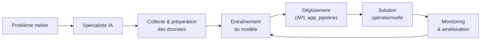
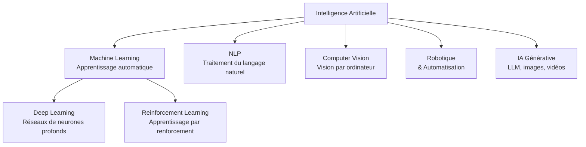
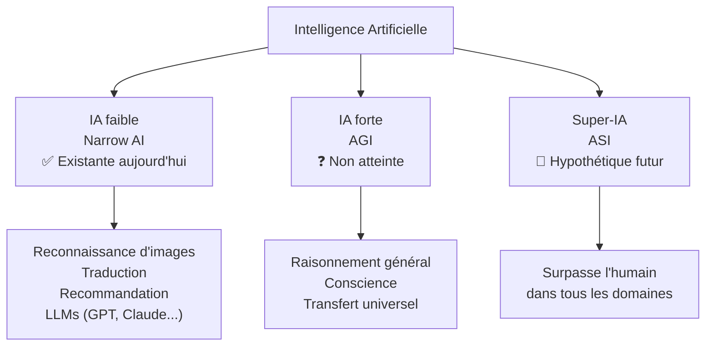
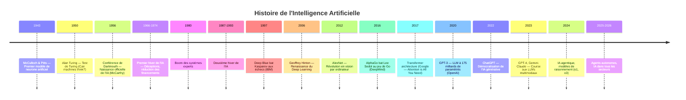
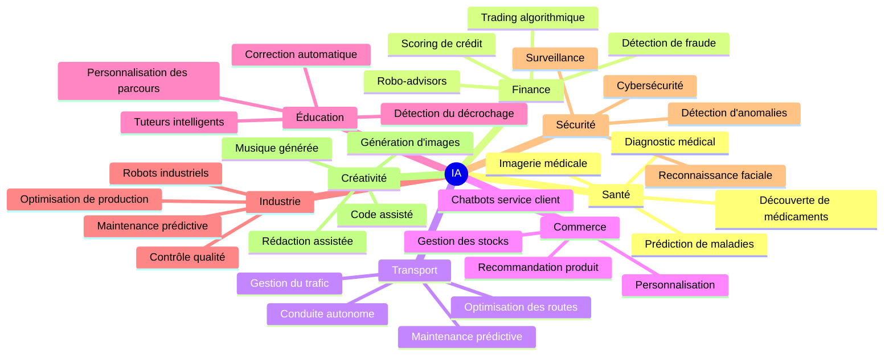
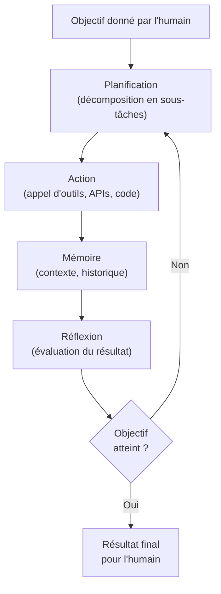

<a id="top"></a>

# Processus et écosystèmes d'IA

## Table des matières

| # | Section |
|---|---------|
| 1 | [Présentation du cours et rôle du spécialiste IA](#section-1) |
| 2 | [Qu'est-ce que l'intelligence artificielle ?](#section-2) |
| 2a | &nbsp;&nbsp;&nbsp;↳ [Définitions](#section-2) |
| 2b | &nbsp;&nbsp;&nbsp;↳ [IA faible vs IA forte](#section-2) |
| 3 | [Historique de l'IA](#section-3) |
| 4 | [Domaines d'application](#section-4) |
| 5 | [Écosystèmes mondiaux et locaux](#section-5) |
| 5a | &nbsp;&nbsp;&nbsp;↳ [Acteurs mondiaux](#section-5) |
| 5b | &nbsp;&nbsp;&nbsp;↳ [Acteurs locaux et régionaux](#section-5) |
| 6 | [Travail de groupe — État de l'IA en 2026](#section-6) |
| 6a | &nbsp;&nbsp;&nbsp;↳ [Sommes-nous en IA forte ?](#section-6) |
| 6b | &nbsp;&nbsp;&nbsp;↳ [L'IA agentique (Agentic AI)](#section-6) |
| 6c | &nbsp;&nbsp;&nbsp;↳ [Consignes du travail de groupe](#section-6) |
| 7 | [Activité individuelle — Dossier sur un acteur majeur de l'IA](#section-7) |

---

<a id="section-1"></a>

<details>
<summary><strong>1 — Présentation du cours et rôle du spécialiste IA</strong></summary>

<br/>

Ce cours introduit les **processus et écosystèmes de l'intelligence artificielle**. Il a pour objectif de donner aux étudiants une vision globale du domaine : ce qu'est l'IA, comment elle a évolué, qui sont les acteurs qui la façonnent, et quel est le rôle d'un spécialiste IA dans une organisation.

---

### Objectifs du cours

À la fin de ce cours, vous serez capable de :

- Définir l'intelligence artificielle et distinguer ses grandes familles
- Retracer les étapes clés de l'histoire de l'IA
- Identifier les domaines d'application de l'IA dans l'industrie
- Nommer les principaux acteurs mondiaux et locaux de l'écosystème IA
- Comprendre le débat actuel sur l'IA forte et l'IA agentique
- Analyser le positionnement d'un acteur majeur de l'IA

---

### Le rôle du spécialiste IA

Un **spécialiste IA** est un professionnel qui conçoit, développe, déploie et maintient des solutions basées sur l'intelligence artificielle. Son rôle varie selon l'organisation, mais comprend généralement :

| Responsabilité | Description |
|----------------|-------------|
| **Comprendre les besoins** | Traduire un problème métier en problème d'IA |
| **Choisir les outils** | Sélectionner les algorithmes, frameworks et plateformes adaptés |
| **Préparer les données** | Collecter, nettoyer et structurer les données d'entraînement |
| **Entraîner les modèles** | Développer et optimiser des modèles de ML/DL |
| **Déployer les solutions** | Exposer les modèles via des APIs (ex. FastAPI), des applications ou des pipelines |
| **Monitorer et maintenir** | Suivre la performance des modèles en production |
| **Communiquer** | Expliquer les résultats et les limites aux équipes non techniques |



---

### Les grandes familles de solutions IA



</details>

<p align="right"><a href="#top">↑ Retour en haut</a></p>

---

<a id="section-2"></a>

<details>
<summary><strong>2 — Qu'est-ce que l'intelligence artificielle ?</strong></summary>

<br/>

### Définitions

Il n'existe pas de définition unique universellement acceptée de l'IA. Voici les plus utilisées :

| Source | Définition |
|--------|-----------|
| **John McCarthy (1956)** | « La science et l'ingénierie de la fabrication de machines intelligentes. » |
| **Stuart Russell & Peter Norvig** | Systèmes qui agissent rationnellement en percevant leur environnement et en prenant des décisions pour atteindre des objectifs. |
| **Commission européenne** | Systèmes logiciels conçus par des humains qui, pour un ensemble d'objectifs définis par l'humain, sont capables d'agir dans des environnements physiques ou numériques. |
| **Définition pratique** | L'IA est la capacité d'une machine à imiter des fonctions cognitives humaines telles qu'apprendre, raisonner, résoudre des problèmes et comprendre le langage. |

---

### IA faible vs IA forte

#### IA faible (Narrow AI)

L'**IA faible** — aussi appelée IA étroite ou *Narrow AI* — est une IA conçue pour accomplir **une tâche spécifique** ou un ensemble limité de tâches. Elle ne comprend pas ce qu'elle fait ; elle reconnaît des patterns dans les données et génère des sorties optimisées.

**Exemples concrets :**

- Reconnaissance faciale (Face ID sur iPhone)
- Recommandation de contenu (Netflix, Spotify, YouTube)
- Traduction automatique (Google Translate, DeepL)
- Assistants vocaux (Siri, Alexa) dans leur périmètre de réponse
- Détection de fraude bancaire
- Conduite autonome de niveau 2-3
- ChatGPT, GPT-4, Claude, Gemini — des LLMs très capables mais **non conscients**

> Toutes les IA disponibles aujourd'hui, sans exception, sont des IA faibles.

---

#### IA forte (General AI / AGI)

L'**IA forte** — aussi appelée Intelligence Artificielle Générale (*AGI*, Artificial General Intelligence) — est une IA hypothétique capable de comprendre, apprendre et appliquer des connaissances dans **n'importe quel domaine**, tout comme un être humain. Elle serait capable de raisonner, planifier, résoudre des problèmes nouveaux, communiquer et avoir une conscience de soi.

| Caractéristique | IA faible (aujourd'hui) | IA forte (hypothétique) |
|-----------------|------------------------|------------------------|
| Domaine | Spécialisé | Généraliste |
| Transfert de connaissances | Non | Oui |
| Conscience / compréhension | Non | Oui (théorique) |
| Exemple | GPT-4, AlphaGo | Aucun à ce jour |
| Statut | Existante | Non atteinte |



---

### IA symbolique vs IA connexionniste

| Type | Approche | Exemples |
|------|----------|---------|
| **IA symbolique** | Règles explicites, logique formelle | Systèmes experts, moteurs de règles |
| **IA connexionniste** | Apprentissage à partir de données, réseaux de neurones | Machine Learning, Deep Learning |
| **IA hybride** | Combinaison des deux | Neuro-symbolique, AlphaGo |

</details>

<p align="right"><a href="#top">↑ Retour en haut</a></p>

---

<a id="section-3"></a>

<details>
<summary><strong>3 — Historique de l'IA</strong></summary>

<br/>

L'histoire de l'IA est marquée par des périodes d'enthousiasme intense suivies de déceptions appelées **hivers de l'IA**, puis de nouvelles percées.



---

### Les grandes étapes en détail

#### 1943–1956 — Les fondations

- **1943** — Warren McCulloch et Walter Pitts publient un modèle mathématique du neurone, base des réseaux de neurones.
- **1950** — Alan Turing publie *Computing Machinery and Intelligence* et propose le **Test de Turing**.
- **1956** — La **conférence de Dartmouth** est considérée comme la naissance officielle de l'IA. John McCarthy, Marvin Minsky, Claude Shannon et d'autrès définissent le domaine.

#### 1957–1974 — Optimisme et premier hiver

- Développement des premiers programmes de jeux (dames, échecs).
- Apparition du **Perceptron** (Frank Rosenblatt, 1958) — premier réseau de neurones entraînable.
- Rapport Lighthill (1973) : conclusions négatives → réduction des financements au Royaume-Uni.

#### 1980–1987 — Boom des systèmes experts

- Les **systèmes experts** (règles IF-THEN codées à la main) deviennent populaires en entreprise.
- Le Japon lance son projet de « 5e génération d'ordinateurs ».

#### 1987–1993 — Deuxième hiver

- Les systèmes experts sont coûteux à maintenir et ne passent pas à l'échelle.
- Nouveau ralentissement des investissements.

#### 1997–2011 — Retour progressif

- **1997** — Deep Blue (IBM) bat le champion du monde aux échecs.
- **2006** — Geoffrey Hinton relance le Deep Learning avec les réseaux profonds.
- **2011** — IBM Watson gagne à Jeopardy!

#### 2012–2022 — L'ère du Deep Learning

- **2012** — AlexNet réduit de 10 points le taux d'erreur en vision par ordinateur.
- **2014** — GAN (Generative Adversarial Networks) — Ian Goodfellow.
- **2017** — Architecture **Transformer** (Google Brain) → base de tous les LLMs modernes.
- **2020** — GPT-3 avec 175 milliards de paramètres.
- **2022** — **ChatGPT** : 100 millions d'utilisateurs en 2 mois.

#### 2023–2026 — L'ère de l'IA générative et agentique

- Multiplication des LLMs multimodaux (texte, image, audio, vidéo).
- Émergence de l'**IA agentique** : agents autonomes capables de planifier et d'agir.
- Intégration de l'IA dans tous les secteurs professionnels.

</details>

<p align="right"><a href="#top">↑ Retour en haut</a></p>

---

<a id="section-4"></a>

<details>
<summary><strong>4 — Domaines d'application</strong></summary>

<br/>

L'IA s'applique aujourd'hui dans pratiquement tous les secteurs d'activité.



---

### Exemples concrets par secteur

| Secteur | Application | Outil / Technologie |
|---------|------------|---------------------|
| **Santé** | Détection du cancer sur IRM | Deep Learning (CNN) |
| **Finance** | Détection de transactions frauduleuses | Anomaly détection, ML |
| **Transport** | Véhicules autonomes | Computer Vision, RL |
| **Commerce** | « Vous aimerez aussi... » | Systèmes de recommandation |
| **Éducation** | Correction automatique de dissertations | NLP |
| **Industrie** | Détection de défauts sur chaîne de montage | Computer Vision |
| **Juridique** | Analyse de contrats | NLP, LLMs |
| **Agriculture** | Détection de maladies des cultures par drone | Computer Vision |
| **Ressources humaines** | Présélection de CV | NLP, ML |
| **Médias** | Génération d'articles sportifs | LLMs |

</details>

<p align="right"><a href="#top">↑ Retour en haut</a></p>

---

<a id="section-5"></a>

<details>
<summary><strong>5 — Écosystèmes mondiaux et locaux</strong></summary>

<br/>

L'écosystème IA est composé de **chercheurs, entreprises, gouvernements, startups et communautés open source** qui interagissent pour développer et déployer des solutions d'IA.

---

### Acteurs mondiaux

#### Les grandes puissances IA

```mermaid
flowchart TD
    subgraph USA["🇺🇸 États-Unis"]
        direction TB
        U1["OpenAI — GPT, ChatGPT, o1"]
        U2["Google DeepMind — Gemini, AlphaFold, AlphaGo"]
        U3["Meta AI — LLaMA, PyTorch"]
        U4["Microsoft — Azure AI, Copilot"]
        U5["Amazon — AWS AI, Alexa, Bedrock"]
        U6["Apple — Core ML, on-device AI"]
        U7["Anthropic — Claude"]
        U8["NVIDIA — GPU, CUDA, NIM"]
    end
    subgraph CHINA["🇨🇳 Chine"]
        direction TB
        C1["Baidu — ERNIE Bot"]
        C2["Alibaba — Qwen, Tongyi"]
        C3["Huawei — Ascend AI chips"]
        C4["ByteDance — Doubao, TikTok AI"]
        C5["DeepSeek — Modèles open source compétitifs"]
    end
    subgraph EU["🇪🇺 Europe"]
        direction TB
        E1["Mistral AI 🇫🇷 — Modèles open source"]
        E2["SAP 🇩🇪 — AI for enterprise"]
        E3["Siemens 🇩🇪 — Industrial AI"]
        E4["IDEMIA 🇫🇷 — Biométrie, identité"]
    end
```



---

#### Les frameworks et outils incontournables

| Catégorie | Outil | Créateur |
|-----------|-------|---------|
| **Deep Learning** | TensorFlow | Google |
| **Deep Learning** | PyTorch | Meta (Facebook) |
| **ML classique** | scikit-learn | Communauté open source |
| **LLMs** | Hugging Face Transformers | Hugging Face |
| **Déploiement** | FastAPI | Sebastián Ramírez |
| **Déploiement** | TensorFlow Serving | Google |
| **Orchestration** | LangChain / LlamaIndex | Communauté |
| **Agents** | AutoGen, CrewAI | Microsoft / Communauté |
| **Données** | Apache Spark | Apache Foundation |
| **MLOps** | MLflow, Weights & Biases | Databricks / W&B |

---

### Acteurs locaux et régionaux

#### Canada

| Acteur | Rôle dans l'IA |
|--------|----------------|
| **Mila** (Montréal) | Institut de recherche en IA fondé par Yoshua Bengio — un des plus importants au monde |
| **Vector Institute** (Toronto) | Recherche en Deep Learning, fondé par Geoffrey Hinton |
| **CIFAR** | Financement de la recherche fondamentale en IA |
| **Cohere** | Startup canadienne — LLMs pour entreprises |
| **Element AI** (acquis par ServiceNow) | IA pour entreprises |
| **Coveo** | IA pour la recherche et recommandation |

> Le Canada est reconnu comme une **superpuissance mondiale en recherche IA**, notamment grâce à Montréal et Toronto.

#### Québec / Montréal

- **Mila** — plus de 1 000 chercheurs, Yoshua Bengio (Prix Turing 2018)
- **Scale AI** — grappe d'innovation en IA financée par le gouvernement fédéral
- **IVADO** — Institut de valorisation des données (HEC, Polytechnique, Université de Montréal)
- **Startups** : Imagia, Dialogue, Osedea, Intact Lab, Desjardins Lab IA

#### France

- **INRIA** — Institut national de recherche en informatique et automatique
- **Mistral AI** — startup française parmi les meilleures au monde en LLMs open source
- **LightOn** — IA pour entreprises
- **Yann LeCun** — Père du Deep Learning, Chief AI Scientist chez Meta, originaire de France

</details>

<p align="right"><a href="#top">↑ Retour en haut</a></p>

---

<a id="section-6"></a>

<details>
<summary><strong>6 — Travail de groupe — État de l'IA en 2026</strong></summary>

<br/>

### Contexte

En 2026, l'IA générative est omniprésente. Les LLMs sont intégrés dans la quasi-totalité des outils professionnels. Les agents IA autonomes commencent à être déployés en production dans les entreprises. Ce travail de groupe vous invite à analyser de manière critique **où en est vraiment l'IA aujourd'hui**.

---

### Sommes-nous en IA forte (AGI) ?

#### Position du débat en 2026

| Point de vue | Argument |
|-------------|---------|
| **Non, nous sommes encore en IA faible** | Les LLMs ne comprennent pas — ils prédisent des tokens. Ils n'ont pas de conscience, de mémoire persistante naturelle, ni de corps. Ils échouent sur des tâches simples pour un enfant (raisonnement causal, bon sens physique). |
| **Nous approchons de l'AGI** | GPT-4o, o3, Gemini Ultra passent des examens médicaux, juridiques et scientifiques. Les modèles de raisonnement (o1, o3) résolvent des problèmes olympiques. Les agents peuvent planifier sur plusieurs étapes. |
| **L'AGI est mal définie** | Sam Altman (OpenAI) suggère que l'AGI pourrait arriver d'ici 2025-2027. Mais les experts ne s'accordent pas sur sa définition. |

> **Position de consensus scientifique en 2026** : nous sommes toujours en **IA faible très avancée**, pas en AGI. Les modèles sont extraordinairement capables dans leurs domaines, mais ils manquent de compréhension causale, de conscience et de généralisation robuste.

---

### L'IA agentique (Agentic AI)

L'**IA agentique** désigne des systèmes d'IA capables de **planifier, décider et agir de manière autonome** pour accomplir des objectifs complexes sur plusieurs étapes, en utilisant des outils, en naviguant sur le web, en écrivant et exécutant du code, et en interagissant avec d'autrès agents.

#### Comment fonctionne un agent IA ?



#### Exemples d'agents IA en 2026

| Agent | Capacité |
|-------|---------|
| **Devin** (Cognition AI) | Agent de développement logiciel autonome |
| **AutoGPT / AgentGPT** | Agents généralistes à objectif libre |
| **CrewAI** | Orchestration de plusieurs agents spécialisés |
| **Microsoft Copilot Agents** | Agents intégrés dans Office 365 |
| **Claude Computer Use** | Agent qui contrôle un ordinateur comme un humain |
| **OpenAI Operator** | Agent qui navigue sur le web et remplit des formulaires |

#### Différence entre LLM et Agent IA

| LLM classique | Agent IA |
|--------------|---------|
| Répond à une question | Accomplit une mission |
| Interaction unique | Boucle d'actions multiples |
| Pas d'outils | Utilise des outils (web, code, APIs) |
| Pas de mémoire persistante | Mémoire sur plusieurs sessions |
| Passif | Actif et autonome |

---

### Consignes du travail de groupe

#### Objectif

Analyser et présenter l'**état réel de l'IA en 2026** : sommes-nous proches de l'IA forte ? L'IA agentique change-t-elle fondamentalement la donné ?

#### Formation des groupes

- Groupes de **3 à 4 étudiants**
- Chaque groupe choisit **un angle d'analyse** parmi les propositions ci-dessous

#### Angles possibles

| # | Angle d'analyse |
|---|----------------|
| A | **Technique** — Les LLMs actuels peuvent-ils vraiment raisonner ? Analyse des benchmarks et des limites. |
| B | **Éthique** — L'IA agentique autonome pose-t-elle des risques ? Qui est responsable des actions d'un agent ? |
| C | **Économique** — L'IA agentique va-t-elle remplacer des emplois ? Quels secteurs sont les plus touchés en 2026 ? |
| D | **Scientifique** — Que disent les chercheurs (Hinton, LeCun, Bengio, Altman) sur l'AGI ? Où se situe le débat ? |
| E | **Pratique** — Quels agents IA sont déjà déployés en production ? Quels résultats concrets ont-ils produits ? |

#### Livrables

1. **Présentation** (10–12 minutes) — diaporama de 8 à 12 slides
2. **Résumé écrit** (1 page maximum) — points clés et position du groupe
3. **Sources** — minimum 3 sources récentes (2024-2026)

#### Critères d'évaluation

| Critère | Points |
|---------|--------|
| Qualité de l'analyse et argumentation | 40 % |
| Clarté de la présentation | 25 % |
| Utilisation de sources récentes et fiables | 20 % |
| Réponse aux questions du groupe | 15 % |

#### Calendrier suggéré

| Étape | Délai |
|-------|-------|
| Formation des groupes et choix de l'angle | Séance 1 |
| Recherche et collecte des sources | Semaine 1–2 |
| Rédaction du résumé et préparation des slides | Semaine 2–3 |
| Présentation devant la classe | Séance 4 |

</details>

<p align="right"><a href="#top">↑ Retour en haut</a></p>

---

<a id="section-7"></a>

<details>
<summary><strong>7 — Activité individuelle — Dossier sur un acteur majeur de l'IA</strong></summary>

<br/>

### Objectif

Lire un **court dossier** (article, rapport, page officielle) sur un acteur majeur de l'écosystème IA et en produire un **résumé structuré** qui explique son rôle dans l'écosystème mondial.

---

### Liste des acteurs suggérés

Choisissez **un acteur** parmi les propositions suivantes — chaque étudiant doit choisir un acteur différent :

| # | Acteur | Pays | Profil |
|---|--------|------|--------|
| 1 | **OpenAI** | 🇺🇸 | Créateur de ChatGPT, GPT-4, o1 — leader de l'IA générative |
| 2 | **Google DeepMind** | 🇺🇸/🇬🇧 | AlphaGo, AlphaFold, Gemini — recherche fondamentale et produits |
| 3 | **Meta AI** | 🇺🇸 | LLaMA, PyTorch — IA open source et réseaux sociaux |
| 4 | **NVIDIA** | 🇺🇸 | GPU, CUDA — infrastructure matérielle de l'IA mondiale |
| 5 | **Mistral AI** | 🇫🇷 | LLMs open source européens compétitifs |
| 6 | **Hugging Face** | 🇫🇷/🇺🇸 | Plateforme collaborative de modèles open source |
| 7 | **Anthropic** | 🇺🇸 | Claude — IA sécuritaire fondée par ex-employés d'OpenAI |
| 8 | **Mila** | 🇨🇦 | Institut de recherche de Yoshua Bengio à Montréal |
| 9 | **DeepSeek** | 🇨🇳 | Modèles open source très performants à faible coût |
| 10 | **Cohere** | 🇨🇦 | LLMs pour entreprises, fondé à Toronto |
| 11 | **IBM Watson** | 🇺🇸 | IA pour l'entreprise — pionnier historique |
| 12 | **Microsoft Azure AI** | 🇺🇸 | Cloud IA, partenaire d'OpenAI, Copilot |

---

### Structure du résumé à produire

Le résumé doit faire **entre 300 et 500 mots** et répondre aux 5 questions suivantes :

#### 1. Qui sont-ils ?
- Fondation, histoire courte, siège social, nombre d'employés approximatif

#### 2. Que font-ils concrètement ?
- Produits, modèles, services ou recherches principaux

#### 3. Quel est leur modèle économique ?
- Open source / commercial / recherche / cloud / licences

#### 4. Quel est leur rôle dans l'écosystème ?
- Chercheur fondamental ? Fournisseur d'infrastructure ? Développeur de produits ? Régulateur ?
- Avec qui collaborent-ils ou se concurrencent-ils ?

#### 5. Quelle est leur position sur l'AGI et la sécurité de l'IA ?
- Comment voient-ils l'avenir de l'IA ? Sont-ils préoccupés par les risques ?

---

### Format de rendu

```
Nom de l'acteur : _______________
Étudiant(e) : _______________
Date : _______________

1. QUI SONT-ILS ?
[Votre texte ici]

2. QUE FONT-ILS CONCRÈTEMENT ?
[Votre texte ici]

3. QUEL EST LEUR MODÈLE ÉCONOMIQUE ?
[Votre texte ici]

4. QUEL EST LEUR RÔLE DANS L'ÉCOSYSTÈME ?
[Votre texte ici]

5. POSITION SUR L'AGI ET LA SÉCURITÉ IA ?
[Votre texte ici]

SOURCES :
- Source 1 : [URL ou référence]
- Source 2 : [URL ou référence]
- Source 3 : [URL ou référence]
```

---

### Critères d'évaluation

| Critère | Points |
|---------|--------|
| Réponse claire aux 5 questions | 50 % |
| Qualité de l'analyse (pas seulement descriptif) | 30 % |
| Sources citées et récentes | 20 % |

---

### Ressources utiles pour démarrer

- Site officiel de l'acteur choisi
- [AI Index Report 2024 — Stanford](https://aiindex.stanford.edu/report/)
- [State of AI Report](https://www.stateof.ai/)
- Wikipedia (point de départ uniquement, à compléter avec des sources primaires)
- Articles de **MIT Technology Review**, **The Verge**, **Wired**, **Le Monde Informatique**

</details>

<p align="right"><a href="#top">↑ Retour en haut</a></p>
