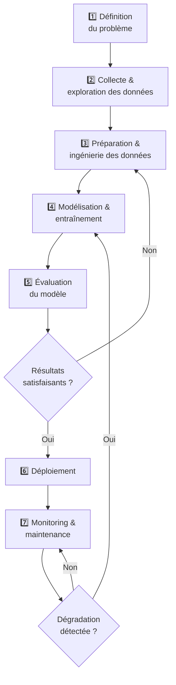
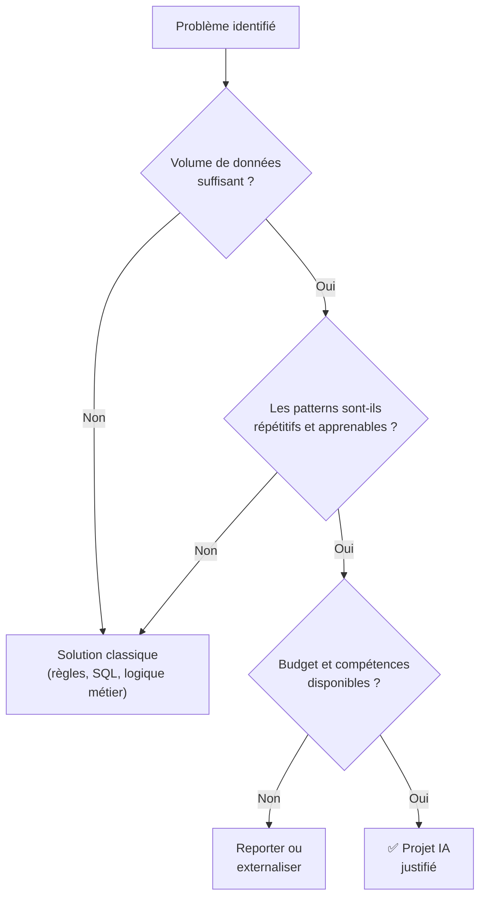
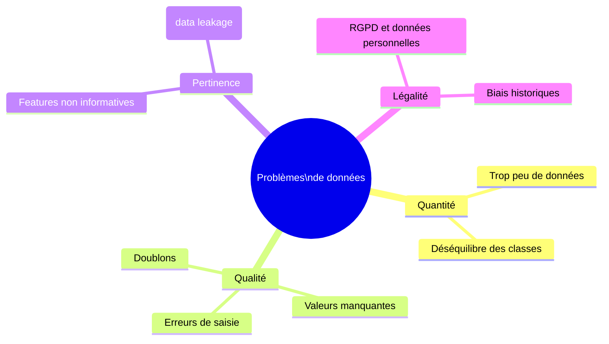
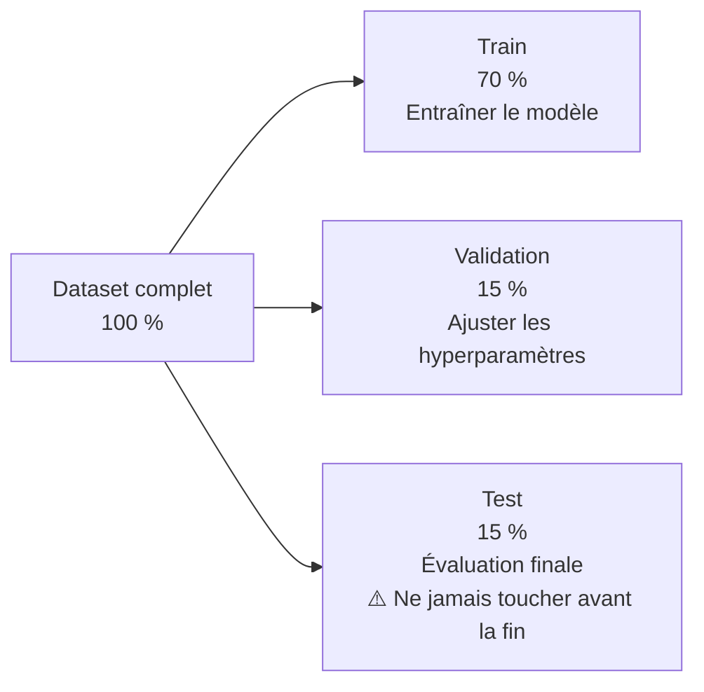
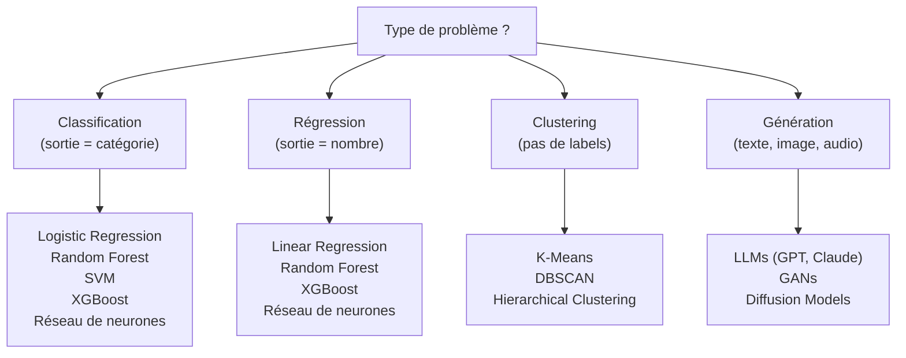
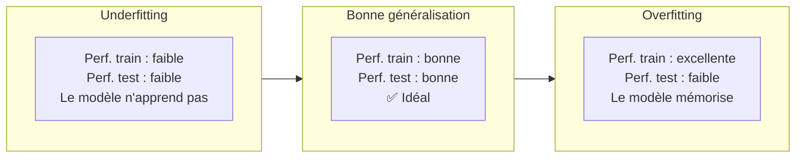
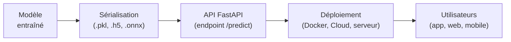
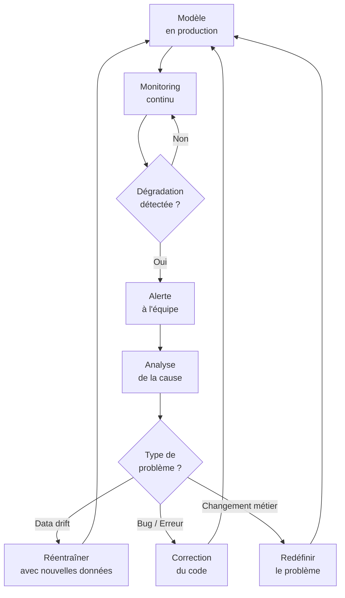
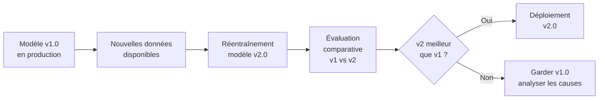
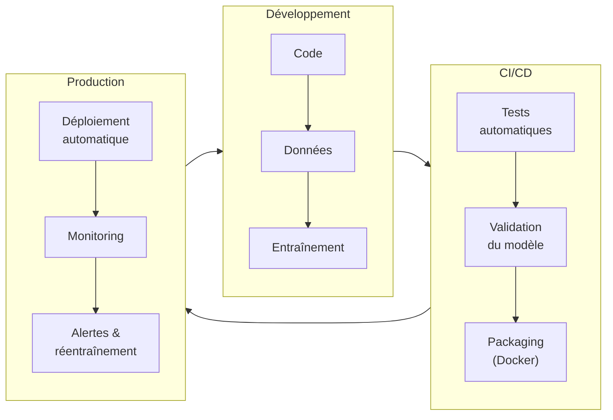

<a id="top"></a>

# Cycle de vie d'un projet IA

## Table des matières

| # | Section |
|---|---------|
| 1 | [Vue d'ensemble — Les 7 phases du cycle de vie](#section-1) |
| 2 | [Phase 1 — Définition du problème et des objectifs](#section-2) |
| 2a | &nbsp;&nbsp;&nbsp;↳ [Identifier le bon problème](#section-2) |
| 2b | &nbsp;&nbsp;&nbsp;↳ [Définir les métriques de succès](#section-2) |
| 3 | [Phase 2 — Collecte et exploration des données](#section-3) |
| 3a | &nbsp;&nbsp;&nbsp;↳ [Sources de données](#section-3) |
| 3b | &nbsp;&nbsp;&nbsp;↳ [Analyse exploratoire (EDA)](#section-3) |
| 4 | [Phase 3 — Préparation et ingénierie des données](#section-4) |
| 4a | &nbsp;&nbsp;&nbsp;↳ [Nettoyage des données](#section-4) |
| 4b | &nbsp;&nbsp;&nbsp;↳ [Feature engineering](#section-4) |
| 5 | [Phase 4 — Modélisation et entraînement](#section-5) |
| 5a | &nbsp;&nbsp;&nbsp;↳ [Choisir le bon algorithme](#section-5) |
| 5b | &nbsp;&nbsp;&nbsp;↳ [Entraînement et validation](#section-5) |
| 5c | &nbsp;&nbsp;&nbsp;↳ [Hyperparamètres et optimisation](#section-5) |
| 6 | [Phase 5 — Évaluation du modèle](#section-6) |
| 6a | &nbsp;&nbsp;&nbsp;↳ [Métriques d'évaluation](#section-6) |
| 6b | &nbsp;&nbsp;&nbsp;↳ [Biais, équité et limites](#section-6) |
| 7 | [Phase 6 — Déploiement](#section-7) |
| 7a | &nbsp;&nbsp;&nbsp;↳ [Stratégies de déploiement](#section-7) |
| 7b | &nbsp;&nbsp;&nbsp;↳ [Déploiement avec FastAPI](#section-7) |
| 8 | [Phase 7 — Monitoring et maintenance](#section-8) |
| 8a | &nbsp;&nbsp;&nbsp;↳ [Data drift et model drift](#section-8) |
| 8b | &nbsp;&nbsp;&nbsp;↳ [Réentraînement et versioning](#section-8) |
| 9 | [MLOps — Automatiser le cycle de vie](#section-9) |
| 10 | [Étude de cas — Projet complet de A à Z](#section-10) |
| 11 | [Travail pratique — Planifier un projet IA](#section-11) |

---

<a id="section-1"></a>

<details>
<summary><strong>1 — Vue d'ensemble — Les 7 phases du cycle de vie</strong></summary>

<br/>

Un projet IA ne se résume pas à entraîner un modèle. Il suit un **cycle de vie structuré** qui commence bien avant le code et continue longtemps après la mise en production.



---

### Les 7 phases en résumé

| Phase | Nom | Activités clés | Qui ?|
|-------|-----|----------------|------|
| 1 | **Définition du problème** | Comprendre le besoin, définir les objectifs et les métriques | Chef de projet, client, data scientist |
| 2 | **Collecte & exploration** | Identifier les sources, explorer les données (EDA) | Data engineer, data scientist |
| 3 | **Préparation des données** | Nettoyer, transformer, créer des features | Data engineer, data scientist |
| 4 | **Modélisation** | Choisir, entraîner et optimiser le modèle | Data scientist, ML engineer |
| 5 | **Évaluation** | Mesurer la performance, détecter les biais | Data scientist, équipe métier |
| 6 | **Déploiement** | Exposer le modèle via une API, intégrer dans les systèmes | ML engineer, DevOps |
| 7 | **Monitoring** | Surveiller la performance en production, réentraîner | MLOps engineer, data scientist |

---

### Pourquoi le cycle est-il itératif ?

En pratique, on revient souvent en arrière :
- Les données collectées sont insuffisantes → retour à la phase 2
- Le modèle performe bien en test mais mal en production → retour à la phase 3 ou 4
- Les besoins du client évoluent → retour à la phase 1

> Un projet IA n'est **jamais vraiment terminé** — il évolue avec les données et les besoins.

---

### Comparaison avec un projet logiciel classique

| Étape logicielle | Équivalent IA |
|-----------------|---------------|
| Recueil des besoins | Définition du problème |
| Conception de la base de données | Collecte et préparation des données |
| Développement | Modélisation et entraînement |
| Tests | Évaluation du modèle |
| Mise en production | Déploiement |
| Maintenance | Monitoring et réentraînement |

</details>

<p align="right"><a href="#top">↑ Retour en haut</a></p>

---

<a id="section-2"></a>

<details>
<summary><strong>2 — Phase 1 — Définition du problème et des objectifs</strong></summary>

<br/>

> C'est la phase **la plus critique** du projet. Un mauvais problème bien résolu reste un mauvais résultat.

---

### Identifier le bon problème

Avant d'écrire la moindre ligne de code, il faut répondre à ces questions :

| Question | Exemple |
|----------|---------|
| **Quel est le problème métier ?** | « Nous avons trop de retours clients non traités » |
| **L'IA est-elle la bonne solution ?** | Peut-être — si le volume est élevé et les patterns répétitifs |
| **Quelles données avons-nous ?** | Historique de 50 000 tickets de support |
| **Quel est le niveau de performance attendu ?** | 85 % de classification correcte minimum |
| **Quelles sont les contraintes ?** | Temps réel requis, RGPD, budget limité |
| **Quel est l'impact si on se trompe ?** | Faible (recommandation) ou fort (médical, juridique) |

---

### L'IA n'est pas toujours la bonne réponse



---

### Définir les métriques de succès

Il est essentiel de définir **avant** le projet comment on mesurera le succès. Il existe deux types de métriques :

#### Métriques techniques (ce que le modèle mesure)

| Métrique | Utilisation |
|----------|------------|
| **Accuracy** | Classification équilibrée |
| **Precision / Recall / F1** | Classification déséquilibrée (fraude, maladie) |
| **AUC-ROC** | Comparaison de classifieurs |
| **RMSE / MAE** | Régression (prédiction de valeurs numériques) |
| **BLEU / ROUGE** | NLP (traduction, résumé) |

#### Métriques métier (ce que le client mesure)

| Métrique | Exemple |
|----------|---------|
| Réduction des coûts | « -30 % de temps de traitement des tickets » |
| Augmentation des revenus | « +5 % de taux de conversion » |
| Satisfaction client | « NPS +10 points » |
| Délai de traitement | « Réponse en < 2 secondes » |

> **Règle d'or** : une métrique technique élevée ne garantit pas un succès métier.

---

### Livrables de la phase 1

- [ ] Document de définition du problème (1 page)
- [ ] Métriques de succès techniques et métier validées par le client
- [ ] Inventaire préliminaire des données disponibles
- [ ] Analyse des risques et contraintes
- [ ] Décision Go / No-Go

</details>

<p align="right"><a href="#top">↑ Retour en haut</a></p>

---

<a id="section-3"></a>

<details>
<summary><strong>3 — Phase 2 — Collecte et exploration des données</strong></summary>

<br/>

> « En IA, les données sont le carburant. Un bon modèle avec de mauvaises données donnera toujours de mauvais résultats. »

---

### Sources de données

| Type | Exemples | Avantages | Inconvénients |
|------|---------|-----------|---------------|
| **Données internes** | Base de données client, logs, ERP | Pertinentes, accessibles | Souvent non structurées |
| **Données ouvertes** | Kaggle, data.gouv.fr, UCI ML Repo | Gratuites, prêtes à l'emploi | Pas toujours représentatives |
| **APIs externes** | Twitter API, OpenWeather, Eurostat | Actualisées, riches | Coûteuses, limites d'usage |
| **Web scraping** | Articles web, avis clients | Volume élevé | Questions légales, bruit |
| **Données synthétiques** | Générées par IA (GANs, LLMs) | Illimitées, contrôlées | Peuvent introduire des biais |
| **Données annotées** | Étiquetées par humains | Haute qualité | Coûteuses et lentes |

---

### Analyse exploratoire des données (EDA)

L'**EDA** (Exploratory Data Analysis) consiste à comprendre les données avant de modéliser.

```python
import pandas as pd
import matplotlib.pyplot as plt
import seaborn as sns

df = pd.read_csv("dataset.csv")

# Aperçu général
print(df.shape)           # dimensions
print(df.dtypes)          # types de colonnes
print(df.describe())      # statistiques descriptives
print(df.isnull().sum())  # valeurs manquantes

# Distribution d'une variable cible
df["label"].value_counts().plot(kind="bar")
plt.title("Distribution des classes")
plt.show()

# Corrélations
sns.heatmap(df.corr(), annot=True, cmap="coolwarm")
plt.show()
```

---

### Questions à poser lors de l'EDA

| Question | Ce qu'on cherche |
|----------|-----------------|
| Combien de lignes et de colonnes ? | Taille suffisante pour entraîner |
| Y a-t-il des valeurs manquantes ? | Stratégie de traitement |
| Les classes sont-elles équilibrées ? | Risque de biais du modèle |
| Y a-t-il des outliers ? | Données aberrantes à traiter |
| Les features sont-elles corrélées ? | Redondance ou multicolinéarité |
| Les données sont-elles récentes ? | Risque de data drift |

---

### Les problèmes fréquents



</details>

<p align="right"><a href="#top">↑ Retour en haut</a></p>

---

<a id="section-4"></a>

<details>
<summary><strong>4 — Phase 3 — Préparation et ingénierie des données</strong></summary>

<br/>

> En moyenne, **60 à 80 % du temps** d'un projet IA est consacré à la préparation des données.

---

### Nettoyage des données

| Problème | Traitement courant |
|----------|-------------------|
| Valeurs manquantes | Suppression, imputation (moyenne, médiane, mode, KNN) |
| Doublons | `df.drop_duplicates()` |
| Outliers | Suppression, winsorization, transformation log |
| Types incorrects | `df["col"].astype(int)` |
| Texte brut | Normalisation, suppression des stop words, lemmatisation |
| Dates | Extraction de features (jour, mois, jour de la semaine) |

```python
# Exemple de nettoyage
import pandas as pd
from sklearn.impute import SimpleImputer

df = pd.read_csv("data.csv")

# Supprimer les doublons
df = df.drop_duplicates()

# Imputer les valeurs manquantes numériques par la médiane
imputer = SimpleImputer(strategy="median")
df[["age", "salary"]] = imputer.fit_transform(df[["age", "salary"]])

# Encoder les variables catégorielles
df = pd.get_dummies(df, columns=["city", "category"], drop_first=True)

print(df.shape)
```

---

### Feature engineering

Le **feature engineering** consiste à créer de nouvelles variables à partir des données existantes pour améliorer les performances du modèle.

| Technique | Exemple |
|-----------|---------|
| **Extraction** | Extraire l'heure, le jour, le mois d'une date |
| **Combinaison** | `prix_total = prix_unitaire × quantité` |
| **Transformation** | `log(revenu)` pour réduire l'asymétrie |
| **Encodage** | One-hot encoding, label encoding, target encoding |
| **Normalisation** | MinMaxScaler, StandardScaler |
| **Binning** | Regrouper les âges en tranches (0-18, 18-35, 35-60, 60+) |
| **Embeddings** | Transformer du texte en vecteurs numériques |

---

### Découpage train / validation / test



> **Règle absolue** : le jeu de test ne doit **jamais** être utilisé pendant le développement. Il simule les données que le modèle verra en production.

---

### Data leakage — L'erreur la plus dangereuse

Le **data leakage** (fuite de données) survient quand des informations du futur ou de la cible se retrouvent dans les features d'entraînement. Le modèle semble très performant en test, mais échoue complètement en production.

**Exemples de leakage :**
- Inclure la variable cible dans les features
- Normaliser les données **avant** de séparer train/test (le test influence la normalisation)
- Utiliser des données créées **après** l'événement à prédire

</details>

<p align="right"><a href="#top">↑ Retour en haut</a></p>

---

<a id="section-5"></a>

<details>
<summary><strong>5 — Phase 4 — Modélisation et entraînement</strong></summary>

<br/>

### Choisir le bon algorithme

Le choix de l'algorithme dépend du **type de problème**, de la **taille des données** et des **contraintes** (interprétabilité, vitesse).



---

### Tableau de sélection des algorithmes

| Algorithme | Type | Avantages | Inconvénients |
|-----------|------|-----------|---------------|
| **Régression logistique** | Classification | Rapide, interprétable | Limité aux relations linéaires |
| **Random Forest** | Class. / Régr. | Robuste, peu de tuning | Boîte noire, lent sur gros volumes |
| **XGBoost / LightGBM** | Class. / Régr. | Très performant, compétitions Kaggle | Hyperparamètres complexes |
| **SVM** | Classification | Efficace en haute dimension | Lent sur grands datasets |
| **K-Means** | Clustering | Simple, rapide | Nombre de clusters à fixer à l'avance |
| **Réseau de neurones** | Tout type | Universel, très puissant | Données volumineuses requises, boîte noire |
| **CNN** | Computer Vision | État de l'art pour les images | Requiert GPU, beaucoup de données |
| **Transformer / LLM** | NLP, génératif | État de l'art pour le texte | Très coûteux en ressources |

---

### Entraînement et validation croisée

```python
from sklearn.ensemble import RandomForestClassifier
from sklearn.model_selection import cross_val_score, train_test_split
from sklearn.metrics import classification_report

# Séparation train/test
X_train, X_test, y_train, y_test = train_test_split(
    X, y, test_size=0.2, random_state=42
)

# Entraînement
model = RandomForestClassifier(n_estimators=100, random_state=42)
model.fit(X_train, y_train)

# Validation croisée sur le train (5 folds)
scores = cross_val_score(model, X_train, y_train, cv=5, scoring="f1_macro")
print(f"F1 moyen (CV) : {scores.mean():.3f} ± {scores.std():.3f}")

# Évaluation finale sur le test
y_pred = model.predict(X_test)
print(classification_report(y_test, y_pred))
```

---

### Hyperparamètres et optimisation

Les **hyperparamètres** sont les paramètres que l'on fixe **avant** l'entraînement (contrairement aux paramètres appris par le modèle).

| Algorithme | Hyperparamètres courants |
|-----------|--------------------------|
| Random Forest | `n_estimators`, `max_depth`, `min_samples_split` |
| XGBoost | `learning_rate`, `n_estimators`, `max_depth`, `subsample` |
| Réseau de neurones | `learning_rate`, nombre de couches, taille des couches, `dropout` |
| K-Means | `n_clusters`, `init` |

**Techniques d'optimisation :**

```python
from sklearn.model_selection import GridSearchCV

param_grid = {
    "n_estimators": [50, 100, 200],
    "max_depth": [None, 10, 20],
    "min_samples_split": [2, 5, 10]
}

grid_search = GridSearchCV(
    RandomForestClassifier(random_state=42),
    param_grid,
    cv=5,
    scoring="f1_macro",
    n_jobs=-1
)
grid_search.fit(X_train, y_train)
print("Meilleurs paramètres :", grid_search.best_params_)
```

</details>

<p align="right"><a href="#top">↑ Retour en haut</a></p>

---

<a id="section-6"></a>

<details>
<summary><strong>6 — Phase 5 — Évaluation du modèle</strong></summary>

<br/>

### Métriques d'évaluation

#### Pour la classification

| Métrique | Formule | Quand l'utiliser |
|----------|---------|-----------------|
| **Accuracy** | (TP + TN) / Total | Classes équilibrées |
| **Precision** | TP / (TP + FP) | Minimiser les faux positifs (spam, pub) |
| **Recall** | TP / (TP + FN) | Minimiser les faux négatifs (cancer, fraude) |
| **F1-Score** | 2 × (P × R) / (P + R) | Équilibre precision/recall |
| **AUC-ROC** | Aire sous la courbe ROC | Comparaison de modèles |

> **Exemple crucial** : pour détecter une maladie grave, le **recall** est prioritaire (on préfère un faux positif à un faux négatif — mieux vaut une fausse alarme qu'un cas manqué).

#### Pour la régression

| Métrique | Description | Sensible aux outliers |
|----------|-------------|----------------------|
| **MAE** | Erreur absolue moyenne | Non |
| **RMSE** | Racine de l'erreur quadratique moyenne | Oui |
| **R²** | Coefficient de détermination (0 à 1) | Moyen |
| **MAPE** | Erreur en pourcentage | Non |

---

### La matrice de confusion

```
                  Prédit Positif    Prédit Négatif
Réel Positif   |  TP (Vrai Pos.)  |  FN (Faux Nég.)  |
Réel Négatif   |  FP (Faux Pos.)  |  TN (Vrai Nég.)  |
```

```python
from sklearn.metrics import confusion_matrix, ConfusionMatrixDisplay
import matplotlib.pyplot as plt

cm = confusion_matrix(y_test, y_pred)
disp = ConfusionMatrixDisplay(confusion_matrix=cm)
disp.plot(cmap="Blues")
plt.title("Matrice de confusion")
plt.show()
```

---

### Biais, équité et limites

Un modèle peut être techniquement performant mais **injuste ou biaisé**.

| Type de biais | Cause | Exemple |
|--------------|-------|---------|
| **Biais de sélection** | Données non représentatives | Modèle entraîné sur des hommes, testé sur des femmes |
| **Biais historique** | Discrimination encodée dans les données | Modèle de recrutement favorisant un genre |
| **Biais de confirmation** | Features corrélées avec des attributs protégés | Code postal comme proxy de l'origine ethnique |
| **Biais d'étiquetage** | Annotations humaines biaisées | Différences d'annotation selon l'annotateur |

**Questions à poser avant de déployer :**
- Le modèle performe-t-il également sur tous les groupes démographiques ?
- Les features utilisées sont-elles justifiables éthiquement ?
- Qui est responsable si le modèle prend une mauvaise décision ?

---

### Overfitting et underfitting



| Problème | Cause | Solution |
|---------|-------|---------|
| Underfitting | Modèle trop simple, pas assez de features | Modèle plus complexe, plus de features |
| Overfitting | Modèle trop complexe, trop peu de données | Régularisation, dropout, plus de données, cross-validation |

</details>

<p align="right"><a href="#top">↑ Retour en haut</a></p>

---

<a id="section-7"></a>

<details>
<summary><strong>7 — Phase 6 — Déploiement</strong></summary>

<br/>

> Un modèle non déployé n'a aucune valeur. Le déploiement transforme un notebook en solution réelle.

---

### Stratégies de déploiement

| Stratégie | Description | Risque |
|-----------|-------------|--------|
| **Big bang** | Remplacer l'ancien système d'un coup | Élevé |
| **Canary release** | Déployer pour 5–10 % des utilisateurs d'abord | Faible |
| **Blue/Green** | Deux environnements identiques — basculer le trafic | Faible |
| **Shadow mode** | Le nouveau modèle tourne en parallèle sans impacter | Très faible |
| **A/B testing** | Comparer deux modèles sur des groupes d'utilisateurs | Faible |



---

### Déploiement avec FastAPI

Voici un exemple complet pour exposer un modèle scikit-learn via FastAPI :

```python
# main.py
import pickle
from fastapi import FastAPI
from pydantic import BaseModel
import numpy as np

app = FastAPI(title="Modèle de classification", version="1.0")

# Charger le modèle au démarrage
with open("model.pkl", "rb") as f:
    model = pickle.load(f)

# Schéma de la requête
class InputData(BaseModel):
    feature1: float
    feature2: float
    feature3: float
    feature4: float

# Schéma de la réponse
class Prediction(BaseModel):
    prediction: int
    probability: float
    label: str

LABELS = {0: "Classe A", 1: "Classe B", 2: "Classe C"}

@app.get("/")
def root():
    return {"message": "API de prédiction opérationnelle"}

@app.post("/predict", response_model=Prediction)
def predict(data: InputData):
    features = np.array([[
        data.feature1,
        data.feature2,
        data.feature3,
        data.feature4
    ]])
    pred = int(model.predict(features)[0])
    proba = float(model.predict_proba(features)[0][pred])
    return Prediction(
        prediction=pred,
        probability=round(proba, 4),
        label=LABELS[pred]
    )
```

```bash
# Sauvegarder le modèle
import pickle
with open("model.pkl", "wb") as f:
    pickle.dump(model, f)

# Lancer l'API
uvicorn main:app --reload

# Tester
# → http://127.0.0.1:8000/docs
```

---

### Conteneurisation avec Docker

```dockerfile
# Dockerfile
FROM python:3.11-slim

WORKDIR /app

COPY requirements.txt .
RUN pip install --no-cache-dir -r requirements.txt

COPY . .

EXPOSE 8000
CMD ["uvicorn", "main:app", "--host", "0.0.0.0", "--port", "8000"]
```

```bash
# Construire et lancer
docker build -t mon-modele-api .
docker run -p 8000:8000 mon-modele-api
```

</details>

<p align="right"><a href="#top">↑ Retour en haut</a></p>

---

<a id="section-8"></a>

<details>
<summary><strong>8 — Phase 7 — Monitoring et maintenance</strong></summary>

<br/>

> Un modèle déployé se **dégrade avec le temps**. Les données du monde réel évoluent — le modèle doit suivre.

---

### Data drift et model drift

| Type | Description | Exemple |
|------|-------------|---------|
| **Data drift** | La distribution des données d'entrée change | Les comportements d'achat changent après le COVID |
| **Concept drift** | La relation entre features et target change | Le sens du mot « viral » avant et après 2020 |
| **Model drift** | Les performances du modèle se dégradent | L'accuracy passe de 92 % à 78 % en 6 mois |



---

### Ce qu'il faut monitorer

| Indicateur | Outil |
|-----------|-------|
| **Performance du modèle** (accuracy, F1...) | MLflow, Weights & Biases |
| **Distribution des données d'entrée** | Evidently AI, Whylogs |
| **Temps de réponse de l'API** | Prometheus, Grafana |
| **Taux d'erreur HTTP** | Logs, Sentry |
| **Volume de requêtes** | Prometheus, Datadog |
| **Valeurs aberrantes en entrée** | Règles de validation Pydantic + alertes |

---

### Réentraînement et versioning



**Bonnes pratiques de versioning :**
- Utiliser **MLflow** ou **DVC** pour tracer chaque version du modèle
- Toujours conserver l'ancien modèle pendant une période de transition
- Documenter les changements de performance entre versions
- Versionner les données d'entraînement au même titre que le code

</details>

<p align="right"><a href="#top">↑ Retour en haut</a></p>

---

<a id="section-9"></a>

<details>
<summary><strong>9 — MLOps — Automatiser le cycle de vie</strong></summary>

<br/>

Le **MLOps** (Machine Learning Operations) est l'ensemble des pratiques visant à **automatiser, fiabiliser et industrialiser** le cycle de vie des projets IA, en s'inspirant du DevOps.



---

### Les niveaux de maturité MLOps

| Niveau | Description |
|--------|-------------|
| **Niveau 0** | Tout manuel — notebooks, déploiement à la main |
| **Niveau 1** | Pipeline ML automatisé — réentraînement automatique |
| **Niveau 2** | CI/CD complet — tests, validation et déploiement automatiques |

---

### Outils MLOps courants

| Catégorie | Outil | Usage |
|-----------|-------|-------|
| **Tracking expériences** | MLflow, Weights & Biases | Enregistrer les runs, métriques, modèles |
| **Versioning données** | DVC, LakeFS | Versionner les datasets comme du code |
| **Pipelines ML** | Kubeflow, Metaflow, Airflow | Orchestrer les étapes du pipeline |
| **Registry de modèles** | MLflow Registry, Hugging Face Hub | Stocker et gérer les versions de modèles |
| **Serving** | FastAPI, TF Serving, BentoML | Exposer les modèles comme APIs |
| **Monitoring** | Evidently, Grafana, Prometheus | Surveiller les performances en production |
| **Conteneurs** | Docker, Kubernetes | Packager et scaler les déploiements |

</details>

<p align="right"><a href="#top">↑ Retour en haut</a></p>

---

<a id="section-10"></a>

<details>
<summary><strong>10 — Étude de cas — Projet complet de A à Z</strong></summary>

<br/>

### Contexte

Une banque veut détecter les transactions frauduleuses en temps réel. Voici comment appliquer les 7 phases.

---

### Phase 1 — Définition du problème

| Élément | Détail |
|---------|--------|
| **Problème métier** | 0,1 % des transactions sont frauduleuses → perte de 5 M$/an |
| **Objectif IA** | Classifier chaque transaction : légitime ou frauduleuse |
| **Métrique clé** | Recall ≥ 95 % sur la classe fraude (on ne veut pas manquer de fraudes) |
| **Contrainte** | Temps de réponse < 100 ms, RGPD, pas d'accès aux noms clients |
| **Décision** | ✅ Projet IA justifié |

---

### Phase 2 — Collecte des données

- 5 millions de transactions sur 2 ans
- Features : montant, heure, pays, type de marchand, historique client
- 0,1 % de fraudes → **classes très déséquilibrées**

---

### Phase 3 — Préparation

- Suppression des doublons
- Imputation de 2 % de valeurs manquantes
- Encodage des pays et types de marchands
- Création de features : `écart_par_rapport_à_la_moyenne_client`, `transactions_dans_les_10_minutes`
- Rééchantillonnage : SMOTE pour équilibrer les classes

---

### Phase 4 — Modélisation

- Modèles testés : Logistic Regression, Random Forest, XGBoost
- **XGBoost** sélectionné : meilleur F1 et recall sur la classe fraude
- GridSearchCV pour optimiser les hyperparamètres

---

### Phase 5 — Évaluation

| Modèle | Accuracy | Recall (fraude) | F1 (fraude) |
|--------|----------|-----------------|-------------|
| Logistic Regression | 97,2 % | 71 % | 0,68 |
| Random Forest | 99,1 % | 88 % | 0,85 |
| **XGBoost** | **99,4 %** | **96 %** | **0,91** |

✅ Critère de recall ≥ 95 % atteint.

---

### Phase 6 — Déploiement

- Modèle sérialisé avec `pickle`
- API FastAPI : endpoint `POST /predict`
- Conteneurisé avec Docker
- Déployé sur AWS ECS
- Canary release : 5 % du trafic d'abord

---

### Phase 7 — Monitoring

- Dashboard Grafana : temps de réponse, taux de fraude détectée
- Alerte si recall < 90 % sur une fenêtre de 7 jours
- Réentraînement mensuel avec les nouvelles transactions

</details>

<p align="right"><a href="#top">↑ Retour en haut</a></p>

---

<a id="section-11"></a>

<details>
<summary><strong>11 — Travail pratique — Planifier un projet IA</strong></summary>

<br/>

### Objectif

Appliquer les 7 phases du cycle de vie à un **projet IA de votre choix**, sans coder — uniquement en planifiant et en documentant chaque étape.

---

### Sujets proposés (ou proposez le vôtre)

| # | Sujet | Type de problème |
|---|-------|-----------------|
| A | Prédire si un étudiant va décrocher avant la fin du semestre | Classification |
| B | Estimer le prix d'un appartement à Montréal | Régression |
| C | Recommander des cours à un étudiant selon son profil | Recommandation |
| D | Détecter des commentaires toxiques sur une plateforme scolaire | NLP / Classification |
| E | Classer automatiquement des images de maladies de plantes | Computer Vision |
| F | Prédire la consommation énergétique d'un bâtiment | Régression |

---

### Livrables à remettre

Remplissez le **gabarit ci-dessous** pour votre projet choisi.

```
========================================
PLAN DE PROJET IA — GABARIT
========================================

Nom du projet : _______________
Étudiant(e) : _______________
Date : _______________

PHASE 1 — DÉFINITION DU PROBLÈME
- Problème métier : 
- Objectif IA (type de tâche) : 
- Métrique(s) de succès technique(s) : 
- Métrique(s) de succès métier : 
- Contraintes identifiées : 

PHASE 2 — COLLECTE DES DONNÉES
- Sources de données envisagées : 
- Volume estimé : 
- Format des données (CSV, images, texte...) : 
- Problèmes anticipés (déséquilibre, bruit, RGPD...) : 

PHASE 3 — PRÉPARATION DES DONNÉES
- Nettoyage prévu : 
- Features à créer (feature engineering) : 
- Découpages train/validation/test (%) : 

PHASE 4 — MODÉLISATION
- Algorithme(s) envisagé(s) : 
- Justification du choix : 
- Hyperparamètres à explorer : 

PHASE 5 — ÉVALUATION
- Métriques choisies et justification : 
- Risques de biais identifiés : 

PHASE 6 — DÉPLOIEMENT
- Format de déploiement (API, app, pipeline...) : 
- Stratégie de déploiement : 
- Stack technique envisagée : 

PHASE 7 — MONITORING
- Ce que vous monitorez : 
- Fréquence de réentraînement envisagée : 
- Critère de déclenchement du réentraînement : 

RISQUES GLOBAUX DU PROJET
1. 
2. 
3. 
========================================
```

---

### Critères d'évaluation

| Critère | Points |
|---------|--------|
| Cohérence entre le problème et les choix techniques | 35 % |
| Justification des métriques choisies | 25 % |
| Anticipation des risques et biais | 20 % |
| Clarté et complétude du gabarit | 20 % |

</details>

<p align="right"><a href="#top">↑ Retour en haut</a></p>
