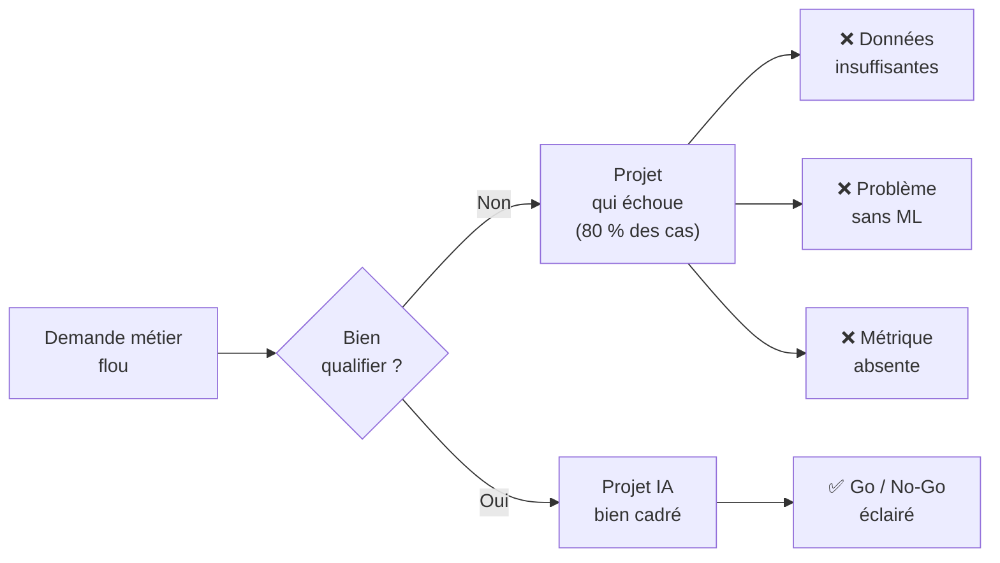
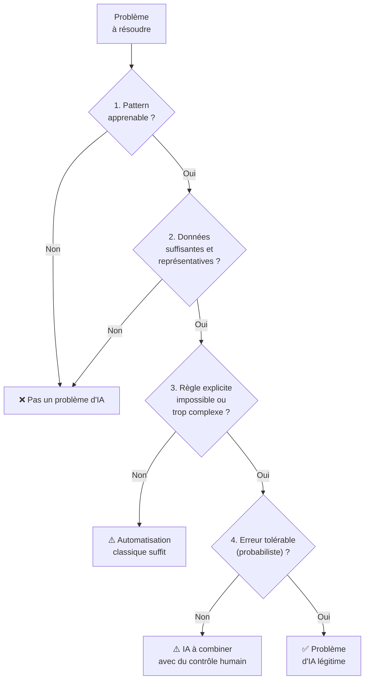
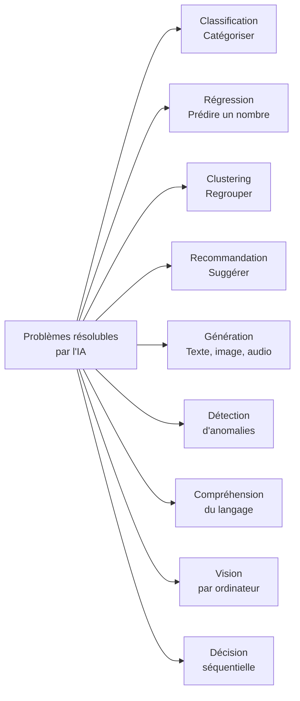
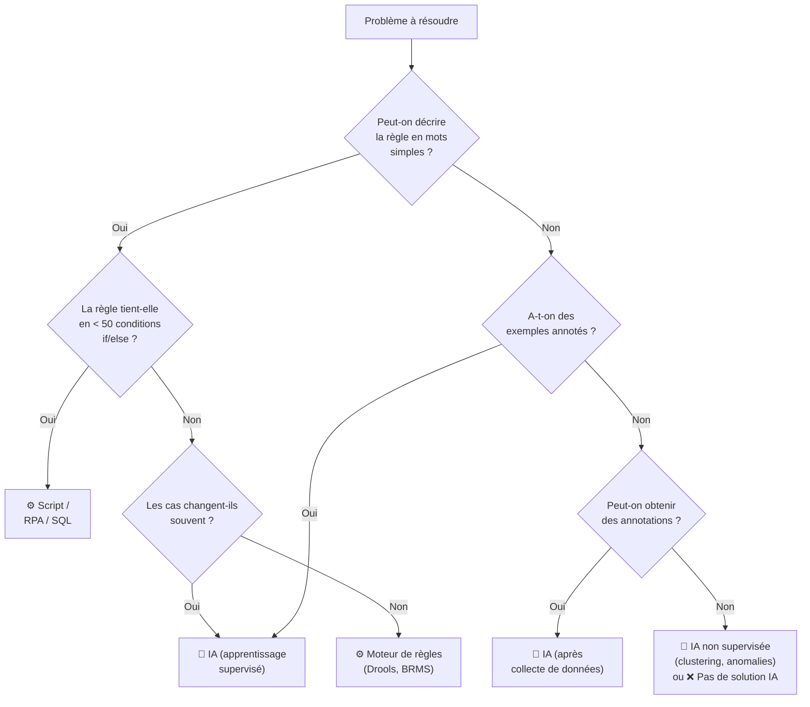
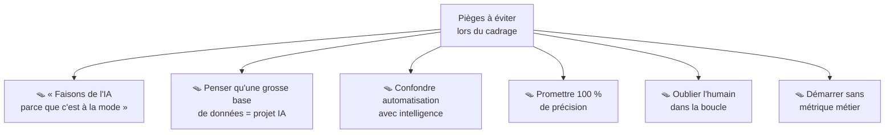
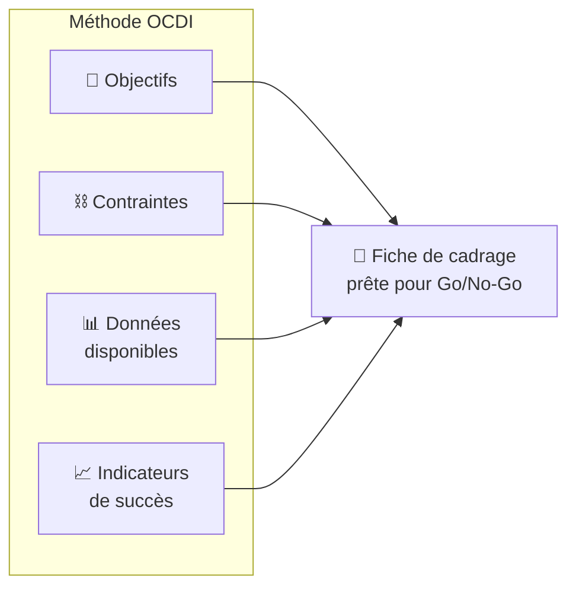
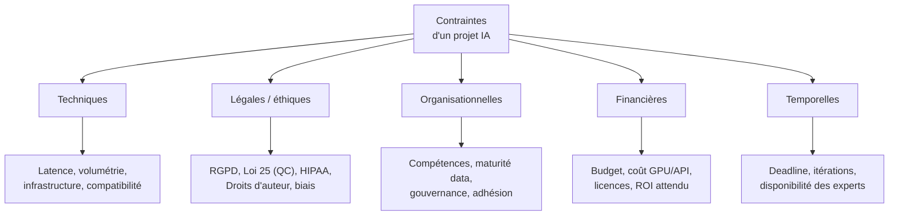
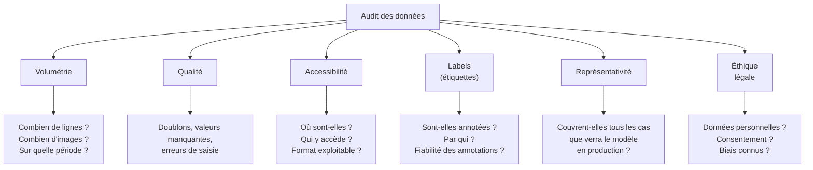
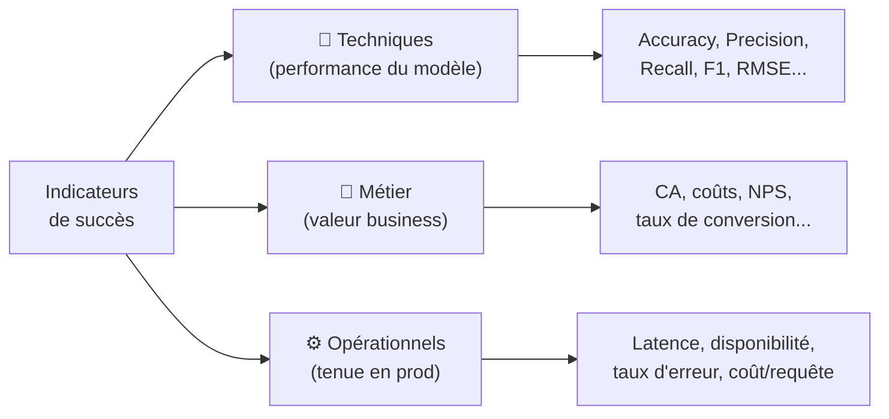

<a id="top"></a>

# Identifier les problèmes pouvant être résolus par l'IA

> L'objectif : savoir **décider** si un problème mérite une solution IA, avant même d'écrire la moindre ligne de code.

## Table des matières

| # | Section |
|---|---------|
| 1 | [Objectifs pédagogiques](#section-1) |
| 2 | [Qu'est-ce qu'un « problème d'IA » ?](#section-2) |
| 2a | &nbsp;&nbsp;&nbsp;↳ [Les 4 conditions nécessaires](#section-2) |
| 2b | &nbsp;&nbsp;&nbsp;↳ [Les familles de problèmes résolubles par l'IA](#section-2) |
| 3 | [Automatisation classique vs IA](#section-3) |
| 3a | &nbsp;&nbsp;&nbsp;↳ [Définitions et différences](#section-3) |
| 3b | &nbsp;&nbsp;&nbsp;↳ [Arbre de décision — IA ou pas IA ?](#section-3) |
| 3c | &nbsp;&nbsp;&nbsp;↳ [Tableau comparatif avec exemples](#section-3) |
| 3d | &nbsp;&nbsp;&nbsp;↳ [Les pièges classiques](#section-3) |
| 4 | [Analyse d'une problématique — la méthode OCDI](#section-4) |
| 4a | &nbsp;&nbsp;&nbsp;↳ [O — Objectifs](#section-4) |
| 4b | &nbsp;&nbsp;&nbsp;↳ [C — Contraintes](#section-4) |
| 4c | &nbsp;&nbsp;&nbsp;↳ [D — Données disponibles](#section-4) |
| 4d | &nbsp;&nbsp;&nbsp;↳ [I — Indicateurs de succès](#section-4) |
| 5 | [Canevas de cadrage d'un projet IA](#section-5) |
| 6 | [Études de cas guidées](#section-6) |
| 6a | &nbsp;&nbsp;&nbsp;↳ [Cas 1 — Centre d'appels](#section-6) |
| 6b | &nbsp;&nbsp;&nbsp;↳ [Cas 2 — E-commerce et recommandations](#section-6) |
| 6c | &nbsp;&nbsp;&nbsp;↳ [Cas 3 — Maintenance industrielle](#section-6) |
| 6d | &nbsp;&nbsp;&nbsp;↳ [Cas 4 — Le faux problème d'IA](#section-6) |
| 7 | [Activité individuelle — Qualifier 5 problèmes](#section-7) |
| 8 | [Travail de groupe — Pitch d'un projet IA](#section-8) |
| 9 | [Quiz de validation](#section-9) |
| 10 | [Grille d'évaluation et livrables](#section-10) |

---

<a id="section-1"></a>

<details>
<summary><strong>1 — Objectifs pédagogiques</strong></summary>

<br/>

À la fin de ce cours, vous serez capable de :

- **Reconnaître** les problèmes qui relèvent réellement de l'intelligence artificielle
- **Distinguer** une solution d'automatisation classique d'une solution d'IA
- **Analyser** une problématique à partir de quatre axes : objectifs, contraintes, données, indicateurs
- **Rédiger** une fiche de cadrage claire pour un projet IA
- **Défendre** une décision Go / No-Go devant un client ou un décideur

---

### Pourquoi ce cours est essentiel



> Selon Gartner, **plus de 80 % des projets IA n'atteignent pas la production**. La cause n°1 n'est pas technique — c'est un **mauvais cadrage** du problème.

</details>

<p align="right"><a href="#top">↑ Retour en haut</a></p>

---

<a id="section-2"></a>

<details>
<summary><strong>2 — Qu'est-ce qu'un « problème d'IA » ?</strong></summary>

<br/>

Un problème relève de l'IA quand **une règle explicite est impossible, trop coûteuse ou trop fragile à écrire**, mais qu'on dispose d'**exemples** à partir desquels une machine peut apprendre.

---

### Les 4 conditions nécessaires



| # | Condition | Question à se poser |
|---|-----------|---------------------|
| 1 | **Pattern apprenable** | Les cas passés ressemblent-ils suffisamment aux cas futurs ? |
| 2 | **Données disponibles** | Ai-je assez d'exemples, étiquetés ou non, pour apprendre ? |
| 3 | **Règle explicite trop complexe** | Est-ce qu'un `if / else` suffirait ? Si oui, inutile d'utiliser l'IA. |
| 4 | **Erreur tolérable** | Peut-on accepter un résultat probabiliste (avec marge d'erreur) ? |

---

### Les familles de problèmes résolubles par l'IA



| Famille | Exemples concrets | Technique typique |
|---------|-------------------|-------------------|
| **Classification** | Spam / non-spam, sentiment positif / négatif, diagnostic | Régression logistique, Random Forest, BERT |
| **Régression** | Prix d'une maison, consommation énergétique, durée | Régression linéaire, XGBoost, réseaux de neurones |
| **Clustering** | Segmentation client, regroupement d'articles similaires | K-means, DBSCAN, HDBSCAN |
| **Recommandation** | Produits, films, articles de presse | Filtrage collaboratif, embeddings |
| **Génération** | Résumé automatique, image, code | LLMs (GPT, Llama), diffusion (Stable Diffusion) |
| **Détection d'anomalies** | Fraude, pannes, cyberattaques | Isolation Forest, autoencoders |
| **NLP** | Traduction, chatbot, Q&R | Transformers, RAG |
| **Vision** | OCR, contrôle qualité, conduite autonome | CNN (ResNet, YOLO), ViT |
| **Décision séquentielle** | Robotique, jeux, trading | Reinforcement learning (DQN, PPO) |

> **Astuce** : avant de lancer un projet, formulez le problème sous forme d'une des familles ci-dessus. Si vous n'y arrivez pas, c'est probablement que ce n'est **pas** un problème d'IA.

</details>

<p align="right"><a href="#top">↑ Retour en haut</a></p>

---

<a id="section-3"></a>

<details>
<summary><strong>3 — Automatisation classique vs IA</strong></summary>

<br/>

> Toute automatisation n'est pas de l'IA. Comprendre la frontière évite de « sur-vendre » un projet et permet de choisir la technologie la plus simple possible (**principe KISS**).

---

### Définitions et différences

| Aspect | Automatisation classique | Intelligence artificielle |
|--------|--------------------------|---------------------------|
| **Logique** | Règles explicites écrites par un humain | Règles apprises à partir d'exemples |
| **Données** | Inutiles pour concevoir la règle | Essentielles (carburant du modèle) |
| **Résultat** | Déterministe (toujours le même) | Probabiliste (peut varier) |
| **Maintenance** | Éditer le code | Réentraîner le modèle |
| **Évolution** | Ajouter manuellement chaque cas | Apprend automatiquement des nouveaux exemples |
| **Explicabilité** | Totale | Partielle (boîte noire pour certains modèles) |
| **Échec typique** | Cas non prévu → bug | Cas hors distribution → prédiction fausse |

---

### Arbre de décision — IA ou pas IA ?



---

### Tableau comparatif avec exemples

| Problème | Solution optimale | Pourquoi ? |
|----------|-------------------|------------|
| Envoyer un courriel de bienvenue après inscription | **Automatisation** (RPA, Zapier) | Règle triviale, déterministe |
| Calculer une TPS/TVQ | **Automatisation** (formule) | Loi fiscale = règle explicite |
| Trier des courriels entrants en `spam` / `non-spam` | **IA** (classification) | Règle trop complexe, évolue sans cesse |
| Détecter un visage dans une photo | **IA** (vision) | Impossible d'écrire la règle en `if/else` |
| Générer un rapport mensuel à partir d'un template | **Automatisation** (Python + Jinja2) | Structure connue, pas d'ambiguïté |
| Résumer 500 commentaires clients | **IA** (NLP, LLM) | Pas de règle, besoin de compréhension |
| Refacturer un client selon un barème | **Automatisation** (SQL) | Règle métier claire |
| Prévoir la demande produit de la semaine prochaine | **IA** (régression temporelle) | Patterns complexes dans les historiques |
| Envoyer une alerte si un serveur dépasse 90 % de CPU | **Automatisation** (seuil) | Règle binaire simple |
| Détecter une attaque zero-day sur le réseau | **IA** (détection d'anomalies) | Les signatures classiques ne suffisent plus |
| Recommander un film à un utilisateur | **IA** (recommandation) | Dépend de préférences apprises |

---

### Les pièges classiques



| Piège | Exemple réel | Conséquence | Remède |
|-------|--------------|-------------|--------|
| **« IA washing »** | « On va mettre du ChatGPT partout » | Coût × 10 vs règles simples | Commencer par la solution la plus simple |
| **Confusion volume = valeur** | 10 To de logs mais pas d'étiquettes | Rien à apprendre | Vérifier la qualité des étiquettes |
| **Règles maquillées en IA** | « Notre IA détecte les mots interdits » (liste de mots-clés) | Mensonge marketing | Être honnête sur la technique |
| **Promesse de 100 %** | « Notre modèle ne se trompe jamais » | Perte de confiance | Toujours communiquer une marge d'erreur |
| **Absence d'HITL** (Human-In-The-Loop) | Diagnostic médical 100 % automatisé | Risque juridique et éthique | Prévoir un processus de validation humaine |
| **Métrique floue** | « On veut améliorer l'expérience client » | Impossible d'évaluer le succès | Définir un KPI chiffré dès le début |

</details>

<p align="right"><a href="#top">↑ Retour en haut</a></p>

---

<a id="section-4"></a>

<details>
<summary><strong>4 — Analyse d'une problématique — la méthode OCDI</strong></summary>

<br/>

Pour cadrer un projet IA, nous utilisons la méthode **OCDI** — quatre axes à remplir systématiquement :



---

### O — Objectifs

Un bon objectif est **SMART** : Spécifique, Mesurable, Atteignable, Réaliste, Temporel.

| Niveau | Question | Exemple (projet support client) |
|--------|----------|--------------------------------|
| **Objectif métier** | Pourquoi faisons-nous ce projet ? | Réduire le temps de traitement moyen d'un ticket de 24 h à 8 h |
| **Objectif produit** | Que va faire la solution ? | Classer automatiquement les tickets par catégorie et urgence |
| **Objectif technique** | Que doit faire le modèle ? | Classifier un ticket en 12 catégories avec F1-score ≥ 0,85 |

#### Anti-exemples (objectifs à bannir)

- ❌ « Améliorer l'expérience client » (pas mesurable)
- ❌ « Faire de l'IA » (ce n'est pas un objectif)
- ❌ « Battre la concurrence grâce à l'IA » (vague)
- ❌ « Avoir un modèle à 99 % de précision » (pas un objectif métier)

#### Formulation correcte

> D'ici **6 mois**, **réduire de 60 %** le nombre de tickets mal routés (de 15 000 à 6 000 / mois) grâce à une **classification automatique**, afin de **faire économiser 400 k$ / an** en heures de support.

---

### C — Contraintes

Les contraintes définissent le **champ du possible**. Ignorer une contrainte = projet qui déraille.



| Type | Exemples concrets | Questions à poser |
|------|------------------|-------------------|
| **Techniques** | Latence < 200 ms, déploiement on-premise, pas de GPU disponible | Quelle infrastructure ? Quelle volumétrie à traiter ? |
| **Légales** | RGPD (UE), Loi 25 (Québec), PIPEDA (Canada), anonymisation obligatoire | Les données sont-elles personnelles ? Faut-il un DPO / EIVP ? |
| **Éthiques** | Pas de biais de genre, explicabilité requise, décisions humaines finales | Y a-t-il un impact sur des personnes ? |
| **Organisationnelles** | Équipe de 2 personnes, pas de data engineer | Qui fait quoi ? Qui valide ? |
| **Financières** | Budget total 80 k$, coût API ≤ 500 $ / mois | Quel est le coût par prédiction toléré ? |
| **Temporelles** | POC en 6 semaines, production en 4 mois | Quelle est l'échéance critique ? |

#### Liste de contrôle des contraintes (à cocher)

- [ ] Volume de données à traiter en temps réel (req/s)
- [ ] Latence maximale acceptable
- [ ] Environnement de déploiement (cloud, on-prem, edge)
- [ ] Conformité légale (RGPD, Loi 25, HIPAA, etc.)
- [ ] Exigence d'explicabilité (sortie interprétable ?)
- [ ] Budget (dev + infra + licences)
- [ ] Compétences disponibles dans l'équipe
- [ ] Délais et jalons critiques
- [ ] Intégration avec les systèmes existants (CRM, ERP, SIRH...)
- [ ] Politique de rétention et sécurité des données

---

### D — Données disponibles

**Pas de données, pas d'IA.** Cet axe est souvent celui qui tue un projet — autant le traiter tôt.



#### Grille d'audit rapide

| Critère | Question | Score (1-5) |
|---------|----------|-------------|
| **Volume** | Ai-je au moins quelques milliers d'exemples ? | ☐ |
| **Qualité** | Les données sont-elles propres (< 10 % de valeurs manquantes) ? | ☐ |
| **Labels** | Sont-elles étiquetées (ou puis-je les étiqueter) ? | ☐ |
| **Fraîcheur** | Datent-elles de moins de 12 mois ? | ☐ |
| **Accessibilité** | Puis-je y accéder techniquement et légalement ? | ☐ |
| **Représentativité** | Couvrent-elles toutes les situations cibles ? | ☐ |
| **Équilibre** | Les classes sont-elles équilibrées (ratio < 1:10) ? | ☐ |
| **Diversité** | Y a-t-il plusieurs sources pour limiter les biais ? | ☐ |

> **Règle du pouce** : si la note moyenne est **< 3 / 5**, il faut investir dans la collecte et l'annotation **avant** de parler de modélisation.

#### Types de données par problème

| Type de problème | Données typiques | Volume minimum indicatif |
|------------------|------------------|--------------------------|
| Classification binaire simple | Tableau structuré, 1 label par ligne | ~1 000 à 10 000 |
| Classification multi-classes | Tableau ou texte, 1 label par ligne | ~5 000 à 100 000 |
| Détection d'objets (image) | Images annotées avec boîtes | ~5 000 à 50 000 |
| NLP (sentiment, intention) | Textes annotés | ~10 000 à 100 000 |
| Régression | Tableau structuré, cible numérique | ~2 000 à 50 000 |
| Fine-tuning d'un LLM | Paires (instruction, réponse) | ~500 à 10 000 |
| Entraînement d'un LLM from scratch | Corpus massif | Milliards de tokens (généralement hors de portée) |

---

### I — Indicateurs de succès

On définit **toujours** deux niveaux d'indicateurs : **technique** (le modèle) et **métier** (la valeur).



#### Métriques techniques selon le type de problème

| Type de problème | Métriques recommandées | Quand l'utiliser ? |
|------------------|-----------------------|--------------------|
| Classification équilibrée | Accuracy, F1 macro | Classes ~équilibrées |
| Classification déséquilibrée | F1, Precision, Recall, PR-AUC | Fraude, maladies rares |
| Classification multi-classes | F1 macro / micro / weighted, matrice de confusion | Catégorisation |
| Régression | MAE, RMSE, MAPE, R² | Prédiction numérique |
| Recommandation | Precision@K, Recall@K, NDCG, MAP | Top-N recommandation |
| NLP (génération) | BLEU, ROUGE, BERTScore, évaluation humaine | Résumé, traduction |
| Détection d'anomalies | Precision, Recall, taux de faux positifs | Fraude, maintenance |
| Clustering | Silhouette, Davies-Bouldin, évaluation humaine | Segmentation |

#### Indicateurs métier

| Indicateur | Exemple chiffré |
|-----------|-----------------|
| Économies réalisées | « –300 k$ / an sur les coûts de support » |
| Gain de productivité | « +40 % de tickets traités par agent » |
| Revenus additionnels | « +2 % de conversion sur la page produit » |
| Satisfaction client | « NPS +8 points » |
| Réduction d'incidents | « –50 % de faux positifs sur les alertes » |
| Temps gagné | « 3 000 h / an libérées pour les experts » |

#### Baseline — **toujours** la mesurer

> Avant d'entraîner un modèle, mesurez la performance actuelle (système manuel, règles, ou modèle trivial). **Sans baseline, impossible de démontrer la valeur de l'IA.**

| Type de baseline | Exemple |
|------------------|---------|
| **Humain** | Un agent classe 60 tickets / h avec 90 % d'exactitude |
| **Règle simple** | `if mot_cle in ticket → catégorie X` → 55 % de F1 |
| **Modèle trivial** | Prédire toujours la classe majoritaire → 35 % de F1 |
| **Système existant** | Ancien modèle interne → 72 % de F1 |

</details>

<p align="right"><a href="#top">↑ Retour en haut</a></p>

---

<a id="section-5"></a>

<details>
<summary><strong>5 — Canevas de cadrage d'un projet IA</strong></summary>

<br/>

Voici un **canevas d'une page** à remplir pour tout nouveau projet IA. Il doit être validé par le client et l'équipe technique **avant** la phase de modélisation.

```
╔════════════════════════════════════════════════════════════════╗
║              FICHE DE CADRAGE — PROJET IA                     ║
╚════════════════════════════════════════════════════════════════╝

Nom du projet    : ________________________________________
Responsable      : ________________________________________
Date             : ________________________________________
Version          : ________________________________________

───────────────────────────────────────────────────────────────
1. CONTEXTE (3 lignes max)
───────────────────────────────────────────────────────────────
Le problème métier est : _________________________________
Il concerne : ____________________________________________
Aujourd'hui, il est traité par : _________________________

───────────────────────────────────────────────────────────────
2. OBJECTIFS (SMART)
───────────────────────────────────────────────────────────────
Objectif métier     : ____________________________________
Objectif produit    : ____________________________________
Objectif technique  : ____________________________________

───────────────────────────────────────────────────────────────
3. CONTRAINTES
───────────────────────────────────────────────────────────────
☐ Techniques        : ___________________________________
☐ Légales/éthiques  : ___________________________________
☐ Budget            : ___________________________________
☐ Délai             : ___________________________________
☐ Autres            : ___________________________________

───────────────────────────────────────────────────────────────
4. DONNÉES DISPONIBLES
───────────────────────────────────────────────────────────────
Sources            : ____________________________________
Volume             : ____________________________________
Qualité (audit)    : ____ / 5
Labels disponibles : ☐ Oui  ☐ Non  ☐ Partiellement
Accès légal validé : ☐ Oui  ☐ Non

───────────────────────────────────────────────────────────────
5. INDICATEURS DE SUCCÈS
───────────────────────────────────────────────────────────────
Baseline actuelle       : _______________________________
Métrique technique cible: _______________________________
Métrique métier cible   : _______________________________
Métrique opérationnelle : _______________________________

───────────────────────────────────────────────────────────────
6. FAMILLE DE PROBLÈME IA
───────────────────────────────────────────────────────────────
☐ Classification        ☐ Régression       ☐ Clustering
☐ Recommandation        ☐ Génération       ☐ Détection d'anomalies
☐ NLP                   ☐ Vision           ☐ Autre : _______

───────────────────────────────────────────────────────────────
7. DÉCISION
───────────────────────────────────────────────────────────────
☐ GO             ☐ GO CONDITIONNEL          ☐ NO-GO

Justification    : ______________________________________
Prochaine étape  : ______________________________________
Validé par       : ______________________________________
```

---

### Exemple rempli — « Classification de tickets support »

| Rubrique | Contenu |
|----------|---------|
| **Contexte** | L'équipe support reçoit 25 000 tickets/mois, 30 % sont mal routés. |
| **Objectif métier** | Réduire de 60 % le taux de mauvais routage en 6 mois. |
| **Objectif technique** | Classifier en 12 catégories avec F1 ≥ 0,85. |
| **Contraintes** | RGPD, latence < 1 s, budget 80 k$, POC en 6 semaines. |
| **Données** | 200 000 tickets historiques étiquetés (catégorie + urgence). |
| **Baseline** | Routage humain : 70 % correct. Règle mots-clés : 55 %. |
| **Métrique technique** | F1 macro ≥ 0,85. |
| **Métrique métier** | Économies ≥ 300 k$ / an. |
| **Famille** | Classification multi-classes (NLP). |
| **Décision** | ✅ GO — données et ROI validés. |

</details>

<p align="right"><a href="#top">↑ Retour en haut</a></p>

---

<a id="section-6"></a>

<details>
<summary><strong>6 — Études de cas guidées</strong></summary>

<br/>

Chaque étude de cas ci-dessous présente une situation réelle. **Avant de lire la solution**, essayez de remplir mentalement la fiche OCDI.

---

### Cas 1 — Centre d'appels

> **Énoncé** : Un centre d'appels traite 4 000 appels / jour. Les agents notent manuellement le motif de l'appel après chaque conversation, ce qui prend 2 min par appel. Les dirigeants veulent accélérer cette étape.

<details>
<summary><em>▶ Analyse OCDI</em></summary>

| Axe | Réponse |
|-----|---------|
| **O — Objectifs** | Réduire le temps de saisie de 2 min → 15 s par appel. Gain attendu : 1,8 M$/an. |
| **C — Contraintes** | Appels en français (QC) et anglais, RGPD + Loi 25, intégration avec le CRM, latence < 5 s. |
| **D — Données** | 18 mois d'enregistrements audio transcrits + motifs annotés (1,2 M d'exemples). |
| **I — Indicateurs** | F1 macro ≥ 0,80 sur 24 motifs, gain de temps moyen ≥ 90 %, NPS agents ≥ +5. |
| **Famille IA** | NLP — classification de texte issue de transcription automatique (ASR). |
| **Verdict** | ✅ **Projet IA légitime** — gros volume, patterns apprenables, ROI clair, données disponibles. |

</details>

---

### Cas 2 — E-commerce et recommandations

> **Énoncé** : Un site e-commerce de 50 000 produits a un taux de conversion de 1,8 %. Le CEO veut « ajouter de l'IA pour vendre plus ».

<details>
<summary><em>▶ Analyse OCDI</em></summary>

| Axe | Réponse |
|-----|---------|
| **O — Objectifs** | Passer de 1,8 % → 2,3 % de conversion en 12 mois grâce à un moteur de recommandation personnalisé. |
| **C — Contraintes** | Cookies-less en approche, latence < 100 ms, budget 120 k$/an, ≥ 30 % du trafic sans compte. |
| **D — Données** | Historique de 24 mois : clics, paniers, achats (anonymisés), 2,3 M d'utilisateurs actifs. |
| **I — Indicateurs** | CTR sur recommandations ≥ 8 %, +15 M$/an de CA, NDCG@10 ≥ 0,45. |
| **Famille IA** | Recommandation (filtrage collaboratif + content-based). |
| **Verdict** | ✅ **Projet IA légitime**, **mais** démarrer par une baseline « produits populaires » avant tout modèle. |

</details>

---

### Cas 3 — Maintenance industrielle

> **Énoncé** : Une usine souhaite prédire les pannes de ses 40 machines-outils. Elles ont chacune 12 capteurs (vibration, température, courant). Historiquement, les pannes surviennent ~1 fois par mois par machine.

<details>
<summary><em>▶ Analyse OCDI</em></summary>

| Axe | Réponse |
|-----|---------|
| **O — Objectifs** | Détecter une panne imminente ≥ 48 h à l'avance. Objectif : –30 % d'arrêts non planifiés. |
| **C — Contraintes** | Déploiement **edge** sur PLC, faibles ressources (1 Go RAM), environnement industriel (pas de cloud). |
| **D — Données** | 18 mois de télémétrie à 10 Hz (≈ 200 milliards de points), seulement 480 pannes étiquetées. |
| **I — Indicateurs** | Recall ≥ 0,80 sur les pannes, Precision ≥ 0,50, taux de faux positifs < 2 / machine / mois. |
| **Famille IA** | Détection d'anomalies + classification déséquilibrée (séries temporelles). |
| **Verdict** | ✅ **Projet IA légitime** — problème typique où les règles seuil ne suffisent pas, mais attention au **déséquilibre** (480 positifs vs des milliards de points normaux). |

</details>

---

### Cas 4 — Le faux problème d'IA

> **Énoncé** : Une PME veut « mettre de l'IA » pour calculer le total d'une facture (produits + taxes + livraison + remises).

<details>
<summary><em>▶ Analyse OCDI</em></summary>

| Axe | Réponse |
|-----|---------|
| **O — Objectifs** | Calculer un total sans erreur. |
| **C — Contraintes** | Zéro tolérance à l'erreur (comptabilité), traçabilité légale. |
| **D — Données** | Aucun besoin d'historique — la règle est **explicite** dans le code fiscal. |
| **I — Indicateurs** | 100 % d'exactitude exigé. |
| **Famille IA** | **Aucune.** |
| **Verdict** | ❌ **Ce n'est PAS un problème d'IA.** C'est une **automatisation classique** avec une formule déterministe. L'IA serait moins fiable, plus coûteuse et non auditable. |

> **Leçon** : Toujours passer le test « peut-on l'écrire en `if/else` ? » avant de parler d'IA.

</details>

</details>

<p align="right"><a href="#top">↑ Retour en haut</a></p>

---

<a id="section-7"></a>

<details>
<summary><strong>7 — Activité individuelle — Qualifier 5 problèmes</strong></summary>

<br/>

**Durée : 45 minutes.**

Pour chacun des 5 problèmes ci-dessous, indiquez :

1. **Type de solution** : Automatisation classique / IA / Combiné / Aucun
2. **Famille IA** (si IA) : classification, régression, NLP, vision, recommandation, détection d'anomalies, génération, clustering
3. **Justification** en 2 à 3 phrases

---

### Problèmes à qualifier

| # | Problème |
|---|----------|
| 1 | Un hôpital veut prédire le risque de réadmission d'un patient dans les 30 jours après sa sortie, à partir de son dossier médical électronique. |
| 2 | Une banque doit envoyer automatiquement un courriel de bienvenue à tout nouveau client dont l'inscription est validée. |
| 3 | Une ville souhaite identifier automatiquement les graffitis sur les murs à partir de photos prises par les agents de surveillance. |
| 4 | Un service RH veut générer automatiquement les lettres de confirmation d'embauche en y insérant le nom, le poste, la date d'entrée et le salaire. |
| 5 | Un transporteur veut optimiser le trajet quotidien de ses 300 camions en tenant compte du trafic, des fenêtres horaires de livraison et de la consommation de carburant. |

### Grille de réponse

```
Problème 1 : ________________________________________
  Type de solution : _______________________________
  Famille IA       : _______________________________
  Justification    : _______________________________

Problème 2 : ________________________________________
  ...
```

---

### Corrigé indicatif (à ne consulter qu'après l'exercice)

<details>
<summary><em>▶ Voir le corrigé</em></summary>

| # | Solution | Famille | Justification |
|---|----------|---------|---------------|
| 1 | **IA** | Classification binaire (ou régression de risque) | Patterns complexes, historique riche, règles explicites impossibles, impact métier fort (mais HITL obligatoire). |
| 2 | **Automatisation** | — | Règle déterministe : `si inscription validée → envoyer template`. Aucun apprentissage nécessaire. |
| 3 | **IA** | Vision (détection d'objets) | Impossible d'écrire un `if/else` sur des pixels. CNN ou modèle type YOLO. |
| 4 | **Automatisation** | — | Génération par template (Jinja2, docx-template). L'IA générative est inutile et risquée juridiquement. |
| 5 | **Combiné** | Optimisation (recherche opérationnelle) + éventuellement ML pour prédire le trafic | Cœur du problème = optimisation (pas IA pure). ML complémentaire pour les prévisions. |

</details>

</details>

<p align="right"><a href="#top">↑ Retour en haut</a></p>

---

<a id="section-8"></a>

<details>
<summary><strong>8 — Travail de groupe — Pitch d'un projet IA</strong></summary>

<br/>

**Durée : 2 h (1 h préparation, 1 h présentations).**
**Groupes : 3 à 4 étudiants.**

---

### Consigne

Chaque groupe choisit **un secteur** et **imagine un projet IA réaliste** à proposer à une entreprise fictive. Le groupe doit **pitcher** son projet en **5 minutes** devant la classe.

| Secteur suggéré | Exemples de problématiques |
|-----------------|----------------------------|
| Santé | Détection précoce de pathologies, optimisation d'horaires, tri des urgences |
| Éducation | Suivi personnalisé des étudiants, correction automatique, recommandation de contenus |
| Finance | Détection de fraude, scoring de crédit, prévision de marché |
| Transport / logistique | Maintenance prédictive, optimisation de tournées, prévision de demande |
| Commerce | Recommandation, prévision de stock, chatbot |
| Environnement | Analyse d'images satellites, prévision d'incendies, qualité de l'air |
| Culture / média | Recommandation, génération de résumés, modération de commentaires |
| Secteur public | Détection de fraude fiscale, tri de documents, accessibilité |

---

### Plan du pitch (5 min, 5 slides)

1. **Le problème** (1 min) — contexte, enjeu, impact
2. **La solution IA proposée** (1 min) — famille de problème, approche technique
3. **Analyse OCDI** (1 min 30) — objectifs, contraintes, données, indicateurs
4. **Pourquoi l'IA et pas autre chose ?** (30 s) — justification de la valeur ajoutée
5. **Go / No-Go et prochaines étapes** (1 min)

---

### Grille d'évaluation par les pairs

| Critère | Poids | Notation /5 |
|---------|-------|-------------|
| Clarté du problème métier | 20 % | ☐ |
| Pertinence de la solution IA (vs automatisation) | 25 % | ☐ |
| Qualité de l'analyse OCDI | 25 % | ☐ |
| Réalisme des contraintes et données | 15 % | ☐ |
| Qualité du pitch (narration, slides, temps) | 15 % | ☐ |

</details>

<p align="right"><a href="#top">↑ Retour en haut</a></p>

---

<a id="section-9"></a>

<details>
<summary><strong>9 — Quiz de validation</strong></summary>

<br/>

Dix questions à choix multiples pour tester vos acquis. Un seul choix correct par question (sauf mention contraire).

---

**Q1 — Laquelle des situations suivantes relève le **mieux** d'une automatisation classique plutôt que d'une IA ?**

- [ ] A. Détecter si une photo contient un chat
- [ ] B. Calculer la TPS + TVQ sur une facture
- [ ] C. Résumer un contrat de 80 pages
- [ ] D. Prédire le taux de désabonnement d'un client

---

**Q2 — Parmi ces éléments, lequel **n'est pas** une condition nécessaire pour justifier un projet IA ?**

- [ ] A. Un pattern apprenable dans les données
- [ ] B. Des données disponibles en quantité suffisante
- [ ] C. Une règle explicite facile à écrire en `if/else`
- [ ] D. Une tolérance à l'erreur probabiliste

---

**Q3 — Vous avez 300 exemples étiquetés pour une classification en 20 catégories. Que faire ?**

- [ ] A. Entraîner directement un modèle complexe (transformer)
- [ ] B. Investir dans l'annotation ou utiliser un LLM en few-shot
- [ ] C. Abandonner le projet
- [ ] D. Utiliser du clustering non supervisé

---

**Q4 — Quelle est la **meilleure** formulation d'objectif SMART ?**

- [ ] A. « Améliorer notre support client grâce à l'IA »
- [ ] B. « Atteindre 95 % d'accuracy »
- [ ] C. « Réduire de 60 % le taux de tickets mal routés en 6 mois »
- [ ] D. « Battre la concurrence »

---

**Q5 — Vous travaillez sur un modèle de détection de fraude. Quelle métrique est **la plus** critique ?**

- [ ] A. Accuracy
- [ ] B. Recall (et F1) sur la classe « fraude »
- [ ] C. RMSE
- [ ] D. BLEU

---

**Q6 — Qu'est-ce qu'une *baseline* ?**

- [ ] A. Le meilleur modèle de l'état de l'art
- [ ] B. Un point de comparaison simple (humain, règle, modèle trivial) avant d'évaluer un modèle IA
- [ ] C. Le jeu de données de validation
- [ ] D. La version 1.0 du modèle

---

**Q7 — Parmi ces tâches, laquelle relève de l'IA générative ?**

- [ ] A. Rédiger automatiquement un résumé de 10 articles scientifiques
- [ ] B. Classer des courriels en spam / non-spam
- [ ] C. Calculer la moyenne d'une série de ventes
- [ ] D. Regrouper des clients par similarité

---

**Q8 — Quelle contrainte est **légale** plutôt que technique ?**

- [ ] A. Latence < 100 ms
- [ ] B. Déploiement sur GPU A100
- [ ] C. Conformité RGPD / Loi 25
- [ ] D. Compatibilité avec Python 3.11

---

**Q9 — Votre client vous dit : « Je veux un modèle à 99,9 % d'exactitude. » Que répondez-vous ?**

- [ ] A. « C'est possible, je m'en occupe. »
- [ ] B. « Définissons d'abord la métrique la plus critique et un seuil réaliste basé sur la baseline. »
- [ ] C. « C'est impossible, je refuse le projet. »
- [ ] D. « On peut tricher sur la métrique. »

---

**Q10 — Vous avez un problème où la règle métier tient en 15 conditions `if/else` claires. Quelle est la meilleure approche ?**

- [ ] A. Un LLM avec prompt engineering
- [ ] B. Un réseau de neurones profond
- [ ] C. Un simple script ou moteur de règles
- [ ] D. Du reinforcement learning

---

<details>
<summary><em>▶ Voir les réponses</em></summary>

| Q | Réponse | Justification |
|---|---------|---------------|
| 1 | **B** | Calcul fiscal = règle déterministe explicite. |
| 2 | **C** | Une règle simple = pas besoin d'IA. |
| 3 | **B** | 300 exemples × 20 classes = trop peu. Few-shot LLM ou annotation supplémentaire. |
| 4 | **C** | Seule réponse SMART (spécifique, mesurable, temporelle). |
| 5 | **B** | En fraude, on veut **détecter un maximum de cas** (Recall), même au prix de faux positifs. |
| 6 | **B** | Définition exacte de la baseline. |
| 7 | **A** | Génération de texte = IA générative. |
| 8 | **C** | RGPD / Loi 25 = contraintes légales. |
| 9 | **B** | Toujours ramener le client à une métrique et une baseline réalistes. |
| 10 | **C** | 15 `if/else` = automatisation classique, pas IA. |

**Barème** : 8-10 correct = excellent, 6-7 = bon, < 6 = revoir sections 2 à 4.

</details>

</details>

<p align="right"><a href="#top">↑ Retour en haut</a></p>

---

<a id="section-10"></a>

<details>
<summary><strong>10 — Grille d'évaluation et livrables</strong></summary>

<br/>

### Livrables du cours

| Livrable | Format | Pondération |
|----------|--------|-------------|
| Qualification des 5 problèmes (activité individuelle) | Fichier `.md` ou PDF, 1 à 2 pages | 20 % |
| Fiche de cadrage OCDI complète pour un projet choisi | Fichier `.md` ou PDF, 2 à 3 pages | 40 % |
| Pitch de groupe (5 min + slides) | Présentation (PPT / PDF) + enregistrement vidéo | 30 % |
| Quiz final | En ligne | 10 % |

---

### Grille d'évaluation détaillée (fiche de cadrage)

| Critère | Points | Description |
|---------|--------|-------------|
| Contexte et problématique | /10 | Clair, concis, ancré dans un besoin réel |
| Objectifs SMART | /15 | Trois niveaux (métier, produit, technique) avec chiffres |
| Analyse des contraintes | /15 | Couvre techniques + légales + org. + budget + délais |
| Audit des données | /20 | Volume, qualité, labels, représentativité, légalité |
| Indicateurs de succès | /15 | Technique + métier + opérationnel + baseline |
| Justification IA vs automatisation | /10 | Argumentée avec test `if/else`, volume, patterns |
| Décision Go/No-Go | /10 | Cohérente avec l'analyse, risques identifiés |
| Qualité rédactionnelle | /5 | Structure, orthographe, lisibilité |

---

### Ressources complémentaires

- [CIFAR — AI Pan-Canadian Strategy](https://cifar.ca/ai/)
- [Google — People + AI Guidebook](https://pair.withgoogle.com/)
- [Microsoft — Responsible AI Impact Assessment Template](https://www.microsoft.com/en-us/ai/responsible-ai)
- [AI Canvas (Agrawal, Gans, Goldfarb)](https://hbr.org/2018/04/a-simple-tool-to-start-making-decisions-with-the-help-of-ai)
- [CNIL — IA et RGPD](https://www.cnil.fr/fr/intelligence-artificielle)
- [Loi 25 (Québec) — Loi sur la protection des renseignements personnels](https://www.cai.gouv.qc.ca/)

---

### Prochaine étape

Une fois votre problème **qualifié** et votre fiche OCDI validée, passez au cours **[20 — Cycle de vie d'un projet IA](./20-Cycle-de-vie-projet-IA.md)** pour découvrir les 7 phases de réalisation, de la collecte des données jusqu'au monitoring en production.

</details>

<p align="right"><a href="#top">↑ Retour en haut</a></p>


_Fin du cours — Identifier les problèmes pouvant être résolus par l'IA._
