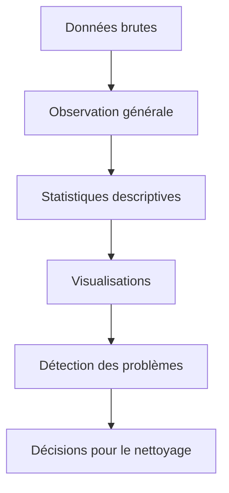
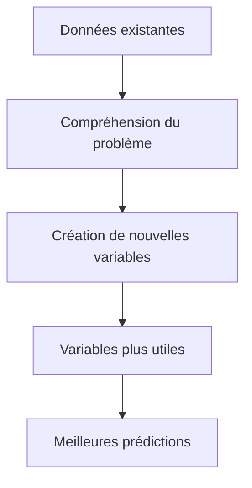
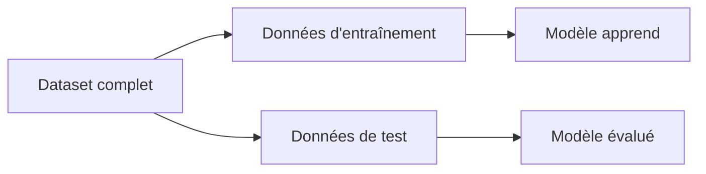
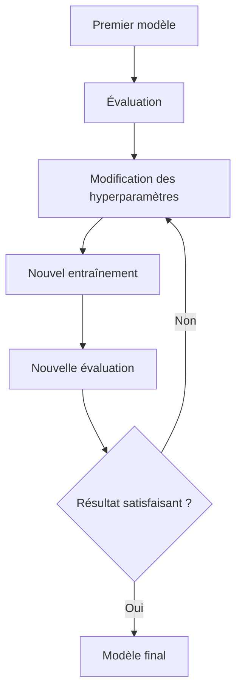
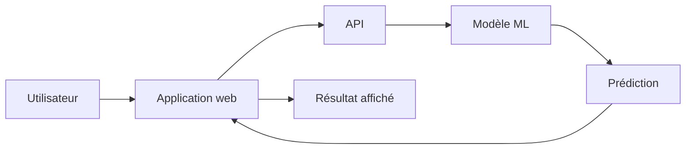

<a id="top"></a>

# Cycle de vie d’un projet en Machine Learning

## Table des matières

| #  | Section                                         |
| -- | ----------------------------------------------- |
| 1  | [Vue d’ensemble du cycle de vie ML](#section-1) |
| 2  | [Collecte des données](#section-2)              |
| 3  | [Analyse exploratoire des données](#section-3)  |
| 4  | [Préparation des données](#section-4)           |
| 5  | [Feature engineering](#section-5)               |
| 6  | [Choix de l’algorithme](#section-6)             |
| 7  | [Entraînement du modèle](#section-7)            |
| 8  | [Évaluation du modèle](#section-8)              |
| 9  | [Fine-tuning du modèle](#section-9)             |
| 10 | [Déploiement du modèle](#section-10)            |
| 11 | [Vulgarisation finale](#section-11)             |

---

<a id="section-1"></a>

<details>
<summary><strong>1 — Vue d’ensemble du cycle de vie ML</strong></summary>

<br/>

Un projet en **Machine Learning** ne commence pas directement par l’entraînement d’un modèle. Avant de choisir un algorithme, il faut comprendre le problème, collecter les bonnes données, les analyser, les préparer, puis seulement ensuite entraîner et tester un modèle.

Le cycle de vie d’un projet ML correspond à l’ensemble des étapes qui permettent de passer d’un problème réel à une solution intelligente utilisable dans une application, une API, un tableau de bord ou un service cloud.

---

## Étapes principales

| Étape                          | Rôle                                                 |
| ------------------------------ | ---------------------------------------------------- |
| **1. Collecte des données**    | Rassembler les données nécessaires au projet         |
| **2. Analyse exploratoire**    | Comprendre les données avant de construire le modèle |
| **3. Préparation des données** | Nettoyer, corriger et transformer les données        |
| **4. Feature engineering**     | Créer de nouvelles variables utiles                  |
| **5. Choix de l’algorithme**   | Choisir le modèle adapté au problème                 |
| **6. Entraînement**            | Faire apprendre le modèle à partir des données       |
| **7. Évaluation**              | Mesurer la qualité du modèle                         |
| **8. Fine-tuning**             | Améliorer les réglages du modèle                     |
| **9. Déploiement**             | Mettre le modèle en production                       |

---

## Schéma global du cycle ML


---

## Exemple général

Une entreprise veut prédire si un client risque de quitter son service.

Pour cela, elle doit :

1. collecter les données des anciens clients ;
2. analyser les comportements ;
3. nettoyer les données ;
4. créer des variables utiles ;
5. choisir un modèle de classification ;
6. entraîner le modèle ;
7. mesurer sa performance ;
8. améliorer ses paramètres ;
9. l’intégrer dans une vraie application.

</details>

<p align="right"><a href="#top">↑ Retour en haut</a></p>

---

<a id="section-2"></a>

<details>
<summary><strong>2 — Collecte des données</strong></summary>

<br/>

## Définition

La **collecte des données** est la première étape d’un projet Machine Learning. Elle consiste à rassembler toutes les informations nécessaires pour résoudre un problème.

Un modèle de Machine Learning apprend à partir d’exemples. Si les exemples sont mauvais, incomplets ou mal choisis, le modèle risque de produire de mauvaises prédictions.

---

## Sources possibles de données

| Source               | Exemple                                     |
| -------------------- | ------------------------------------------- |
| Base de données      | Clients, ventes, transactions               |
| Fichier CSV ou Excel | Historique de prix, résultats d’examens     |
| API                  | Données météo, données financières          |
| Capteurs             | Température, mouvement, vitesse             |
| Images               | Radiographies, photos de produits           |
| Texte                | Avis clients, courriels, documents          |
| Logs                 | Connexions, erreurs système, navigation web |

---

## Exemple

Une entreprise veut prédire le prix des maisons.

Elle collecte :

* la superficie ;
* le nombre de chambres ;
* le quartier ;
* l’année de construction ;
* la présence d’un garage ;
* le prix réel des maisons déjà vendues.

Dans ce cas, le modèle aura besoin d’anciens exemples pour apprendre la relation entre les caractéristiques d’une maison et son prix.

---

## Questions importantes

Avant d’utiliser les données, il faut se demander :

* Les données sont-elles fiables ?
* Les données sont-elles suffisantes ?
* Les données représentent-elles bien la réalité ?
* Les données contiennent-elles la réponse attendue ?
* Les données sont-elles récentes ?
* Les données peuvent-elles être utilisées légalement ?

---

## Risque principal

Si les données sont de mauvaise qualité, le modèle sera de mauvaise qualité.

On résume souvent cela par l’expression :

> Mauvaises données en entrée, mauvais résultat en sortie.

</details>

<p align="right"><a href="#top">↑ Retour en haut</a></p>

---

<a id="section-3"></a>

<details>
<summary><strong>3 — Analyse exploratoire des données</strong></summary>

<br/>

## Définition

L’**analyse exploratoire des données**, aussi appelée **EDA** pour *Exploratory Data Analysis*, consiste à observer les données pour mieux les comprendre avant de construire le modèle.

Cette étape permet de détecter les problèmes, les tendances, les anomalies et les relations importantes entre les variables.

---

## Ce qu’on analyse

| Élément observé          | Objectif                                    |
| ------------------------ | ------------------------------------------- |
| Valeurs manquantes       | Identifier les informations absentes        |
| Doublons                 | Repérer les lignes répétées                 |
| Valeurs extrêmes         | Détecter les données anormales              |
| Moyennes et médianes     | Comprendre les valeurs centrales            |
| Distributions            | Voir comment les données sont réparties     |
| Corrélations             | Identifier les relations entre variables    |
| Déséquilibre des classes | Vérifier si une catégorie domine les autres |

---

## Exemple

Dans un projet de prédiction du prix des maisons, l’équipe peut analyser :

* le prix moyen des maisons ;
* la superficie moyenne ;
* les quartiers les plus chers ;
* les valeurs manquantes ;
* les maisons avec des prix anormaux ;
* la relation entre superficie et prix.

---

## Schéma simple de l’EDA



---

## Exemple de problème détecté

Si une maison possède une superficie de **0 m²**, cela est probablement une erreur.

Si une personne a un âge de **250 ans**, la donnée est impossible.

Si une colonne contient trop de valeurs manquantes, il faut décider si on la corrige, si on la remplace ou si on la supprime.

---

## Pourquoi cette étape est essentielle ?

L’analyse exploratoire évite de construire un modèle à l’aveugle.

Elle permet de comprendre les données avant de les donner au modèle. Sans cette étape, on risque de garder des erreurs, de mal choisir les variables ou de mal interpréter les résultats.

</details>

<p align="right"><a href="#top">↑ Retour en haut</a></p>

---

<a id="section-4"></a>

<details>
<summary><strong>4 — Préparation des données</strong></summary>

<br/>

## Définition

La **préparation des données** consiste à nettoyer, corriger et transformer les données pour les rendre utilisables par un modèle de Machine Learning.

Les données brutes sont rarement prêtes directement. Elles peuvent contenir des erreurs, des textes, des valeurs manquantes, des doublons ou des formats incohérents.

---

## Actions fréquentes

| Action                         | Exemple                                       |
| ------------------------------ | --------------------------------------------- |
| Supprimer les doublons         | Deux lignes identiques pour le même client    |
| Corriger les erreurs           | Âge impossible, prix négatif                  |
| Traiter les valeurs manquantes | Remplacer une valeur absente par une moyenne  |
| Encoder les catégories         | Transformer “Montréal” en valeur numérique    |
| Normaliser les données         | Mettre les valeurs sur une échelle comparable |
| Séparer les données            | Créer un jeu d’entraînement et un jeu de test |

---

## Exemple

Une colonne contient le quartier d’une maison :

* Montréal ;
* Laval ;
* Longueuil ;
* Québec.

Un modèle ne comprend pas directement ces mots. Il faut donc transformer ces catégories en valeurs numériques.

C’est ce qu’on appelle l’**encodage des variables catégorielles**.

---

## Exemple de préparation


---

## Pourquoi cette étape est importante ?

Un modèle apprend mieux avec des données propres, cohérentes et bien structurées.

Par exemple, si une même ville est écrite de plusieurs façons :

* Montréal ;
* montreal ;
* MTL ;
* Montréal QC.

Le modèle peut croire qu’il s’agit de plusieurs catégories différentes. Il faut donc uniformiser les valeurs.

</details>

<p align="right"><a href="#top">↑ Retour en haut</a></p>

---

<a id="section-5"></a>

<details>
<summary><strong>5 — Feature engineering</strong></summary>

<br/>

## Définition

Le **feature engineering** consiste à créer de nouvelles variables utiles à partir des données existantes.

Une **feature** est une variable utilisée par le modèle pour apprendre.

L’objectif est de donner au modèle des informations plus pertinentes que les données brutes.

---

## Exemple simple

Si on possède l’année de construction d’une maison, on peut créer une nouvelle variable :

```text
Âge du bâtiment = année actuelle - année de construction
```

Cette nouvelle variable peut être plus utile que l’année de construction seule.

---

## Exemples de nouvelles variables

| Projet           | Features créées                                              |
| ---------------- | ------------------------------------------------------------ |
| Prix des maisons | Prix par m², âge du bâtiment, nombre total de pièces         |
| Banque           | Ratio dette/revenu, historique de paiement, niveau de risque |
| Marketing        | Nombre d’achats par mois, panier moyen, fréquence de visite  |
| Santé            | Moyenne des mesures, évolution des symptômes                 |
| Application web  | Nombre de connexions, temps moyen par session                |

---

## Pourquoi cette étape améliore le modèle ?

Le modèle ne comprend pas le contexte comme un humain.

Le feature engineering aide donc à transformer les données en informations plus significatives.

Par exemple, deux clients peuvent avoir le même revenu, mais pas le même niveau de risque si l’un a beaucoup de dettes et l’autre très peu.

Une variable comme le **ratio dette/revenu** peut donc être plus utile que le revenu seul.

---

## Schéma



</details>

<p align="right"><a href="#top">↑ Retour en haut</a></p>

---

<a id="section-6"></a>

<details>
<summary><strong>6 — Choix de l’algorithme</strong></summary>

<br/>

## Définition

Le **choix de l’algorithme** consiste à sélectionner le modèle le plus adapté au problème à résoudre.

On ne choisit pas un algorithme au hasard. Le choix dépend principalement du type de problème, du type de données, de la taille du dataset et du niveau d’explication attendu.

---

## Types de problèmes

| Type de problème      | Objectif                        | Exemple              |
| --------------------- | ------------------------------- | -------------------- |
| Classification        | Prédire une catégorie           | Malade ou non malade |
| Régression            | Prédire une valeur numérique    | Prix d’une maison    |
| Clustering            | Découvrir des groupes           | Segments de clients  |
| Détection d’anomalies | Trouver des comportements rares | Fraude bancaire      |

---

## Exemples d’algorithmes

| Problème       | Algorithmes possibles                                        |
| -------------- | ------------------------------------------------------------ |
| Classification | Régression logistique, arbre de décision, Random Forest, SVM |
| Régression     | Régression linéaire, arbre de régression, XGBoost            |
| Clustering     | K-Means, DBSCAN, clustering hiérarchique                     |
| Deep Learning  | Réseaux de neurones, CNN, RNN, Transformers                  |

---

## Exemple

Si on veut prédire si un client va quitter une entreprise, la réponse attendue est :

* oui ;
* non.

Il s’agit donc d’un problème de **classification**.

On peut utiliser un modèle comme :

* régression logistique ;
* arbre de décision ;
* Random Forest ;
* XGBoost.

---

## Question importante

Avant de choisir l’algorithme, il faut demander :

> Est-ce que je veux prédire une catégorie, une valeur numérique, ou découvrir des groupes ?

La réponse à cette question oriente directement le choix du modèle.

</details>

<p align="right"><a href="#top">↑ Retour en haut</a></p>

---

<a id="section-7"></a>

<details>
<summary><strong>7 — Entraînement du modèle</strong></summary>

<br/>

## Définition

L’**entraînement du modèle** est l’étape où le modèle apprend à partir des données préparées.

Le modèle reçoit des exemples et ajuste progressivement ses paramètres pour trouver des relations entre les variables d’entrée et la réponse attendue.

---

## Exemple

Pour prédire le prix d’une maison, le modèle reçoit plusieurs exemples :

| Superficie | Chambres | Quartier  | Prix réel |
| ---------- | -------- | --------- | --------- |
| 100 m²     | 3        | Montréal  | 450 000 $ |
| 140 m²     | 4        | Laval     | 520 000 $ |
| 80 m²      | 2        | Longueuil | 350 000 $ |

Le modèle observe ces exemples et apprend que certaines variables influencent le prix.

---

## Séparation des données

Il ne faut pas entraîner et tester le modèle sur les mêmes données.

On divise souvent le dataset en deux parties :

| Partie                 | Rôle                                                                |
| ---------------------- | ------------------------------------------------------------------- |
| Données d’entraînement | Servent à faire apprendre le modèle                                 |
| Données de test        | Servent à vérifier si le modèle fonctionne sur de nouvelles données |

Exemple courant :

```text
80 % des données pour l’entraînement
20 % des données pour le test
```

---

## Schéma



---

## Risque principal

Le modèle peut apprendre trop fortement les exemples d’entraînement.

Dans ce cas, il donne de très bons résultats sur les anciennes données, mais de mauvais résultats sur de nouvelles données.

Ce problème s’appelle le **surapprentissage**.

</details>

<p align="right"><a href="#top">↑ Retour en haut</a></p>

---

<a id="section-8"></a>

<details>
<summary><strong>8 — Évaluation du modèle</strong></summary>

<br/>

## Définition

L’**évaluation du modèle** consiste à mesurer la qualité des prédictions sur des données que le modèle n’a pas utilisées pendant l’entraînement.

Le but est de vérifier si le modèle est réellement capable de généraliser.

---

## Métriques de classification

| Métrique             | Question posée                                            |
| -------------------- | --------------------------------------------------------- |
| Accuracy             | Combien de prédictions sont correctes au total ?          |
| Précision            | Quand le modèle dit “positif”, a-t-il souvent raison ?    |
| Rappel               | Parmi tous les vrais positifs, combien ont été détectés ? |
| F1-score             | Quel est l’équilibre entre précision et rappel ?          |
| Matrice de confusion | Quels types d’erreurs le modèle fait-il ?                 |

---

## Exemple

Un modèle prédit si un courriel est un spam.

| Situation    | Signification                                   |
| ------------ | ----------------------------------------------- |
| Vrai positif | Le modèle dit spam, et c’est bien un spam       |
| Faux positif | Le modèle dit spam, mais ce n’est pas un spam   |
| Vrai négatif | Le modèle dit non-spam, et ce n’est pas un spam |
| Faux négatif | Le modèle dit non-spam, mais c’est un spam      |

---

## Métriques de régression

| Métrique | Utilité                                             |
| -------- | --------------------------------------------------- |
| MAE      | Erreur moyenne absolue                              |
| MSE      | Erreur quadratique moyenne                          |
| RMSE     | Erreur moyenne exprimée dans l’unité de la variable |
| R²       | Niveau d’explication du modèle                      |

---

## Pourquoi cette étape est importante ?

Un modèle peut sembler performant pendant l’entraînement, mais échouer sur de nouvelles données.

L’évaluation permet de répondre à la question :

> Est-ce que mon modèle fonctionne vraiment dans des situations nouvelles ?

</details>

<p align="right"><a href="#top">↑ Retour en haut</a></p>

---

<a id="section-9"></a>

<details>
<summary><strong>9 — Fine-tuning du modèle</strong></summary>

<br/>

## Définition

Le **fine-tuning** consiste à améliorer un modèle après une première version.

On ajuste certains réglages, on compare plusieurs configurations et on cherche à obtenir de meilleures performances.

Dans le Machine Learning classique, on parle souvent d’**optimisation des hyperparamètres**.

---

## Hyperparamètres

Les hyperparamètres sont des réglages choisis avant ou pendant l’entraînement.

| Modèle             | Exemple d’hyperparamètre                   |
| ------------------ | ------------------------------------------ |
| Arbre de décision  | Profondeur maximale                        |
| Random Forest      | Nombre d’arbres                            |
| KNN                | Nombre de voisins                          |
| Réseau de neurones | Taux d’apprentissage                       |
| XGBoost            | Nombre d’arbres, profondeur, learning rate |

---

## Exemple

Une équipe utilise un modèle Random Forest.

Elle teste plusieurs configurations :

| Version  | Nombre d’arbres | Profondeur maximale |
| -------- | --------------- | ------------------- |
| Modèle 1 | 50              | 5                   |
| Modèle 2 | 100             | 10                  |
| Modèle 3 | 200             | 15                  |

Elle compare les résultats et choisit la configuration la plus fiable.

---

## Attention

Le fine-tuning ne doit pas seulement améliorer le score sur les données d’entraînement.

Il doit améliorer la capacité du modèle à bien fonctionner sur de nouvelles données.

Sinon, le modèle risque de faire du surapprentissage.

---

## Schéma



</details>

<p align="right"><a href="#top">↑ Retour en haut</a></p>

---

<a id="section-10"></a>

<details>
<summary><strong>10 — Déploiement du modèle</strong></summary>

<br/>

## Définition

Le **déploiement** consiste à intégrer le modèle dans un environnement réel afin qu’il puisse être utilisé par des utilisateurs, une application ou un système informatique.

Un modèle entraîné dans un notebook n’est pas encore une vraie solution. Il devient utile lorsqu’il est accessible dans un système réel.

---

## Exemples de déploiement

| Type de déploiement | Exemple                                      |
| ------------------- | -------------------------------------------- |
| API REST            | Une application envoie des données au modèle |
| Application web     | L’utilisateur remplit un formulaire          |
| Tableau de bord     | Le modèle affiche des prédictions            |
| Service cloud       | Le modèle est hébergé sur AWS, Azure ou GCP  |
| Application mobile  | Le modèle donne une prédiction dans une app  |

---

## Exemple concret

Une banque entraîne un modèle pour prédire le risque d’un dossier de prêt.

Après le déploiement, un conseiller remplit un formulaire avec :

* revenu ;
* âge ;
* dettes ;
* emploi ;
* historique de paiement ;
* montant demandé.

Le modèle retourne ensuite un score de risque.

---

## Schéma de déploiement



---

## Après le déploiement

Le projet ne s’arrête pas au déploiement.

Il faut surveiller :

* la performance du modèle ;
* les erreurs ;
* les temps de réponse ;
* les changements dans les données ;
* les nouvelles habitudes des utilisateurs ;
* les problèmes de sécurité ;
* les biais possibles.

Cette étape s’appelle souvent le **monitoring**.

---

## Pourquoi cette étape est importante ?

Un modèle qui reste dans un fichier ou dans un notebook n’aide pas encore l’entreprise.

Le déploiement transforme le modèle en outil utilisable.

</details>

<p align="right"><a href="#top">↑ Retour en haut</a></p>

---

<a id="section-11"></a>

<details>
<summary><strong>11 — Vulgarisation finale</strong></summary>

<br/>

## Vulgarisation 1 — Le projet ML comme une recette de cuisine

Un projet Machine Learning ressemble à une recette.

| Étape ML                | Recette de cuisine                                  |
| ----------------------- | --------------------------------------------------- |
| Collecte des données    | Acheter les ingrédients                             |
| Analyse exploratoire    | Vérifier la qualité des ingrédients                 |
| Préparation des données | Laver, couper et préparer les ingrédients           |
| Feature engineering     | Ajouter des épices ou mélanger certains ingrédients |
| Choix de l’algorithme   | Choisir la bonne recette                            |
| Entraînement            | Cuisiner le plat                                    |
| Évaluation              | Goûter le plat                                      |
| Fine-tuning             | Ajuster le sel, le temps de cuisson ou les épices   |
| Déploiement             | Servir le plat aux clients                          |

L’idée importante est simple : on ne peut pas réussir un bon plat avec de mauvais ingrédients, une mauvaise préparation ou une recette mal choisie. C’est la même chose en Machine Learning.

---

## Vulgarisation 2 — Le projet ML comme un étudiant qui apprend

Un modèle de Machine Learning ressemble à un étudiant.

| Étape ML                | Étudiant                                                |
| ----------------------- | ------------------------------------------------------- |
| Collecte des données    | On lui donne des cours et des exemples                  |
| Analyse exploratoire    | Il observe le sujet et comprend les notions importantes |
| Préparation des données | On organise ses notes                                   |
| Feature engineering     | On crée des fiches de révision plus intelligentes       |
| Choix de l’algorithme   | On choisit une méthode d’apprentissage                  |
| Entraînement            | Il s’exerce avec des exercices                          |
| Évaluation              | Il passe un examen                                      |
| Fine-tuning             | Il corrige ses erreurs et révise mieux                  |
| Déploiement             | Il applique ses connaissances dans la vraie vie         |

Le modèle apprend à partir d’exemples, comme un étudiant apprend à partir d’exercices corrigés.

---

## Vulgarisation 3 — Le projet ML comme un médecin

Un modèle ML peut aussi être comparé à un médecin qui apprend à poser un diagnostic.

| Étape ML                | Médecin                                   |
| ----------------------- | ----------------------------------------- |
| Collecte des données    | Il reçoit les dossiers des patients       |
| Analyse exploratoire    | Il observe les symptômes fréquents        |
| Préparation des données | Il corrige les dossiers incomplets        |
| Feature engineering     | Il crée des indicateurs utiles            |
| Choix de l’algorithme   | Il choisit une méthode de diagnostic      |
| Entraînement            | Il apprend avec des cas déjà connus       |
| Évaluation              | On vérifie s’il diagnostique correctement |
| Fine-tuning             | On améliore sa méthode                    |
| Déploiement             | Il aide à analyser de nouveaux patients   |

L’objectif n’est pas seulement de mémoriser les anciens patients. L’objectif est d’être capable de bien analyser de nouveaux cas.

---

## Phrase essentielle à retenir

Un projet Machine Learning ne consiste pas seulement à lancer un algorithme. C’est un processus complet qui commence par les données et se termine par une solution utilisable dans la vraie vie.

---

## Résumé ultra simple


---

## À retenir pour l’examen

| Question                             | Réponse attendue                               |
| ------------------------------------ | ---------------------------------------------- |
| Quelle est la première étape ?       | Collecte des données                           |
| Que veut dire EDA ?                  | Analyse exploratoire des données               |
| À quoi sert la préparation ?         | Nettoyer et transformer les données            |
| À quoi sert le feature engineering ? | Créer de meilleures variables                  |
| Quand choisit-on l’algorithme ?      | Après avoir compris le problème et les données |
| À quoi sert l’entraînement ?         | Faire apprendre le modèle                      |
| À quoi sert l’évaluation ?           | Vérifier la qualité du modèle                  |
| À quoi sert le fine-tuning ?         | Améliorer les réglages                         |
| À quoi sert le déploiement ?         | Utiliser le modèle dans une vraie application  |

</details>

<p align="right"><a href="#top">↑ Retour en haut</a></p>
