<a id="top"></a>

# LLM vs AI Agent vs Agentic AI

## Table des matières

| # | Section |
|---|---------|
| 1 | [Vue d'ensemble — Les 3 concepts en un coup d'oeil](#section-1) |
| 2 | [LLM — Large Language Model](#section-2) |
| 2a | &nbsp;&nbsp;&nbsp;↳ [Définition et fonctionnement](#section-2) |
| 2b | &nbsp;&nbsp;&nbsp;↳ [Ce qu'un LLM fait et ne fait pas](#section-2) |
| 2c | &nbsp;&nbsp;&nbsp;↳ [Exemples de LLMs majeurs](#section-2) |
| 3 | [AI Agent — Agent IA](#section-3) |
| 3a | &nbsp;&nbsp;&nbsp;↳ [Définition et architecture](#section-3) |
| 3b | &nbsp;&nbsp;&nbsp;↳ [Les composants d'un agent](#section-3) |
| 3c | &nbsp;&nbsp;&nbsp;↳ [Types d'agents](#section-3) |
| 4 | [Agentic AI — IA agentique](#section-4) |
| 4a | &nbsp;&nbsp;&nbsp;↳ [Définition](#section-4) |
| 4b | &nbsp;&nbsp;&nbsp;↳ [Ce qui distingue l'agentic AI](#section-4) |
| 4c | &nbsp;&nbsp;&nbsp;↳ [Multi-agent systems](#section-4) |
| 5 | [Comparaison directe — LLM vs Agent vs Agentic AI](#section-5) |
| 6 | [Comment ils s'articulent ensemble](#section-6) |
| 7 | [Limites et risques](#section-7) |
| 8 | [Cas d'usage concrets par type](#section-8) |
| 9 | [Quiz de consolidation](#section-9) |

---

<a id="section-1"></a>

<details>
<summary><strong>1 — Vue d'ensemble — Les 3 concepts en un coup d'oeil</strong></summary>

<br/>

Ces trois termes sont souvent confondus ou utilisés de manière interchangeable. Ils désignent pourtant des niveaux d'abstraction différents.

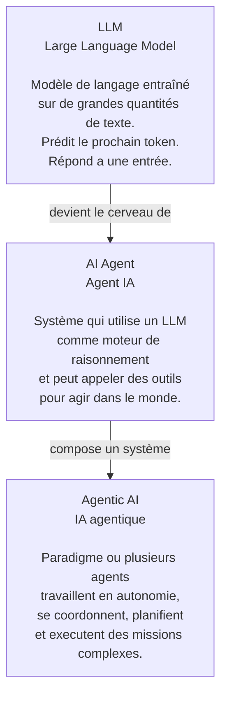

| Concept | Analogie humaine |
|---------|-----------------|
| **LLM** | Un expert très instruit qui répond a des questions |
| **AI Agent** | Un assistant qui peut aussi utiliser un ordinateur, chercher sur le web et envoyer des emails |
| **Agentic AI** | Une equipe d'assistants spécialisés qui collaborent pour accomplir un projet |

</details>

<p align="right"><a href="#top">↑ Retour en haut</a></p>

---

<a id="section-2"></a>

<details>
<summary><strong>2 — LLM — Large Language Model</strong></summary>

<br/>

### définition et fonctionnement

Un **LLM** (Large Language Model) est un modèle de langage entraîné sur des milliards de mots de texte pour apprendre les patterns statistiques du langage. Il fonctionne en **prédisant le prochain token** (mot ou sous-mot) le plus probable étant donné le contexte précédent.

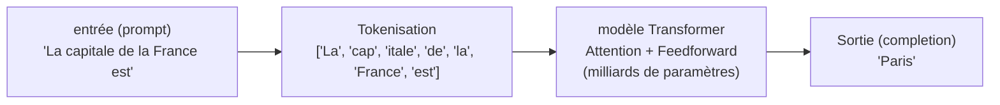

#### Comment un LLM est-il entraîné ?

| étape | Description |
|-------|-------------|
| **Pre-entraînement** | entraînement sur des milliards de documents — le modèle apprend la langue, les faits, la logique |
| **Fine-tuning supervisé** | entraînement sur des exemples de bonne qualité (questions/réponses) |
| **RLHF** | Reinforcement Learning from Human Feedback — les humains notent les réponses, le modèle s'aligne |

---

### Ce qu'un LLM fait et ne fait pas

| Un LLM FAIT | Un LLM ne FAIT PAS |
|------------|---------------------|
| générer du texte cohérent | Agir de maniere autonome |
| résumer, traduire, expliquer | Naviguer sur le web (sans outils) |
| Repondre a des questions | Se souvenir entre deux sessions (sans memoire externe) |
| Ecrire du code | exécuter ce code (sans outil) |
| Raisonner sur un problème | Initier une action de lui-même |
| Comprendre des images (si multimodal) | Prendre des décisions persistantes |

> Un LLM est **reactif** — il répond quand on lui parle. Il n'agit pas de lui-même.

---

### Architecture interne — Le Transformer

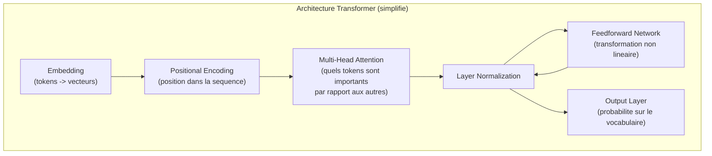

Le mécanisme clé est l'**attention** : le modèle apprend quels mots du contexte sont les plus pertinents pour prédire le prochain token. C'est ce qui permet de traiter des phrases longues et des dépendances a longue distance.

---

### Exemples de LLMs majeurs en 2026

| modèle | créateur | Points forts |
|--------|---------|--------------|
| **GPT-4o / o3** | OpenAI | Multimodal, raisonnement avance |
| **Claude 3.5 / Claude 4** | Anthropic | fenêtre de contexte large, surete |
| **Gemini Ultra** | Google DeepMind | intégration Google, multimodal |
| **LLaMA 3** | Meta | Open source, deployable localement |
| **Mistral Large** | Mistral AI | Europeen, open source competitif |
| **DeepSeek V3** | DeepSeek | Très performant, couts reduits |
| **Qwen** | Alibaba | Multilangue, open source |

</details>

<p align="right"><a href="#top">↑ Retour en haut</a></p>

---

<a id="section-3"></a>

<details>
<summary><strong>3 — AI Agent — Agent IA</strong></summary>

<br/>

### définition et architecture

Un **AI Agent** est un système qui utilise un LLM comme moteur de raisonnement et qui est capable d'**utiliser des outils**, de **planifier des étapes** et d'**agir dans son environnement** pour accomplir un objectif donné.

La différence fondamentale avec un LLM seul : l'agent **fait des choses** dans le monde, pas seulement des mots.

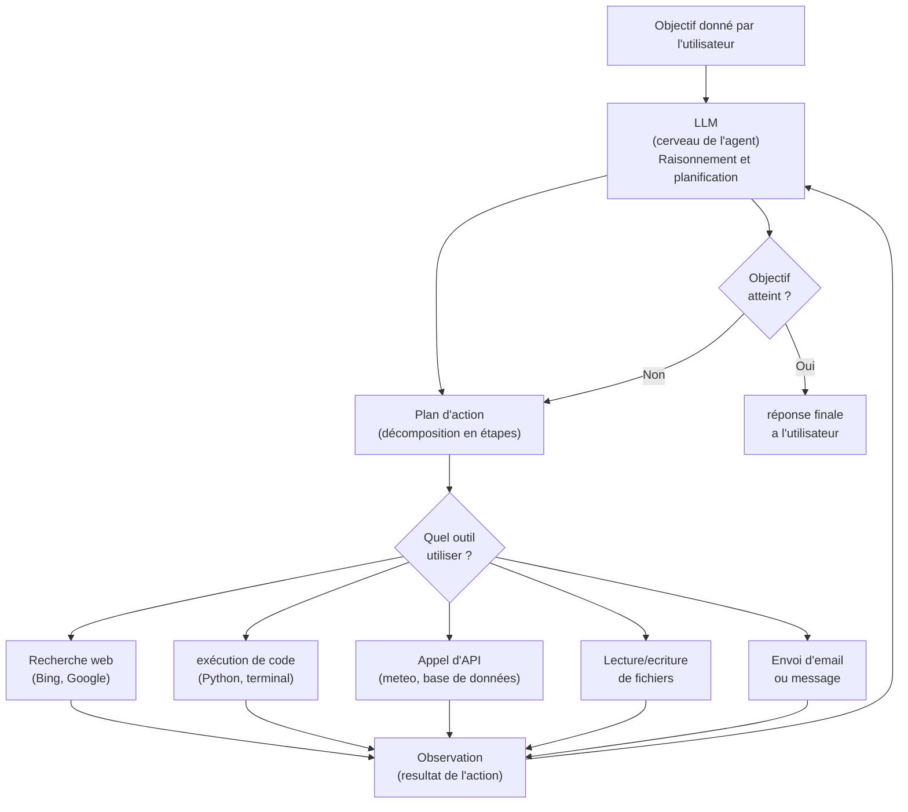

---

### Les composants d'un agent

| Composant | rôle | Exemple |
|-----------|------|---------|
| **LLM (cerveau)** | Raisonne, planifie, décide | GPT-4, Claude, Mistral |
| **Outils (tools)** | Actions que l'agent peut effectuer | Recherche web, calculatrice, API |
| **Memoire** | Retient le contexte et l'historique | Memoire court terme (contexte), long terme (base vectorielle) |
| **Planificateur** | Decompose les objectifs en sous-taches | ReAct, Chain-of-Thought |
| **Observateur** | Analyse les resultats des actions | Feedback loop |

#### Les deux types de memoire d'un agent

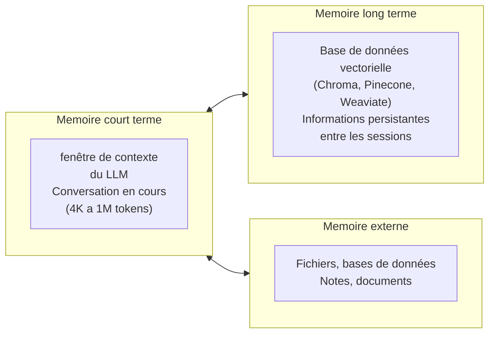

---

### Types d'agents

| Type | Description | Exemple |
|------|-------------|---------|
| **Agent ReAct** | Raisonne (Reason) puis agit (Act) en boucle | Agent de recherche qui cherche et synthetise |
| **Agent planificateur** | créé un plan complet avant d'agir | Planification de projet |
| **Agent executeur de code** | Ecrit et exécuté du code Python pour resoudre des problèmes | Data analyst agent |
| **Agent conversationnel** | Maintient une conversation avec memoire | Assistant personnel |
| **Agent RAG** | récupéré des documents pertinents avant de repondre | Chatbot sur documentation interne |

#### Le pattern ReAct (Reason + Act)

```
Pensée  : Je dois trouver la population de Montreal en 2026.
Action  : recherche_web("population Montreal 2026")
Observation : "La population de Montreal est estimee a 2,1 millions en 2026."
Pensée  : J'ai l'information. Je peux repondre.
réponse : La population de Montreal est d'environ 2,1 millions d'habitants en 2026.
```

</details>

<p align="right"><a href="#top">↑ Retour en haut</a></p>

---

<a id="section-4"></a>

<details>
<summary><strong>4 — Agentic AI — IA agentique</strong></summary>

<br/>

### définition

L'**Agentic AI** (IA agentique) designe un **paradigme** — une facon de concevoir des systèmes IA — ou un ou plusieurs agents operent avec un **haut degre d'autonomie**, sur des **taches longues et complexes**, en boucle, avec peu ou pas d'intervention humaine a chaque étape.

Ce n'est pas un produit spécifique. C'est une architecture de système.

---

### Ce qui distingue l'Agentic AI

| caractéristique | Agent IA simple | Agentic AI |
|----------------|----------------|------------|
| **Duree de la tache** | Quelques echanges | Heures, jours, semaines |
| **Autonomie** | Moderee — l'humain supervisé | Elevee — l'agent décide seul de nombreuses étapes |
| **Nombre d'agents** | Un seul | Plusieurs agents coordonnes |
| **Memoire** | Court terme (contexte) | Long terme, persistante entre sessions |
| **Planification** | Simple | Multi-niveaux, avec revision du plan |
| **Gestion des erreurs** | Limitee | L'agent détecté et corrige ses erreurs |
| **Interaction humaine** | Après chaque étape | Seulement aux points de décision critiques (HITL) |

---

### La boucle agentique

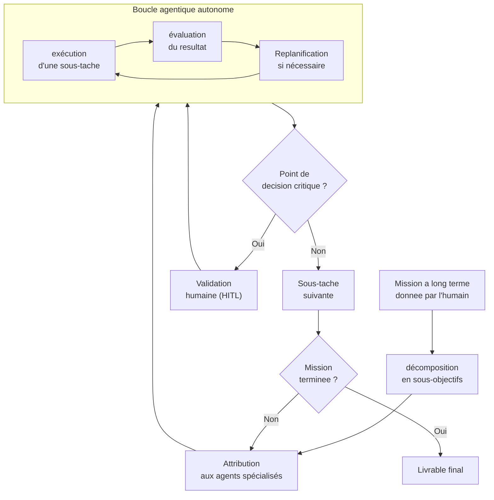

> **HITL** = Human In The Loop — l'humain intervient uniquement aux étapes critiques.

---

### Multi-agent systems — systèmes multi-agents

Dans l'Agentic AI, plusieurs agents spécialisés collaborent comme une equipe.

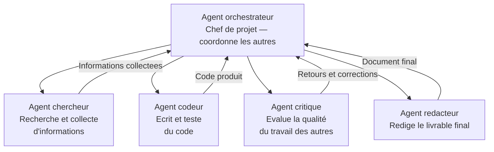

#### Exemples de frameworks multi-agents

| Framework | créateur | Description |
|-----------|---------|-------------|
| **CrewAI** | CrewAI | Orchestration d'agents avec rôles et objectifs définis |
| **AutoGen** | Microsoft | Agents qui se parlent entre eux pour resoudre des problèmes |
| **LangGraph** | LangChain | Graphe d'etats pour des workflows agentiques complexes |
| **OpenAI Swarm** | OpenAI | Framework leger pour systèmes multi-agents |
| **Agency Swarm** | Communaute | Agents avec memoire et communication structuree |

</details>

<p align="right"><a href="#top">↑ Retour en haut</a></p>

---

<a id="section-5"></a>

<details>
<summary><strong>5 — Comparaison directe — LLM vs Agent vs Agentic AI</strong></summary>

<br/>

### Tableau comparatif complet

| critère | LLM | AI Agent | Agentic AI |
|---------|-----|----------|------------|
| **définition** | modèle de langage qui prédit des tokens | système base sur un LLM + outils | Paradigme de systèmes autonomes a long terme |
| **Initiative** | Aucune — répond uniquement | Peut planifier des étapes | Opere de maniere independante sur de longues missions |
| **Outils externes** | Non (sauf plugins) | Oui | Oui — plusieurs types d'outils |
| **Nombre d'agents** | 1 modèle | 1 agent | Plusieurs agents coordonnes |
| **Memoire** | fenêtre de contexte uniquement | Contexte + memoire externe | Memoire persistante multi-sessions |
| **Duree d'exécution** | Secondes | Minutes | Heures a jours |
| **Supervision humaine** | A chaque echange | Moderee | Minimale (HITL aux points clés) |
| **Gestion des erreurs** | Aucune | Limitee | Correction autonome |
| **Exemple** | ChatGPT en mode chat | Agent de recherche Perplexity | Devin (agent de dev logiciel autonome) |

---

### Diagramme de positionnement

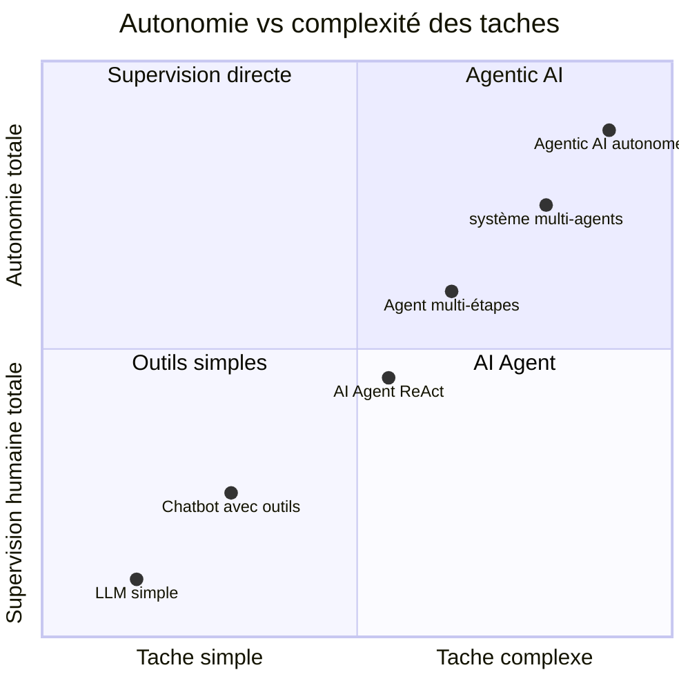

---

### Analogie avec une equipe de travail

| Concept IA | Analogie |
|-----------|---------|
| **LLM** | Un expert très qualifie qu'on consulte en face a face — il repond, mais ne fait rien si on ne lui demande pas |
| **AI Agent** | Un assistant personnel avec acces a un ordinateur, internet et votre agenda — il peut agir, mais reste sous supervision |
| **Agentic AI** | Une equipe entiere d'assistants spécialisés qui travaille sur un projet de plusieurs semaines, se coordonne et ne vous contacte que pour les décisions importantes |

</details>

<p align="right"><a href="#top">↑ Retour en haut</a></p>

---

<a id="section-6"></a>

<details>
<summary><strong>6 — Comment ils s'articulent ensemble</strong></summary>

<br/>

LLM, AI Agent et Agentic AI ne sont pas des alternatives — ils s'imbriquent l'un dans l'autre.

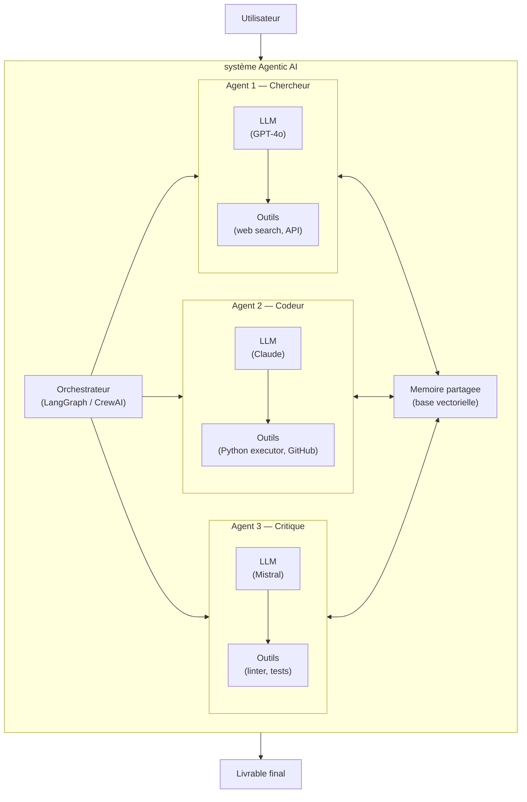

---

### La progression naturelle

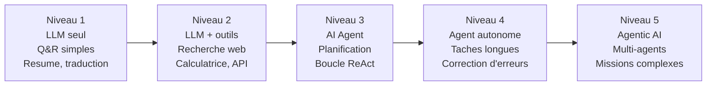

> A mesure que le niveau augmente : plus de puissance, mais aussi plus de risques, plus de couts et plus de complexité de supervision.

</details>

<p align="right"><a href="#top">↑ Retour en haut</a></p>

---

<a id="section-7"></a>

<details>
<summary><strong>7 — Limites et risques</strong></summary>

<br/>

### Limites des LLMs

| limite | Description |
|--------|-------------|
| **Hallucinations** | Le modèle généré des informations fausses avec confiance |
| **Coupure temporelle** | Pas de connaissance des evenements après la date de training |
| **Absence de memoire** | Oublie tout entre deux conversations (sans memoire externe) |
| **Pas de raisonnement causal** | Correlations statistiques, pas de comprehension réelle |
| **Sensible aux biais** | Reproduit les biais presents dans les données d'entraînement |
| **Couts** | Chaque token généré a un cout financier et energetique |

---

### Risques spécifiques aux agents et a l'Agentic AI

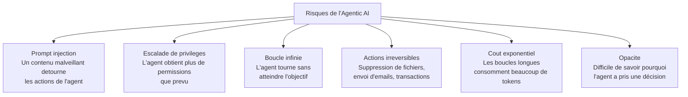

---

### Tableau des risques et mitigation

| Risque | Mitigation |
|--------|-----------|
| **Hallucinations** | RAG, grounding sur des sources verifiees, validation humaine |
| **Prompt injection** | Validation des entrées, sandboxing des outils |
| **Actions irreversibles** | Mode simulation avant action, validation HITL |
| **Boucle infinie** | limite de tokens et d'iterations |
| **Couts eleves** | Monitoring des couts, modèles plus petits pour les sous-taches simples |
| **Opacite** | Logging de chaque étape, traces d'exécution |

---

### La question de la confiance et du contrôle

Plus un système est agentique, plus la question du contrôle humain est critique.

| Niveau d'autonomie | modèle de supervision |
|-------------------|----------------------|
| LLM seul | L'humain lit et valide chaque réponse |
| AI Agent | L'humain supervisé le plan et les étapes clés |
| Agentic AI | HITL aux décisions critiques — le reste est autonome |
| Super-agentic (futur) | Supervision difficile — risque systemique |

> La plupart des experts recommandent de maintenir un **humain dans la boucle** pour toute action ayant des consequences réelles et irreversibles.

</details>

<p align="right"><a href="#top">↑ Retour en haut</a></p>

---

<a id="section-8"></a>

<details>
<summary><strong>8 — Cas d'usage concrets par type</strong></summary>

<br/>

### Quand utiliser un LLM seul ?

| Cas d'usage | Pourquoi un LLM suffit |
|-------------|----------------------|
| résumer un document | Tache discrete, une seule entrée |
| Traduire un texte | Pas besoin d'action externe |
| Repondre a des FAQ | Les réponses sont dans le contexte ou le modèle |
| générer du code a partir d'une description | L'humain copie-colle et exécuté lui-même |
| Classifier un email | entrée unique, sortie unique |

---

### Quand utiliser un AI Agent ?

| Cas d'usage | Ce que l'agent apporte |
|-------------|----------------------|
| Rechercher et synthetiser des informations récentes | Acces au web en temps réel |
| Analyser un fichier CSV et produire un rapport | exécution de code Python |
| Reserver un vol selon des critères | Appel d'APIs externes |
| Monitorer un site web et alerter en cas de changement | Boucle d'exécution periodique |
| Repondre a des questions sur une base documentaire interne | RAG + recherche semantique |

---

### Quand utiliser l'Agentic AI ?

| Cas d'usage | Pourquoi l'Agentic AI est nécessaire |
|-------------|-------------------------------------|
| Developper une fonctionnalite logicielle de A a Z | nécessité recherche, code, tests, revue — plusieurs agents |
| Conduire une analyse de marche complète | Collecte de données, analyse, redaction — taches paralleles |
| Automatiser un pipeline de recrutement | Tri de CV, entretiens preliminaires, rapports — agents spécialisés |
| Gerer un projet de contenu editorial | Recherche, redaction, relecture, publication — workflow long |
| Supporter le cycle de vie d'un projet IA | Collecte, nettoyage, entraînement, évaluation, déploiement — automatise |

---

### Exemples de produits réels en 2026

| Produit | Type | Ce qu'il fait |
|---------|------|---------------|
| **ChatGPT** (sans plugins) | LLM | Conversation, génération de texte et code |
| **Perplexity AI** | AI Agent | Recherche web + synthese |
| **GitHub Copilot** | AI Agent | Completion et génération de code avec contexte du repo |
| **Devin** (Cognition) | Agentic AI | Developpement logiciel autonome de bout en bout |
| **Operator** (OpenAI) | Agentic AI | Navigation web autonome, remplissage de formulaires |
| **Claude Computer Use** | Agentic AI | contrôle d'un ordinateur comme un humain |
| **Microsoft Copilot Agents** | Agentic AI | Workflows automatises dans Office 365 |

</details>

<p align="right"><a href="#top">↑ Retour en haut</a></p>

---

<a id="section-9"></a>

<details>
<summary><strong>9 — Quiz de consolidation</strong></summary>

<br/>

Pour chaque question, choisissez la meilleure réponse puis ouvrez l'explication.

---

**Question 1** — Un etudiant ouvre ChatGPT, pose une question sur Python et obtient une réponse. Quel type de système utilise-t-il ?

A) Un AI Agent  
B) Un LLM  
C) Un système Agentic AI  
D) Un système multi-agents

<details>
<summary>réponse et explication</summary>

**réponse : B — Un LLM**

ChatGPT en mode conversation standard est un LLM. Il répond a une entrée sans initier d'actions, sans outils externes (sauf si des plugins sont actives) et sans planification multi-étapes. C'est le niveau le plus simple.

</details>

---

**Question 2** — Perplexity AI recoit une question, effectue plusieurs recherches web, consulte des sources, les synthetise et produit une réponse avec citations. Quel type de système est-ce ?

A) Un LLM seul  
B) Un AI Agent  
C) Un système Agentic AI  
D) Un modèle de diffusion

<details>
<summary>réponse et explication</summary>

**réponse : B — Un AI Agent**

Perplexity utilise un LLM comme moteur de raisonnement, mais ajoute des outils de recherche web. Il planifie des étapes (chercher, lire, synthetiser) et agit dans son environnement (internet). C'est la définition d'un AI Agent.

</details>

---

**Question 3** — Devin recoit comme mission "créé une API REST pour gerer des utilisateurs, avec tests et documentation", travaille pendant 2 heures en ecrivant du code, en executant des tests, en corrigeant ses erreurs, et livre un projet fonctionnel. Quel type de système est-ce ?

A) Un LLM  
B) Un AI Agent simple  
C) Un système Agentic AI  
D) Un système expert

<details>
<summary>réponse et explication</summary>

**réponse : C — Un système Agentic AI**

Devin opere de maniere autonome sur une mission longue, planifie de nombreuses sous-taches, utilise plusieurs outils (editeur de code, terminal, navigateur), détecté et corrige ses propres erreurs sans intervention humaine a chaque étape. C'est le paradigme Agentic AI.

</details>

---

**Question 4** — Quelle est la différence principale entre un AI Agent et un LLM ?

A) Un AI Agent utilise un modèle plus grand  
B) Un AI Agent peut agir dans son environnement grâce à des outils  
C) Un AI Agent ne peut pas générer de texte  
D) Un LLM est plus autonome qu'un AI Agent

<details>
<summary>réponse et explication</summary>

**réponse : B**

La différence fondamentale est la capacité d'**action**. Un LLM généré du texte en réponse a une entrée. Un AI Agent utilise ce LLM comme cerveau mais peut en plus appeler des outils (web, code, APIs, fichiers) pour agir dans le monde réel. L'AI Agent est construit **autour** du LLM.

</details>

---

**Question 5** — Dans un système Agentic AI, qu'est-ce que le HITL ?

A) Un type de modèle de langage  
B) Un outil de recherche web  
C) Le moment ou un humain intervient pour valider une décision critique  
D) Une technique d'entraînement

<details>
<summary>réponse et explication</summary>

**réponse : C**

**HITL** (Human In The Loop) designe les points dans le workflow agentique ou l'intervention humaine est requise avant de continuer. Par exemple, avant qu'un agent envoie un email important, supprime des fichiers ou effectue une transaction financiere. C'est le mécanisme de contrôle qui permet de garder l'humain responsable des décisions critiques.

</details>

</details>

<p align="right"><a href="#top">↑ Retour en haut</a></p>
