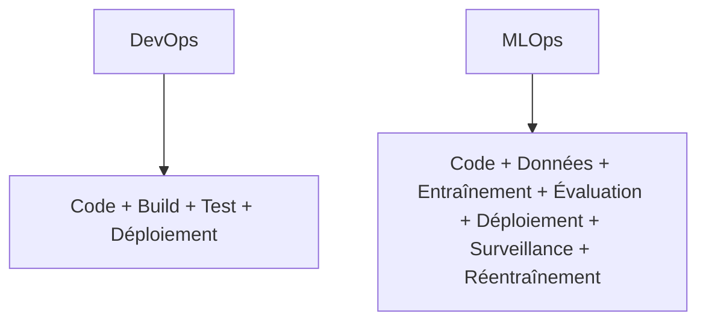
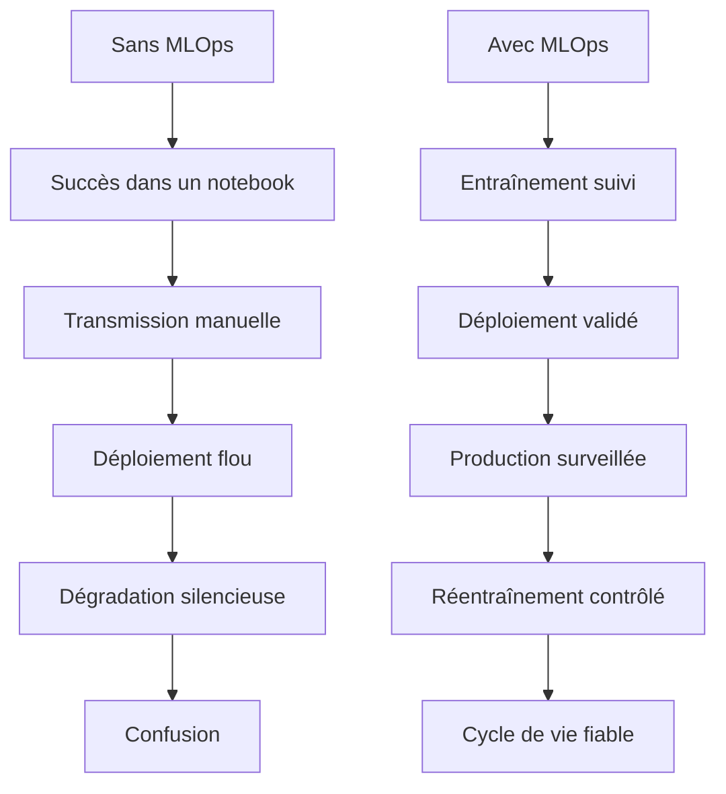

Voici la traduction complète en français du travail fourni. 

<a id="top"></a>

# MLOps — Définition, importance et différence avec DevOps

## Table des matières

| #  | Section                                                          |
| -- | ---------------------------------------------------------------- |
| 1  | [Introduction au MLOps](#section-1)                              |
| 2  | [À quoi sert le MLOps](#section-2)                               |
| 3  | [Pourquoi le MLOps est devenu nécessaire](#section-3)            |
| 4  | [Différence entre DevOps et MLOps](#section-4)                   |
| 4a |   ↳ [Pourquoi DevOps seul ne suffit pas pour le ML](#section-4a) |
| 5  | [Cycle de vie principal d’un système MLOps](#section-5)          |
| 6  | [Composants principaux du MLOps](#section-6)                     |
| 7  | [Scénarios sans MLOps](#section-7)                               |
| 7a |   ↳ [Scénarios avec MLOps](#section-7a)                          |
| 8  | [Tableau comparatif simple : DevOps vs MLOps](#section-8)        |
| 9  | [Annexe — Résumé court](#section-9)                              |
| 10 | [Conclusion](#section-10)                                        |

---

<a id="section-1"></a>

<details>
<summary>1 - Introduction au MLOps</summary>

<br/>

**MLOps** signifie **Machine Learning Operations**, c’est-à-dire les opérations liées au machine learning.

Il s’agit d’une discipline utilisée pour gérer le **cycle de vie complet des systèmes d’apprentissage automatique** de manière fiable, répétable et organisée.

Un projet de machine learning ne se termine pas lorsque le modèle est entraîné. Après l’entraînement, le modèle doit encore être :

* validé ;
* déployé ;
* surveillé ;
* mis à jour ;
* réentraîné lorsque nécessaire ;
* gouverné dans le temps.

C’est précisément à ce moment que le MLOps devient important.


Le MLOps ne consiste pas seulement à construire un modèle.

Il consiste à s’assurer que le modèle peut **fonctionner dans le monde réel**, continuer à offrir de bonnes performances et rester maîtrisable dans le temps.

</details>

<p align="right"><a href="#top">↑ Retour en haut</a></p>

---

<a id="section-2"></a>

<details>
<summary>2 - À quoi sert le MLOps</summary>

<br/>

Le MLOps sert à transformer le machine learning d’une simple expérience ponctuelle en un **véritable système de production**.

Son objectif est d’aider les équipes à :

* faire passer les modèles des notebooks vers la production ;
* suivre les versions des modèles ;
* connecter les modèles aux pipelines de données ;
* surveiller la qualité du modèle après son déploiement ;
* détecter une baisse de performance ;
* réentraîner les modèles lorsque les données changent ;
* rendre l’ensemble du processus reproductible.

En termes simples, le MLOps sert à répondre à des questions comme :

* Quel modèle fonctionne actuellement en production ?
* Quel jeu de données a été utilisé pour l’entraîner ?
* Quelle version du code a permis de le créer ?
* Le modèle est-il encore performant aujourd’hui ?
* Les données d’entrée ont-elles changé ?
* Faut-il réentraîner le modèle ?

Sans MLOps, un modèle peut fonctionner une fois pendant les tests, mais devenir difficile à faire confiance, à maintenir ou à améliorer par la suite.

</details>

<p align="right"><a href="#top">↑ Retour en haut</a></p>

---

<a id="section-3"></a>

<details>
<summary>3 - Pourquoi le MLOps est devenu nécessaire</summary>

<br/>

Les systèmes logiciels traditionnels dépendent surtout du **code écrit par les développeurs**.

Les systèmes de machine learning sont différents, car leur comportement dépend de plusieurs éléments en même temps :

* le code ;
* les données d’entraînement ;
* la logique de création des variables, appelée feature engineering ;
* les hyperparamètres ;
* l’artefact du modèle entraîné ;
* les données réelles observées après le déploiement.

Cela crée de nouvelles difficultés.

Par exemple :

* le modèle peut être performant pendant les tests, mais mauvais en production ;
* les données de production peuvent être différentes des données d’entraînement ;
* les équipes peuvent oublier quelle version du modèle a été déployée ;
* deux personnes peuvent entraîner le même projet et obtenir des résultats différents ;
* la performance peut diminuer progressivement sans erreur évidente.

C’est pourquoi le MLOps est devenu nécessaire.

Il introduit de la structure, de la traçabilité, de la surveillance et une discipline opérationnelle dans le travail lié au machine learning.

</details>

<p align="right"><a href="#top">↑ Retour en haut</a></p>

---

<a id="section-4"></a>

<details>
<summary>4 - Différence entre DevOps et MLOps</summary>

<br/>

C’est l’une des idées les plus importantes à comprendre.

**DevOps** se concentre sur le cycle de vie des **applications logicielles**.

**MLOps** se concentre sur le cycle de vie des **systèmes de machine learning**.

Les deux visent l’automatisation, la fiabilité et une livraison plus rapide, mais ils ne gèrent pas exactement le même type de système.

---

### DevOps

DevOps concerne principalement :

* le code source ;
* la construction de l’application ;
* les tests automatisés ;
* les pipelines de déploiement ;
* l’automatisation de l’infrastructure ;
* la surveillance de la disponibilité et des performances de l’application.

En DevOps, la logique de l’application est écrite explicitement par les développeurs.

---

### MLOps

Le MLOps reprend certaines idées de DevOps, mais il doit aussi gérer :

* les jeux de données ;
* l’entraînement des modèles ;
* le suivi des expériences ;
* l’évaluation des modèles ;
* le packaging des modèles ;
* le service du modèle en production ;
* la détection de dérive ;
* les workflows de réentraînement.

En MLOps, une partie du comportement du système est **apprise à partir des données**, et non seulement codée à la main.

C’est la différence essentielle.



La différence peut donc être résumée ainsi :

* **DevOps** gère la livraison logicielle.
* **MLOps** gère la livraison et la maintenance des systèmes de machine learning.

</details>

<p align="right"><a href="#top">↑ Retour en haut</a></p>

---

<a id="section-4a"></a>

<details>
<summary>4a - Pourquoi DevOps seul ne suffit pas pour le ML</summary>

<br/>

DevOps est extrêmement utile, mais à lui seul, il ne résout pas complètement les problèmes du machine learning.

Voici pourquoi.

Dans un projet logiciel classique, si le code ne change pas, le comportement du système est généralement censé rester stable.

En machine learning, même lorsque le code reste identique, le comportement peut quand même changer parce que :

* les données d’entraînement ont changé ;
* les données reçues en production ont changé ;
* les tendances ou les comportements ciblés ont évolué ;
* le modèle a été réentraîné avec des paramètres différents ;
* la relation entre les entrées et les sorties a dérivé avec le temps.

Cela signifie que les systèmes de machine learning doivent gérer plus que le simple déploiement.

Ils doivent aussi gérer :

* la **traçabilité des données** ;
* la **traçabilité des modèles** ;
* la **reproductibilité de l’entraînement** ;
* la **performance dans le temps** ;
* les **décisions de réentraînement continu**.

Un pipeline DevOps peut répondre à ces questions :

* L’application s’est-elle construite correctement ?
* Les tests sont-ils passés ?
* Le service a-t-il été déployé ?

Mais un pipeline MLOps doit aussi répondre à ces questions :

* Le modèle a-t-il été entraîné sur des données approuvées ?
* Le modèle a-t-il atteint les seuils d’évaluation requis ?
* Le modèle devient-il moins précis en production ?
* Faut-il réentraîner le modèle ?
* Peut-on relier cette prédiction à une version précise du modèle ?

C’est pourquoi le MLOps ne remplace pas DevOps.

Il s’agit d’une **extension de la pensée opérationnelle appliquée aux systèmes de machine learning**.

</details>

<p align="right"><a href="#top">↑ Retour en haut</a></p>

---

<a id="section-5"></a>

<details>
<summary>5 - Cycle de vie principal d’un système MLOps</summary>

<br/>

Un système MLOps suit généralement un cycle de vie continu.


Chaque étape a un objectif.

| Étape                   | Rôle théorique                                         |
| ----------------------- | ------------------------------------------------------ |
| Problème métier         | définir l’objectif et la valeur attendue               |
| Collecte des données    | rassembler les informations brutes nécessaires         |
| Préparation des données | nettoyer, transformer, valider et organiser            |
| Entraînement            | apprendre des modèles à partir des données             |
| Évaluation              | mesurer la qualité et l’état de préparation            |
| Déploiement             | rendre le modèle disponible en production              |
| Surveillance            | observer les prédictions et le comportement du système |
| Réentraînement          | mettre à jour le modèle lorsque nécessaire             |

L’idée importante est que les systèmes de machine learning ne sont pas statiques.

Ils doivent être maintenus comme des systèmes vivants.

</details>

<p align="right"><a href="#top">↑ Retour en haut</a></p>

---

<a id="section-6"></a>

<details>
<summary>6 - Composants principaux du MLOps</summary>

<br/>

Le MLOps repose généralement sur plusieurs composants conceptuels.

| Composant                | Objectif                                                    |
| ------------------------ | ----------------------------------------------------------- |
| Pipeline de données      | déplacer et préparer les données                            |
| Pipeline d’entraînement  | automatiser l’entraînement du modèle                        |
| Suivi des expériences    | enregistrer les exécutions, les paramètres et les métriques |
| Registre de modèles      | stocker les versions approuvées des modèles                 |
| Mécanisme de déploiement | servir le modèle en production                              |
| Couche de surveillance   | suivre les performances et les changements de données       |
| Couche de gouvernance    | contrôler l’approbation, la traçabilité et la conformité    |

Ces composants aident les organisations à répondre clairement à des questions opérationnelles.

Par exemple :

* Quelle version du modèle est approuvée ?
* Quelles métriques ont justifié le déploiement ?
* Quand le modèle a-t-il été réentraîné ?
* Qu’est-ce qui a changé entre la version 1 et la version 2 ?
* Le modèle est-il encore fiable aujourd’hui ?

</details>

<p align="right"><a href="#top">↑ Retour en haut</a></p>

---

<a id="section-7"></a>

<details>
<summary>7 - Scénarios sans MLOps</summary>

<br/>

La manière la plus simple de comprendre **pourquoi le MLOps est important** est d’imaginer ce qui se produit lorsqu’il est absent.

---

### Scénario 1 — Un modèle fonctionne dans un notebook, mais échoue en production

Un scientifique des données construit un modèle de prédiction du désabonnement client dans un notebook.

L’évaluation semble excellente, donc l’équipe décide de l’utiliser.

Plus tard, l’équipe d’ingénierie déploie le modèle dans une application, mais les prédictions deviennent incohérentes.

Pourquoi ?

Parce que :

* le format des données en production est légèrement différent ;
* une variable est manquante ;
* les étapes de prétraitement utilisées pendant l’entraînement n’ont pas été correctement intégrées ;
* personne n’a documenté le pipeline d’entraînement exact.

Sans MLOps, le projet dépend de la mémoire manuelle et de transmissions informelles entre les équipes.

**Résultat :**

le modèle semblait réussi en développement, mais l’organisation ne peut pas l’exécuter de manière fiable dans le système réel.

---

### Scénario 2 — Personne ne sait quel modèle est en production

Une entreprise entraîne plusieurs modèles de détection de fraude pendant deux mois.

Différents membres de l’équipe testent différentes versions.

Un modèle est déployé, puis un autre le remplace, mais l’équipe ne maintient pas de registre clair.

Plus tard, la direction demande :

* Quel modèle est actuellement actif ?
* Quel jeu de données a été utilisé ?
* Pourquoi les prédictions sont-elles différentes du mois dernier ?

Personne ne peut répondre avec certitude.

**Résultat :**

l’équipe perd la traçabilité et la confiance.

Même un bon modèle devient difficile à défendre ou à améliorer.

---

### Scénario 3 — La performance du modèle diminue silencieusement

Un modèle de recommandation a été entraîné sur le comportement des utilisateurs de l’année précédente.

Au début, il fonctionne bien.

Quelques mois plus tard, les habitudes des utilisateurs changent, mais l’équipe n’a aucune surveillance de la qualité des prédictions ni de la dérive des données.

L’application fonctionne toujours.

Il n’y a pas de panne.

Il n’y a pas d’erreur système évidente.

Mais les recommandations sont maintenant moins pertinentes.

**Résultat :**

le système semble sain du point de vue logiciel, mais il échoue du point de vue du machine learning.

C’est l’une des raisons principales pour lesquelles DevOps seul ne suffit pas.

---

### Scénario 4 — Le réentraînement crée de la confusion

Une équipe décide de réentraîner un modèle de prévision de la demande avec des données plus récentes.

Le nouveau modèle donne des résultats différents de l’ancien.

Cependant :

* les paramètres d’entraînement n’ont pas été enregistrés ;
* la version du jeu de données n’a pas été sauvegardée ;
* la logique de création des variables a légèrement changé ;
* aucun processus formel de comparaison n’existe.

L’équipe ne peut donc pas expliquer si le nouveau modèle est réellement meilleur ou simplement différent.

**Résultat :**

le réentraînement devient risqué au lieu d’être utile.

---

### Scénario 5 — Un bon modèle ne peut pas être audité

Un modèle est utilisé pour soutenir des décisions métier importantes.

Plus tard, une revue interne demande :

* qui a approuvé ce modèle ;
* quels tests ont été réalisés ;
* quand il a été déployé ;
* quelles étaient ses limites connues.

Sans pratiques MLOps comme la documentation, le processus d’approbation et le suivi des versions, l’équipe ne peut pas fournir de réponses claires.

**Résultat :**

le problème n’est plus seulement technique.

Il devient aussi organisationnel et lié à la gouvernance.

</details>

<p align="right"><a href="#top">↑ Retour en haut</a></p>

---

<a id="section-7a"></a>

<details>
<summary>7a - Scénarios avec MLOps</summary>

<br/>

Voyons maintenant les mêmes types de situations lorsque le **MLOps est en place**.

---

### Scénario 1 — Le modèle passe correctement du notebook à la production

L’équipe entraîne un modèle de prédiction du désabonnement client, mais cette fois les étapes de prétraitement, la logique des variables, l’artefact du modèle et les résultats d’évaluation sont stockés dans un pipeline contrôlé.

Avant le déploiement :

* le schéma des données d’entrée est validé ;
* le package du modèle inclut la logique de prétraitement ;
* l’environnement de service respecte les mêmes hypothèses que l’environnement d’entraînement ;
* l’étape de déploiement est standardisée.

**Résultat :**

le modèle se comporte de manière cohérente entre l’expérimentation et la production.

C’est l’un des bénéfices les plus clairs du MLOps :

il réduit l’écart entre un résultat obtenu dans un notebook et un résultat utilisable en production.

---

### Scénario 2 — Le modèle déployé est toujours identifiable

Un registre de modèles est utilisé.

Chaque version du modèle possède :

* un numéro de version ;
* des métriques associées ;
* une référence au jeu de données d’entraînement ;
* une référence au code ;
* un statut de déploiement.

Lorsque quelqu’un demande quel modèle est en production, la réponse est immédiate.

**Résultat :**

l’équipe gagne en traçabilité, en responsabilité et en confiance.

Au lieu de dire : « Je pense que la version B est déployée »,

elle peut dire : « La version 2.3 est déployée, entraînée sur le jeu de données X et approuvée à cette date. »

---

### Scénario 3 — La baisse de performance est détectée tôt

Un modèle de recommandation est déployé avec des règles de surveillance.

Le système suit :

* la distribution des données d’entrée ;
* le comportement des prédictions ;
* les indicateurs métier liés à l’utilité du modèle ;
* les signaux possibles de dérive.

Lorsque les données réelles commencent à changer, des alertes apparaissent.

L’équipe analyse la situation et planifie un réentraînement.

**Résultat :**

le modèle est maintenu de manière proactive au lieu de se dégrader silencieusement.

C’est pourquoi le MLOps est si important :

il aide les équipes à comprendre qu’un modèle peut se dégrader même lorsque l’application fonctionne encore techniquement.

---

### Scénario 4 — Le réentraînement devient contrôlé et comparable

Un modèle de prévision est réentraîné avec des données récentes à travers un pipeline d’entraînement formel.

L’équipe peut comparer :

* l’ancien jeu de données avec le nouveau ;
* les anciens hyperparamètres avec les nouveaux ;
* les anciennes métriques avec les nouvelles ;
* l’ancienne version du modèle avec la version candidate.

Le nouveau modèle n’est promu que s’il respecte des conditions définies.

**Résultat :**

le réentraînement devient un processus d’amélioration discipliné, et non une expérience confuse.

---

### Scénario 5 — La gouvernance et la revue deviennent possibles

Un modèle utilisé en production est documenté et enregistré.

L’équipe peut montrer :

* quand il a été entraîné ;
* quels tests ont été réussis ;
* quelle version est active ;
* qui a approuvé le déploiement ;
* quelles limites connues ont été identifiées.

**Résultat :**

l’organisation peut expliquer et défendre clairement son système de machine learning.

C’est particulièrement important lorsque le machine learning devient une partie réelle des processus décisionnels.

---

### Interprétation courte

Sans MLOps, les équipes disent souvent :

* « Le modèle fonctionnait sur ma machine. »
* « Nous ne sommes pas sûrs de la version actuellement en production. »
* « Le système fonctionne, donc tout doit être correct. »
* « Nous l’avons réentraîné, mais nous ne savons pas ce qui a changé. »

Avec MLOps, les équipes peuvent dire :

* « Cette version précise est déployée. »
* « Ces métriques ont justifié la mise en production. »
* « Une dérive a été détectée la semaine dernière. »
* « Le réentraînement a été déclenché avec des données contrôlées et des résultats suivis. »

Cette différence explique **pourquoi le MLOps existe**.



</details>

<p align="right"><a href="#top">↑ Retour en haut</a></p>

---

<a id="section-8"></a>

<details>
<summary>8 - Tableau comparatif simple : DevOps vs MLOps</summary>

<br/>

| Aspect                    | DevOps                                       | MLOps                                                                                 |
| ------------------------- | -------------------------------------------- | ------------------------------------------------------------------------------------- |
| Objectif principal        | applications logicielles                     | systèmes de machine learning                                                          |
| Ressource principale      | code source                                  | code + données + modèle                                                               |
| But principal             | livraison logicielle fiable                  | livraison fiable du modèle et gestion de son cycle de vie                             |
| Focus des tests           | exactitude du code, intégration, déploiement | code + qualité des données + qualité du modèle + comportement en production           |
| Source du changement      | principalement les changements de code       | changements de code, de données et de modèle                                          |
| Focus de la surveillance  | disponibilité, logs, latence, erreurs        | disponibilité, latence, qualité des prédictions, dérive des données, dérive du modèle |
| Artefact livré            | package applicatif ou conteneur              | modèle entraîné avec système de service                                               |
| Besoin de réentraînement  | généralement non pertinent                   | souvent essentiel                                                                     |
| Enjeu de reproductibilité | reproductibilité du build                    | reproductibilité de l’expérience, des données, de l’entraînement et du modèle         |
| Défi supplémentaire       | complexité de l’infrastructure               | infrastructure + évolution des données + incertitude statistique                      |

---

### Interprétation courte

DevOps demande :

**Peut-on construire, tester et déployer cette application de manière fiable ?**

MLOps demande :

**Peut-on construire, entraîner, valider, déployer, surveiller et maintenir ce système apprenant de manière fiable dans le temps ?**

</details>

<p align="right"><a href="#top">↑ Retour en haut</a></p>

---

<a id="section-9"></a>

<details>
<summary>9 - Annexe — Résumé court</summary>

<br/>

```text
MLOps = Machine Learning Operations

À quoi cela sert :
- déployer des modèles de machine learning
- suivre les versions
- surveiller la qualité des prédictions
- détecter la dérive
- réentraîner les modèles
- garder les systèmes de ML fiables dans le temps

Différence principale avec DevOps :
DevOps gère les opérations logicielles.
MLOps gère les opérations liées au machine learning.

Pourquoi ils sont différents :
Le logiciel dépend principalement du code.
Les systèmes ML dépendent du code + des données + des modèles entraînés.

Pourquoi le MLOps est important :
Un modèle peut se dégrader même si le code ne change pas.
Les systèmes ML ont donc besoin de surveillance, de traçabilité et de réentraînement.

Intuition simple :
Sans MLOps, le ML reste fragile et difficile à faire confiance.
Avec MLOps, le ML devient maîtrisable comme un véritable système de production.
```

</details>

<p align="right"><a href="#top">↑ Retour en haut</a></p>

---

<a id="section-10"></a>

<details>
<summary>10 - Conclusion</summary>

<br/>

Le MLOps est la discipline opérationnelle qui rend le machine learning utilisable à grande échelle dans des conditions réelles.

Son objectif n’est pas simplement d’entraîner des modèles, mais de s’assurer qu’ils peuvent être :

* déployés correctement ;
* suivis clairement ;
* surveillés en continu ;
* améliorés de manière sûre dans le temps.

La plus grande différence entre **DevOps** et **MLOps** est que DevOps gère des systèmes dont le comportement est principalement défini par le code, tandis que MLOps gère des systèmes dont le comportement dépend du **code, des données et des modèles entraînés**.

Les scénarios précédents montrent clairement pourquoi :

* **sans MLOps**, le machine learning reste souvent fragile, manuel et difficile à faire confiance ;
* **avec MLOps**, le machine learning devient structuré, traçable, surveillé et maintenable.

C’est pourquoi le MLOps est nécessaire.

</details>

<p align="right"><a href="#top">↑ Retour en haut</a></p>
