<a id="top"></a>

# Cours — Comprendre les outils modernes d’un projet d’intelligence artificielle

## Table des matières

| #  | Section                                                           |
| -- | ----------------------------------------------------------------- |
| 1  | [Introduction générale](#section-1)                               |
| 2  | [Pourquoi un projet IA utilise plusieurs outils ?](#section-2)    |
| 3  | [Vue globale d’une architecture IA moderne](#section-3)           |
| 4  | [Python : pourquoi ce langage est central en IA ?](#section-4)    |
| 5  | [Environnement virtuel Python : pourquoi ?](#section-5)           |
| 6  | [Dépendances et conflits de versions](#section-6)                 |
| 7  | [Streamlit : c’est quoi ?](#section-7)                            |
| 8  | [Pourquoi utiliser Streamlit ?](#section-8)                       |
| 9  | [FastAPI : c’est quoi ?](#section-9)                              |
| 10 | [FastAPI ou FastPi : éviter la confusion](#section-10)            |
| 11 | [Streamlit et FastAPI : deux rôles différents](#section-11)       |
| 12 | [API : c’est quoi ?](#section-12)                                 |
| 13 | [Client, serveur, requête et réponse](#section-13)                |
| 14 | [Routes : c’est quoi ?](#section-14)                              |
| 15 | [Méthodes HTTP : GET, POST, PUT, PATCH, DELETE](#section-15)      |
| 16 | [Codes HTTP : 1xx, 2xx, 3xx, 4xx, 5xx](#section-16)               |
| 17 | [JSON : c’est quoi ?](#section-17)                                |
| 18 | [Exercices JSON](#section-18)                                     |
| 19 | [Pydantic : c’est quoi ?](#section-19)                            |
| 20 | [Pourquoi Pydantic est important dans une API IA ?](#section-20)  |
| 21 | [Swagger et OpenAPI : documentation interactive](#section-21)     |
| 22 | [H2O.ai : c’est quoi ?](#section-22)                              |
| 23 | [AutoML : pourquoi automatiser certains essais ML ?](#section-23) |
| 24 | [MLOps : c’est quoi ?](#section-24)                               |
| 25 | [Pourquoi MLOps est indispensable en IA ?](#section-25)           |
| 26 | [Machines virtuelles : c’est quoi ?](#section-26)                 |
| 27 | [Hyperviseurs : c’est quoi ?](#section-27)                        |
| 28 | [Conteneurs : c’est quoi ?](#section-28)                          |
| 29 | [Docker : c’est quoi ?](#section-29)                              |
| 30 | [Images Docker et registres d’images](#section-30)                |
| 31 | [Docker Compose : pourquoi ?](#section-31)                        |
| 32 | [Architecture complète d’un projet IA pédagogique](#section-32)   |
| 33 | [Architecture complète d’un projet IA professionnel](#section-33) |
| 34 | [Erreurs fréquentes à éviter](#section-34)                        |
| 35 | [Activité formative complète](#section-35)                        |
| 36 | [Synthèse finale](#section-36)                                    |

---

<a id="section-1"></a>

<details open>
<summary><strong>1 — Introduction générale</strong></summary>

<br/>

Un projet d’intelligence artificielle ne se limite pas à entraîner un modèle dans un notebook. Dans un vrai contexte professionnel, il faut aussi penser à la manière dont ce modèle sera utilisé, partagé, testé, déployé, surveillé et maintenu.

Un modèle IA peut donner de bons résultats dans un fichier Python, mais cela ne signifie pas qu’il est prêt à être utilisé par une entreprise, une application ou un utilisateur final. Pour devenir utile, le modèle doit être intégré dans un système complet.

Par exemple, une entreprise peut vouloir créer une application qui prédit si un client risque de quitter un service. Le modèle doit recevoir des données, vérifier que ces données sont correctes, produire une prédiction, retourner une réponse compréhensible, être accessible par une interface, être hébergé sur une machine, être mis à jour et être surveillé dans le temps.

C’est pour cela qu’on utilise plusieurs outils autour du modèle.

On utilise Python pour écrire la logique. On utilise un environnement virtuel pour isoler les dépendances. On utilise Streamlit pour créer une interface simple. On utilise FastAPI pour créer une API. On utilise Pydantic pour valider les données. On utilise JSON pour échanger des informations entre systèmes. On utilise Docker pour rendre l’environnement reproductible. On utilise des machines virtuelles ou le cloud pour héberger le système. On utilise des pratiques MLOps pour suivre les modèles, les versions et les performances.

> **À retenir**
> Le modèle IA est seulement une partie du système. La vraie valeur vient de la capacité à transformer ce modèle en service fiable, utilisable, maintenable et surveillable.

> **Bonne pratique**
> Il faut distinguer la phase d’expérimentation et la phase de déploiement. Un notebook est utile pour tester une idée. Une API, une interface, un conteneur et une stratégie de suivi sont nécessaires pour construire une solution exploitable.

> **Attention**
> Ne pas confondre “faire fonctionner un modèle une fois” avec “déployer un service IA fiable”. Ce sont deux niveaux très différents.

</details>

<p align="right"><a href="#top">↑ Retour en haut</a></p>

---

<a id="section-2"></a>

<details>
<summary><strong>2 — Pourquoi un projet IA utilise plusieurs outils ?</strong></summary>

<br/>

Un projet IA moderne contient plusieurs responsabilités. Chaque outil répond à un besoin précis.

Si on mélange tout dans un seul fichier, le projet peut fonctionner au début, mais il devient rapidement difficile à comprendre, difficile à tester, difficile à partager et difficile à déployer.

Une application IA doit souvent gérer les données, entraîner un modèle, exposer une API, afficher une interface, valider les données, surveiller les résultats et fonctionner dans un environnement reproductible. Aucun outil unique ne fait tout parfaitement.

### Exemple simple

Imaginons une application qui prédit le risque de fraude d’une transaction bancaire.

Le projet doit faire plusieurs choses :

| Besoin                   | Exemple d’outil         | Pourquoi ?                      |
| ------------------------ | ----------------------- | ------------------------------- |
| Lire les données         | Python, pandas          | Charger et préparer les données |
| Entraîner un modèle      | scikit-learn, H2O.ai    | Produire un modèle prédictif    |
| Tester plusieurs modèles | H2O.ai, MLflow          | Comparer les performances       |
| Créer une API            | FastAPI                 | Recevoir des transactions       |
| Valider les entrées      | Pydantic                | Refuser les données invalides   |
| Échanger les données     | JSON                    | Utiliser un format standard     |
| Créer une interface      | Streamlit               | Permettre à un humain de tester |
| Conteneuriser            | Docker                  | Reproduire l’environnement      |
| Héberger                 | VM, cloud, serveur      | Exécuter l’application          |
| Surveiller               | MLOps, logs, monitoring | Maintenir le système fiable     |

### Diagramme — Rôle général des outils

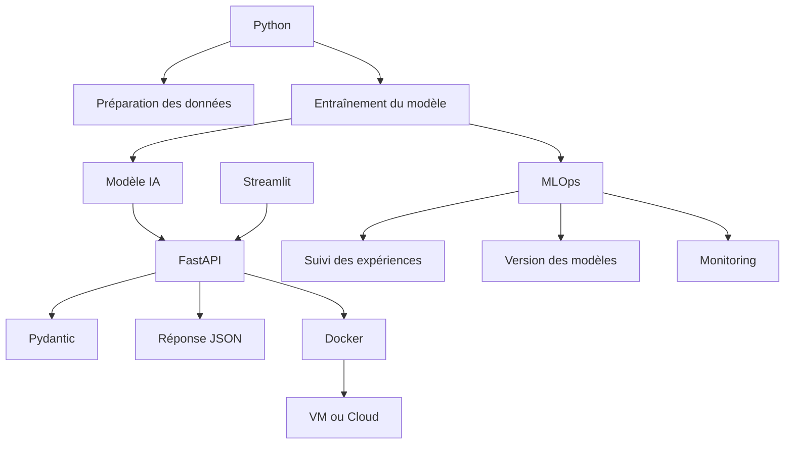

> **À retenir**
> Chaque outil a un rôle. Un bon projet IA ne consiste pas à empiler des technologies, mais à choisir les bons outils pour répondre aux bons besoins.

> **Attention**
> Si les rôles ne sont pas clairs, on risque d’utiliser Streamlit comme backend, FastAPI comme interface, Docker comme machine virtuelle ou MLOps comme simple mot marketing.

</details>

<p align="right"><a href="#top">↑ Retour en haut</a></p>

---

<a id="section-3"></a>

<details>
<summary><strong>3 — Vue globale d’une architecture IA moderne</strong></summary>

<br/>

Un projet IA moderne peut être vu comme une chaîne complète. Cette chaîne commence avec des données et se termine avec un service utilisable.

Le modèle n’est donc pas la fin du projet. Le modèle est une brique au milieu d’une architecture.

### Diagramme — Chaîne générale d’un projet IA

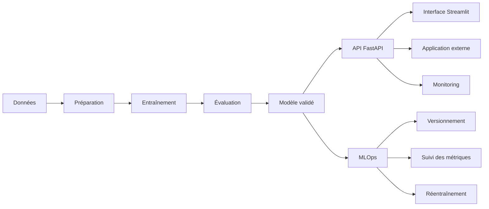

Dans cette chaîne, chaque étape a une fonction.

La préparation des données permet d’obtenir des données propres. L’entraînement permet au modèle d’apprendre. L’évaluation permet de mesurer la qualité du modèle. L’API permet de rendre le modèle accessible. L’interface permet à un humain de l’utiliser. Le monitoring permet de détecter les problèmes. Le MLOps permet de gérer le cycle de vie complet du modèle.

### Exemple concret

Une entreprise veut créer un assistant qui recommande une action commerciale.

Le modèle peut recevoir :

* le profil du client ;
* l’historique des achats ;
* le niveau d’engagement ;
* les derniers contacts ;
* le risque de départ.

Le modèle retourne :

* une action recommandée ;
* un score de confiance ;
* une explication courte ;
* la version du modèle.

> **À retenir**
> Dans un projet professionnel, il faut penser dès le départ à la question suivante : comment le modèle sera-t-il utilisé par une personne, une application ou un autre système ?

</details>

<p align="right"><a href="#top">↑ Retour en haut</a></p>

---

<a id="section-4"></a>

<details>
<summary><strong>4 — Python : pourquoi ce langage est central en IA ?</strong></summary>

<br/>

Python est l’un des langages les plus utilisés en intelligence artificielle parce qu’il est simple à lire, riche en bibliothèques et très présent dans les communautés data science, machine learning, deep learning et automatisation.

Python permet de travailler rapidement avec des fichiers, des données, des modèles, des API et des interfaces.

### Ce que Python permet de faire dans un projet IA

| Besoin                  | Exemple                                |
| ----------------------- | -------------------------------------- |
| Lire des données        | Charger un fichier CSV                 |
| Nettoyer des données    | Corriger des valeurs manquantes        |
| Transformer des données | Normaliser des colonnes                |
| Entraîner un modèle     | Régression, classification, clustering |
| Évaluer un modèle       | Accuracy, F1-score, RMSE               |
| Créer une API           | FastAPI                                |
| Créer une interface     | Streamlit                              |
| Automatiser             | Scripts, pipelines                     |
| Déployer                | Docker, cloud, services                |

### Diagramme — Python au centre de l’écosystème IA

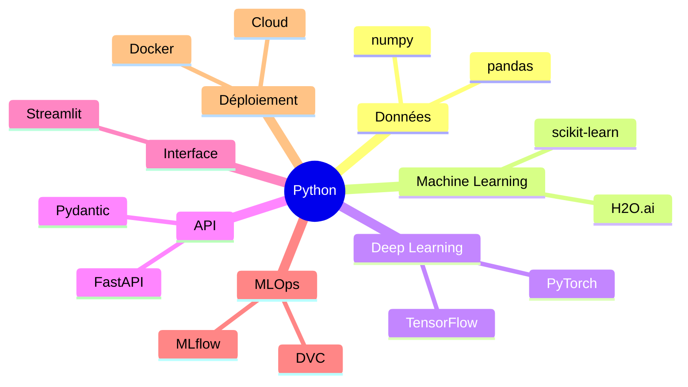

> **Conseil pédagogique**
> Python est populaire en IA parce qu’il permet de passer rapidement de l’idée au prototype. Il est aussi suffisamment riche pour construire des projets professionnels si l’architecture est bien organisée.

> **Attention**
> Python seul ne suffit pas. Il faut organiser le projet, isoler les dépendances, documenter les routes, valider les données et préparer le déploiement.

</details>

<p align="right"><a href="#top">↑ Retour en haut</a></p>

---

<a id="section-5"></a>

<details>
<summary><strong>5 — Environnement virtuel Python : pourquoi ?</strong></summary>

<br/>

Un environnement virtuel est un espace isolé dans lequel on installe les bibliothèques Python nécessaires à un projet.

Sans environnement virtuel, toutes les bibliothèques sont installées dans le même espace global. Cela peut provoquer des conflits entre projets.

### Exemple de conflit

Projet 1 :

```text
FastAPI ancienne version
Pydantic version 1
scikit-learn version A
```

Projet 2 :

```text
FastAPI récente version
Pydantic version 2
scikit-learn version B
```

Si les deux projets utilisent le même environnement global, une mise à jour faite pour le projet 2 peut casser le projet 1.

### Analogie

Un environnement virtuel est comme une salle de laboratoire séparée.

Chaque projet a sa propre salle avec ses propres outils. Si on change un outil dans une salle, cela ne casse pas les autres salles.

### Diagramme — Environnement global vs environnements virtuels

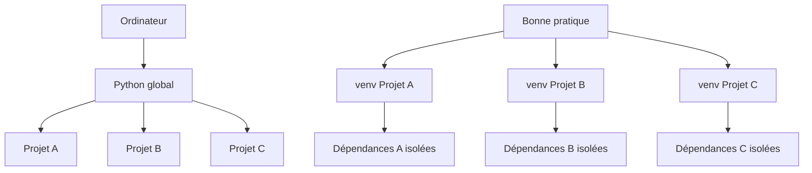

### Pourquoi c’est important ?

| Raison           | Explication                                     |
| ---------------- | ----------------------------------------------- |
| Isolation        | Chaque projet garde ses propres bibliothèques   |
| Reproductibilité | On peut refaire le même environnement           |
| Sécurité         | On évite de modifier Python global              |
| Collaboration    | Les autres peuvent installer les mêmes versions |
| Maintenance      | Le projet est plus propre                       |

> **Bonne pratique**
> Pour chaque nouveau projet Python sérieux, il faut créer un environnement virtuel.

> **Attention**
> Installer toutes les bibliothèques dans Python global peut donner l’impression de gagner du temps au début, mais cela crée souvent des problèmes plus tard.

</details>

<p align="right"><a href="#top">↑ Retour en haut</a></p>

---

<a id="section-6"></a>

<details>
<summary><strong>6 — Dépendances et conflits de versions</strong></summary>

<br/>

Une dépendance est une bibliothèque dont un projet a besoin pour fonctionner.

Par exemple, une application FastAPI peut dépendre de FastAPI, Pydantic, Uvicorn, scikit-learn, pandas et numpy.

Le problème est que les bibliothèques évoluent. Une version récente peut changer certaines règles. Une ancienne version peut ne plus être compatible avec un autre outil.

### Exemple simplifié

Une application utilise Pydantic pour valider les données.

Si Pydantic change de version majeure, certaines syntaxes ou certains comportements peuvent changer.

Le projet peut alors produire des erreurs.

### Pourquoi noter les dépendances ?

Dans un vrai projet, on veut savoir exactement quelles bibliothèques sont utilisées.

On veut éviter cette situation :

```text
Chez le professeur, ça marche.
Chez l’apprenant, ça ne marche pas.
Sur le serveur, ça ne marche plus.
```

### Diagramme — Problème de dépendances

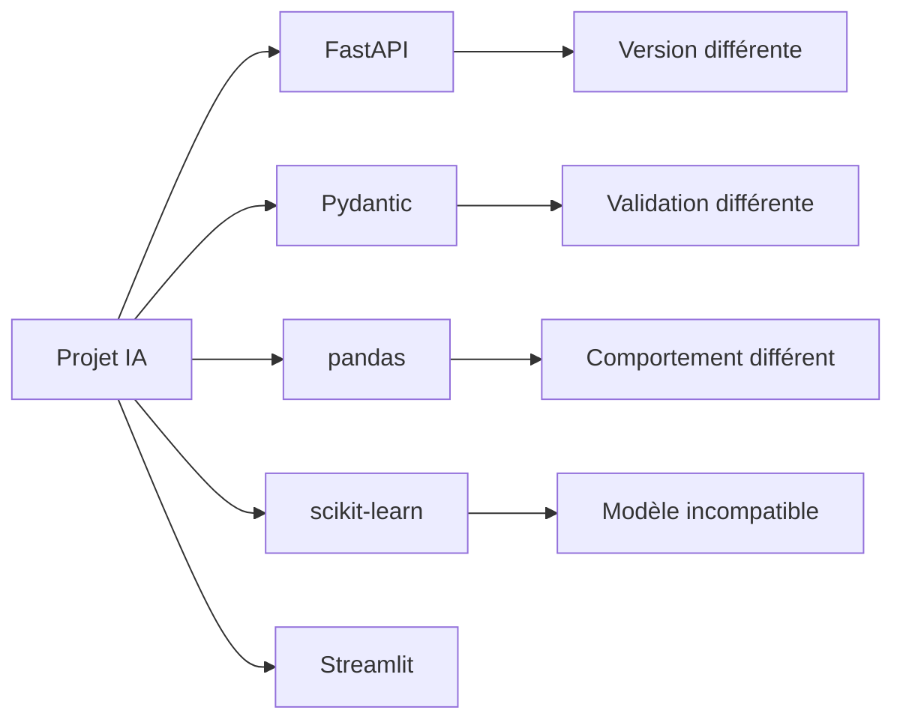

> **À retenir**
> Un projet IA reproductible doit contrôler ses dépendances. Sinon, le même projet peut donner des erreurs différentes selon la machine.

> **Bonne pratique**
> Les dépendances doivent être documentées dans un fichier dédié, par exemple `requirements.txt`, `pyproject.toml` ou un fichier équivalent selon l’outil utilisé.

</details>

<p align="right"><a href="#top">↑ Retour en haut</a></p>

---

<a id="section-7"></a>

<details>
<summary><strong>7 — Streamlit : c’est quoi ?</strong></summary>

<br/>

Streamlit est un outil Python qui permet de créer rapidement une interface web interactive.

Il est très utilisé en data science et en IA parce qu’il permet de transformer rapidement un script Python en application visuelle.

Avec Streamlit, on peut créer :

* une page web simple ;
* un formulaire ;
* un bouton ;
* un tableau ;
* un graphique ;
* une interface pour tester un modèle ;
* un tableau de bord ;
* une démonstration.

### Exemple simple

Un modèle prédit le prix d’une maison.

L’utilisateur entre :

* la surface ;
* le nombre de chambres ;
* la ville ;
* l’année de construction.

Streamlit affiche :

```text
Prix estimé : 425 000 $
```

### Diagramme — Rôle de Streamlit

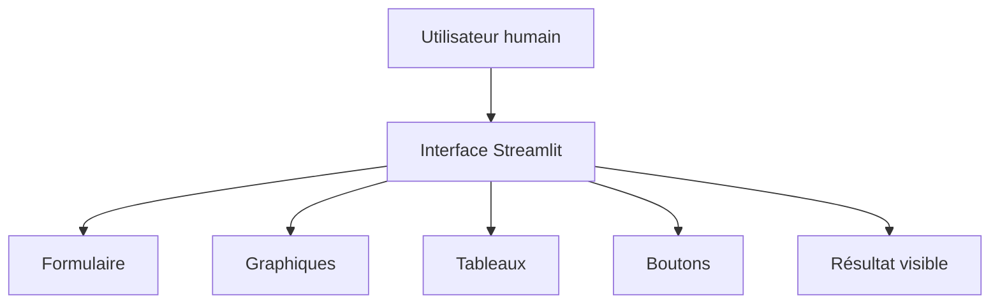

> **À retenir**
> Streamlit est très utile pour montrer rapidement un modèle IA à une personne non technique.

> **Attention**
> Streamlit est surtout une interface. Il ne remplace pas automatiquement une API professionnelle ou un backend complet.

</details>

<p align="right"><a href="#top">↑ Retour en haut</a></p>

---

<a id="section-8"></a>

<details>
<summary><strong>8 — Pourquoi utiliser Streamlit ?</strong></summary>

<br/>

On utilise Streamlit quand on veut aller vite et créer une interface simple sans construire un vrai frontend complet.

Dans un cours, Streamlit est utile parce qu’il permet de voir rapidement le résultat d’un modèle.

Dans une entreprise, Streamlit peut être utile pour un prototype, une démonstration interne, un tableau de bord ou un outil d’analyse rapide.

### Avantages

| Avantage      | Explication                               |
| ------------- | ----------------------------------------- |
| Rapidité      | On crée une interface très vite           |
| Simplicité    | On reste en Python                        |
| Visualisation | On peut afficher graphiques et tableaux   |
| Démonstration | Très bon pour présenter un modèle         |
| Pédagogie     | Le résultat devient visible immédiatement |

### Limites

| Limite                           | Explication                                       |
| -------------------------------- | ------------------------------------------------- |
| Moins flexible                   | Moins personnalisable qu’un vrai frontend         |
| Pas idéal pour grande production | Peut devenir limité pour une application complexe |
| Sécurité à bien gérer            | Ne pas exposer n’importe quoi                     |
| Architecture à clarifier         | Ne pas mélanger interface et logique critique     |

### Diagramme — Streamlit dans un prototype


> **Conseil pédagogique**
> Streamlit est excellent pour la phase de prototype. Il permet de prouver rapidement qu’une idée fonctionne.

> **Attention**
> Un prototype Streamlit n’est pas automatiquement une application de production prête pour un grand nombre d’utilisateurs.

</details>

<p align="right"><a href="#top">↑ Retour en haut</a></p>

---

<a id="section-9"></a>

<details>
<summary><strong>9 — FastAPI : c’est quoi ?</strong></summary>

<br/>

FastAPI est un framework Python qui permet de créer des API modernes.

Une API est une interface qui permet à deux systèmes de communiquer.

FastAPI est souvent utilisé pour exposer une logique Python, un modèle IA, un service de calcul ou une fonctionnalité backend.

### Exemple simple

Une application veut faire une prédiction.

Elle envoie une requête à une API :

```text
POST /predict
```

Elle envoie des données :

```json
{
  "age": 45,
  "income": 72000,
  "contract_type": "monthly"
}
```

L’API répond :

```json
{
  "prediction": "medium_risk",
  "score": 0.63
}
```

### Diagramme — FastAPI comme backend

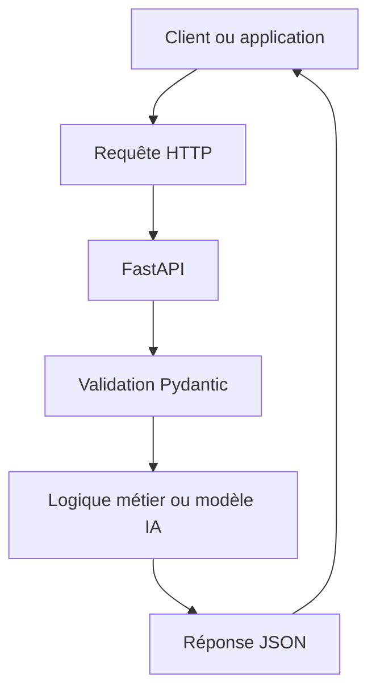

### Pourquoi FastAPI est utilisé ?

| Besoin                       | Rôle de FastAPI           |
| ---------------------------- | ------------------------- |
| Recevoir des requêtes        | L’API écoute des routes   |
| Exposer un modèle IA         | Route `/predict`          |
| Retourner du JSON            | Réponse standard          |
| Documenter automatiquement   | Documentation interactive |
| Valider avec Pydantic        | Entrées propres           |
| Connecter plusieurs systèmes | Backend réutilisable      |

> **À retenir**
> FastAPI transforme une logique Python en service accessible par d’autres applications.

> **Bonne pratique**
> Dans un projet IA, FastAPI sert souvent de pont entre le modèle et le monde extérieur.

</details>

<p align="right"><a href="#top">↑ Retour en haut</a></p>

---

<a id="section-10"></a>

<details>
<summary><strong>10 — FastAPI ou FastPi : éviter la confusion</strong></summary>

<br/>

Le bon nom est **FastAPI**.

Il ne faut pas confondre FastAPI avec Raspberry Pi.

FastAPI est un outil logiciel. Raspberry Pi est une petite machine physique.

| Terme        | Nature             | Rôle                                   |
| ------------ | ------------------ | -------------------------------------- |
| FastAPI      | Framework Python   | Créer des API                          |
| Raspberry Pi | Petit ordinateur   | Exécuter des programmes, capteurs, IoT |
| API          | Concept logiciel   | Faire communiquer des systèmes         |
| Pi           | Machine matérielle | Petit ordinateur Linux                 |

### Exemple

FastAPI peut fonctionner sur un Raspberry Pi, mais ce sont deux choses différentes.

On peut installer une petite API FastAPI sur un Raspberry Pi pour recevoir des données de capteurs.

### Diagramme — Différence FastAPI / Raspberry Pi

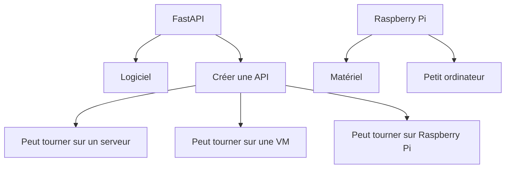

> **À retenir**
> FastAPI répond à la question : comment créer une API ?
> Raspberry Pi répond à la question : sur quelle petite machine peut-on exécuter un programme ?

</details>

<p align="right"><a href="#top">↑ Retour en haut</a></p>

---

<a id="section-11"></a>

<details>
<summary><strong>11 — Streamlit et FastAPI : deux rôles différents</strong></summary>

<br/>

Streamlit et FastAPI sont complémentaires.

Streamlit est fait pour l’interface utilisateur.

FastAPI est fait pour l’API backend.

### Comparaison

| Élément               | Streamlit                           | FastAPI                       |
| --------------------- | ----------------------------------- | ----------------------------- |
| Rôle principal        | Interface utilisateur               | API backend                   |
| Utilisateur principal | Humain                              | Application ou système        |
| Format principal      | Page web                            | JSON                          |
| Usage courant         | Démonstration, dashboard, prototype | Backend, service, intégration |
| Exemple               | Formulaire de prédiction            | Route `/predict`              |
| Documentation API     | Pas le rôle principal               | Documentation automatique     |
| Production            | Possible mais limité selon cas      | Très adapté aux services API  |

### Diagramme — Les deux ensemble

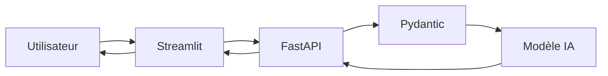

### Analogie

Streamlit est la vitrine du magasin.

FastAPI est le comptoir de service derrière la vitrine.

Le modèle IA est l’expert qui donne la réponse.

> **Conseil pédagogique**
> Faire travailler Streamlit et FastAPI ensemble aide à comprendre la séparation entre interface et backend.

> **Attention**
> Si toute la logique critique est directement placée dans Streamlit, le projet peut devenir difficile à maintenir, tester et sécuriser.

</details>

<p align="right"><a href="#top">↑ Retour en haut</a></p>

---

<a id="section-12"></a>

<details>
<summary><strong>12 — API : c’est quoi ?</strong></summary>

<br/>

API signifie :

```text
Application Programming Interface
```

En français, on peut dire : interface de programmation applicative.

Une API permet à deux systèmes de communiquer selon des règles claires.

### Exemple de la vie réelle

Quand une application météo affiche la température, le téléphone ne mesure pas lui-même la météo. Il demande l’information à un serveur météo.

L’application envoie une requête.

Le serveur répond avec des données.

### Exemple en IA

Un système envoie un texte :

```json
{
  "text": "Ce produit est excellent."
}
```

L’API IA répond :

```json
{
  "sentiment": "positive",
  "confidence": 0.94
}
```

### Diagramme — Communication avec une API

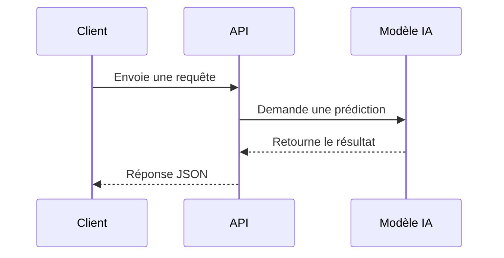

> **À retenir**
> Une API est comme un serveur dans un restaurant. Le client ne va pas directement dans la cuisine. Il fait une demande, puis reçoit une réponse.

> **Bonne pratique**
> Une API bien conçue permet de rendre un modèle IA utilisable par plusieurs applications différentes.

</details>

<p align="right"><a href="#top">↑ Retour en haut</a></p>

---

<a id="section-13"></a>

<details>
<summary><strong>13 — Client, serveur, requête et réponse</strong></summary>

<br/>

Dans une API, il y a souvent un client et un serveur.

Le client est celui qui demande quelque chose.

Le serveur est celui qui reçoit la demande, traite la demande et retourne une réponse.

### Exemples de clients

Un client peut être :

* un navigateur web ;
* une application mobile ;
* une interface Streamlit ;
* un script Python ;
* un outil de test d’API ;
* une autre API ;
* un service cloud.

### Exemples de serveurs

Un serveur peut être :

* une API FastAPI ;
* une application Flask ;
* un backend Java ;
* un service cloud ;
* une base de données exposée par une API ;
* un serveur de modèle IA.

### Diagramme — Requête et réponse

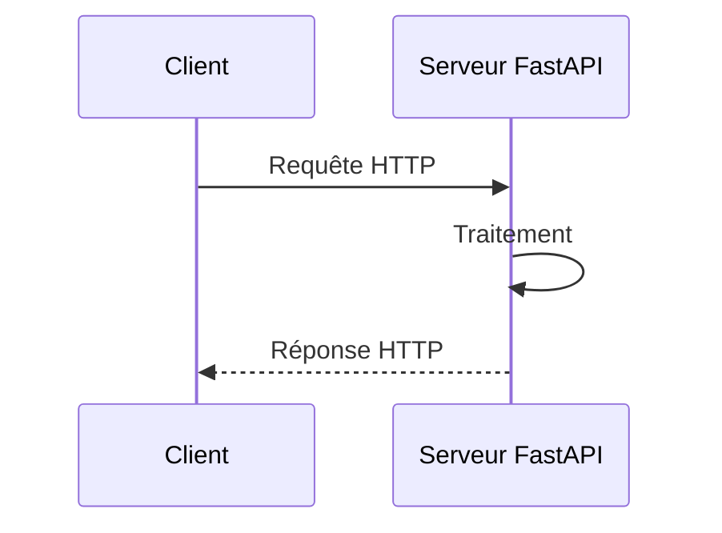

### Composition d’une requête HTTP

Une requête peut contenir :

| Élément          | Exemple                       |
| ---------------- | ----------------------------- |
| Méthode          | GET, POST, PUT, PATCH, DELETE |
| URL              | `/predict`                    |
| Headers          | Content-Type, Authorization   |
| Body             | JSON envoyé au serveur        |
| Query parameters | `?city=Montreal`              |
| Path parameters  | `/students/15`                |

> **Conseil pédagogique**
> Une requête HTTP est comme une lettre structurée : elle contient une adresse, une intention, parfois un contenu, et parfois des informations supplémentaires.

</details>

<p align="right"><a href="#top">↑ Retour en haut</a></p>

---

<a id="section-14"></a>

<details>
<summary><strong>14 — Routes : c’est quoi ?</strong></summary>

<br/>

Une route est une adresse spécifique dans une API.

Chaque route représente une action ou une ressource.

### Exemples de routes

```text
GET /students
GET /students/15
POST /students
POST /predict
GET /health
GET /model-info
```

### Lecture simple

| Route          | Signification                          |
| -------------- | -------------------------------------- |
| `/students`    | Liste ou collection d’étudiants        |
| `/students/15` | Étudiant avec identifiant 15           |
| `/predict`     | Faire une prédiction                   |
| `/health`      | Vérifier que l’API fonctionne          |
| `/model-info`  | Obtenir des informations sur le modèle |

### Diagramme — Routes d’une API IA

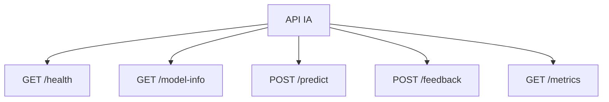

### Bonne pratique

Les routes doivent être :

* claires ;
* cohérentes ;
* lisibles ;
* prévisibles ;
* orientées ressource ou action ;
* faciles à documenter.

> **À retenir**
> Une route est comme une porte dans un bâtiment. Chaque porte mène à un service précis.

> **Attention**
> Une API avec des routes mal nommées devient difficile à utiliser, même si le code fonctionne.

</details>

<p align="right"><a href="#top">↑ Retour en haut</a></p>

---

<a id="section-15"></a>

<details>
<summary><strong>15 — Méthodes HTTP : GET, POST, PUT, PATCH, DELETE</strong></summary>

<br/>

Les méthodes HTTP indiquent l’intention de la requête.

La route dit où aller.

La méthode dit quoi faire.

Par exemple :

```text
GET /students
POST /students
DELETE /students/15
```

Ces trois requêtes ne veulent pas dire la même chose.

---

## 15.1 GET

GET sert à lire ou récupérer une information.

Exemples :

```text
GET /students
GET /students/15
GET /model-info
GET /health
```

GET signifie :

```text
Donne-moi une information.
```

> **À retenir**
> GET doit normalement être utilisé pour lire des données, pas pour modifier le système.

> **Attention**
> Il ne faut pas envoyer un mot de passe ou un secret dans l’URL avec GET, car l’URL peut être visible dans les historiques et les logs.

---

## 15.2 POST

POST sert souvent à créer une ressource ou à envoyer des données pour traitement.

Exemples :

```text
POST /students
POST /predict
POST /login
POST /calculate
```

POST signifie :

```text
Voici des données, traite-les ou crée quelque chose.
```

Dans un projet IA, POST est très fréquent parce qu’une prédiction nécessite souvent un body JSON.

### Exemple

```json
{
  "age": 45,
  "income": 72000,
  "complaints": 3
}
```

L’API peut répondre :

```json
{
  "risk": "medium",
  "score": 0.63
}
```

> **À retenir**
> POST est souvent utilisé pour envoyer des données structurées à un modèle IA.

---

## 15.3 PUT

PUT sert à remplacer complètement une ressource existante.

Exemple :

```text
PUT /students/15
```

Cela signifie :

```text
Remplace entièrement la fiche de l’étudiant 15.
```

PUT est utile quand on envoie une version complète de la ressource.

---

## 15.4 PATCH

PATCH sert à modifier seulement une partie d’une ressource.

Exemple :

```text
PATCH /students/15
```

Cela signifie :

```text
Modifie seulement certains champs de l’étudiant 15.
```

### Différence simple

| Méthode | Sens                                 |
| ------- | ------------------------------------ |
| PUT     | Je remplace toute la fiche           |
| PATCH   | Je corrige seulement quelques champs |

> **Conseil pédagogique**
> PUT est comme refaire toute une fiche. PATCH est comme corriger une ligne dans la fiche.

---

## 15.5 DELETE

DELETE sert à supprimer une ressource.

Exemple :

```text
DELETE /students/15
```

Cela signifie :

```text
Supprime l’étudiant 15.
```

Dans les vrais systèmes, on peut aussi faire une suppression logique. Cela veut dire que la donnée n’est pas effacée physiquement, mais désactivée.

Exemple conceptuel :

```json
{
  "active": false
}
```

> **Attention**
> DELETE doit être protégé par des permissions. Tout le monde ne doit pas avoir le droit de supprimer des ressources.

---

## Tableau récapitulatif

| Méthode | Rôle                   | Exemple               | Phrase simple               |
| ------- | ---------------------- | --------------------- | --------------------------- |
| GET     | Lire                   | `GET /courses`        | Donne-moi les cours         |
| POST    | Créer ou traiter       | `POST /predict`       | Voici des données à traiter |
| PUT     | Remplacer              | `PUT /students/15`    | Remplace toute la fiche     |
| PATCH   | Modifier partiellement | `PATCH /students/15`  | Modifie quelques champs     |
| DELETE  | Supprimer              | `DELETE /students/15` | Supprime cette ressource    |

### Diagramme — Choisir la bonne méthode

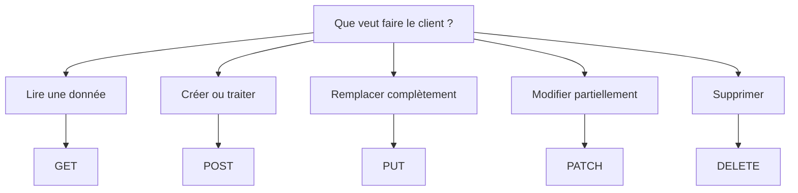

</details>

<p align="right"><a href="#top">↑ Retour en haut</a></p>

---

<a id="section-16"></a>

<details>
<summary><strong>16 — Codes HTTP : 1xx, 2xx, 3xx, 4xx, 5xx</strong></summary>

<br/>

Quand un serveur répond à une requête HTTP, il retourne un code de statut.

Ce code indique si la requête a réussi, si elle a été redirigée, si le client a fait une erreur ou si le serveur a eu un problème.

### Familles de codes

| Famille | Signification       |
| ------- | ------------------- |
| 1xx     | Information         |
| 2xx     | Succès              |
| 3xx     | Redirection         |
| 4xx     | Erreur côté client  |
| 5xx     | Erreur côté serveur |

> **À retenir**
> Le premier chiffre du code HTTP donne déjà une information importante.

---

## 16.1 Codes 1xx — Information

Les codes 1xx indiquent que la requête est reçue ou en cours de traitement.

| Code | Signification simple    |
| ---- | ----------------------- |
| 100  | Continue                |
| 101  | Changement de protocole |
| 102  | Traitement en cours     |

Ces codes sont moins visibles pour les débutants, car ils sont souvent gérés automatiquement par les navigateurs ou les clients HTTP.

---

## 16.2 Codes 2xx — Succès

Les codes 2xx indiquent que la requête a réussi.

| Code | Nom        | Exemple                                 |
| ---- | ---------- | --------------------------------------- |
| 200  | OK         | La liste demandée est retournée         |
| 201  | Created    | Une nouvelle ressource est créée        |
| 202  | Accepted   | La requête est acceptée pour traitement |
| 204  | No Content | Succès sans contenu à retourner         |

### Exemple

```text
GET /health
```

Réponse :

```text
200 OK
```

Cela signifie que l’API fonctionne.

> **À retenir**
> Les codes 2xx sont généralement de bonnes nouvelles.

---

## 16.3 Codes 3xx — Redirection

Les codes 3xx indiquent que la ressource se trouve ailleurs ou que le client doit être redirigé.

| Code | Nom                | Explication            |
| ---- | ------------------ | ---------------------- |
| 301  | Moved Permanently  | Déplacement permanent  |
| 302  | Found              | Redirection temporaire |
| 304  | Not Modified       | Contenu non modifié    |
| 307  | Temporary Redirect | Redirection temporaire |
| 308  | Permanent Redirect | Redirection permanente |

### Exemple

Un site passe de HTTP à HTTPS.

Le serveur peut rediriger :

```text
http://site.com
```

vers :

```text
https://site.com
```

---

## 16.4 Codes 4xx — Erreur côté client

Les codes 4xx indiquent que le problème vient probablement de la requête envoyée par le client.

| Code | Nom                    | Explication                          |
| ---- | ---------------------- | ------------------------------------ |
| 400  | Bad Request            | Requête mal formée                   |
| 401  | Unauthorized           | Authentification absente ou invalide |
| 403  | Forbidden              | Accès interdit                       |
| 404  | Not Found              | Ressource introuvable                |
| 405  | Method Not Allowed     | Méthode non autorisée                |
| 409  | Conflict               | Conflit avec l’état actuel           |
| 415  | Unsupported Media Type | Format non supporté                  |
| 422  | Unprocessable Entity   | Données invalides selon le modèle    |
| 429  | Too Many Requests      | Trop de requêtes                     |

### 401 vs 403

401 signifie souvent :

```text
Je ne sais pas encore qui tu es, ou ton authentification est invalide.
```

403 signifie :

```text
Je sais qui tu es, mais tu n’as pas le droit.
```

### 404

404 signifie :

```text
La route ou la ressource demandée n’existe pas.
```

Exemple :

```text
GET /studentss
```

au lieu de :

```text
GET /students
```

### 405

405 signifie :

```text
La route existe, mais pas avec cette méthode HTTP.
```

Exemple :

```text
GET /predict
```

alors que l’API attend :

```text
POST /predict
```

### 422

422 est très important avec FastAPI et Pydantic.

Il signifie :

```text
J’ai compris la requête, mais les données ne respectent pas le format attendu.
```

Exemple :

L’API attend :

```json
{
  "age": 30,
  "income": 50000
}
```

Mais le client envoie :

```json
{
  "age": "bonjour",
  "income": "abc"
}
```

L’API peut répondre :

```text
422 Unprocessable Entity
```

> **À retenir**
> Une erreur 422 n’est pas forcément une panne. Cela signifie souvent que la validation fonctionne correctement.

---

## 16.5 Codes 5xx — Erreur côté serveur

Les codes 5xx indiquent que le problème vient probablement du serveur.

| Code | Nom                   | Explication                                 |
| ---- | --------------------- | ------------------------------------------- |
| 500  | Internal Server Error | Erreur interne                              |
| 502  | Bad Gateway           | Mauvaise réponse d’un service intermédiaire |
| 503  | Service Unavailable   | Service indisponible                        |
| 504  | Gateway Timeout       | Temps d’attente dépassé                     |

### Exemple 500

Un modèle IA n’est pas chargé correctement.

Le serveur reçoit la requête, mais il plante pendant le traitement.

Réponse possible :

```text
500 Internal Server Error
```

> **Attention**
> Si une API retourne souvent des erreurs 500, il faut consulter les logs du serveur. Le problème vient rarement de l’utilisateur final.

### Diagramme — Diagnostic par code HTTP

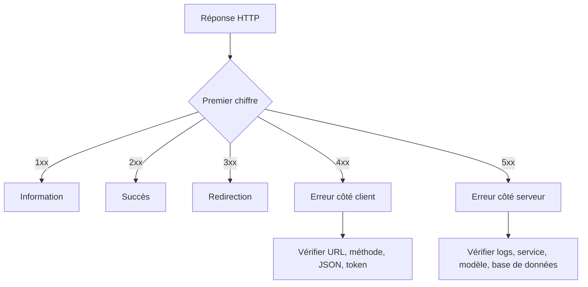

</details>

<p align="right"><a href="#top">↑ Retour en haut</a></p>

---

<a id="section-17"></a>

<details>
<summary><strong>17 — JSON : c’est quoi ?</strong></summary>

<br/>

JSON signifie :

```text
JavaScript Object Notation
```

JSON est un format standard utilisé pour échanger des données entre applications.

Même si le nom contient JavaScript, JSON est utilisé avec presque tous les langages : Python, Java, C#, Go, PHP, Ruby, JavaScript et plusieurs autres.

### Exemple simple

```json
{
  "name": "Amira",
  "age": 24,
  "program": "Artificial Intelligence"
}
```

Ce JSON représente un objet avec trois champs.

### Types de valeurs JSON

| Type    | Exemple                     |
| ------- | --------------------------- |
| Texte   | `"Montreal"`                |
| Nombre  | `42`                        |
| Décimal | `3.14`                      |
| Booléen | `true` ou `false`           |
| Liste   | `["AI", "Cloud", "DevOps"]` |
| Objet   | `{ "name": "Karim" }`       |
| Null    | `null`                      |

### Exemple IA

```json
{
  "customer_id": 123,
  "age": 45,
  "income": 72000,
  "complaints": 3,
  "contract_type": "monthly"
}
```

L’API peut répondre :

```json
{
  "prediction": "medium_risk",
  "score": 0.63,
  "model_version": "v1.0"
}
```

### Diagramme — JSON dans une API

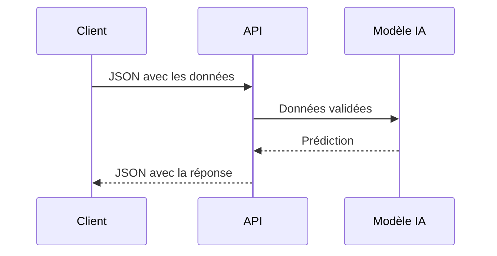

> **À retenir**
> JSON est le langage commun entre les applications modernes.

> **Attention**
> Un JSON mal formé peut provoquer une erreur 400. Un JSON bien formé mais incorrect par rapport au modèle attendu peut provoquer une erreur 422.

### Erreurs fréquentes en JSON

| Erreur                                 | Exemple               |
| -------------------------------------- | --------------------- |
| Oublier les guillemets autour des clés | `{ name: "Amira" }`   |
| Mettre une virgule en trop             | `{ "age": 24, }`      |
| Utiliser des guillemets simples        | `{ 'name': 'Amira' }` |
| Envoyer un texte au lieu d’un nombre   | `{ "age": "vingt" }`  |
| Oublier une accolade                   | `{ "name": "Amira" `  |

> **Bonne pratique**
> En JSON, les clés doivent être entre guillemets doubles.

</details>

<p align="right"><a href="#top">↑ Retour en haut</a></p>

---

<a id="section-18"></a>

<details>
<summary><strong>18 — Exercices JSON</strong></summary>

<br/>

## Exercice 1 — Lire un JSON

Voici un JSON :

```json
{
  "student_id": 15,
  "name": "Karim",
  "program": "Cloud Computing",
  "active": true
}
```

Questions :

1. Quel est l’identifiant ?
2. Quel est le nom ?
3. Le champ `active` est-il un texte ou un booléen ?
4. Ce JSON représente-t-il une liste ou un objet ?

---

## Exercice 2 — Corriger un JSON invalide

JSON incorrect :

```text
{
  name: "Amira",
  "age": 24,
  "program": "AI",
}
```

Questions :

1. Quelle erreur voyez-vous sur la clé `name` ?
2. Quelle erreur voyez-vous à la fin ?
3. Réécrivez le JSON correctement.

Correction attendue :

```json
{
  "name": "Amira",
  "age": 24,
  "program": "AI"
}
```

---

## Exercice 3 — Construire un JSON pour une prédiction IA

Vous devez envoyer à une API de prédiction les informations suivantes :

| Champ         | Valeur  |
| ------------- | ------- |
| age           | 45      |
| income        | 72000   |
| complaints    | 3       |
| contract_type | monthly |

JSON attendu :

```json
{
  "age": 45,
  "income": 72000,
  "complaints": 3,
  "contract_type": "monthly"
}
```

---

## Exercice 4 — Identifier les types

Pour chaque champ, indiquez le type JSON.

```json
{
  "city": "Montreal",
  "temperature": -5,
  "snow": true,
  "alerts": ["ice", "wind"],
  "humidity": null
}
```

| Champ       | Type attendu |
| ----------- | ------------ |
| city        | Texte        |
| temperature | Nombre       |
| snow        | Booléen      |
| alerts      | Liste        |
| humidity    | Null         |

---

## Exercice 5 — JSON de réponse IA

Une API IA répond :

```json
{
  "prediction": "fraud",
  "score": 0.91,
  "model_version": "fraud-v2",
  "requires_review": true
}
```

Questions :

1. Quelle est la prédiction ?
2. Quel est le score ?
3. Quelle version du modèle a répondu ?
4. Le dossier doit-il être revu par un humain ?
5. Quel champ permet de savoir si une revue humaine est nécessaire ?

> **Conseil pédagogique**
> Les exercices JSON sont très utiles avant d’aborder FastAPI, parce que les API modernes échangent souvent des données en JSON.

</details>

<p align="right"><a href="#top">↑ Retour en haut</a></p>

---

<a id="section-19"></a>

<details>
<summary><strong>19 — Pydantic : c’est quoi ?</strong></summary>

<br/>

Pydantic est une bibliothèque Python utilisée pour valider les données.

FastAPI utilise Pydantic pour vérifier que les données reçues respectent un format attendu.

### Problème sans validation

Supposons qu’une API attend :

```text
age : nombre
income : nombre
contract_type : texte
```

Mais le client envoie :

```json
{
  "age": "bonjour",
  "income": "abc",
  "contract_type": 123
}
```

Sans validation, l’application peut planter, produire un mauvais résultat ou transmettre des données incohérentes au modèle IA.

Avec Pydantic, l’API peut refuser automatiquement ces données.

### Diagramme — Validation avec Pydantic

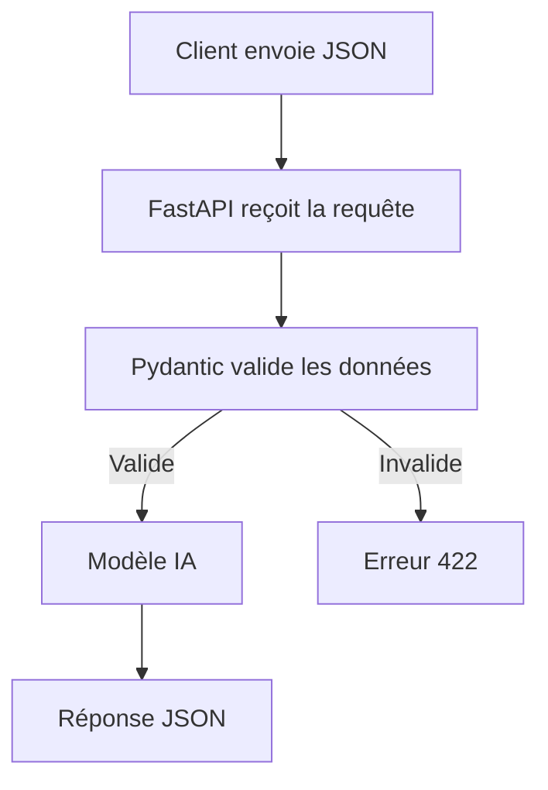

### Ce que Pydantic peut vérifier

| Élément           | Exemple                                                 |
| ----------------- | ------------------------------------------------------- |
| Type              | `age` doit être un nombre                               |
| Champ obligatoire | `income` doit être présent                              |
| Valeur autorisée  | `operation` doit être add, subtract, multiply ou divide |
| Structure         | Le JSON doit respecter le modèle attendu                |
| Réponse           | Le résultat retourné doit avoir le bon format           |

> **À retenir**
> Pydantic agit comme un gardien à l’entrée de l’API.

> **Bonne pratique**
> Dans une API IA, valider les entrées est essentiel, car un modèle peut produire des résultats absurdes si les données d’entrée sont incorrectes.

</details>

<p align="right"><a href="#top">↑ Retour en haut</a></p>

---

<a id="section-20"></a>

<details>
<summary><strong>20 — Pourquoi Pydantic est important dans une API IA ?</strong></summary>

<br/>

Pydantic est important parce qu’une API IA reçoit souvent des données venant de l’extérieur.

Ces données peuvent venir :

* d’une interface Streamlit ;
* d’une application mobile ;
* d’un frontend web ;
* d’un autre service ;
* d’un fichier ;
* d’un utilisateur ;
* d’un système automatisé.

Ces données peuvent être bonnes, incomplètes, incohérentes ou dangereuses.

### Exemple

Une API de prédiction attend :

```json
{
  "age": 45,
  "income": 72000,
  "complaints": 3
}
```

Mais elle reçoit :

```json
{
  "age": "quarante-cinq",
  "income": "beaucoup",
  "complaints": -10
}
```

Le modèle ne peut pas travailler correctement avec ces valeurs.

Pydantic aide à refuser les données invalides avant qu’elles arrivent au modèle.

### Pydantic protège contre

| Problème               | Exemple                             |
| ---------------------- | ----------------------------------- |
| Mauvais type           | Texte au lieu d’un nombre           |
| Champ manquant         | `age` absent                        |
| Valeur non autorisée   | opération inconnue                  |
| Données incohérentes   | nombre négatif impossible           |
| Réponse non structurée | API retourne un format imprévisible |

### Diagramme — Avant et après Pydantic

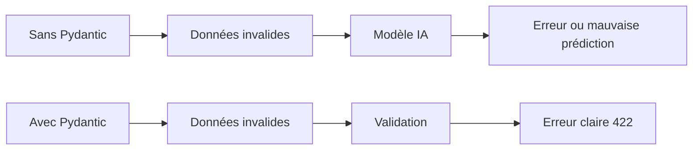

> **Attention**
> Si on ne valide pas les entrées, le modèle peut recevoir des données absurdes et retourner une prédiction qui semble correcte mais qui est en réalité fausse.

> **À retenir**
> Pydantic améliore la robustesse de l’API, la qualité de la documentation et la clarté des erreurs.

</details>

<p align="right"><a href="#top">↑ Retour en haut</a></p>

---

<a id="section-21"></a>

<details>
<summary><strong>21 — Swagger et OpenAPI : documentation interactive</strong></summary>

<br/>

FastAPI génère automatiquement une documentation interactive de l’API.

Cette documentation est souvent accessible à une adresse comme :

```text
/docs
```

Elle permet de voir :

* les routes disponibles ;
* les méthodes HTTP ;
* les paramètres attendus ;
* les bodies JSON attendus ;
* les réponses possibles ;
* les erreurs de validation ;
* les modèles Pydantic.

### Pourquoi c’est utile ?

La documentation interactive permet de tester l’API sans créer une application cliente complète.

On peut ouvrir la documentation, cliquer sur une route, entrer un JSON et observer la réponse.

### Diagramme — Documentation dans le cycle de test

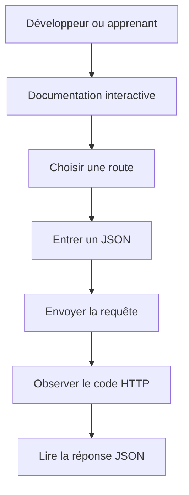

> **À retenir**
> La documentation interactive est excellente pour apprendre les API parce qu’elle rend visibles les routes, les méthodes, les modèles et les réponses.

> **Bonne pratique**
> Une bonne documentation API réduit les erreurs de communication entre les équipes frontend, backend, data science et DevOps.

> **Attention**
> En production, il faut réfléchir à l’exposition de cette documentation. Dans certains contextes, il ne faut pas exposer publiquement toute la structure de l’API.

</details>

<p align="right"><a href="#top">↑ Retour en haut</a></p>

---

<a id="section-22"></a>

<details>
<summary><strong>22 — H2O.ai : c’est quoi ?</strong></summary>

<br/>

H2O.ai est une plateforme orientée machine learning et AutoML.

AutoML signifie Automated Machine Learning.

L’objectif est d’automatiser une partie du processus d’entraînement et de comparaison de modèles.

H2O.ai peut entraîner plusieurs modèles, comparer leurs performances et proposer un classement.

### Exemple

Une entreprise possède un fichier CSV avec des informations clients.

Elle veut prédire si un client va quitter l’entreprise.

Au lieu de tester manuellement plusieurs modèles un par un, elle peut utiliser une approche AutoML.

L’outil peut tester plusieurs modèles :

* régression ;
* arbres ;
* random forest ;
* gradient boosting ;
* modèles empilés ;
* autres approches selon le contexte.

### Diagramme — Principe AutoML

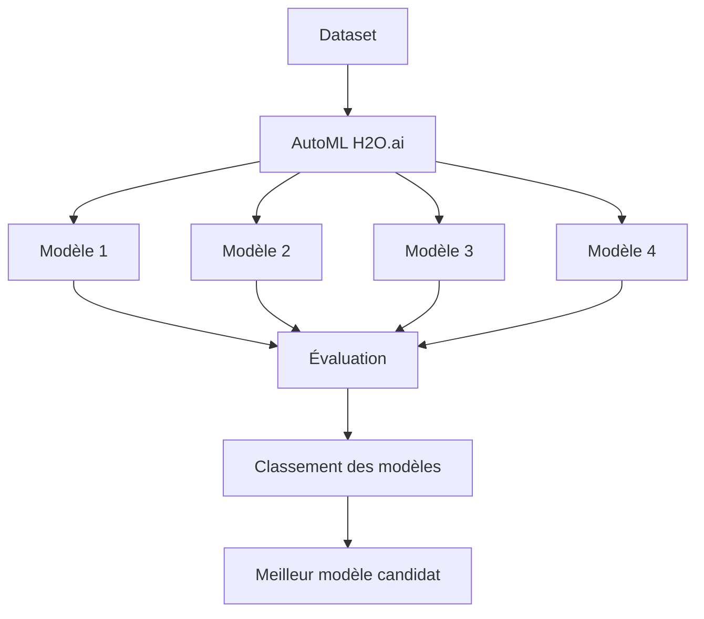

### Pourquoi H2O.ai est utile ?

| Besoin                              | Utilité                         |
| ----------------------------------- | ------------------------------- |
| Tester rapidement plusieurs modèles | AutoML                          |
| Comparer les performances           | Leaderboard                     |
| Gagner du temps                     | Automatisation                  |
| Aider les débutants                 | Moins de configuration manuelle |
| Aider les équipes                   | Standardiser les essais         |

> **À retenir**
> H2O.ai peut accélérer les essais de machine learning, surtout sur des données tabulaires.

> **Attention**
> AutoML ne remplace pas la compréhension des données. Un outil peut proposer un bon score, mais l’humain doit comprendre pourquoi le modèle est acceptable ou non.

</details>

<p align="right"><a href="#top">↑ Retour en haut</a></p>

---

<a id="section-23"></a>

<details>
<summary><strong>23 — AutoML : pourquoi automatiser certains essais ML ?</strong></summary>

<br/>

AutoML permet d’automatiser une partie de la recherche de modèles.

Dans un projet machine learning, il faut souvent tester plusieurs algorithmes, plusieurs paramètres et plusieurs transformations.

Cela peut prendre beaucoup de temps.

### Ce qu’AutoML peut aider à faire

| Étape                      | Rôle possible d’AutoML      |
| -------------------------- | --------------------------- |
| Tester plusieurs modèles   | Comparaison automatique     |
| Ajuster des paramètres     | Recherche de configurations |
| Évaluer les performances   | Calcul de métriques         |
| Classer les modèles        | Leaderboard                 |
| Réduire le temps de départ | Prototype rapide            |

### Ce qu’AutoML ne remplace pas

AutoML ne remplace pas :

* la compréhension métier ;
* le nettoyage des données ;
* l’analyse des biais ;
* le choix des métriques ;
* l’interprétation des résultats ;
* la validation humaine ;
* la réflexion éthique ;
* la surveillance en production.

### Diagramme — AutoML avec contrôle humain

```mermaid
flowchart LR
    A[Données] --> B[AutoML]
    B --> C[Modèles candidats]
    C --> D[Classement]
    D --> E[Analyse humaine]
    E --> F[Choix final]
    F --> G[Déploiement contrôlé]
```

> **À retenir**
> AutoML peut accélérer le travail, mais la responsabilité du choix final reste humaine.

> **Attention**
> Choisir automatiquement le modèle avec le meilleur score sans comprendre la métrique, les données et le contexte peut mener à une mauvaise décision.

</details>

<p align="right"><a href="#top">↑ Retour en haut</a></p>

---

<a id="section-24"></a>

<details>
<summary><strong>24 — MLOps : c’est quoi ?</strong></summary>

<br/>

MLOps signifie Machine Learning Operations.

MLOps consiste à appliquer des pratiques d’ingénierie, de DevOps, de versionnement, de surveillance et d’automatisation aux projets de machine learning.

Un modèle IA n’est pas terminé lorsqu’il est entraîné.

Il faut encore :

* enregistrer les expériences ;
* comparer les modèles ;
* versionner les modèles ;
* déployer une version ;
* surveiller les performances ;
* détecter les dérives ;
* réentraîner si nécessaire ;
* revenir à une ancienne version si une nouvelle version est mauvaise.

### Diagramme — Cycle MLOps

```mermaid
flowchart LR
    A[Données] --> B[Entraînement]
    B --> C[Évaluation]
    C --> D[Validation]
    D --> E[Déploiement]
    E --> F[Monitoring]
    F --> G[Détection de dérive]
    G --> H[Réentraînement]
    H --> B
```

### Pourquoi MLOps est différent du DevOps classique ?

Dans une application classique, le code est l’élément principal.

Dans un projet IA, il y a plusieurs éléments :

* le code ;
* les données ;
* le modèle ;
* les paramètres ;
* les métriques ;
* l’environnement ;
* les versions ;
* les résultats.

### Comparaison DevOps / MLOps

| Élément          | DevOps                 | MLOps                         |
| ---------------- | ---------------------- | ----------------------------- |
| Objet principal  | Application logicielle | Modèle IA + données + code    |
| Ce qu’on déploie | Code                   | Code + modèle + environnement |
| Risque principal | Bug logiciel           | Dégradation du modèle         |
| Suivi            | Logs, disponibilité    | Métriques ML, drift, versions |
| Exemple          | API web                | API de prédiction IA          |

> **À retenir**
> MLOps permet de passer d’un modèle expérimental à un modèle exploitable en production.

</details>

<p align="right"><a href="#top">↑ Retour en haut</a></p>

---

<a id="section-25"></a>

<details>
<summary><strong>25 — Pourquoi MLOps est indispensable en IA ?</strong></summary>

<br/>

Un modèle IA dépend des données.

Si les données changent, le modèle peut devenir moins performant.

C’est ce qu’on appelle souvent la dérive des données ou la dérive du concept.

### Exemple

Un modèle de détection de fraude est entraîné avec des données de 2024.

En 2026, les fraudeurs utilisent de nouvelles techniques.

Le modèle peut devenir moins efficace parce que le monde a changé.

Il faut donc surveiller le modèle.

### Ce que MLOps permet de suivre

| Élément           | Question                                     |
| ----------------- | -------------------------------------------- |
| Version du modèle | Quel modèle est en production ?              |
| Dataset           | Quelles données ont servi à l’entraînement ? |
| Métriques         | Quelle performance a été obtenue ?           |
| Paramètres        | Quelle configuration a été utilisée ?        |
| Déploiement       | Où le modèle fonctionne-t-il ?               |
| Monitoring        | Le modèle reste-t-il fiable ?                |
| Drift             | Les données ont-elles changé ?               |

### Diagramme — Risque sans MLOps

```mermaid
flowchart TD
    A[Modèle entraîné] --> B[Déploiement]
    B --> C[Les données changent]
    C --> D[Performance baisse]
    D --> E[Personne ne remarque]
    E --> F[Mauvaises décisions]
```

### Diagramme — Avec MLOps

```mermaid
flowchart TD
    A[Modèle entraîné] --> B[Déploiement]
    B --> C[Monitoring]
    C --> D{Performance correcte ?}
    D -->|Oui| E[Continuer]
    D -->|Non| F[Alerte]
    F --> G[Analyse]
    G --> H[Réentraînement]
    H --> I[Nouvelle version]
```

> **Attention**
> Un modèle peut continuer à répondre même s’il est devenu mauvais. C’est plus dangereux qu’une application qui plante, car l’erreur peut être silencieuse.

> **À retenir**
> MLOps sert à rendre les modèles IA traçables, surveillables et améliorables.

</details>

<p align="right"><a href="#top">↑ Retour en haut</a></p>

---

<a id="section-26"></a>

<details>
<summary><strong>26 — Machines virtuelles : c’est quoi ?</strong></summary>

<br/>

Une machine virtuelle est un ordinateur simulé à l’intérieur d’un autre ordinateur.

Elle possède son propre système d’exploitation, son propre disque, sa propre mémoire, son propre réseau et ses propres logiciels.

Par exemple, sur un ordinateur Windows, on peut lancer une machine virtuelle Ubuntu.

Cette machine virtuelle se comporte comme un vrai ordinateur Linux.

### Pourquoi utiliser une VM ?

Les machines virtuelles sont utiles pour :

* tester un système sans casser son ordinateur principal ;
* apprendre Linux ;
* créer un environnement de laboratoire ;
* simuler un serveur ;
* isoler un projet ;
* héberger une application ;
* reproduire un environnement de production.

### Diagramme — Machine physique et VM

```mermaid
flowchart TD
    A[Ordinateur physique] --> B[Hyperviseur]
    B --> C[VM Ubuntu]
    B --> D[VM Windows Server]
    B --> E[VM Debian]
```

### Exemple pédagogique

Une personne veut apprendre à installer un serveur Linux.

Au lieu de modifier son ordinateur personnel, elle crée une VM.

Si la configuration est cassée, elle peut supprimer la VM et recommencer.

> **À retenir**
> Une VM est excellente pour apprendre, tester et isoler un système complet.

> **Attention**
> Une VM consomme plus de ressources qu’un conteneur, car elle contient un système d’exploitation complet.

</details>

<p align="right"><a href="#top">↑ Retour en haut</a></p>

---

<a id="section-27"></a>

<details>
<summary><strong>27 — Hyperviseurs : c’est quoi ?</strong></summary>

<br/>

Un hyperviseur est le logiciel qui permet de créer et gérer des machines virtuelles.

Il partage les ressources physiques de l’ordinateur entre plusieurs machines virtuelles.

### Exemples d’hyperviseurs

| Hyperviseur        | Contexte                     |
| ------------------ | ---------------------------- |
| VirtualBox         | Formation, laboratoire       |
| VMware Workstation | Formation, entreprise        |
| Hyper-V            | Windows Pro / Windows Server |
| KVM                | Linux                        |
| VMware ESXi        | Serveurs d’entreprise        |

### Analogie

L’ordinateur physique est un immeuble.

L’hyperviseur est le gestionnaire de l’immeuble.

Chaque machine virtuelle est un appartement.

Chaque appartement possède son propre espace, mais tous partagent l’immeuble physique.

### Diagramme — Rôle de l’hyperviseur

```mermaid
flowchart TD
    A[Matériel physique] --> B[Hyperviseur]
    B --> C[VM 1 : Ubuntu]
    B --> D[VM 2 : Windows]
    B --> E[VM 3 : Debian]
    C --> F[Applications]
    D --> G[Applications]
    E --> H[Applications]
```

> **À retenir**
> L’hyperviseur est la couche qui permet de faire tourner plusieurs machines virtuelles sur une même machine physique.

</details>

<p align="right"><a href="#top">↑ Retour en haut</a></p>

---

<a id="section-28"></a>

<details>
<summary><strong>28 — Conteneurs : c’est quoi ?</strong></summary>

<br/>

Un conteneur est un environnement léger qui contient une application et ses dépendances.

Contrairement à une machine virtuelle, un conteneur ne contient pas un système d’exploitation complet. Il partage le noyau du système hôte.

### Exemple

Une application FastAPI peut être placée dans un conteneur avec :

* Python ;
* FastAPI ;
* Pydantic ;
* les dépendances ;
* le modèle IA ;
* la commande de démarrage.

Ainsi, l’application fonctionne de la même manière sur plusieurs machines.

### VM vs conteneur

| Élément    | Machine virtuelle | Conteneur         |
| ---------- | ----------------- | ----------------- |
| OS complet | Oui               | Non               |
| Poids      | Plus lourd        | Plus léger        |
| Démarrage  | Plus lent         | Plus rapide       |
| Isolation  | Très forte        | Bonne             |
| Usage      | Système complet   | Application       |
| Exemple    | VM Ubuntu         | Conteneur FastAPI |

### Diagramme — VM vs conteneur

```mermaid
flowchart LR
    A[Machine physique] --> B[Hyperviseur]
    B --> C[VM avec OS complet]
    B --> D[VM avec OS complet]

    E[Machine physique] --> F[Docker Engine]
    F --> G[Conteneur App 1]
    F --> H[Conteneur App 2]
    F --> I[Conteneur App 3]
```

> **À retenir**
> Une VM virtualise une machine complète. Un conteneur emballe une application avec ce dont elle a besoin.

> **Attention**
> Un conteneur n’est pas une mini-machine virtuelle complète. Il ne faut pas confondre les deux.

</details>

<p align="right"><a href="#top">↑ Retour en haut</a></p>

---

<a id="section-29"></a>

<details>
<summary><strong>29 — Docker : c’est quoi ?</strong></summary>

<br/>

Docker est un outil qui permet de créer, exécuter et gérer des conteneurs.

Docker répond à un problème très connu :

```text
Chez moi ça marche, mais chez toi ça ne marche pas.
```

Avec Docker, on emballe l’application et ses dépendances dans une image. Cette image peut ensuite être utilisée pour lancer un conteneur identique sur une autre machine.

### Exemple

Une application IA utilise :

* Python ;
* FastAPI ;
* Pydantic ;
* scikit-learn ;
* pandas ;
* un modèle sauvegardé.

Avec Docker, on peut créer une image contenant tout cela.

### Diagramme — Cycle Docker

```mermaid
flowchart LR
    A[Code application] --> B[Image Docker]
    B --> C[Conteneur local]
    B --> D[Conteneur serveur]
    B --> E[Conteneur cloud]
```

### Pourquoi Docker est utile en IA ?

| Besoin           | Rôle de Docker                    |
| ---------------- | --------------------------------- |
| Reproductibilité | Même environnement partout        |
| Déploiement      | Plus simple sur serveur           |
| Collaboration    | Même configuration pour l’équipe  |
| Isolation        | Les dépendances sont séparées     |
| Pédagogie        | Moins de problèmes d’installation |
| MLOps            | Déploiement contrôlé des modèles  |

> **À retenir**
> Docker permet de transformer un projet fragile en environnement reproductible.

> **Attention**
> Docker ne corrige pas un mauvais code. Il rend seulement l’environnement plus contrôlé et plus portable.

</details>

<p align="right"><a href="#top">↑ Retour en haut</a></p>

---

<a id="section-30"></a>

<details>
<summary><strong>30 — Images Docker et registres d’images</strong></summary>

<br/>

Une image Docker est un modèle figé qui permet de créer un conteneur.

Un conteneur est une instance en cours d’exécution de cette image.

### Analogie

L’image Docker est la recette.

Le conteneur est le plat préparé à partir de la recette.

Avec la même image, on peut créer plusieurs conteneurs identiques.

### Registre d’images

Un registre d’images est un endroit où l’on stocke les images Docker.

Exemples :

| Registre                  | Description                |
| ------------------------- | -------------------------- |
| Docker Hub                | Registre public très connu |
| GitHub Container Registry | Registre lié à GitHub      |
| Amazon ECR                | Registre AWS               |
| Azure Container Registry  | Registre Microsoft Azure   |
| Google Artifact Registry  | Registre Google Cloud      |

### Diagramme — Image, registre et déploiement

```mermaid
flowchart LR
    A[Développeur] --> B[Construire image Docker]
    B --> C[Registre d'images]
    C --> D[Serveur de test]
    C --> E[Serveur de production]
    C --> F[Cloud ou Kubernetes]
```

### Pourquoi utiliser un registre ?

On utilise un registre pour :

* partager une image avec une équipe ;
* déployer sur un serveur ;
* automatiser avec CI/CD ;
* versionner les livraisons ;
* déployer dans le cloud ;
* utiliser Kubernetes ou un orchestrateur.

> **À retenir**
> Dans une vraie chaîne de déploiement, l’image Docker est souvent construite, publiée dans un registre, puis déployée sur un serveur ou un cluster.

</details>

<p align="right"><a href="#top">↑ Retour en haut</a></p>

---

<a id="section-31"></a>

<details>
<summary><strong>31 — Docker Compose : pourquoi ?</strong></summary>

<br/>

Docker Compose permet de lancer plusieurs conteneurs ensemble.

Un projet IA peut contenir plusieurs services :

* une API FastAPI ;
* une interface Streamlit ;
* une base de données ;
* un serveur MLflow ;
* un stockage d’artefacts ;
* un service de monitoring.

Docker Compose permet de définir ces services dans une seule configuration et de les lancer ensemble.

### Diagramme — Projet avec plusieurs conteneurs

```mermaid
flowchart TD
    A[Docker Compose] --> B[Conteneur Streamlit]
    A --> C[Conteneur FastAPI]
    A --> D[Conteneur Base de données]
    A --> E[Conteneur MLflow]
    A --> F[Réseau Docker]

    B --> C
    C --> D
    C --> E
```

### Pourquoi c’est utile ?

| Besoin                         | Rôle de Docker Compose               |
| ------------------------------ | ------------------------------------ |
| Lancer plusieurs services      | Une seule configuration              |
| Faire communiquer les services | Réseau Docker                        |
| Reproduire un laboratoire      | Même environnement pour tous         |
| Tester localement              | Simulation d’une petite architecture |
| Enseigner proprement           | Structure claire                     |

> **Conseil pédagogique**
> Docker Compose est très utile pour les laboratoires qui combinent FastAPI, Streamlit, MLflow et une base de données.

</details>

<p align="right"><a href="#top">↑ Retour en haut</a></p>

---

<a id="section-32"></a>

<details>
<summary><strong>32 — Architecture complète d’un projet IA pédagogique</strong></summary>

<br/>

Voici une architecture simple adaptée à un cours.

L’objectif est de faire comprendre les rôles de chaque outil sans rendre le projet trop complexe.

### Architecture pédagogique

```mermaid
flowchart TD
    A[Utilisateur] --> B[Streamlit]
    B --> C[FastAPI]
    C --> D[Pydantic]
    D --> E[Modèle IA simple]
    E --> F[Réponse JSON]
    F --> B

    G[Docker Compose] --> B
    G --> C
```

### Rôle de chaque partie

| Élément        | Rôle                                |
| -------------- | ----------------------------------- |
| Streamlit      | Interface simple pour l’utilisateur |
| FastAPI        | API backend                         |
| Pydantic       | Validation des entrées              |
| Modèle IA      | Prédiction                          |
| JSON           | Format d’échange                    |
| Docker Compose | Lancement des services              |

### Exemple de scénario

L’utilisateur ouvre Streamlit.

Il entre les données d’un client.

Streamlit envoie ces données à FastAPI.

FastAPI valide les données avec Pydantic.

Le modèle retourne une prédiction.

FastAPI répond en JSON.

Streamlit affiche le résultat.

> **À retenir**
> Cette architecture est très bonne pour enseigner les bases d’un projet IA moderne.

> **Bonne pratique**
> Même si le modèle est simple, l’architecture permet d’introduire des concepts professionnels : API, validation, JSON, conteneurs et séparation des responsabilités.

</details>

<p align="right"><a href="#top">↑ Retour en haut</a></p>

---

<a id="section-33"></a>

<details>
<summary><strong>33 — Architecture complète d’un projet IA professionnel</strong></summary>

<br/>

Une architecture professionnelle ajoute plusieurs éléments.

On ne se limite plus à Streamlit et FastAPI. On ajoute souvent une base de données, un système de logs, un outil MLOps, un registre d’images, un pipeline CI/CD et du monitoring.

### Architecture professionnelle

```mermaid
flowchart TD
    A[Utilisateur ou application] --> B[Frontend ou Streamlit]
    B --> C[API Gateway ou FastAPI]
    C --> D[Pydantic Validation]
    D --> E[Service de prédiction]
    E --> F[Modèle IA]
    E --> G[Base de données]
    E --> H[Logs]
    F --> I[Registry modèle]
    J[Pipeline CI/CD] --> K[Image Docker]
    K --> L[Registre d'images]
    L --> M[Serveur / Kubernetes / Cloud]
    M --> C
    N[MLOps] --> I
    N --> O[Suivi des métriques]
    N --> P[Monitoring drift]
```

### Éléments supplémentaires

| Élément              | Rôle                             |
| -------------------- | -------------------------------- |
| API Gateway          | Contrôler l’accès aux API        |
| Base de données      | Stocker les données et résultats |
| Logs                 | Comprendre ce qui se passe       |
| Monitoring           | Surveiller l’état du service     |
| MLflow ou équivalent | Suivre expériences et modèles    |
| CI/CD                | Automatiser tests et déploiement |
| Registre d’images    | Stocker les images Docker        |
| Cloud / Kubernetes   | Déployer à grande échelle        |

> **Attention**
> Plus l’architecture est professionnelle, plus elle nécessite de discipline. Il faut documenter, tester, sécuriser et surveiller.

> **Conseil pédagogique**
> Le cours peut commencer par une architecture simple, puis montrer progressivement comment les briques se combinent dans une architecture plus réaliste.

</details>

<p align="right"><a href="#top">↑ Retour en haut</a></p>

---

<a id="section-34"></a>

<details>
<summary><strong>34 — Erreurs fréquentes à éviter</strong></summary>

<br/>

## Erreur 1 — Confondre Streamlit et FastAPI

Streamlit est une interface.

FastAPI est une API.

Les deux peuvent communiquer, mais ils n’ont pas le même rôle.

## Erreur 2 — Ne pas valider les données

Si une API accepte n’importe quelles données, le modèle peut produire des résultats incohérents.

Pydantic permet d’éviter ce problème.

## Erreur 3 — Ignorer les codes HTTP

Il faut apprendre à lire les codes HTTP.

Un 404 n’a pas le même sens qu’un 422 ou qu’un 500.

## Erreur 4 — Croire que Docker est une VM

Docker utilise des conteneurs.

Une VM simule une machine complète.

Les deux concepts sont liés à l’isolation, mais ils ne sont pas identiques.

## Erreur 5 — Croire qu’AutoML remplace l’expertise

H2O.ai et AutoML peuvent accélérer les tests, mais ils ne remplacent pas la compréhension des données, des métriques et du contexte métier.

## Erreur 6 — Oublier MLOps

Un modèle peut devenir moins performant avec le temps.

Sans MLOps, on risque de ne pas s’en rendre compte.

### Tableau des erreurs

| Erreur                      | Conséquence                  | Bonne pratique           |
| --------------------------- | ---------------------------- | ------------------------ |
| Tout mettre dans Streamlit  | Projet difficile à maintenir | Séparer interface et API |
| Pas de Pydantic             | Données invalides            | Valider les entrées      |
| Ignorer HTTP                | Diagnostic difficile         | Lire les codes de statut |
| Pas d’environnement virtuel | Conflits de versions         | Isoler les dépendances   |
| Pas de Docker               | Projet non reproductible     | Conteneuriser            |
| Pas de MLOps                | Modèle non suivi             | Versionner et surveiller |

> **Attention**
> Une architecture qui fonctionne une fois en local n’est pas forcément une architecture fiable.

</details>

<p align="right"><a href="#top">↑ Retour en haut</a></p>

---

<a id="section-35"></a>

<details>
<summary><strong>35 — Activité formative complète</strong></summary>

<br/>

## Mise en situation

Une entreprise veut créer une application IA qui prédit si une transaction bancaire est frauduleuse.

L’application doit permettre :

* à un analyste de tester une transaction ;
* à une autre application d’envoyer automatiquement des transactions ;
* au backend de valider les données ;
* au modèle IA de retourner une prédiction ;
* à l’équipe technique de déployer l’application facilement ;
* à l’équipe data de suivre les versions du modèle.

## Partie 1 — Choix des outils

Associez chaque besoin au bon outil.

| Besoin                          | Outil attendu     |
| ------------------------------- | ----------------- |
| Interface rapide                | Streamlit         |
| API backend                     | FastAPI           |
| Validation des données JSON     | Pydantic          |
| Format d’échange                | JSON              |
| Conteneurisation                | Docker            |
| Suivi du modèle en production   | MLOps             |
| Automatisation d’essais ML      | H2O.ai            |
| Isolation système complète      | Machine virtuelle |
| Gestion des machines virtuelles | Hyperviseur       |
| Stockage d’images Docker        | Registre d’images |

---

## Partie 2 — Méthodes HTTP

Associez la méthode à la bonne action.

| Action                                             | Méthode |
| -------------------------------------------------- | ------- |
| Lire les informations du modèle                    | GET     |
| Envoyer une transaction pour prédiction            | POST    |
| Remplacer complètement une transaction enregistrée | PUT     |
| Modifier seulement le statut d’une transaction     | PATCH   |
| Supprimer une transaction de test                  | DELETE  |

---

## Partie 3 — Codes HTTP

Expliquez les codes suivants.

| Code | Question                                     |
| ---- | -------------------------------------------- |
| 200  | Que signifie ce code ?                       |
| 201  | Dans quel cas peut-on l’utiliser ?           |
| 400  | Quelle différence avec 422 ?                 |
| 401  | Que manque-t-il souvent ?                    |
| 403  | Pourquoi l’accès peut-il être refusé ?       |
| 404  | Que doit-on vérifier ?                       |
| 405  | Que signifie une mauvaise méthode HTTP ?     |
| 422  | Pourquoi FastAPI peut-il retourner ce code ? |
| 500  | Où faut-il regarder pour diagnostiquer ?     |

---

## Partie 4 — JSON

Voici un JSON envoyé à une API :

```json
{
  "transaction_id": "TX-1001",
  "amount": 3500.75,
  "country": "CA",
  "card_present": false,
  "customer_age": 42
}
```

Questions :

1. Quel champ est un texte ?
2. Quel champ est un nombre décimal ?
3. Quel champ est un booléen ?
4. Ce JSON est-il un objet ou une liste ?
5. Quel champ pourrait être utilisé comme identifiant ?

---

## Partie 5 — Architecture

Complétez l’architecture suivante avec les bons outils.

```mermaid
flowchart LR
    A[Analyste] --> B[?]
    B --> C[?]
    C --> D[?]
    D --> E[Modèle IA]
    E --> F[Réponse JSON]
```

Réponse attendue :

```mermaid
flowchart LR
    A[Analyste] --> B[Streamlit]
    B --> C[FastAPI]
    C --> D[Pydantic]
    D --> E[Modèle IA]
    E --> F[Réponse JSON]
```

---

## Partie 6 — Question de réflexion

Expliquez en 8 à 10 lignes pourquoi un projet IA professionnel ne doit pas rester uniquement dans un notebook.

La réponse devrait mentionner :

* l’interface ;
* l’API ;
* la validation ;
* le déploiement ;
* Docker ;
* le suivi des modèles ;
* la surveillance ;
* la maintenance.

> **Conseil pédagogique**
> Cette activité permet de vérifier la compréhension des outils, mais aussi les liens entre les outils.

</details>

<p align="right"><a href="#top">↑ Retour en haut</a></p>

---

<a id="section-36"></a>

<details>
<summary><strong>36 — Synthèse finale</strong></summary>

<br/>

Un projet IA moderne ne se limite pas au modèle.

Il faut comprendre l’écosystème complet.

Python permet d’écrire la logique IA.

L’environnement virtuel permet d’isoler les dépendances.

Streamlit permet de créer rapidement une interface.

FastAPI permet de créer une API professionnelle.

Les routes organisent les points d’entrée de l’API.

Les méthodes HTTP indiquent l’intention de la requête.

Les codes HTTP permettent de diagnostiquer la réponse.

JSON permet d’échanger des données entre systèmes.

Pydantic permet de valider les données.

La documentation interactive permet de tester et comprendre l’API.

H2O.ai et AutoML permettent d’accélérer certains essais de machine learning.

MLOps permet de gérer le cycle de vie du modèle.

Les machines virtuelles permettent d’isoler un système complet.

Les hyperviseurs permettent de gérer les machines virtuelles.

Les conteneurs permettent d’emballer une application et ses dépendances.

Docker permet de créer et lancer ces conteneurs.

Les registres d’images permettent de stocker et partager les images Docker.

### Résumé en une phrase

Un vrai projet IA consiste à transformer un modèle en service fiable, validé, documenté, déployable, reproductible et surveillable.

### Diagramme — Vue finale

```mermaid
flowchart TD
    A[Idée IA] --> B[Données]
    B --> C[Modèle]
    C --> D[API FastAPI]
    D --> E[Validation Pydantic]
    D --> F[JSON]
    G[Streamlit] --> D
    D --> H[Docker]
    H --> I[Registre d'images]
    I --> J[VM / Cloud / Serveur]
    C --> K[MLOps]
    K --> L[Monitoring]
    K --> M[Versionnement]
    K --> N[Réentraînement]
```

> **À retenir**
> Le modèle IA répond à une question. L’architecture permet d’utiliser cette réponse dans un vrai système.

> **Attention**
> Un modèle sans API, sans validation, sans déploiement, sans logs et sans suivi reste une expérience, pas une solution professionnelle.

</details>

<p align="right"><a href="#top">↑ Retour en haut</a></p>
