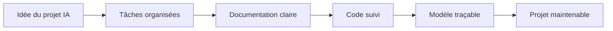
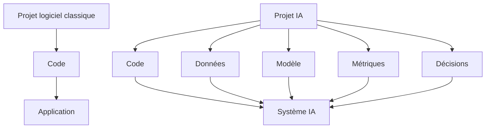
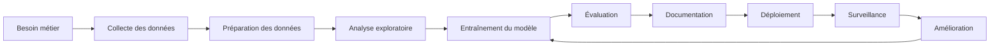
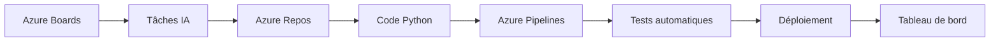
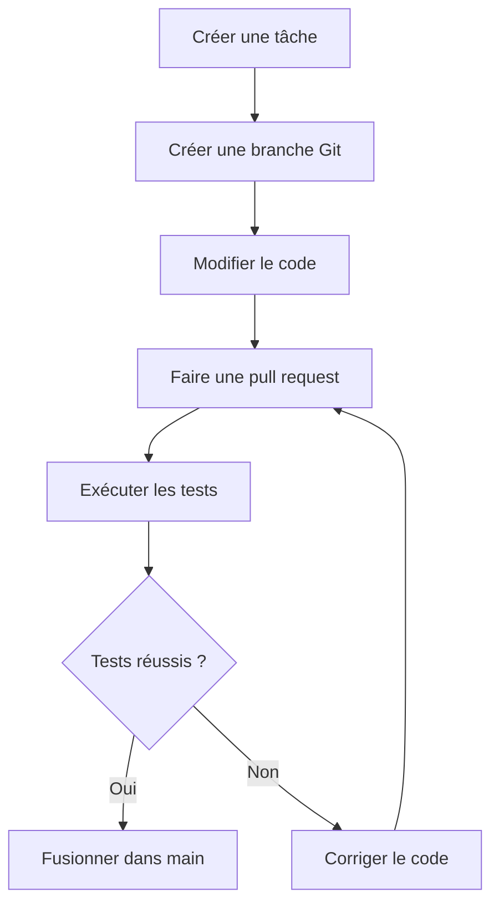

<a id="top"></a>

# Outils de gestion des différents aspects d’un projet en IA — Documentation et traçabilité

> Objectif général : comprendre comment organiser, suivre, documenter et tracer un projet en intelligence artificielle à l’aide d’outils comme Trello, Jira, Notion et Azure DevOps.

---

## Table des matières

| #  | Section                                                                                                      |
| -- | ------------------------------------------------------------------------------------------------------------ |
| 1  | [Introduction générale](#section-1)                                                                          |
| 2  | [Pourquoi un projet en IA demande plus de suivi qu’un projet classique](#section-2)                          |
| 3  | [Documentation et traçabilité : deux notions essentielles](#section-3)                                       |
| 4  | [Cycle de vie d’un projet en IA](#section-4)                                                                 |
| 5  | [Trello : organisation visuelle des tâches](#section-5)                                                     |
| 6  | [Jira : gestion structurée des tâches, des sprints et des anomalies](#section-6)                             |
| 7  | [Notion : documentation, centralisation et suivi collaboratif](#section-7)                                   |
| 8  | [Azure DevOps : gestion du code, des tâches, des dépôts et des pipelines](#section-8)                        |
| 9  | [Comparaison simple entre Trello, Jira, Notion et Azure DevOps](#section-9)                                  |
| 10 | [Exemple complet : projet IA de prédiction du désabonnement client](#section-10)                             |
| 11 | [Bonnes pratiques de documentation dans un projet IA](#section-11)                                          |
| 12 | [Scénarios sans outils et avec outils](#section-12)                                                          |
| 13 | [Activité formative guidée](#section-13)                                                                     |
| 14 | [Annexe — Résumé court](#section-14)                                                                         |
| 15 | [Conclusion](#section-15)                                                                                    |

---

<a id="section-1"></a>

<details>
<summary>1 - Introduction générale</summary>

<br/>

Un projet en intelligence artificielle ne consiste pas seulement à écrire du code ou à entraîner un modèle.

Un projet en IA comprend généralement plusieurs dimensions :

* la compréhension du besoin métier ;
* la collecte des données ;
* la préparation des données ;
* l’expérimentation avec plusieurs modèles ;
* l’évaluation des performances ;
* le suivi des erreurs ;
* la documentation des décisions ;
* la gestion du code ;
* le déploiement ;
* la surveillance du modèle après son utilisation.

Cela signifie qu’un projet IA doit être **organisé**, **documenté** et **traçable**.

En termes simples, il faut être capable de répondre à ces questions :

* Qui travaille sur quelle tâche ?
* Quelle tâche est terminée ?
* Quelle tâche est bloquée ?
* Quelle version du code a été utilisée ?
* Quel jeu de données a servi à entraîner le modèle ?
* Quel modèle a obtenu les meilleurs résultats ?
* Pourquoi une décision technique a-t-elle été prise ?
* Où se trouve la documentation du projet ?
* Quelle anomalie a été détectée ?
* Est-ce que le projet peut être repris par une autre personne ?

Sans outils de gestion, les réponses à ces questions deviennent rapidement floues.

Avec des outils adaptés, le projet devient plus clair, plus professionnel et plus facile à maintenir.



L’objectif de ce cours est donc de comprendre le rôle de quatre outils très utilisés :

| Outil | Rôle principal |
| ----- | -------------- |
| Trello | organiser visuellement les tâches |
| Jira | gérer des tâches structurées, des sprints et des anomalies |
| Notion | centraliser la documentation et les informations du projet |
| Azure DevOps | gérer le code, les tâches, les dépôts et les pipelines |

</details>

<p align="right"><a href="#top">↑ Retour en haut</a></p>

---

<a id="section-2"></a>

<details>
<summary>2 - Pourquoi un projet en IA demande plus de suivi qu’un projet classique</summary>

<br/>

Dans un projet logiciel classique, l’équipe suit surtout le code, les fonctionnalités et les anomalies.

Dans un projet en IA, il faut suivre davantage d’éléments.

Un système d’intelligence artificielle dépend de plusieurs composants en même temps :

* le code source ;
* les jeux de données ;
* les versions des données ;
* les scripts de nettoyage ;
* les paramètres d’entraînement ;
* les modèles entraînés ;
* les métriques de performance ;
* les décisions prises pendant les expérimentations ;
* les erreurs observées ;
* les limites du modèle.

C’est cette combinaison qui rend les projets IA plus difficiles à suivre.

Par exemple, deux étudiants peuvent entraîner le même modèle avec le même code, mais obtenir des résultats différents si :

* le fichier de données n’est pas exactement le même ;
* les données ont été nettoyées différemment ;
* les paramètres du modèle ont changé ;
* une colonne a été supprimée ;
* la méthode de division entraînement/test n’est pas identique ;
* la version d’une bibliothèque Python est différente.

C’est pourquoi un projet IA doit être documenté avec rigueur.



**À retenir**

Dans un projet IA, le code ne suffit pas. Il faut aussi suivre les données, les expériences, les modèles et les décisions.

</details>

<p align="right"><a href="#top">↑ Retour en haut</a></p>

---

<a id="section-3"></a>

<details>
<summary>3 - Documentation et traçabilité : deux notions essentielles</summary>

<br/>

La documentation et la traçabilité sont deux notions proches, mais elles ne désignent pas exactement la même chose.

---

### Documentation

La documentation sert à expliquer le projet.

Elle répond à des questions comme :

* Quel est l’objectif du projet ?
* Quel problème veut-on résoudre ?
* Quelles données sont utilisées ?
* Comment installer le projet ?
* Comment exécuter le code ?
* Comment entraîner le modèle ?
* Comment interpréter les résultats ?
* Quelles sont les limites connues ?

Exemple de documentation attendue dans un projet IA :

| Document | Rôle |
| -------- | ---- |
| README.md | expliquer rapidement le projet |
| cahier des charges | décrire le besoin et les exigences |
| dictionnaire des données | expliquer les colonnes du jeu de données |
| rapport d’expérimentation | comparer les modèles testés |
| journal des décisions | garder les choix importants |
| guide d’installation | permettre à une autre personne d’exécuter le projet |

---

### Traçabilité

La traçabilité sert à retrouver l’historique du projet.

Elle répond à des questions comme :

* Qui a modifié cette tâche ?
* Quand cette anomalie a-t-elle été détectée ?
* Quelle version du modèle a été déployée ?
* Quelle version du code a produit ce résultat ?
* Pourquoi cette fonctionnalité a-t-elle été ajoutée ?
* Quelle décision a été prise pendant la réunion ?

La traçabilité permet donc de comprendre **ce qui s’est passé**, **quand**, **par qui** et **pourquoi**.

---

### Différence simple

| Notion | Question principale | Exemple |
| ------ | ------------------- | ------- |
| Documentation | Comment fonctionne le projet ? | README, guide, rapport |
| Traçabilité | Que s’est-il passé dans le projet ? | historique des tâches, commits, tickets, décisions |

---

### Exemple très simple

Sans documentation :

> Le modèle fonctionne, mais personne ne sait exactement comment l’exécuter.

Sans traçabilité :

> Le modèle a changé, mais personne ne sait quelle modification a causé la différence.

Avec documentation et traçabilité :

> L’équipe peut expliquer le projet, reproduire les résultats et comprendre l’historique des décisions.

</details>

<p align="right"><a href="#top">↑ Retour en haut</a></p>

---

<a id="section-4"></a>

<details>
<summary>4 - Cycle de vie d’un projet en IA</summary>

<br/>

Un projet en IA suit généralement plusieurs étapes.

Ces étapes doivent être suivies dans un outil de gestion afin d’éviter la confusion.



Chaque étape peut être transformée en tâches concrètes.

| Étape | Exemples de tâches à suivre |
| ----- | --------------------------- |
| Besoin métier | définir l’objectif, identifier les utilisateurs, préciser les contraintes |
| Collecte des données | obtenir les fichiers, vérifier les sources, valider les permissions |
| Préparation des données | nettoyer les valeurs manquantes, supprimer les doublons, transformer les colonnes |
| Analyse exploratoire | produire des graphiques, comprendre les distributions, détecter les anomalies |
| Entraînement | tester plusieurs modèles, ajuster les paramètres, sauvegarder les résultats |
| Évaluation | calculer les métriques, comparer les modèles, choisir un modèle candidat |
| Documentation | rédiger le README, expliquer les données, noter les limites |
| Déploiement | créer une API, préparer un conteneur, configurer un environnement |
| Surveillance | suivre les erreurs, mesurer les prédictions, détecter la dérive |
| Amélioration | corriger les problèmes, réentraîner, améliorer les données |

Dans un projet professionnel, ces tâches doivent être visibles et attribuées.

Cela signifie que chaque tâche doit idéalement avoir :

* un titre clair ;
* une description ;
* un responsable ;
* un statut ;
* une priorité ;
* une date limite ;
* des commentaires ;
* des pièces jointes si nécessaire ;
* un lien vers le code, la documentation ou le résultat produit.

</details>

<p align="right"><a href="#top">↑ Retour en haut</a></p>

---

<a id="section-5"></a>

<details>
<summary>5 - Trello : organisation visuelle des tâches</summary>

<br/>

Trello est un outil simple et visuel pour organiser les tâches.

Il fonctionne avec une logique de tableau.

Dans un tableau Trello, on retrouve généralement :

* des colonnes ;
* des cartes ;
* des étiquettes ;
* des responsables ;
* des dates ;
* des commentaires ;
* des listes de vérification.

---

### Idée simple

Trello ressemble à un tableau avec des colonnes.

Chaque carte représente une tâche.

Exemple de colonnes :

| Colonne | Signification |
| ------- | ------------- |
| À faire | tâches prévues mais non commencées |
| En cours | tâches actuellement travaillées |
| À vérifier | tâches terminées mais à valider |
| Terminé | tâches complétées et validées |

---

### Exemple pour un projet IA

Projet : prédire le désabonnement des clients.

| Colonne | Exemples de cartes |
| ------- | ------------------ |
| À faire | récupérer le jeu de données, définir les métriques, créer le README |
| En cours | nettoyer les données, faire l’analyse exploratoire |
| À vérifier | valider les métriques, relire le rapport |
| Terminé | dépôt Git créé, structure du projet finalisée |

---

### Exemple de carte Trello bien rédigée

Titre de la carte :

```text
Nettoyer les valeurs manquantes du fichier clients.csv
```

Description :

```text
Objectif : identifier les colonnes contenant des valeurs manquantes et appliquer une stratégie de nettoyage.

Travail attendu :
- charger le fichier clients.csv ;
- afficher le nombre de valeurs manquantes par colonne ;
- décider quelles colonnes seront supprimées ou imputées ;
- documenter la stratégie dans le fichier documentation/donnees.md.

Résultat attendu :
- script Python propre ;
- capture ou tableau des valeurs manquantes ;
- explication courte de la stratégie choisie.
```

Liste de vérification possible :

```text
[ ] Charger le fichier CSV
[ ] Afficher les valeurs manquantes
[ ] Proposer une stratégie de nettoyage
[ ] Appliquer la stratégie
[ ] Documenter le choix
[ ] Faire valider par l’équipe
```

---

### Quand utiliser Trello ?

Trello est utile lorsque :

* l’équipe débute ;
* le projet est simple ;
* on veut visualiser rapidement l’avancement ;
* on ne veut pas créer une structure trop lourde ;
* on veut comprendre qui fait quoi.

Trello est particulièrement adapté pour les projets pédagogiques, les petits projets IA, les prototypes et les travaux d’équipe.

---

### Limites de Trello

Trello peut devenir insuffisant lorsque :

* le projet devient très grand ;
* il y a beaucoup d’anomalies à suivre ;
* l’équipe travaille avec des sprints structurés ;
* il faut produire des rapports complexes ;
* il faut relier fortement les tâches au code et aux versions.

Dans ce cas, Jira ou Azure DevOps peuvent être plus adaptés.

</details>

<p align="right"><a href="#top">↑ Retour en haut</a></p>

---

<a id="section-6"></a>

<details>
<summary>6 - Jira : gestion structurée des tâches, des sprints et des anomalies</summary>

<br/>

Jira est un outil plus structuré que Trello.

Il est très utilisé dans les équipes qui travaillent avec des méthodes agiles comme Scrum ou Kanban.

Jira permet de gérer :

* des tâches ;
* des user stories ;
* des anomalies ;
* des sprints ;
* des priorités ;
* des responsables ;
* des workflows ;
* des tableaux de suivi ;
* des rapports d’avancement.

---

### Vocabulaire de base dans Jira

| Terme | Explication simple |
| ----- | ------------------ |
| Projet | espace de travail pour une équipe ou un produit |
| Work item | élément de travail à suivre |
| Tâche | travail précis à réaliser |
| Bug | problème ou anomalie à corriger |
| Story | besoin exprimé du point de vue utilisateur |
| Epic | grand bloc de travail regroupant plusieurs stories |
| Sprint | période courte pendant laquelle l’équipe réalise un ensemble de tâches |
| Backlog | liste des tâches prévues mais pas encore réalisées |
| Workflow | chemin suivi par une tâche, par exemple À faire → En cours → Terminé |

---

### Exemple de user story pour un projet IA

```text
En tant que responsable marketing,
je veux identifier les clients qui risquent de quitter l’entreprise,
afin de lancer des actions de fidélisation ciblées.
```

Cette user story peut ensuite être découpée en tâches.

| Tâche | Responsable possible |
| ----- | -------------------- |
| Préparer le jeu de données client | data analyst |
| Créer les variables utiles | data scientist |
| Entraîner un modèle de classification | data scientist |
| Évaluer le modèle avec précision, rappel et F1-score | data scientist |
| Créer une API de prédiction | développeur backend |
| Documenter les limites du modèle | équipe IA |

---

### Exemple de bug dans un projet IA

Titre du bug :

```text
Le modèle retourne une erreur lorsque la colonne age est vide
```

Description :

```text
Contexte : l’API de prédiction échoue lorsqu’un client n’a pas de valeur dans la colonne age.

Étapes pour reproduire :
1. envoyer une requête avec age vide ;
2. appeler l’endpoint /predict ;
3. observer l’erreur retournée par l’API.

Résultat observé : erreur serveur.

Résultat attendu : le système doit appliquer une valeur par défaut ou retourner un message clair.

Priorité : élevée.
```

---

### Exemple de sprint IA

Un sprint est une période de travail courte, par exemple deux semaines.

Sprint 1 : préparation des données.

| Tâche | Statut |
| ----- | ------ |
| Importer les données brutes | Terminé |
| Nettoyer les valeurs manquantes | En cours |
| Supprimer les doublons | À faire |
| Documenter le dictionnaire des données | À faire |
| Produire une première analyse exploratoire | À faire |

Sprint 2 : expérimentation.

| Tâche | Statut |
| ----- | ------ |
| Tester une régression logistique | À faire |
| Tester un arbre de décision | À faire |
| Comparer les métriques | À faire |
| Sélectionner un modèle candidat | À faire |
| Rédiger le rapport d’évaluation | À faire |

---

### Quand utiliser Jira ?

Jira est utile lorsque :

* le projet est structuré ;
* l’équipe travaille avec des sprints ;
* il faut gérer des anomalies ;
* il faut suivre les priorités ;
* il faut produire des rapports d’avancement ;
* plusieurs rôles participent au projet.

Jira convient bien aux projets IA plus sérieux, aux équipes professionnelles et aux projets qui doivent être suivis avec rigueur.

</details>

<p align="right"><a href="#top">↑ Retour en haut</a></p>

---

<a id="section-7"></a>

<details>
<summary>7 - Notion : documentation, centralisation et suivi collaboratif</summary>

<br/>

Notion est un outil de documentation et d’organisation collaborative.

Il permet de créer des pages, des bases de données, des tableaux, des listes, des calendriers et des espaces de documentation.

Dans un projet IA, Notion peut servir à centraliser :

* le cahier des charges ;
* les notes de réunion ;
* le dictionnaire des données ;
* les décisions techniques ;
* les résultats d’expérimentation ;
* les liens vers les dépôts Git ;
* les liens vers les tableaux Trello ou Jira ;
* les guides d’installation ;
* les comptes rendus de validation.

---

### Idée simple

Notion peut être vu comme le classeur principal du projet.

Trello ou Jira servent surtout à suivre les tâches.

Notion sert surtout à expliquer et conserver l’information.

---

### Structure Notion recommandée pour un projet IA

```text
Projet IA — Prédiction du désabonnement client
│
├── 01 - Présentation du projet
├── 02 - Objectifs métier
├── 03 - Données utilisées
├── 04 - Dictionnaire des données
├── 05 - Analyse exploratoire
├── 06 - Expérimentations modèles
├── 07 - Résultats et métriques
├── 08 - Décisions techniques
├── 09 - Guide d’installation
├── 10 - Limites du modèle
└── 11 - Suivi des réunions
```

---

### Exemple de page : dictionnaire des données

| Colonne | Type | Description | Exemple | Remarque |
| ------- | ---- | ----------- | ------- | -------- |
| customer_id | texte | identifiant unique du client | C001 | ne doit pas être utilisé comme variable prédictive |
| age | nombre | âge du client | 42 | valeurs manquantes possibles |
| monthly_charge | nombre | montant mensuel payé | 79.90 | variable importante |
| contract_type | catégorie | type de contrat | mensuel | à encoder avant l’entraînement |
| churn | binaire | client parti ou non | 0 ou 1 | variable cible |

---

### Exemple de page : journal des décisions

| Date | Décision | Justification | Impact |
| ---- | -------- | ------------- | ------ |
| 2026-06-01 | supprimer customer_id | identifiant sans valeur prédictive | réduit le bruit |
| 2026-06-02 | utiliser F1-score | classes déséquilibrées | meilleure évaluation |
| 2026-06-03 | tester Random Forest | modèle robuste pour données tabulaires | comparaison avec modèle simple |

---

### Exemple de page : expérimentation modèle

```text
Nom de l’expérience : Random Forest V1

Données utilisées : dataset_clients_v1.csv

Prétraitement :
- suppression des doublons ;
- imputation de l’âge par la médiane ;
- encodage one-hot des variables catégorielles.

Modèle : Random Forest

Paramètres :
- n_estimators = 100
- max_depth = 10
- random_state = 42

Résultats :
- accuracy = 0.87
- precision = 0.81
- recall = 0.74
- F1-score = 0.77

Conclusion :
le modèle est prometteur, mais le rappel doit être amélioré.
```

---

### Quand utiliser Notion ?

Notion est utile lorsque :

* il faut centraliser la documentation ;
* l’équipe veut un espace lisible ;
* plusieurs documents doivent être reliés ;
* il faut garder les décisions importantes ;
* il faut préparer une présentation claire du projet.

Notion ne remplace pas toujours Git, Jira ou Azure DevOps.

Il complète ces outils en rendant l’information plus accessible.

</details>

<p align="right"><a href="#top">↑ Retour en haut</a></p>

---

<a id="section-8"></a>

<details>
<summary>8 - Azure DevOps : gestion du code, des tâches, des dépôts et des pipelines</summary>

<br/>

Azure DevOps est une plateforme plus complète.

Elle permet de gérer plusieurs aspects d’un projet logiciel ou IA :

* les tâches ;
* les tableaux de suivi ;
* les dépôts Git ;
* les branches ;
* les pull requests ;
* les tests ;
* les pipelines CI/CD ;
* les artefacts ;
* les tableaux de bord.

Dans un projet IA, Azure DevOps peut servir à relier le suivi du travail avec le code et l’automatisation.

---

### Principaux composants

| Composant | Rôle simple |
| --------- | ----------- |
| Azure Boards | suivre les tâches, bugs, user stories et sprints |
| Azure Repos | stocker le code source avec Git |
| Azure Pipelines | automatiser les tests, les builds et les déploiements |
| Azure Test Plans | organiser des plans de tests |
| Azure Artifacts | stocker des packages ou dépendances |
| Dashboards | afficher l’état du projet avec des indicateurs |

---

### Exemple dans un projet IA



---

### Exemple de tâche dans Azure Boards

Titre :

```text
Créer un pipeline de test pour le modèle de prédiction
```

Description :

```text
Objectif : automatiser les tests de base du projet IA à chaque modification du code.

Travail attendu :
- installer les dépendances Python ;
- exécuter les tests unitaires ;
- vérifier que le script d’entraînement démarre correctement ;
- générer un rapport de test ;
- bloquer la fusion si les tests échouent.

Résultat attendu :
- fichier de pipeline fonctionnel ;
- exécution automatique à chaque commit ou pull request ;
- preuve que les tests passent.
```

---

### Exemple de structure de dépôt Git pour un projet IA

```text
projet-ia-churn/
│
├── data/
│   ├── raw/
│   └── processed/
│
├── notebooks/
│   └── exploration.ipynb
│
├── src/
│   ├── preprocessing.py
│   ├── train.py
│   ├── evaluate.py
│   └── predict.py
│
├── tests/
│   ├── test_preprocessing.py
│   └── test_predict.py
│
├── docs/
│   ├── donnees.md
│   ├── experimentation.md
│   └── limites.md
│
├── requirements.txt
├── README.md
└── azure-pipelines.yml
```

---

### Exemple simplifié de pipeline

```yaml
trigger:
  - main

pool:
  vmImage: ubuntu-latest

steps:
  - task: UsePythonVersion@0
    inputs:
      versionSpec: '3.12'

  - script: |
      python -m pip install --upgrade pip
      pip install -r requirements.txt
    displayName: Installer les dépendances

  - script: |
      pytest tests
    displayName: Exécuter les tests
```

Ce pipeline signifie :

* lorsqu’une modification est envoyée sur la branche principale ;
* Azure DevOps prépare un environnement ;
* Python est installé ;
* les dépendances sont installées ;
* les tests sont exécutés automatiquement.

---

### Quand utiliser Azure DevOps ?

Azure DevOps est utile lorsque :

* le projet doit être très structuré ;
* le code doit être versionné ;
* les tâches doivent être reliées au code ;
* les tests doivent être automatisés ;
* il faut mettre en place une logique CI/CD ;
* l’équipe travaille dans un environnement Microsoft ou Azure.

Azure DevOps est plus complet, mais aussi plus exigeant pour des débutants.

</details>

<p align="right"><a href="#top">↑ Retour en haut</a></p>

---

<a id="section-9"></a>

<details>
<summary>9 - Comparaison simple entre Trello, Jira, Notion et Azure DevOps</summary>

<br/>

Chaque outil a un rôle différent.

Il ne faut pas penser qu’un seul outil est toujours meilleur que les autres.

Le choix dépend du contexte, du niveau de l’équipe et de la complexité du projet.

| Outil | Utilisation principale | Niveau de complexité | Très utile pour |
| ----- | ---------------------- | -------------------- | --------------- |
| Trello | suivi visuel des tâches | simple | débutants, petits projets, prototypes |
| Jira | gestion agile structurée | moyen à avancé | sprints, anomalies, priorités, équipes agiles |
| Notion | documentation centralisée | simple à moyen | pages, bases de connaissances, décisions, notes |
| Azure DevOps | gestion complète code + tâches + pipelines | moyen à avancé | dépôts Git, CI/CD, tests, projets professionnels |

---

### Comparaison par besoin

| Besoin | Outil recommandé |
| ------ | ---------------- |
| Voir rapidement les tâches à faire | Trello |
| Gérer un sprint | Jira ou Azure Boards |
| Suivre des bugs | Jira ou Azure Boards |
| Documenter les données | Notion ou dossier docs dans Git |
| Garder les décisions techniques | Notion |
| Gérer le code source | Azure Repos ou GitHub |
| Automatiser les tests | Azure Pipelines ou GitHub Actions |
| Suivre un projet IA complet en entreprise | Jira + Notion + Git ou Azure DevOps |

---

### Combinaisons possibles

| Type de projet | Combinaison simple |
| -------------- | ------------------ |
| Petit projet étudiant | Trello + README Git |
| Projet étudiant avancé | Trello + Notion + Git |
| Projet agile structuré | Jira + Notion + Git |
| Projet entreprise Microsoft | Azure DevOps + Wiki/Notion |
| Projet IA/MLOps | Jira ou Azure Boards + Git + pipelines + documentation |

---

### Interprétation courte

Trello sert surtout à voir l’avancement.

Jira sert surtout à structurer le travail agile.

Notion sert surtout à centraliser les connaissances.

Azure DevOps sert surtout à relier les tâches, le code et l’automatisation.

</details>

<p align="right"><a href="#top">↑ Retour en haut</a></p>

---

<a id="section-10"></a>

<details>
<summary>10 - Exemple complet : projet IA de prédiction du désabonnement client</summary>

<br/>

Imaginons un projet IA simple.

Objectif : prédire si un client risque de quitter une entreprise.

Ce type de projet peut être utilisé pour expliquer comment organiser les tâches, la documentation et la traçabilité.

---

### Contexte du projet

Une entreprise veut identifier les clients qui risquent de se désabonner.

Elle possède un fichier contenant des informations sur ses clients :

* âge ;
* durée d’abonnement ;
* montant mensuel payé ;
* type de contrat ;
* nombre d’appels au support ;
* statut de désabonnement.

L’équipe doit construire un modèle capable de prédire la probabilité de désabonnement.

---

### Organisation dans Trello

Tableau : Projet IA — Churn client

| Colonne | Cartes possibles |
| ------- | ---------------- |
| À faire | créer le dépôt Git, analyser le besoin, charger les données |
| En cours | nettoyer les données, faire l’analyse exploratoire |
| À vérifier | valider les métriques, relire la documentation |
| Terminé | structure du projet créée, README initial rédigé |

---

### Organisation dans Jira

Epic : construire un modèle de prédiction du désabonnement.

User stories :

| User story | Tâches associées |
| ---------- | ---------------- |
| Comprendre les données clients | dictionnaire des données, analyse des colonnes, détection valeurs manquantes |
| Préparer les données | nettoyage, encodage, séparation train/test |
| Entraîner un modèle | modèle de base, modèle avancé, comparaison métriques |
| Déployer une prédiction simple | API, tests, documentation endpoint |

---

### Documentation dans Notion

Pages recommandées :

```text
Projet IA — Churn client
│
├── Présentation générale
├── Besoin métier
├── Données disponibles
├── Dictionnaire des données
├── Analyse exploratoire
├── Choix des modèles
├── Résultats obtenus
├── Journal des décisions
├── Limites du modèle
└── Guide d’installation
```

---

### Code et automatisation dans Azure DevOps

Azure DevOps peut gérer :

* le dépôt Git du projet ;
* les tâches dans Azure Boards ;
* les tests automatiques avec Azure Pipelines ;
* les pull requests ;
* les tableaux de bord d’avancement.

Workflow possible :



---

### Exemple de traçabilité complète

| Élément | Exemple de trace |
| ------- | ---------------- |
| Tâche | TASK-12 : nettoyer les valeurs manquantes |
| Code | commit Git : correction preprocessing.py |
| Documentation | page Notion : stratégie de nettoyage |
| Résultat | F1-score avant = 0.71, après = 0.76 |
| Décision | utiliser la médiane pour imputer l’âge |

Grâce à cette traçabilité, l’équipe peut expliquer ce qui a été fait et pourquoi.

</details>

<p align="right"><a href="#top">↑ Retour en haut</a></p>

---

<a id="section-11"></a>

<details>
<summary>11 - Bonnes pratiques de documentation dans un projet IA</summary>

<br/>

Un projet IA bien documenté doit permettre à une autre personne de comprendre, installer, exécuter et évaluer le projet.

---

### 1. Rédiger un README clair

Le fichier README.md est souvent le premier fichier consulté.

Il doit contenir :

* le nom du projet ;
* l’objectif ;
* le contexte ;
* la structure du dépôt ;
* les prérequis ;
* les étapes d’installation ;
* les commandes d’exécution ;
* les résultats principaux ;
* les limites connues.

Exemple minimal :

```markdown
# Projet IA — Prédiction du désabonnement client

## Objectif

Ce projet vise à prédire si un client risque de quitter l’entreprise à partir de données historiques.

## Installation

```bash
python -m venv .venv
source .venv/bin/activate
pip install -r requirements.txt
```

## Exécution

```bash
python src/train.py
python src/evaluate.py
```

## Résultats

Le meilleur modèle obtenu est une Random Forest avec un F1-score de 0.77.
```

---

### 2. Documenter les données

Il ne suffit pas de dire : « nous avons utilisé un fichier CSV ».

Il faut expliquer :

* d’où viennent les données ;
* combien de lignes elles contiennent ;
* quelles colonnes sont disponibles ;
* quelles colonnes ont été supprimées ;
* quelles transformations ont été appliquées ;
* quelles limites existent.

---

### 3. Documenter les expériences

Chaque expérience importante doit être enregistrée.

| Élément | Exemple |
| ------- | ------- |
| Nom de l’expérience | Random Forest V2 |
| Données utilisées | dataset_v2_processed.csv |
| Modèle | Random Forest |
| Paramètres | n_estimators=200, max_depth=12 |
| Métriques | accuracy, precision, recall, F1-score |
| Résultat | F1-score = 0.79 |
| Décision | modèle conservé pour comparaison finale |

---

### 4. Documenter les décisions

Un bon projet ne montre pas seulement ce qui a été fait.

Il explique aussi pourquoi cela a été fait.

Exemple :

```text
Décision : utiliser F1-score comme métrique principale.

Raison : les classes sont déséquilibrées. L’accuracy seule donne une vision trop optimiste.

Impact : les modèles seront comparés principalement selon leur capacité à équilibrer précision et rappel.
```

---

### 5. Documenter les limites

Un modèle IA a toujours des limites.

Exemples :

* le modèle dépend de la qualité des données ;
* certaines variables importantes peuvent manquer ;
* les résultats peuvent changer si le comportement des clients évolue ;
* le modèle peut être moins fiable sur certains groupes de clients ;
* les prédictions ne doivent pas être interprétées comme des certitudes.

Documenter les limites augmente la crédibilité du projet.

</details>

<p align="right"><a href="#top">↑ Retour en haut</a></p>

---

<a id="section-12"></a>

<details>
<summary>12 - Scénarios sans outils et avec outils</summary>

<br/>

La manière la plus simple de comprendre l’importance des outils de gestion est de comparer deux situations.

---

### Scénario 1 — Sans outil de gestion

Une équipe commence un projet IA.

Les tâches sont discutées oralement.

Les fichiers sont envoyés par courriel.

Les décisions sont prises en réunion, mais ne sont pas notées.

Le code est modifié directement sans branche claire.

Après deux semaines, l’équipe se pose plusieurs questions :

* Qui devait nettoyer les données ?
* Quelle version du fichier CSV faut-il utiliser ?
* Pourquoi la colonne contract_type a-t-elle été supprimée ?
* Quel modèle a donné le meilleur résultat ?
* Où se trouve le rapport final ?
* Est-ce que les tests ont été exécutés ?

Personne ne peut répondre avec certitude.

**Résultat :**

le projet devient difficile à comprendre, même si certains morceaux fonctionnent.

---

### Scénario 2 — Avec Trello

L’équipe crée un tableau Trello.

Chaque tâche est représentée par une carte.

Les cartes passent de À faire à En cours, puis à Terminé.

L’équipe voit rapidement l’avancement.

**Résultat :**

le suivi devient plus clair, surtout pour un petit projet.

---

### Scénario 3 — Avec Jira

L’équipe crée un backlog, des user stories et des bugs.

Les tâches sont planifiées dans des sprints.

Chaque anomalie est décrite avec des étapes de reproduction.

**Résultat :**

le projet devient plus structuré et plus professionnel.

---

### Scénario 4 — Avec Notion

L’équipe centralise toute la documentation.

Les décisions sont écrites.

Les données sont décrites.

Les résultats des modèles sont comparés dans des tableaux.

**Résultat :**

une autre personne peut comprendre le projet sans devoir poser toutes les questions à l’équipe.

---

### Scénario 5 — Avec Azure DevOps

L’équipe relie les tâches au code.

Les modifications passent par des branches et des pull requests.

Les tests sont lancés automatiquement.

Le pipeline bloque les modifications problématiques.

**Résultat :**

le projet est plus fiable, plus traçable et plus proche d’un fonctionnement professionnel.

---

### Interprétation courte

Sans outils, le projet dépend de la mémoire des personnes.

Avec outils, le projet dépend d’un processus visible, documenté et vérifiable.

</details>

<p align="right"><a href="#top">↑ Retour en haut</a></p>

---

<a id="section-13"></a>

<details>
<summary>13 - Activité formative guidée</summary>

<br/>

Cette activité permet de mettre en pratique les notions du cours.

---

### Contexte

Vous devez organiser un mini-projet IA.

Sujet : prédire si un étudiant risque d’abandonner un cours en ligne.

Le jeu de données contient :

* nombre de connexions ;
* temps passé sur la plateforme ;
* nombre de devoirs remis ;
* moyenne des quiz ;
* participation au forum ;
* statut final : abandon ou non.

---

### Travail demandé — Partie 1 : Trello

Créer un tableau de tâches avec au minimum quatre colonnes :

```text
À faire
En cours
À vérifier
Terminé
```

Créer au minimum huit cartes :

1. définir l’objectif du projet ;
2. créer le dépôt Git ;
3. analyser les colonnes du jeu de données ;
4. nettoyer les valeurs manquantes ;
5. produire une analyse exploratoire ;
6. entraîner un modèle simple ;
7. évaluer le modèle ;
8. rédiger la documentation finale.

Pour chaque carte, préciser :

* une description ;
* un responsable ;
* une priorité ;
* une liste de vérification.

---

### Travail demandé — Partie 2 : Jira

Créer une structure agile simple.

Epic :

```text
Construire un modèle IA de prédiction d’abandon
```

Créer au moins trois user stories :

```text
En tant qu’enseignant,
je veux identifier les étudiants à risque,
afin d’intervenir plus tôt.
```

```text
En tant qu’équipe pédagogique,
je veux visualiser les facteurs importants,
afin de comprendre les causes possibles d’abandon.
```

```text
En tant qu’administrateur,
je veux disposer d’un rapport clair,
afin de prendre des décisions basées sur les données.
```

Créer au moins deux bugs possibles :

```text
Bug 1 : le modèle échoue lorsque la moyenne des quiz est vide.
Bug 2 : le script d’entraînement ne fonctionne pas si le fichier CSV est déplacé.
```

---

### Travail demandé — Partie 3 : Notion

Créer une structure de documentation.

Pages minimales :

```text
01 - Présentation du projet
02 - Données utilisées
03 - Dictionnaire des données
04 - Analyse exploratoire
05 - Expérimentations
06 - Résultats
07 - Décisions techniques
08 - Limites du modèle
09 - Guide d’installation
```

Dans la page « Décisions techniques », ajouter au moins trois décisions.

Exemple :

| Date | Décision | Justification |
| ---- | -------- | ------------- |
| 2026-06-10 | utiliser F1-score | les classes sont déséquilibrées |
| 2026-06-11 | imputer les valeurs manquantes | éviter de supprimer trop de lignes |
| 2026-06-12 | tester un modèle simple d’abord | établir une référence de base |

---

### Travail demandé — Partie 4 : Azure DevOps

Proposer une organisation du dépôt.

Structure minimale :

```text
projet-abandon-cours/
│
├── data/
├── notebooks/
├── src/
├── tests/
├── docs/
├── README.md
└── requirements.txt
```

Proposer aussi un pipeline simple qui :

* installe Python ;
* installe les dépendances ;
* exécute les tests ;
* affiche un message si tout est correct.

---

### Questions de réflexion

1. Pourquoi Trello est-il plus simple à utiliser pour des débutants ?
2. Pourquoi Jira est-il plus adapté à un projet structuré avec des sprints ?
3. Pourquoi Notion est-il utile pour la documentation ?
4. Pourquoi Azure DevOps est-il utile pour relier les tâches au code ?
5. Quelle est la différence entre documentation et traçabilité ?
6. Pourquoi un projet IA doit-il documenter les données utilisées ?
7. Pourquoi faut-il garder une trace des décisions techniques ?
8. Quel outil choisiriez-vous pour un petit projet étudiant ? Pourquoi ?
9. Quel outil choisiriez-vous pour un projet professionnel ? Pourquoi ?
10. Que risque une équipe qui ne documente pas son projet IA ?

</details>

<p align="right"><a href="#top">↑ Retour en haut</a></p>

---

<a id="section-14"></a>

<details>
<summary>14 - Annexe — Résumé court</summary>

<br/>

```text
Un projet IA doit être organisé, documenté et traçable.

Documentation :
- explique le projet ;
- décrit les données ;
- montre comment installer et exécuter ;
- présente les résultats ;
- explique les limites.

Traçabilité :
- montre qui a fait quoi ;
- indique quand une tâche a changé ;
- relie les décisions au contexte ;
- relie les tâches au code ;
- permet de comprendre l’historique du projet.

Trello :
- outil simple et visuel ;
- cartes et colonnes ;
- utile pour petits projets et débutants.

Jira :
- outil agile plus structuré ;
- tâches, stories, bugs, sprints ;
- utile pour projets professionnels ou équipes organisées.

Notion :
- outil de documentation ;
- pages, bases de données, tableaux ;
- utile pour centraliser les connaissances et décisions.

Azure DevOps :
- plateforme complète ;
- tâches, dépôts Git, pipelines, tests ;
- utile pour relier gestion de projet, code et automatisation.

Idée principale :
Sans outils, le projet dépend de la mémoire des personnes.
Avec des outils, le projet devient visible, structuré et vérifiable.
```

</details>

<p align="right"><a href="#top">↑ Retour en haut</a></p>

---

<a id="section-15"></a>

<details>
<summary>15 - Conclusion</summary>

<br/>

La gestion d’un projet en intelligence artificielle ne se limite pas au développement du modèle.

Un projet IA sérieux doit être suivi comme un système complet.

Il faut organiser les tâches, documenter les décisions, suivre les anomalies, versionner le code et conserver une trace des résultats.

Trello, Jira, Notion et Azure DevOps répondent à des besoins différents.

Trello aide à visualiser simplement les tâches.

Jira aide à structurer le travail agile, les sprints et les anomalies.

Notion aide à centraliser la documentation et les décisions.

Azure DevOps aide à relier le code, les tâches, les tests et les pipelines.

Le plus important n’est pas de connaître tous les boutons de chaque outil.

Le plus important est de comprendre pourquoi ces outils existent.

Ils permettent à une équipe de travailler de manière plus claire, plus fiable et plus professionnelle.

Dans un projet IA, cette rigueur est essentielle, car il faut suivre non seulement le code, mais aussi les données, les modèles, les expériences et les décisions.

Un projet bien géré est un projet que l’on peut expliquer, reprendre, corriger, améliorer et défendre.

</details>

<p align="right"><a href="#top">↑ Retour en haut</a></p>
