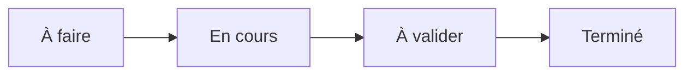

# Outils de gestion des différents aspects d’un projet en IA — Documentation et traçabilité

## Table des matières

| #  | Section                                                                          |
| -- | -------------------------------------------------------------------------------- |
| 1  | [Introduction générale](#section-1)                                              |
| 2  | [Pourquoi un projet IA doit être organisé](#section-2)                           |
| 3  | [Documentation et traçabilité](#section-3)                                       |
| 4  | [Cycle de vie d’un projet IA](#section-4)                                        |
| 5  | [Trello — Organisation visuelle des tâches](#section-5)                          |
| 6  | [Jira — Gestion structurée des tâches, sprints et anomalies](#section-6)         |
| 7  | [Notion — Documentation et centralisation de l’information](#section-7)          |
| 8  | [Azure DevOps — Code, tâches, dépôts et pipelines](#section-8)                   |
| 9  | [Tableau comparatif des outils](#section-9)                                      |
| 10 | [Exemple complet — Projet IA de prédiction du désabonnement client](#section-10) |
| 11 | [Modèles de documents à produire](#section-11)                                   |
| 12 | [Bonnes pratiques de traçabilité](#section-12)                                   |
| 13 | [Scénarios sans outils et avec outils](#section-13)                              |
| 14 | [Activité formative](#section-14)                                                |
| 15 | [Quiz de consolidation](#section-15)                                             |
| 16 | [Résumé final](#section-16)                                                      |
| 17 | [Conclusion](#section-17)                                                        |

---

1 - Introduction générale

 

Dans un projet d’intelligence artificielle, il ne suffit pas de créer un modèle qui donne de bons résultats une seule fois.

Un projet IA sérieux doit être :

* organisé ;
* documenté ;
* traçable ;
* reproductible ;
* compréhensible par une autre personne ;
* maintenable dans le temps.

Cela signifie qu’une équipe doit être capable de répondre clairement à plusieurs questions.

Par exemple :

* Quel est l’objectif du projet ?
* Qui travaille sur quelle tâche ?
* Quelle version du code a été utilisée ?
* Quel jeu de données a été utilisé ?
* Quels tests ont été réalisés ?
* Quels résultats ont été obtenus ?
* Quelles décisions ont été prises ?
* Pourquoi un modèle a été choisi plutôt qu’un autre ?
* Où se trouve la documentation ?
* Où se trouve le code source ?
* Où sont les anomalies ou problèmes connus ?

Pour gérer tout cela, les équipes utilisent des outils de gestion de projet et de documentation.

Dans ce cours, nous allons étudier quatre outils importants :

| Outil        | Rôle principal                                                 |
| ------------ | -------------------------------------------------------------- |
| Trello       | Organiser visuellement les tâches                              |
| Jira         | Gérer les tâches, les sprints, les anomalies et le suivi agile |
| Notion       | Centraliser la documentation et l’information                  |
| Azure DevOps | Gérer le code, les tâches, les dépôts et les pipelines         |

Ces outils ne remplacent pas les compétences techniques. Ils permettent plutôt de structurer le travail pour que le projet reste clair, maîtrisable et professionnel.

---

### Idée principale

Un projet IA mal organisé peut fonctionner au début, mais devenir rapidement difficile à comprendre, difficile à corriger et difficile à faire évoluer.

Un projet IA bien organisé garde une trace claire :

* du travail réalisé ;
* des décisions prises ;
* des versions utilisées ;
* des résultats obtenus ;
* des problèmes rencontrés.

C’est cette capacité à garder une trace qui rend le projet sérieux.

<a href="#top">↑ Retour en haut</a>

---

2 - Pourquoi un projet IA doit être organisé

 

Un projet d’intelligence artificielle est souvent plus complexe qu’un projet logiciel classique.

Dans un projet logiciel traditionnel, l’équipe travaille principalement sur le code.

Dans un projet IA, l’équipe doit gérer plusieurs éléments en même temps :

* le code ;
* les données ;
* les modèles ;
* les expériences ;
* les métriques ;
* les résultats ;
* les versions ;
* les décisions ;
* les limites ;
* les validations.

---

### Exemple simple

Imaginons une équipe qui développe un modèle pour prédire si un client risque de quitter une entreprise.

L’équipe doit gérer :

| Élément       | Exemple                                                         |
| ------------- | --------------------------------------------------------------- |
| Données       | fichier `clients.csv`                                           |
| Code          | scripts Python d’entraînement et d’évaluation                   |
| Modèle        | modèle entraîné `model_churn.pkl`                               |
| Métriques     | exactitude, précision, rappel, F1-score                         |
| Documentation | objectif, installation, limites                                 |
| Tâches        | nettoyage des données, entraînement, évaluation                 |
| Anomalies     | erreur dans les données, mauvais score, problème d’installation |
| Décisions     | choix de l’algorithme, choix des variables, choix du seuil      |

Sans outil de gestion, ces informations peuvent être dispersées dans :

* des courriels ;
* des messages Teams ;
* des fichiers locaux ;
* des captures d’écran ;
* des notebooks non organisés ;
* des conversations informelles ;
* des dossiers mal nommés.

Le projet devient alors difficile à suivre.

---

### Problème fréquent

Une personne peut dire :

> « Le modèle fonctionnait hier, mais je ne sais plus quelle version j’ai utilisée. »

Ou encore :

> « J’ai obtenu un score de 88 %, mais je ne sais plus avec quel fichier de données. »

Ou encore :

> « J’ai modifié le nettoyage des données, mais je n’ai pas documenté ce changement. »

Ces situations montrent un manque de traçabilité.

---

### Pourquoi c’est grave ?

Dans un projet IA, un petit changement peut modifier fortement les résultats.

Par exemple :

* changer une colonne dans le jeu de données ;
* supprimer des valeurs manquantes différemment ;
* modifier le seuil de classification ;
* changer la séparation entraînement/test ;
* utiliser une autre version du modèle ;
* modifier les hyperparamètres.

Si ces changements ne sont pas suivis, l’équipe ne peut plus expliquer précisément les résultats.

---

### À retenir

Un projet IA doit être organisé parce qu’il contient plusieurs éléments qui évoluent en même temps.

Le code seul ne suffit pas.

Il faut aussi gérer :

* les tâches ;
* les données ;
* les modèles ;
* les résultats ;
* la documentation ;
* les décisions ;
* les validations.

<a href="#top">↑ Retour en haut</a>

---

3 - Documentation et traçabilité

 

La documentation et la traçabilité sont deux notions proches, mais elles ne signifient pas exactement la même chose.

---

## 3.1 Documentation

La documentation sert à expliquer le projet.

Elle répond à des questions comme :

* Quel est le but du projet ?
* Comment installer le projet ?
* Comment exécuter le projet ?
* Où se trouvent les données ?
* Comment entraîner le modèle ?
* Comment évaluer le modèle ?
* Quels résultats ont été obtenus ?
* Quelles sont les limites du modèle ?

La documentation aide une personne à comprendre le projet.

---

### Exemple de documentation

Un fichier `README.md` peut expliquer :

* l’objectif du projet ;
* la structure des dossiers ;
* les commandes d’installation ;
* les commandes d’exécution ;
* les résultats principaux ;
* les limites connues.

Exemple :

<pre><code class="language-markdown"># Projet IA — Prédiction du désabonnement client

## Objectif

Ce projet vise à prédire si un client risque de quitter l’entreprise à partir de données historiques.

## Installation

Créer un environnement virtuel :

python -m venv .venv

Activer l’environnement virtuel :

.venv\Scripts\Activate.ps1

Installer les dépendances :

pip install -r requirements.txt

## Exécution

Lancer l’entraînement :

python src/train.py

Lancer l’évaluation :

python src/evaluate.py

## Résultats principaux

Le modèle obtient une exactitude de 86 %, une précision de 82 % et un rappel de 79 %.

## Limites

Le modèle dépend des données historiques et doit être réévalué régulièrement.</code></pre>

---

## 3.2 Traçabilité

La traçabilité sert à garder la preuve de ce qui a été fait.

Elle répond à des questions comme :

* Qui a fait cette modification ?
* Quand cette modification a-t-elle été faite ?
* Pourquoi cette décision a-t-elle été prise ?
* Quelle version du code a été utilisée ?
* Quelle version des données a été utilisée ?
* Quel modèle a été entraîné ?
* Quels résultats ont été obtenus ?
* Quelle tâche est liée à quel commit ?
* Quelle anomalie a été corrigée ?

La traçabilité permet de revenir en arrière et de comprendre l’historique du projet.

---

### Exemple de traçabilité

| Élément à tracer    | Exemple                                   |
| ------------------- | ----------------------------------------- |
| Version du code     | commit Git `a3f45c2`                      |
| Version des données | `clients_clean_v2.csv`                    |
| Modèle entraîné     | `model_churn_v3.pkl`                      |
| Date d’entraînement | 25 juin 2026                              |
| Métriques           | précision 82 %, rappel 79 %               |
| Responsable         | membre de l’équipe IA                     |
| Décision            | modèle retenu pour test interne           |
| Justification       | meilleur rappel que la version précédente |

---

## 3.3 Différence simple

| Notion        | Question principale                                            |
| ------------- | -------------------------------------------------------------- |
| Documentation | Comment comprendre et utiliser le projet ?                     |
| Traçabilité   | Comment savoir ce qui a été fait, par qui, quand et pourquoi ? |

---

### Exemple concret

Documentation :

> Pour lancer le projet, exécuter `python src/train.py`.

Traçabilité :

> La commande `python src/train.py` a été exécutée le 25 juin 2026 avec le fichier `clients_clean_v2.csv`, et le modèle obtenu a donné un F1-score de 80 %.

---

### À retenir

La documentation explique le projet.

La traçabilité prouve et suit ce qui a été fait dans le projet.

Les deux sont nécessaires dans un projet IA professionnel.

<a href="#top">↑ Retour en haut</a>

---

4 - Cycle de vie d’un projet IA

 

Un projet d’intelligence artificielle suit généralement plusieurs étapes.

Chaque étape doit être suivie, documentée et reliée aux autres.

---

---

## 4.1 Définition du problème

La première étape consiste à définir clairement le problème à résoudre.

Exemples :

* prédire le désabonnement client ;
* détecter des transactions frauduleuses ;
* recommander des produits ;
* classer des images ;
* prédire la demande ;
* analyser des commentaires clients.

À cette étape, il faut documenter :

* l’objectif métier ;
* les utilisateurs concernés ;
* la valeur attendue ;
* les contraintes ;
* les risques ;
* les critères de succès.

---

## 4.2 Collecte des données

La deuxième étape consiste à identifier et collecter les données.

À cette étape, il faut documenter :

* la source des données ;
* le format des données ;
* la date de collecte ;
* les colonnes disponibles ;
* les droits d’accès ;
* les données sensibles ;
* les limites connues.

---

## 4.3 Préparation des données

Les données doivent souvent être nettoyées avant d’être utilisées.

Exemples de traitements :

* suppression des doublons ;
* gestion des valeurs manquantes ;
* transformation des colonnes ;
* encodage des variables catégorielles ;
* normalisation ;
* séparation entraînement/test.

À cette étape, il faut garder une trace claire des transformations appliquées.

---

## 4.4 Analyse exploratoire

L’analyse exploratoire permet de mieux comprendre les données.

Elle peut inclure :

* des statistiques descriptives ;
* des graphiques ;
* l’analyse des valeurs manquantes ;
* l’analyse des distributions ;
* la recherche de corrélations ;
* la détection d’anomalies.

Cette étape doit être documentée, car elle influence les choix du modèle.

---

## 4.5 Entraînement du modèle

L’entraînement consiste à apprendre un modèle à partir des données.

À cette étape, il faut suivre :

* l’algorithme utilisé ;
* les paramètres ;
* les données utilisées ;
* la version du code ;
* la durée d’entraînement ;
* les résultats obtenus.

---

## 4.6 Évaluation

L’évaluation permet de mesurer la qualité du modèle.

Selon le type de problème, on peut utiliser :

| Type de problème | Métriques possibles                     |
| ---------------- | --------------------------------------- |
| Classification   | exactitude, précision, rappel, F1-score |
| Régression       | MAE, MSE, RMSE, R²                      |
| Clustering       | silhouette score, analyse qualitative   |
| Recommandation   | précision@k, rappel@k, taux de clic     |

Les résultats doivent être conservés pour comparer les versions.

---

## 4.7 Validation

La validation permet de décider si le modèle est acceptable.

Il faut se demander :

* le modèle est-il assez performant ?
* les erreurs sont-elles acceptables ?
* les données sont-elles représentatives ?
* le modèle respecte-t-il les contraintes ?
* les limites sont-elles documentées ?
* le modèle peut-il être utilisé en production ?

---

## 4.8 Déploiement

Le déploiement consiste à rendre le modèle utilisable.

Le modèle peut être déployé :

* dans une API ;
* dans une application web ;
* dans un tableau de bord ;
* dans un pipeline automatisé ;
* dans un environnement cloud.

À cette étape, la traçabilité est essentielle.

Il faut savoir quelle version du modèle est déployée.

---

## 4.9 Surveillance

Après le déploiement, le modèle doit être surveillé.

Il faut suivre :

* les erreurs ;
* la latence ;
* la qualité des prédictions ;
* les changements dans les données ;
* la dérive des données ;
* la dérive du modèle ;
* les retours utilisateurs.

---

## 4.10 Amélioration continue

Un modèle IA n’est pas figé.

Il peut devoir être amélioré lorsque :

* de nouvelles données sont disponibles ;
* la performance diminue ;
* le contexte métier change ;
* les utilisateurs signalent des problèmes ;
* une nouvelle version est nécessaire.

---

### À retenir

Chaque étape du cycle de vie d’un projet IA doit être organisée.

Les outils comme Trello, Jira, Notion et Azure DevOps permettent de suivre ces étapes de manière plus claire et plus professionnelle.

<a href="#top">↑ Retour en haut</a>

---

5 - Trello — Organisation visuelle des tâches

 

Trello est un outil simple et visuel pour organiser les tâches.

Il fonctionne avec des tableaux, des listes et des cartes.

---

## 5.1 Principe de base

Dans Trello, un projet est représenté par un tableau.

Dans ce tableau, on crée des colonnes.

Dans chaque colonne, on ajoute des cartes.

Chaque carte représente une tâche.

---

### Exemple de tableau Trello

---

## 5.2 Exemple de colonnes pour un projet IA

Pour un projet IA, on peut créer les colonnes suivantes :

| Colonne   | Rôle                                    |
| --------- | --------------------------------------- |
| Idées     | tâches proposées ou non encore validées |
| À faire   | tâches prévues                          |
| En cours  | tâches actuellement traitées            |
| Bloqué    | tâches qui ont un problème              |
| À valider | tâches terminées mais à vérifier        |
| Terminé   | tâches validées                         |

---

## 5.3 Exemple de cartes Trello

Dans un projet de prédiction du désabonnement client, on peut créer les cartes suivantes :

| Carte                                    | Description                   |
| ---------------------------------------- | ----------------------------- |
| Définir l’objectif du projet             | préciser le problème métier   |
| Importer le fichier clients.csv          | ajouter les données au projet |
| Nettoyer les valeurs manquantes          | préparer les données          |
| Créer le notebook d’analyse exploratoire | comprendre les données        |
| Entraîner un premier modèle              | créer une première version    |
| Évaluer le modèle                        | calculer les métriques        |
| Documenter les résultats                 | écrire les conclusions        |
| Préparer la présentation finale          | synthétiser le projet         |

---

## 5.4 Exemple détaillé d’une carte Trello

Une carte Trello peut contenir :

* un titre ;
* une description ;
* une personne responsable ;
* une date limite ;
* une checklist ;
* des pièces jointes ;
* des commentaires ;
* une étiquette.

Exemple :

| Élément     | Exemple                                                                  |
| ----------- | ------------------------------------------------------------------------ |
| Titre       | Nettoyer les valeurs manquantes                                          |
| Responsable | membre responsable des données                                           |
| Date limite | 28 juin 2026                                                             |
| Description | Identifier et traiter les valeurs manquantes dans le fichier clients.csv |
| Checklist   | analyser, nettoyer, sauvegarder, documenter                              |
| Étiquette   | Données                                                                  |
| Statut      | En cours                                                                 |

---

## 5.5 Exemple de checklist

<pre><code class="language-text">Tâche : Nettoyer les valeurs manquantes

Checklist :
[ ] Identifier les colonnes avec valeurs manquantes
[ ] Calculer le pourcentage de valeurs manquantes
[ ] Choisir une stratégie de traitement
[ ] Appliquer le nettoyage
[ ] Sauvegarder le fichier nettoyé
[ ] Documenter les transformations appliquées
[ ] Déplacer la carte dans la colonne À valider</code></pre>

---

## 5.6 Avantages de Trello

Trello est utile parce qu’il est :

* simple ;
* visuel ;
* facile à comprendre ;
* adapté aux petits projets ;
* pratique pour suivre l’avancement ;
* accessible aux débutants.

Il permet de voir rapidement :

* ce qui est à faire ;
* ce qui est en cours ;
* ce qui est terminé ;
* ce qui bloque.

---

## 5.7 Limites de Trello

Trello peut devenir limité lorsque le projet devient plus complexe.

Ses limites possibles :

* moins adapté aux grands projets ;
* moins structuré que Jira ;
* suivi des anomalies moins avancé ;
* moins adapté aux équipes avec beaucoup de règles ;
* traçabilité technique moins forte qu’Azure DevOps.

---

## 5.8 Quand utiliser Trello ?

Trello est recommandé pour :

* un petit projet IA ;
* un projet étudiant ;
* une équipe débutante ;
* un suivi visuel simple ;
* une phase d’idéation ;
* un prototype.

---

### À retenir

Trello répond surtout à la question :

> Où en est le travail ?

Il permet de visualiser les tâches et leur avancement.

<a href="#top">↑ Retour en haut</a>

---

6 - Jira — Gestion structurée des tâches, sprints et anomalies

 

Jira est un outil de gestion de projet plus structuré que Trello.

Il est souvent utilisé dans les équipes qui travaillent avec des méthodes agiles, comme Scrum ou Kanban.

Jira permet de gérer :

* les tâches ;
* les user stories ;
* les anomalies ;
* les sprints ;
* les priorités ;
* les statuts ;
* les responsabilités ;
* les tableaux de bord ;
* les rapports d’avancement.

---

## 6.1 Principe de base

Dans Jira, le travail est découpé en éléments appelés tickets ou issues.

Un ticket peut représenter :

* une tâche ;
* une anomalie ;
* une amélioration ;
* une user story ;
* une demande technique ;
* une activité de documentation.

---

## 6.2 Types de tickets utiles en projet IA

| Type de ticket | Exemple                                                      |
| -------------- | ------------------------------------------------------------ |
| Epic           | Construire un système de prédiction du désabonnement         |
| Story          | En tant qu’analyste, je veux visualiser les clients à risque |
| Task           | Nettoyer les données clients                                 |
| Bug            | Le script d’entraînement échoue si une colonne est manquante |
| Spike          | Comparer deux algorithmes de classification                  |
| Sub-task       | Calculer le taux de valeurs manquantes                       |

---

## 6.3 Exemple d’Epic

Un Epic est un grand bloc de travail.

Exemple :

<pre><code class="language-text">Epic : Développer un modèle IA de prédiction du désabonnement client

Objectif :
Construire un modèle capable de prédire si un client risque de quitter l’entreprise.

Tickets liés :
- Collecter les données clients
- Nettoyer les données
- Réaliser l’analyse exploratoire
- Entraîner un modèle de classification
- Évaluer le modèle
- Documenter les résultats
- Préparer une démonstration</code></pre>

---

## 6.4 Exemple de user story

Une user story décrit un besoin du point de vue d’un utilisateur.

Format classique :

<pre><code class="language-text">En tant que [type d’utilisateur],
je veux [objectif],
afin de [bénéfice attendu].</code></pre>

Exemple :

<pre><code class="language-text">En tant que responsable marketing,
je veux identifier les clients à risque de désabonnement,
afin de proposer des actions de rétention avant leur départ.</code></pre>

---

## 6.5 Exemple de ticket de tâche

<pre><code class="language-text">Titre :
Nettoyer le fichier clients.csv

Type :
Task

Description :
Analyser le fichier clients.csv, identifier les valeurs manquantes, supprimer les doublons et produire un fichier nettoyé.

Critères d’acceptation :
- Les valeurs manquantes sont identifiées.
- Les doublons sont supprimés.
- Le fichier clients_clean.csv est généré.
- Les transformations sont documentées.
- Le ticket contient un lien vers le commit Git correspondant.

Priorité :
Élevée

Statut :
À faire</code></pre>

---

## 6.6 Exemple de ticket d’anomalie

Un ticket d’anomalie sert à documenter un problème.

<pre><code class="language-text">Titre :
Le script train.py échoue lorsque la colonne monthly_charges est vide

Type :
Bug

Description :
Lors de l’exécution du script d’entraînement, le programme s’arrête si certaines lignes contiennent une valeur vide dans la colonne monthly_charges.

Étapes pour reproduire :
1. Utiliser le fichier clients.csv.
2. Exécuter python src/train.py.
3. Observer l’erreur dans le terminal.

Résultat obtenu :
Le script s’arrête avec une erreur.

Résultat attendu :
Le script doit gérer les valeurs manquantes ou afficher un message clair.

Priorité :
Moyenne

Critères de résolution :
- Le problème est corrigé.
- Un test simple est ajouté.
- La correction est liée à un commit Git.</code></pre>

---

## 6.7 Notion de sprint

Un sprint est une période courte pendant laquelle l’équipe réalise un ensemble de tâches.

Un sprint dure souvent une ou deux semaines.

Dans un projet IA, un sprint peut avoir un objectif précis.

Exemple :

| Sprint   | Objectif                                             |
| -------- | ---------------------------------------------------- |
| Sprint 1 | Comprendre le problème et collecter les données      |
| Sprint 2 | Nettoyer les données et faire l’analyse exploratoire |
| Sprint 3 | Entraîner et comparer les modèles                    |
| Sprint 4 | Évaluer, documenter et préparer la démonstration     |

---

## 6.8 Exemple de sprint IA

<pre><code class="language-text">Sprint 2 — Préparation des données

Objectif du sprint :
Produire un jeu de données propre et prêt pour l’entraînement.

Tickets du sprint :
- Identifier les valeurs manquantes
- Supprimer les doublons
- Encoder les variables catégorielles
- Normaliser les variables numériques
- Générer clients_clean.csv
- Documenter les transformations

Résultat attendu :
Un fichier de données nettoyé et une documentation claire des traitements appliqués.</code></pre>

---

## 6.9 Avantages de Jira

Jira est utile parce qu’il permet :

* une gestion structurée du travail ;
* un suivi précis des tâches ;
* une gestion claire des anomalies ;
* une organisation par sprint ;
* une priorisation des tâches ;
* une meilleure traçabilité ;
* une bonne visibilité pour les équipes.

---

## 6.10 Limites de Jira

Jira peut être plus difficile à utiliser pour les débutants.

Ses limites possibles :

* plus complexe que Trello ;
* demande une bonne discipline ;
* peut devenir lourd si les tickets sont mal rédigés ;
* nécessite une configuration plus sérieuse ;
* moins naturel pour la documentation longue que Notion.

---

## 6.11 Quand utiliser Jira ?

Jira est recommandé pour :

* un projet IA structuré ;
* une équipe de plusieurs personnes ;
* un projet avec des sprints ;
* un projet avec beaucoup de tâches ;
* un projet avec des anomalies à suivre ;
* un projet qui demande une traçabilité plus formelle.

---

### À retenir

Jira répond surtout aux questions :

> Qui fait quoi ?

> Dans quel sprint ?

> Quel ticket est lié à quel problème ?

> Quelle anomalie a été corrigée ?

Il permet de gérer le projet de manière plus structurée que Trello.

<a href="#top">↑ Retour en haut</a>

---

7 - Notion — Documentation et centralisation de l’information

 

Notion est un outil de documentation et d’organisation collaborative.

Il permet de centraliser plusieurs types d’informations dans un même espace.

Dans un projet IA, Notion peut servir à regrouper :

* la documentation du projet ;
* les comptes rendus de réunion ;
* les décisions importantes ;
* les descriptions des données ;
* les résultats d’expériences ;
* les liens utiles ;
* les risques ;
* les notes de cours ou de projet ;
* les guides d’installation.

---

## 7.1 Pourquoi utiliser Notion ?

Un projet IA produit beaucoup d’informations.

Ces informations ne sont pas toujours du code.

Par exemple :

* pourquoi le projet existe ;
* quelles données sont utilisées ;
* quelles hypothèses ont été faites ;
* quelles décisions ont été prises ;
* quels modèles ont été testés ;
* quels résultats ont été obtenus ;
* quelles limites doivent être connues.

Notion permet de centraliser ces informations dans un espace clair.

---

## 7.2 Exemple de structure Notion

Pour un projet IA, on peut créer les pages suivantes :

<pre><code class="language-text">Projet IA — Prédiction du désabonnement client

1. Présentation du projet
2. Objectifs et contexte métier
3. Données utilisées
4. Analyse exploratoire
5. Expériences et modèles testés
6. Résultats
7. Décisions importantes
8. Risques et limites
9. Réunions
10. Liens utiles
11. Guide d’installation
12. Rapport final</code></pre>

---

## 7.3 Page de présentation du projet

Exemple de contenu :

<pre><code class="language-text">Nom du projet :
Prédiction du désabonnement client

Objectif :
Identifier les clients qui risquent de quitter l’entreprise.

Contexte :
L’entreprise souhaite réduire les pertes de clients en repérant les profils à risque.

Utilisateurs concernés :
- équipe marketing
- équipe relation client
- direction commerciale

Résultat attendu :
Un modèle capable de produire un score de risque pour chaque client.

Critères de succès :
- rappel supérieur à 75 %
- documentation complète
- résultats interprétables
- limites clairement identifiées</code></pre>

---

## 7.4 Page de documentation des données

Dans un projet IA, les données doivent être documentées avec soin.

Exemple :

<pre><code class="language-text">Nom du fichier :
clients.csv

Source :
Export interne du système client.

Date d’extraction :
25 juin 2026.

Nombre de lignes :
10 000 clients.

Nombre de colonnes :
12 colonnes.

Variable cible :
churn

Description de la variable cible :
0 signifie client conservé.
1 signifie client perdu.

Colonnes importantes :
- tenure : ancienneté du client
- monthly_charges : montant mensuel payé
- contract_type : type de contrat
- support_tickets : nombre de demandes au support
- churn : statut final du client

Limites connues :
- certaines valeurs sont manquantes
- certaines colonnes ne sont pas normalisées
- les données représentent une période historique précise</code></pre>

---

## 7.5 Page de suivi des expériences

Notion peut aussi servir à suivre les expériences de machine learning.

Exemple de tableau :

| Expérience | Modèle                | Données | Précision | Rappel | F1-score | Décision   |
| ---------- | --------------------- | ------- | --------: | -----: | -------: | ---------- |
| EXP-001    | Régression logistique | v1      |      78 % |   70 % |     74 % | rejetée    |
| EXP-002    | Random Forest         | v1      |      84 % |   76 % |     80 % | à comparer |
| EXP-003    | XGBoost               | v2      |      86 % |   79 % |     82 % | retenue    |

---

## 7.6 Page de décisions importantes

Une bonne pratique consiste à garder une page des décisions importantes.

Exemple :

<pre><code class="language-text">Décision 001

Date :
25 juin 2026

Décision :
Utiliser le rappel comme métrique principale.

Justification :
Dans ce projet, il est plus grave de ne pas détecter un client réellement à risque que de signaler un client qui ne quittera finalement pas l’entreprise.

Impact :
Les modèles seront comparés principalement sur le rappel, puis sur le F1-score.

Responsable :
Équipe IA.</code></pre>

---

## 7.7 Page de réunion

Exemple :

<pre><code class="language-text">Réunion du 25 juin 2026

Participants :
- responsable projet
- responsable données
- responsable modèle
- responsable documentation

Sujets discutés :
- qualité du fichier clients.csv
- choix des premières métriques
- organisation du dépôt Git
- répartition des tâches

Décisions :
- commencer avec un modèle simple
- documenter toutes les transformations de données
- créer un tableau de suivi des expériences

Actions à faire :
- préparer clients_clean.csv
- créer le fichier README.md
- lancer une première expérience
- créer les tickets de suivi</code></pre>

---

## 7.8 Avantages de Notion

Notion est utile parce qu’il permet :

* de centraliser l’information ;
* de créer une documentation lisible ;
* de structurer les notes ;
* de suivre les décisions ;
* de partager facilement l’information ;
* d’avoir des pages liées entre elles ;
* de créer des tableaux simples.

---

## 7.9 Limites de Notion

Notion n’est pas un outil principal de gestion de code.

Ses limites possibles :

* moins adapté au suivi technique du code ;
* moins adapté aux pipelines CI/CD ;
* moins structuré que Jira pour les sprints ;
* peut devenir désorganisé si les pages sont mal structurées ;
* ne remplace pas Git ni Azure DevOps.

---

## 7.10 Quand utiliser Notion ?

Notion est recommandé pour :

* la documentation centrale ;
* les notes de projet ;
* les décisions importantes ;
* les comptes rendus ;
* les tableaux de suivi simples ;
* la préparation d’un rapport ;
* la centralisation des liens.

---

### À retenir

Notion répond surtout à la question :

> Où se trouve l’information importante du projet ?

Il permet d’éviter que les connaissances du projet soient dispersées.

<a href="#top">↑ Retour en haut</a>

---

8 - Azure DevOps — Code, tâches, dépôts et pipelines

 

Azure DevOps est une plateforme complète pour gérer le cycle de vie d’un projet logiciel ou IA.

Elle peut être utilisée pour :

* gérer les tâches ;
* héberger le code source ;
* gérer les dépôts Git ;
* suivre les branches ;
* automatiser les tests ;
* créer des pipelines ;
* gérer les versions ;
* suivre les livraisons.

Dans un projet IA, Azure DevOps peut relier le travail de gestion, le code et l’automatisation.

---

## 8.1 Principaux composants d’Azure DevOps

| Composant        | Rôle                                            |
| ---------------- | ----------------------------------------------- |
| Azure Boards     | gérer les tâches, bugs, user stories et sprints |
| Azure Repos      | héberger le code source avec Git                |
| Azure Pipelines  | automatiser les tests, builds et déploiements   |
| Azure Artifacts  | gérer des packages                              |
| Azure Test Plans | organiser des tests plus formels                |

---

## 8.2 Azure Boards

Azure Boards permet de suivre le travail.

Il ressemble à Jira sur plusieurs aspects.

On peut y créer :

* des tâches ;
* des bugs ;
* des user stories ;
* des epics ;
* des sprints ;
* des priorités.

Exemple :

<pre><code class="language-text">Epic :
Créer un modèle IA de prédiction du désabonnement.

User story :
En tant que responsable marketing, je veux obtenir un score de risque client afin de prioriser les actions de rétention.

Task :
Nettoyer le fichier clients.csv.

Bug :
Le script evaluate.py échoue lorsque le modèle n’existe pas dans le dossier models.</code></pre>

---

## 8.3 Azure Repos

Azure Repos permet d’héberger le code source avec Git.

Dans un projet IA, le dépôt peut contenir :

* les scripts Python ;
* les notebooks ;
* les fichiers de configuration ;
* les tests ;
* la documentation ;
* les pipelines ;
* le fichier README.md.

Exemple de structure :

<pre><code class="language-text">projet-ia/
│
├── data/
├── notebooks/
├── src/
├── tests/
├── models/
├── reports/
├── azure-pipelines.yml
├── requirements.txt
└── README.md</code></pre>

---

## 8.4 Azure Pipelines

Azure Pipelines permet d’automatiser certaines étapes.

Par exemple :

* installer les dépendances ;
* vérifier le code ;
* exécuter les tests ;
* entraîner un modèle ;
* générer un rapport ;
* déployer une API ;
* archiver un artefact.

---

### Exemple simple de pipeline

<pre><code class="language-yaml">trigger:
  - main

pool:
  vmImage: ubuntu-latest

steps:
  - script: |
      python -m pip install --upgrade pip
      pip install -r requirements.txt
    displayName: Installer les dépendances

  - script: |
      python src/train.py
    displayName: Entraîner le modèle

  - script: |
      python src/evaluate.py
    displayName: Évaluer le modèle</code></pre>

---

## 8.5 Pourquoi Azure DevOps est utile en IA ?

Azure DevOps est utile parce qu’il permet de relier :

* les tâches ;
* le code ;
* les commits ;
* les branches ;
* les tests ;
* les pipelines ;
* les versions ;
* les validations.

Cela améliore fortement la traçabilité.

---

## 8.6 Exemple de traçabilité avec Azure DevOps

Imaginons qu’un bug soit créé :

<pre><code class="language-text">Bug :
Le modèle produit une erreur lorsque la colonne monthly_charges contient une valeur vide.</code></pre>

L’équipe peut ensuite :

1. créer une branche Git ;
2. corriger le code ;
3. faire un commit ;
4. lier le commit au bug ;
5. créer une pull request ;
6. exécuter les tests automatiquement ;
7. valider la correction ;
8. fermer le bug.

---

### Exemple de branche

<pre><code class="language-text">fix/gestion-valeurs-manquantes</code></pre>

---

### Exemple de message de commit

<pre><code class="language-text">Corrige la gestion des valeurs manquantes dans monthly_charges</code></pre>

---

## 8.7 Avantages d’Azure DevOps

Azure DevOps est utile parce qu’il permet :

* de gérer le code et les tâches au même endroit ;
* de relier les commits aux tickets ;
* d’automatiser les tests ;
* de créer des pipelines ;
* de suivre les versions ;
* de structurer le travail d’équipe ;
* d’améliorer la traçabilité technique.

---

## 8.8 Limites d’Azure DevOps

Azure DevOps peut être plus complexe pour les débutants.

Ses limites possibles :

* demande une certaine maîtrise de Git ;
* demande une compréhension des pipelines ;
* peut être trop lourd pour un très petit projet ;
* nécessite une bonne organisation ;
* demande une configuration initiale.

---

## 8.9 Quand utiliser Azure DevOps ?

Azure DevOps est recommandé pour :

* un projet IA professionnel ;
* un projet avec code source important ;
* une équipe technique ;
* un projet qui nécessite des pipelines ;
* un projet qui doit garder une forte traçabilité ;
* un projet qui doit être testé et déployé automatiquement.

---

### À retenir

Azure DevOps répond surtout aux questions :

> Où est le code ?

> Quelle modification a été faite ?

> Quel ticket est lié à quel commit ?

> Quels tests ont été exécutés ?

> Quel pipeline a validé le projet ?

C’est un outil très utile lorsque le projet IA devient technique et doit être industrialisé.

<a href="#top">↑ Retour en haut</a>

---

9 - Tableau comparatif des outils

 

Chaque outil a un rôle différent.

Il ne faut pas les confondre.

---

## 9.1 Comparaison générale

| Outil        | Rôle principal         | Très utile pour                 | Moins adapté pour        |
| ------------ | ---------------------- | ------------------------------- | ------------------------ |
| Trello       | organisation visuelle  | petits projets, suivi simple    | grands projets complexes |
| Jira         | gestion structurée     | sprints, anomalies, tickets     | documentation longue     |
| Notion       | documentation          | centralisation de l’information | gestion avancée du code  |
| Azure DevOps | cycle de vie technique | code, dépôts, pipelines         | prise de notes simple    |

---

## 9.2 Comparaison selon les besoins

| Besoin                     | Outil recommandé     |
| -------------------------- | -------------------- |
| Voir rapidement les tâches | Trello               |
| Gérer un sprint            | Jira ou Azure Boards |
| Documenter le projet       | Notion               |
| Héberger le code           | Azure Repos          |
| Suivre les anomalies       | Jira ou Azure Boards |
| Automatiser les tests      | Azure Pipelines      |
| Garder les comptes rendus  | Notion               |
| Créer une checklist simple | Trello               |
| Relier code et tâche       | Azure DevOps         |
| Gérer une équipe agile     | Jira                 |

---

## 9.3 Exemple d’utilisation combinée

Dans un vrai projet IA, on peut utiliser plusieurs outils ensemble.

Exemple :

| Besoin                        | Outil                |
| ----------------------------- | -------------------- |
| Organisation visuelle simple  | Trello               |
| Documentation principale      | Notion               |
| Code source                   | Azure Repos          |
| Pipelines automatisés         | Azure Pipelines      |
| Gestion structurée des tâches | Jira ou Azure Boards |

---

## 9.4 Attention

Utiliser trop d’outils peut aussi devenir un problème.

Le but n’est pas d’utiliser Trello, Jira, Notion et Azure DevOps en même temps dans tous les projets.

Le but est de choisir les bons outils selon le niveau du projet.

---

## 9.5 Choix simple selon le contexte

| Contexte                   | Choix recommandé                     |
| -------------------------- | ------------------------------------ |
| Petit projet débutant      | Trello + README                      |
| Projet de cours structuré  | Trello ou Jira + Notion + Git        |
| Projet technique sérieux   | Azure DevOps + Notion                |
| Projet agile professionnel | Jira + Git + pipeline                |
| Projet IA industrialisé    | Azure DevOps + MLOps + documentation |

---

### À retenir

Il n’existe pas un outil unique parfait.

Chaque outil répond à un besoin précis.

Le bon choix dépend de la taille du projet, du niveau de l’équipe et du degré de traçabilité attendu.

<a href="#top">↑ Retour en haut</a>

---

10 - Exemple complet — Projet IA de prédiction du désabonnement client

 

Pour comprendre l’utilisation des outils, prenons un exemple complet.

---

## 10.1 Sujet du projet

Le projet consiste à créer un modèle IA capable de prédire si un client risque de quitter une entreprise.

Le modèle utilise des données historiques sur les clients.

---

## 10.2 Objectif métier

L’objectif métier est d’aider l’entreprise à identifier les clients à risque afin de mettre en place des actions de rétention.

Exemples d’actions possibles :

* offrir un rabais ;
* proposer un meilleur service ;
* contacter le client ;
* analyser son insatisfaction ;
* améliorer son expérience.

---

## 10.3 Organisation du projet avec Trello

Tableau Trello proposé :

| Colonne   | Exemples de cartes                          |
| --------- | ------------------------------------------- |
| À faire   | collecter les données, créer le README      |
| En cours  | nettoyer les données, analyser les colonnes |
| Bloqué    | accès au fichier refusé, colonne manquante  |
| À valider | modèle entraîné, rapport rédigé             |
| Terminé   | environnement installé, dépôt créé          |

---

### Exemple de carte Trello

<pre><code class="language-text">Carte :
Créer le fichier README.md

Description :
Rédiger la documentation minimale du projet.

Checklist :
[ ] Présenter l’objectif du projet
[ ] Décrire les données utilisées
[ ] Ajouter les commandes d’installation
[ ] Ajouter les commandes d’exécution
[ ] Ajouter les résultats principaux
[ ] Ajouter les limites connues

Responsable :
Membre documentation

Statut :
À faire</code></pre>

---

## 10.4 Organisation du projet avec Jira

Epic principal :

<pre><code class="language-text">Epic :
Système IA de prédiction du désabonnement client</code></pre>

User story :

<pre><code class="language-text">En tant que responsable marketing,
je veux identifier les clients qui risquent de quitter l’entreprise,
afin de prioriser les actions de rétention.</code></pre>

Tickets possibles :

| Ticket                              | Type  |
| ----------------------------------- | ----- |
| Collecter les données clients       | Task  |
| Nettoyer les valeurs manquantes     | Task  |
| Créer l’analyse exploratoire        | Task  |
| Entraîner un modèle de base         | Task  |
| Comparer plusieurs modèles          | Spike |
| Corriger l’erreur de chargement CSV | Bug   |
| Documenter les résultats            | Task  |

---

## 10.5 Documentation du projet avec Notion

Structure Notion proposée :

<pre><code class="language-text">Projet IA — Churn client

1. Présentation
2. Objectifs métier
3. Données utilisées
4. Analyse exploratoire
5. Expériences
6. Résultats
7. Décisions
8. Limites
9. Réunions
10. Rapport final</code></pre>

---

## 10.6 Gestion du code avec Azure DevOps

Structure du dépôt :

<pre><code class="language-text">projet-ia-churn/
│
├── data/
│   ├── raw/
│   └── processed/
│
├── notebooks/
│   └── analyse_exploratoire.ipynb
│
├── src/
│   ├── train.py
│   ├── evaluate.py
│   └── predict.py
│
├── tests/
│   └── test_preprocessing.py
│
├── models/
│
├── reports/
│
├── requirements.txt
├── azure-pipelines.yml
└── README.md</code></pre>

---

## 10.7 Exemple de traçabilité complète

| Élément           | Exemple                                           |
| ----------------- | ------------------------------------------------- |
| Ticket            | IA-023 Nettoyer les données                       |
| Branche           | `feature/nettoyage-donnees`                       |
| Commit            | `Corrige les valeurs manquantes dans clients.csv` |
| Fichier modifié   | `src/preprocessing.py`                            |
| Données utilisées | `clients_clean_v2.csv`                            |
| Modèle généré     | `model_churn_v2.pkl`                              |
| Métriques         | précision 82 %, rappel 79 %                       |
| Documentation     | page Notion Résultats EXP-002                     |
| Décision          | modèle retenu pour comparaison finale             |

---

## 10.8 Résultat attendu

À la fin du projet, l’équipe doit pouvoir montrer :

* le tableau des tâches ;
* les tickets réalisés ;
* le code source ;
* la documentation ;
* les expériences réalisées ;
* les résultats obtenus ;
* les décisions importantes ;
* les limites du modèle ;
* la version finale du modèle.

---

### À retenir

Un projet IA complet ne se limite pas au modèle.

Il doit aussi montrer :

* comment le travail a été organisé ;
* comment les résultats ont été obtenus ;
* comment les décisions ont été prises ;
* comment le projet peut être repris.

<a href="#top">↑ Retour en haut</a>

---

11 - Modèles de documents à produire

 

Dans un projet IA, plusieurs documents peuvent être créés pour améliorer la documentation et la traçabilité.

---

## 11.1 Fichier README.md

Le fichier `README.md` doit être placé à la racine du projet.

Modèle simple :

<pre><code class="language-markdown"># Nom du projet

## 1. Objectif

Présenter clairement l’objectif du projet.

## 2. Contexte

Expliquer pourquoi ce projet est utile.

## 3. Données utilisées

Décrire les données, leur source, leur format et leurs limites.

## 4. Installation

Expliquer comment installer le projet.

## 5. Exécution

Donner les commandes nécessaires pour lancer le projet.

## 6. Résultats

Présenter les métriques principales.

## 7. Limites

Expliquer les limites connues du modèle.

## 8. Auteurs

Indiquer les personnes responsables du projet.</code></pre>

---

## 11.2 Fiche de données

La fiche de données décrit le jeu de données.

<pre><code class="language-text">Nom du jeu de données :
clients.csv

Source :
À compléter.

Date de collecte :
À compléter.

Nombre de lignes :
À compléter.

Nombre de colonnes :
À compléter.

Variable cible :
À compléter.

Colonnes importantes :
À compléter.

Valeurs manquantes :
À compléter.

Transformations appliquées :
À compléter.

Limites connues :
À compléter.

Risques :
À compléter.</code></pre>

---

## 11.3 Fiche d’expérience IA

Cette fiche permet de garder une trace de chaque expérience.

<pre><code class="language-text">Identifiant de l’expérience :
EXP-001

Date :
À compléter.

Objectif :
À compléter.

Données utilisées :
À compléter.

Version du code :
À compléter.

Algorithme :
À compléter.

Paramètres :
À compléter.

Métriques obtenues :
À compléter.

Résultat :
À compléter.

Décision :
À compléter.

Commentaires :
À compléter.</code></pre>

---

## 11.4 Fiche de décision

Cette fiche permet de justifier les choix importants.

<pre><code class="language-text">Décision :
À compléter.

Date :
À compléter.

Contexte :
À compléter.

Options envisagées :
Option 1 :
Option 2 :
Option 3 :

Décision retenue :
À compléter.

Justification :
À compléter.

Impact :
À compléter.

Responsable :
À compléter.</code></pre>

---

## 11.5 Fiche de modèle

Cette fiche décrit le modèle entraîné.

<pre><code class="language-text">Nom du modèle :
À compléter.

Version :
À compléter.

Date d’entraînement :
À compléter.

Données utilisées :
À compléter.

Algorithme :
À compléter.

Paramètres principaux :
À compléter.

Métriques :
À compléter.

Forces :
À compléter.

Limites :
À compléter.

Utilisation prévue :
À compléter.

Utilisation déconseillée :
À compléter.</code></pre>

---

## 11.6 Compte rendu de réunion

<pre><code class="language-text">Date :
À compléter.

Participants :
À compléter.

Objectif de la réunion :
À compléter.

Points discutés :
- point 1
- point 2
- point 3

Décisions prises :
- décision 1
- décision 2

Actions à faire :
- action 1
- action 2

Responsables :
À compléter.

Date de suivi :
À compléter.</code></pre>

---

### À retenir

Ces documents ne sont pas de la décoration.

Ils servent à rendre le projet :

* compréhensible ;
* vérifiable ;
* reproductible ;
* défendable ;
* professionnel.

<a href="#top">↑ Retour en haut</a>

---

12 - Bonnes pratiques de traçabilité

 

La traçabilité doit être simple, mais constante.

Il vaut mieux une traçabilité simple et bien appliquée qu’un système compliqué que personne n’utilise.

---

## 12.1 Nommer clairement les fichiers

Mauvais exemple :

<pre><code class="language-text">data_final.csv
data_final2.csv
data_ok.csv
new_model.pkl
test_model_last.pkl</code></pre>

Meilleur exemple :

<pre><code class="language-text">clients_raw_2026-06-25.csv
clients_clean_v1.csv
clients_clean_v2.csv
model_churn_logistic_v1.pkl
model_churn_random_forest_v2.pkl
rapport_evaluation_exp_003.md</code></pre>

---

## 12.2 Lier les tâches au code

Chaque tâche importante devrait être liée à une modification du code.

Exemple :

| Ticket | Branche                     | Commit                                       |
| ------ | --------------------------- | -------------------------------------------- |
| IA-012 | `feature/nettoyage-donnees` | `Ajoute le nettoyage des valeurs manquantes` |
| IA-018 | `feature/evaluation-modele` | `Ajoute le calcul du F1-score`               |
| IA-021 | `fix/lecture-csv`           | `Corrige le chargement du fichier CSV`       |

---

## 12.3 Documenter les expériences

Chaque expérience doit indiquer :

* l’objectif ;
* les données utilisées ;
* le modèle utilisé ;
* les paramètres ;
* les métriques ;
* la décision finale.

Sans cela, il devient difficile de comparer les modèles.

---

## 12.4 Éviter les décisions non documentées

Mauvais exemple :

> On a choisi Random Forest parce que ça semblait mieux.

Meilleur exemple :

> Le modèle Random Forest a été retenu parce qu’il obtient un rappel de 79 %, supérieur aux autres modèles testés, tout en conservant un F1-score acceptable de 80 %.

---

## 12.5 Conserver les limites

Un projet professionnel doit aussi documenter ses limites.

Exemples :

* données anciennes ;
* petit échantillon ;
* données déséquilibrées ;
* variables importantes absentes ;
* résultats non validés en production ;
* modèle non interprétable ;
* risque de dérive dans le temps.

---

## 12.6 Utiliser un langage clair

La documentation doit être compréhensible.

Il faut éviter les phrases vagues.

Mauvais exemple :

> Le modèle marche bien.

Meilleur exemple :

> Le modèle obtient une exactitude de 86 %, un rappel de 79 % et un F1-score de 80 % sur le jeu de test.

---

## 12.7 Garder une trace des versions

Il faut garder une trace :

* des versions du code ;
* des versions des données ;
* des versions du modèle ;
* des versions de la documentation.

---

### À retenir

La traçabilité n’est pas seulement une question d’outil.

C’est une discipline de travail.

Elle consiste à garder une trace claire de ce qui a été fait, pourquoi cela a été fait et avec quel résultat.

<a href="#top">↑ Retour en haut</a>

---

13 - Scénarios sans outils et avec outils

 

La manière la plus simple de comprendre l’importance des outils est de comparer deux situations.

---

## 13.1 Scénario sans outils

Une équipe travaille sur un modèle IA.

Chaque personne garde ses fichiers localement.

Les tâches sont discutées oralement.

Les résultats sont envoyés par messages.

Le code est modifié sans lien avec les tâches.

Les décisions ne sont pas documentées.

Après deux semaines, l’équipe ne sait plus précisément :

* quelle version des données a été utilisée ;
* quel modèle a donné les meilleurs résultats ;
* qui a modifié le script principal ;
* pourquoi un algorithme a été choisi ;
* quelles erreurs ont été corrigées ;
* quelles limites ont été identifiées.

---

### Résultat

Le projet devient fragile.

Même si le modèle donne un bon score, l’équipe a de la difficulté à expliquer le travail.

---

## 13.2 Scénario avec outils

La même équipe utilise des outils de gestion.

Trello ou Jira permet de suivre les tâches.

Notion centralise la documentation.

Azure DevOps conserve le code, les branches, les commits et les pipelines.

Chaque expérience est documentée.

Chaque décision importante est notée.

Chaque anomalie est suivie.

Chaque modèle est relié à une version des données et du code.

---

### Résultat

L’équipe peut répondre clairement à ces questions :

* Qu’est-ce qui a été fait ?
* Qui l’a fait ?
* Quand cela a-t-il été fait ?
* Pourquoi cette décision a-t-elle été prise ?
* Quel résultat a été obtenu ?
* Quelle version est utilisée ?
* Quelles limites sont connues ?

---

## 13.3 Comparaison

| Aspect        | Sans outils                   | Avec outils     |
| ------------- | ----------------------------- | --------------- |
| Tâches        | dispersées                    | suivies         |
| Code          | difficile à relier au travail | lié aux tickets |
| Documentation | incomplète                    | centralisée     |
| Décisions     | oubliées                      | enregistrées    |
| Résultats     | difficiles à comparer         | structurés      |
| Anomalies     | mal suivies                   | documentées     |
| Traçabilité   | faible                        | forte           |
| Projet        | fragile                       | maîtrisé        |

---

### À retenir

Les outils ne garantissent pas automatiquement la qualité du projet.

Mais ils donnent un cadre qui aide l’équipe à travailler de manière plus sérieuse, plus claire et plus professionnelle.

<a href="#top">↑ Retour en haut</a>

---

14 - Activité formative

 

## Objectif de l’activité

L’objectif est de préparer l’organisation complète d’un projet IA en utilisant les notions vues dans le cours.

---

## Mise en situation

Vous travaillez sur un projet IA dont l’objectif est de prédire si un client risque de quitter une entreprise.

Votre équipe doit organiser le projet avant de commencer le développement.

Vous devez préparer :

* une structure de tâches ;
* une documentation minimale ;
* une stratégie de traçabilité ;
* une organisation des outils.

---

## Travail demandé

### Partie 1 — Organisation des tâches

Créer un tableau de tâches avec au moins six tâches.

Pour chaque tâche, préciser :

* le titre ;
* la description ;
* le responsable ;
* le statut ;
* la priorité ;
* le résultat attendu.

Modèle :

| Tâche       | Description | Responsable | Statut      | Priorité    | Résultat attendu |
| ----------- | ----------- | ----------- | ----------- | ----------- | ---------------- |
| À compléter | À compléter | À compléter | À compléter | À compléter | À compléter      |

---

### Partie 2 — Choix des outils

Compléter le tableau suivant.

| Besoin du projet      | Outil choisi | Justification |
| --------------------- | ------------ | ------------- |
| Suivre les tâches     | À compléter  | À compléter   |
| Documenter le projet  | À compléter  | À compléter   |
| Gérer le code         | À compléter  | À compléter   |
| Suivre les anomalies  | À compléter  | À compléter   |
| Automatiser les tests | À compléter  | À compléter   |

---

### Partie 3 — Documentation minimale

Rédiger un mini `README.md` contenant :

* le nom du projet ;
* l’objectif ;
* les données utilisées ;
* les étapes d’installation ;
* les commandes d’exécution ;
* les résultats attendus ;
* les limites connues.

---

### Partie 4 — Traçabilité

Créer une fiche d’expérience IA.

Modèle :

<pre><code class="language-text">Identifiant de l’expérience :
EXP-001

Objectif :
À compléter.

Données utilisées :
À compléter.

Version du code :
À compléter.

Modèle utilisé :
À compléter.

Paramètres :
À compléter.

Métriques :
À compléter.

Résultat :
À compléter.

Décision :
À compléter.</code></pre>

---

### Partie 5 — Réflexion

Répondre aux questions suivantes :

1. Pourquoi la documentation est-elle importante dans un projet IA ?
2. Quelle est la différence entre documentation et traçabilité ?
3. Pourquoi Trello peut-il être utile au début d’un projet ?
4. Pourquoi Jira est-il plus structuré que Trello ?
5. Pourquoi Notion est-il utile pour centraliser l’information ?
6. Pourquoi Azure DevOps est-il utile pour relier les tâches au code ?
7. Que risque-t-on si les expériences IA ne sont pas documentées ?
8. Pourquoi faut-il documenter les limites d’un modèle ?
9. Pourquoi un bon score ne suffit-il pas à rendre un projet professionnel ?
10. Quel outil choisiriez-vous pour un petit projet IA et pourquoi ?

---

## Résultat attendu

À la fin de l’activité, le projet doit être organisé de manière claire.

Il doit contenir :

* un tableau de tâches ;
* un choix d’outils justifié ;
* une documentation minimale ;
* une fiche d’expérience ;
* une réflexion sur la traçabilité.

<a href="#top">↑ Retour en haut</a>

---

15 - Quiz de consolidation

 

## Question 1

Quel est le rôle principal de la documentation dans un projet IA ?

A. Remplacer le code source
B. Expliquer le projet et faciliter sa compréhension
C. Supprimer les données inutiles
D. Entraîner automatiquement le modèle

---

## Question 2

Quel est le rôle principal de la traçabilité ?

A. Garder une trace de ce qui a été fait, par qui, quand et pourquoi
B. Créer automatiquement des graphiques
C. Remplacer les tests du modèle
D. Supprimer les anomalies

---

## Question 3

Quel outil est particulièrement adapté à l’organisation visuelle simple des tâches ?

A. Trello
B. Python
C. NumPy
D. Matplotlib

---

## Question 4

Quel outil est souvent utilisé pour gérer des tâches, des sprints et des anomalies ?

A. Jira
B. Excel uniquement
C. PowerPoint
D. Bloc-notes

---

## Question 5

Quel outil est particulièrement utile pour centraliser la documentation d’un projet ?

A. Notion
B. Terminal
C. Explorateur de fichiers uniquement
D. Navigateur privé

---

## Question 6

Quel composant d’Azure DevOps sert à gérer le code source ?

A. Azure Repos
B. Azure Boards
C. Azure Test Plans uniquement
D. Azure Notes

---

## Question 7

Quel composant d’Azure DevOps sert à automatiser des étapes comme les tests ou le déploiement ?

A. Azure Pipelines
B. Azure Calendar
C. Azure Slides
D. Azure Forms

---

## Question 8

Pourquoi faut-il documenter les données utilisées dans un projet IA ?

A. Pour savoir d’où elles viennent, ce qu’elles contiennent et quelles sont leurs limites
B. Pour éviter d’écrire du code
C. Pour supprimer tous les fichiers du projet
D. Pour empêcher l’évaluation du modèle

---

## Question 9

Pourquoi faut-il garder une trace des expériences IA ?

A. Pour comparer les modèles et comprendre les résultats obtenus
B. Pour rendre le projet plus confus
C. Pour éviter d’utiliser des métriques
D. Pour supprimer les anciennes décisions

---

## Question 10

Quel est le risque d’un projet IA sans documentation ?

A. Le projet devient difficile à comprendre, à reproduire et à maintenir
B. Le modèle devient automatiquement parfait
C. Le code s’améliore automatiquement
D. Les données deviennent toujours propres

---

## Corrigé

| Question | Réponse |
| -------- | ------- |
| 1        | B       |
| 2        | A       |
| 3        | A       |
| 4        | A       |
| 5        | A       |
| 6        | A       |
| 7        | A       |
| 8        | A       |
| 9        | A       |
| 10       | A       |

<a href="#top">↑ Retour en haut</a>

---

16 - Résumé final

 

<pre><code class="language-text">Un projet IA ne se limite pas à entraîner un modèle.

Il faut aussi organiser les tâches, documenter le travail, suivre les décisions, conserver les résultats et garder une trace des versions.

Trello sert principalement à organiser visuellement les tâches.

Jira sert à gérer les tâches, les sprints, les anomalies et le suivi structuré du travail.

Notion sert à centraliser la documentation, les notes, les décisions et les informations importantes.

Azure DevOps sert à gérer le code, les dépôts, les tâches techniques, les branches, les commits et les pipelines.

La documentation répond à la question :
Comment comprendre et utiliser le projet ?

La traçabilité répond à la question :
Qu’est-ce qui a été fait, par qui, quand, pourquoi et avec quels résultats ?

Un projet IA professionnel doit être clair, reproductible, traçable et maintenable.</code></pre>

<a href="#top">↑ Retour en haut</a>

---

17 - Conclusion

 

Les outils de gestion de projet sont essentiels dans un projet d’intelligence artificielle.

Ils permettent de transformer un travail technique en projet organisé, compréhensible et professionnel.

Sans organisation, un projet IA peut rapidement devenir difficile à suivre.

Les tâches peuvent être oubliées.

Les décisions peuvent être perdues.

Les résultats peuvent devenir impossibles à expliquer.

Les modèles peuvent être entraînés sans que l’équipe sache exactement quelles données ou quels paramètres ont été utilisés.

Avec une bonne organisation, l’équipe peut suivre le travail, documenter les décisions, relier les tâches au code, comparer les expériences et expliquer les résultats.

Trello est utile pour visualiser simplement l’avancement.

Jira est utile pour structurer les tâches, les sprints et les anomalies.

Notion est utile pour centraliser la documentation et les informations importantes.

Azure DevOps est utile pour gérer le code, les dépôts, les pipelines et la traçabilité technique.

La compétence importante n’est pas seulement de connaître ces outils.

La compétence importante est de comprendre quel outil utiliser, à quel moment, et pour quel besoin.

Un projet IA sérieux doit toujours être :

* organisé ;
* documenté ;
* traçable ;
* reproductible ;
* maintenable ;
* compréhensible par une autre personne.

C’est ce qui distingue un simple essai technique d’un véritable projet professionnel en intelligence artificielle.

<a href="#top">↑ Retour en haut</a>

