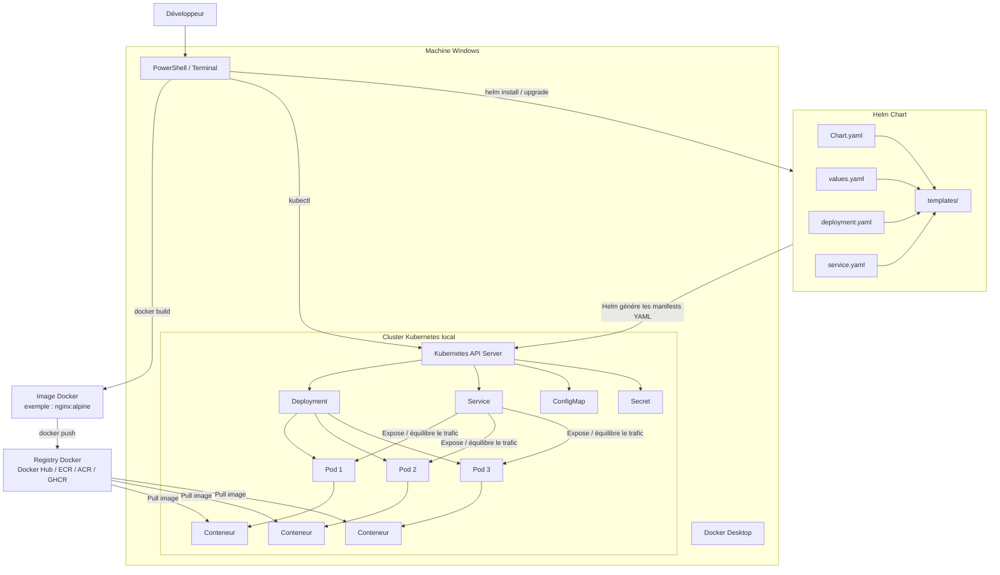
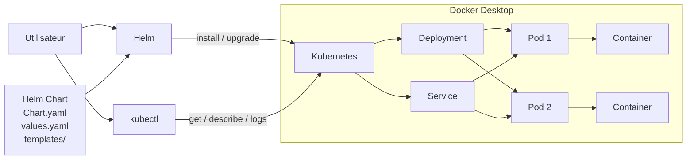

# HELM AVEC KUBERNETES SOUS DOCKER DESKTOP

## 1. Objectifs du cours

Dans ce cours, nous allons apprendre à utiliser **Helm** pour déployer et gérer des applications dans un cluster **Kubernetes local fourni par Docker Desktop**.

À la fin du cours, vous serez capables de :

* comprendre pourquoi Helm est utilisé avec Kubernetes ;
* vérifier le fonctionnement de Kubernetes dans Docker Desktop ;
* installer Helm sous Windows ;
* comprendre la structure d’un **Helm Chart** ;
* créer un Chart ;
* utiliser `values.yaml` ;
* générer dynamiquement des fichiers Kubernetes ;
* installer une application avec Helm ;
* modifier une application avec `helm upgrade` ;
* revenir à une ancienne version avec `helm rollback` ;
* supprimer une application avec `helm uninstall` ;
* utiliser des dépôts Helm ;
* déployer une application réelle ;
* comprendre le rôle de Helm dans un pipeline DevOps.

---

# 2. Environnement utilisé

Nous allons travailler avec :

* Windows ;
* Docker Desktop ;
* Kubernetes intégré à Docker Desktop ;
* PowerShell ;
* `kubectl` ;
* Helm 3 ;
* Docker ;
* une application Web simple.

Votre écran Docker Desktop montre déjà un cluster Kubernetes actif :

```text
Cluster: Active
Cluster type: kubeadm
Nodes: 1
Kubernetes version: v1.34.1
Namespace: default
```

Cela signifie que Docker Desktop exécute actuellement un cluster Kubernetes local.

Notre architecture est donc approximativement :

```text
Windows
   |
   v
Docker Desktop
   |
   +-------------------------+
   | Kubernetes Cluster      |
   |                         |
   | Node unique             |
   |                         |
   | Pods                    |
   | Deployments             |
   | Services                |
   | ConfigMaps              |
   | Secrets                 |
   +-------------------------+
             ^
             |
             |
           Helm
```

Helm ne remplace pas Kubernetes.

Helm va **générer et gérer les ressources Kubernetes**.


## Diagramme complet



### Lecture simplifiée du diagramme

```text
Code source
    ↓
Docker build
    ↓
Image Docker
    ↓
Docker Hub / Registry
    ↓
Helm Chart
    ↓
Helm génère les fichiers Kubernetes
    ↓
Kubernetes API Server
    ↓
Deployment
    ↓
Pods
    ↓
Containers
```

Et la différence importante à faire comprendre est :

```text
Docker
  → construit l'image

Helm
  → prépare et gère le déploiement Kubernetes

Kubernetes
  → orchestre et maintient les Pods

kubectl
  → permet à l'administrateur de communiquer avec Kubernetes
```

## Diagramme simplifié




---

# 3. Rappel : Kubernetes sans Helm

Avant de comprendre Helm, il faut comprendre le problème qu'il cherche à résoudre.

Supposons que nous souhaitions déployer une application Nginx.

Avec Kubernetes, nous pourrions créer :

```text
deployment.yaml
service.yaml
configmap.yaml
secret.yaml
ingress.yaml
```

Exemple :

```yaml
apiVersion: apps/v1
kind: Deployment
metadata:
  name: nginx-demo
spec:
  replicas: 2

  selector:
    matchLabels:
      app: nginx-demo

  template:
    metadata:
      labels:
        app: nginx-demo

    spec:
      containers:
        - name: nginx
          image: nginx:alpine

          ports:
            - containerPort: 80
```

Puis :

```powershell
kubectl apply -f deployment.yaml
```

Pour le Service :

```yaml
apiVersion: v1
kind: Service
metadata:
  name: nginx-service

spec:
  selector:
    app: nginx-demo

  ports:
    - port: 80
      targetPort: 80

  type: ClusterIP
```

Puis :

```powershell
kubectl apply -f service.yaml
```

Cela fonctionne.

Mais imaginons maintenant que notre application possède :

```text
10 Deployments
5 Services
8 ConfigMaps
4 Secrets
2 Ingress
3 PersistentVolumeClaims
```

Nous devons maintenir énormément de fichiers YAML.

C'est précisément ici que Helm devient intéressant.

---

# 4. Qu'est-ce que Helm ?

Helm est souvent présenté comme :

> le gestionnaire de paquets de Kubernetes.

On peut le comparer à :

```text
apt      -> Ubuntu/Linux
winget   -> Windows
npm      -> JavaScript
pip      -> Python
Helm     -> Kubernetes
```

Mais Helm fait plus qu'installer des logiciels.

Helm permet également de créer des **templates Kubernetes paramétrables**.

Au lieu d'avoir :

```yaml
replicas: 3
```

nous pouvons écrire :

```yaml
replicas: {{ .Values.replicaCount }}
```

Puis définir :

```yaml
replicaCount: 3
```

dans :

```text
values.yaml
```

Nous pouvons alors facilement changer :

```yaml
replicaCount: 5
```

sans modifier directement le template Kubernetes.

---

# 5. Les trois concepts les plus importants de Helm

Il faut distinguer :

```text
Chart
Release
Repository
```

## 5.1 Chart

Un **Chart** est un package Helm.

Il contient notamment :

```text
templates
configuration
métadonnées
valeurs par défaut
```

Exemple :

```text
mon-application/
│
├── Chart.yaml
├── values.yaml
│
└── templates/
    ├── deployment.yaml
    ├── service.yaml
    └── ingress.yaml
```

---

## 5.2 Release

Une **Release** est une instance installée d'un Chart.

Par exemple :

```powershell
helm install boutique ./boutique-chart
```

Ici :

```text
boutique-chart
```

est le Chart.

Et :

```text
boutique
```

est le nom de la Release.

On pourrait installer le même Chart plusieurs fois :

```powershell
helm install boutique-dev ./boutique-chart
helm install boutique-test ./boutique-chart
helm install boutique-prod ./boutique-chart
```

Nous avons alors trois Releases différentes.

---

## 5.3 Repository

Un **repository Helm** contient des Charts prêts à être utilisés.

Par exemple :

```text
Bitnami
Prometheus Community
Grafana
Ingress NGINX
```

Conceptuellement :

```text
Helm Repository
      |
      v
     Chart
      |
      v
   helm install
      |
      v
    Release
      |
      v
Kubernetes resources
```

---

# 6. Vérification de Kubernetes

Ouvrez PowerShell.

Commencez par :

```powershell
kubectl version --client
```

Puis :

```powershell
kubectl cluster-info
```

Ensuite :

```powershell
kubectl get nodes
```

Vous devriez obtenir quelque chose ressemblant à :

```text
NAME             STATUS   ROLES           AGE   VERSION
docker-desktop   Ready    control-plane   ...   v1.34.1
```

Vérifiez également :

```powershell
kubectl get pods
```

Puis :

```powershell
kubectl get pods -A
```

L'option :

```text
-A
```

signifie :

```text
--all-namespaces
```

---

# 7. Vérifier le contexte Kubernetes

Une machine peut être connectée à plusieurs clusters Kubernetes.

Exécutez :

```powershell
kubectl config get-contexts
```

Vous devriez notamment voir :

```text
docker-desktop
```

Vérifiez le contexte actuellement utilisé :

```powershell
kubectl config current-context
```

Résultat attendu :

```text
docker-desktop
```

Sinon :

```powershell
kubectl config use-context docker-desktop
```

---

# 8. Installation de Helm sous Windows

Nous devons maintenant installer la commande :

```text
helm
```

## Méthode 1 — Winget

Dans PowerShell :

```powershell
winget install Helm.Helm
```

Fermez puis rouvrez PowerShell.

Vérifiez :

```powershell
helm version
```

Vous devriez obtenir une sortie ressemblant à :

```text
version.BuildInfo{Version:"v3..."}
```

---

# 9. Vérification complète

Exécutez :

```powershell
docker version
```

Puis :

```powershell
kubectl version --client
```

Puis :

```powershell
kubectl get nodes
```

Puis :

```powershell
helm version
```

Nous avons donc :

```text
Docker
   |
   v
Docker Desktop
   |
   v
Kubernetes
   |
   +--> kubectl
   |
   +--> Helm
```

---

# 10. Premier déploiement Helm

Commençons avec quelque chose de très simple.

Créez un dossier :

```powershell
mkdir C:\helm-labs
```

Entrez dedans :

```powershell
cd C:\helm-labs
```

Créez notre premier Chart :

```powershell
helm create monapp
```

Affichez son contenu :

```powershell
tree /F monapp
```

Vous obtenez approximativement :

```text
monapp
│
│   .helmignore
│   Chart.yaml
│   values.yaml
│
├───charts
│
├───templates
│       deployment.yaml
│       hpa.yaml
│       ingress.yaml
│       service.yaml
│       serviceaccount.yaml
│       NOTES.txt
│       _helpers.tpl
│
└───templates/tests
        test-connection.yaml
```

Helm vient donc de générer automatiquement la structure d'une application Kubernetes.

---

# 11. Le fichier Chart.yaml

Ouvrez :

```text
monapp/Chart.yaml
```

Vous trouverez quelque chose ressemblant à :

```yaml
apiVersion: v2

name: monapp

description: A Helm chart for Kubernetes

type: application

version: 0.1.0

appVersion: "1.16.0"
```

## `name`

Nom du Chart :

```yaml
name: monapp
```

## `version`

Version du Chart :

```yaml
version: 0.1.0
```

Attention :

```text
version
```

correspond à la version du Chart.

---

## `appVersion`

```yaml
appVersion: "1.16.0"
```

correspond conceptuellement à la version de l'application.

Il faut donc distinguer :

```text
Chart version
```

et :

```text
Application version
```

---

# 12. Le fichier values.yaml

C'est l'un des fichiers les plus importants de Helm.

Ouvrez :

```text
monapp/values.yaml
```

Vous trouverez de nombreuses variables.

Par exemple :

```yaml
replicaCount: 1
```

Cette valeur indique le nombre de Pods souhaités.

Nous retrouvons également quelque chose ressemblant à :

```yaml
image:
  repository: nginx
  pullPolicy: IfNotPresent
  tag: ""
```

Nous pouvons décider d'utiliser :

```yaml
image:
  repository: nginx
  pullPolicy: IfNotPresent
  tag: "alpine"
```

---

# 13. Templates Helm

Regardons :

```text
templates/deployment.yaml
```

Vous trouverez des expressions ressemblant à :

```yaml
{{ .Values.replicaCount }}
```

Ceci indique à Helm :

> prends la valeur `replicaCount` située dans `values.yaml`.

Si :

```yaml
replicaCount: 3
```

alors Helm produira finalement :

```yaml
replicas: 3
```

---

# 14. Le moteur de templates

Helm utilise des expressions :

```text
{{ ... }}
```

Exemple :

```yaml
image: "{{ .Values.image.repository }}:{{ .Values.image.tag }}"
```

Si :

```yaml
image:
  repository: nginx
  tag: alpine
```

Helm génère :

```yaml
image: "nginx:alpine"
```

C'est le principe fondamental de Helm.

---

# 15. Helm ne transmet pas les templates directement à Kubernetes

C'est un point extrêmement important.

Kubernetes ne comprend pas :

```yaml
{{ .Values.replicaCount }}
```

C'est Helm qui transforme :

```yaml
replicas: {{ .Values.replicaCount }}
```

en :

```yaml
replicas: 3
```

Puis Helm transmet le YAML final à Kubernetes.

Workflow :

```text
Chart Helm
   +
values.yaml
   |
   v
Moteur de templates Helm
   |
   v
YAML Kubernetes final
   |
   v
Kubernetes API Server
   |
   v
Deployment / Service / Pods
```

---

# 16. Voir le YAML sans installer l'application

Avant de déployer, nous pouvons demander à Helm de produire le YAML.

Depuis :

```text
C:\helm-labs
```

exécutez :

```powershell
helm template demo ./monapp
```

Helm affiche alors tous les fichiers YAML qui seraient envoyés à Kubernetes.

C'est une commande extrêmement utile pour comprendre et déboguer les Charts.

---

# 17. Vérifier un Chart

Exécutez :

```powershell
helm lint ./monapp
```

Helm vérifie la structure du Chart.

Un résultat normal ressemble à :

```text
1 chart(s) linted, 0 chart(s) failed
```

---

# 18. Installer notre application

Exécutez :

```powershell
helm install demo ./monapp
```

Ici :

```text
demo
```

est la Release.

Et :

```text
./monapp
```

est notre Chart.

---

# 19. Vérifier les Releases Helm

Exécutez :

```powershell
helm list
```

Vous devriez voir quelque chose ressemblant à :

```text
NAME   NAMESPACE   REVISION   STATUS
demo   default     1          deployed
```

---

# 20. Vérifier les ressources Kubernetes

Exécutez :

```powershell
kubectl get deployments
```

Puis :

```powershell
kubectl get pods
```

Puis :

```powershell
kubectl get services
```

Vous constaterez qu'Helm a créé des ressources Kubernetes.

Important :

```text
Helm
```

ne remplace pas :

```text
kubectl
```

Les deux sont utilisés ensemble.

Helm sert principalement à :

```text
installer
configurer
versionner
mettre à jour
désinstaller
```

des ensembles de ressources Kubernetes.

`kubectl` permet d'interagir directement avec Kubernetes.

---

# 21. Examiner une Release

Exécutez :

```powershell
helm status demo
```

Cette commande affiche l'état de la Release.

Vous pouvez également afficher ses valeurs :

```powershell
helm get values demo
```

Et l'ensemble des manifests générés :

```powershell
helm get manifest demo
```

---

# 22. Accéder à l'application

Dans un environnement local Docker Desktop, une méthode particulièrement simple consiste à utiliser :

```powershell
kubectl get services
```

Puis :

```powershell
kubectl port-forward service/demo-monapp 8080:80
```

Laissez cette fenêtre PowerShell ouverte.

Dans le navigateur :

```text
http://localhost:8080
```

Vous devriez obtenir la page Nginx.

---

# 23. Modification du nombre de Pods

Ouvrez :

```text
monapp/values.yaml
```

Modifiez :

```yaml
replicaCount: 1
```

en :

```yaml
replicaCount: 3
```

Attention :

si nous exécutons simplement :

```powershell
helm install demo ./monapp
```

Helm répondra que la Release existe déjà.

Pour mettre à jour une Release, nous utilisons :

```powershell
helm upgrade demo ./monapp
```

---

# 24. Vérification

Exécutez :

```powershell
kubectl get pods
```

Vous devriez maintenant voir plusieurs Pods.

Par exemple :

```text
demo-monapp-xxxxx   Running
demo-monapp-yyyyy   Running
demo-monapp-zzzzz   Running
```

Helm a mis à jour le Deployment.

Kubernetes s'est ensuite occupé de créer les Pods supplémentaires.

---

# 25. Le concept de Revision

Exécutez :

```powershell
helm list
```

Après une mise à jour, vous pourriez obtenir :

```text
REVISION
2
```

Pourquoi ?

Parce que Helm conserve l'historique des déploiements.

Exécutez :

```powershell
helm history demo
```

Exemple :

```text
REVISION   STATUS
1          superseded
2          deployed
```

---

# 26. Rollback

Supposons que notre deuxième version contienne une mauvaise configuration.

Nous pouvons revenir à la première :

```powershell
helm rollback demo 1
```

Puis :

```powershell
helm history demo
```

Helm crée alors une nouvelle révision correspondant au retour à l'ancienne configuration.

C'est très important dans les environnements DevOps.

---

# 27. Installer avec `--set`

Il n'est pas obligatoire de modifier directement `values.yaml`.

Nous pouvons faire :

```powershell
helm upgrade demo ./monapp --set replicaCount=4
```

Puis :

```powershell
kubectl get pods
```

Helm demandera alors à Kubernetes d'exécuter quatre réplicas.

---

# 28. Pourquoi utiliser `--set` ?

Cette approche est pratique dans les pipelines CI/CD.

Par exemple :

```powershell
helm upgrade boutique ./chart `
  --set image.tag=2.3.7 `
  --set replicaCount=5
```

Le pipeline peut ainsi déployer automatiquement une nouvelle image Docker.

---

# 29. Utiliser plusieurs fichiers values

Dans une vraie entreprise, nous avons souvent :

```text
values-dev.yaml
values-test.yaml
values-prod.yaml
```

Exemple :

```text
monapp/
│
├── Chart.yaml
├── values.yaml
├── values-dev.yaml
├── values-test.yaml
├── values-prod.yaml
│
└── templates/
```

---

# 30. Exemple environnement DEV

Créer :

```text
values-dev.yaml
```

avec :

```yaml
replicaCount: 1

image:
  repository: nginx
  tag: alpine
```

Installation :

```powershell
helm upgrade --install monapp-dev ./monapp -f ./monapp/values-dev.yaml
```

---

# 31. Environnement PROD

Créer :

```text
values-prod.yaml
```

Exemple :

```yaml
replicaCount: 4

image:
  repository: nginx
  tag: alpine
```

Puis :

```powershell
helm upgrade --install monapp-prod ./monapp -f ./monapp/values-prod.yaml
```

La même application possède alors deux configurations.

---

# 32. Pourquoi `helm upgrade --install` est très utilisé

Considérons :

```powershell
helm upgrade --install monapp ./monapp
```

Cette commande signifie :

```text
Si monapp existe :
    faire upgrade

Sinon :
    faire install
```

Elle est donc particulièrement intéressante en CI/CD.

---

# 33. Les Namespaces

Jusqu'à maintenant, nous utilisons :

```text
default
```

Mais dans une vraie architecture, nous pourrions avoir :

```text
development
testing
production
monitoring
```

Créons :

```powershell
kubectl create namespace development
```

Puis :

```powershell
kubectl get namespaces
```

Installation :

```powershell
helm upgrade --install monapp-dev ./monapp -n development
```

Vérification :

```powershell
helm list -n development
```

Puis :

```powershell
kubectl get pods -n development
```

---

# 34. Création automatique du Namespace

Helm peut également créer le namespace :

```powershell
helm upgrade --install monapp-test ./monapp `
  --namespace testing `
  --create-namespace
```

---

# 35. Suppression d'une Release

Pour supprimer une Release :

```powershell
helm uninstall demo
```

Vérifiez :

```powershell
helm list
```

Puis :

```powershell
kubectl get pods
```

Les ressources appartenant à la Release auront été supprimées.

---

# 36. Helm Repository

Jusqu'à présent, nous avons utilisé un Chart local :

```text
./monapp
```

Mais nous pouvons également télécharger des Charts disponibles dans des repositories.

Liste des repositories :

```powershell
helm repo list
```

Au départ, la liste peut être vide.

---

# 37. Ajouter un repository

Un repository Helm contient des Charts réutilisables.

Par exemple :

```powershell
helm repo add bitnami https://charts.bitnami.com/bitnami
```

Puis :

```powershell
helm repo update
```

Vérifiez :

```powershell
helm repo list
```

---

# 38. Rechercher des Charts

Exécutez :

```powershell
helm search repo nginx
```

Helm recherchera les Charts contenant Nginx.

Nous pouvons également faire :

```powershell
helm search repo mysql
```

ou :

```powershell
helm search repo redis
```

---

# 39. Afficher les informations d'un Chart

Par exemple :

```powershell
helm show chart bitnami/nginx
```

Pour voir les valeurs disponibles :

```powershell
helm show values bitnami/nginx
```

Cette commande est extrêmement importante.

Avant d'installer un Chart inconnu :

```powershell
helm show values NOM_DU_CHART
```

permet de comprendre sa configuration.

---

# 40. Déployer Nginx depuis un repository

Exemple :

```powershell
helm install nginx-demo bitnami/nginx
```

Puis :

```powershell
helm list
```

Puis :

```powershell
kubectl get pods
```

Puis :

```powershell
kubectl get services
```

---

# 41. Tester Nginx

Pour éviter les différences de configuration réseau entre machines, utilisez :

```powershell
kubectl port-forward service/nginx-demo 8080:80
```

Puis ouvrez :

```text
http://localhost:8080
```

---

# 42. Différence entre Docker Image et Helm Chart

Cette distinction est fondamentale.

## Image Docker

Contient l'application.

Exemple :

```text
nginx:alpine
```

---

## Helm Chart

Explique comment déployer cette application sur Kubernetes.

Le Chart peut définir :

```text
Deployment
Service
Ingress
ConfigMap
Secret
PersistentVolumeClaim
ServiceAccount
Autoscaling
```

Architecture :

```text
Application
     |
     v
Dockerfile
     |
     v
Docker Image
     |
     v
Registry
     |
     |
     +----------+
                |
                v
             Helm Chart
                |
                v
          Kubernetes
                |
        +-------+-------+
        |               |
        v               v
   Deployment         Service
        |
        v
      Pods
```

---

# 43. Exemple réaliste DevOps

Supposons qu'une entreprise développe :

```text
API FastAPI
```

Le développeur crée :

```text
app/
Dockerfile
requirements.txt
```

Docker construit :

```text
company/api:1.0
```

L'image est placée dans :

```text
Docker Hub
AWS ECR
Azure Container Registry
GitHub Container Registry
```

Puis Helm déploie cette image dans Kubernetes.

---

# 44. Exemple de `values.yaml`

```yaml
replicaCount: 2

image:
  repository: company/api
  tag: "1.0"
  pullPolicy: IfNotPresent

service:
  type: ClusterIP
  port: 8000

resources:
  requests:
    cpu: 100m
    memory: 128Mi

  limits:
    cpu: 500m
    memory: 512Mi
```

Le développeur peut ensuite publier :

```text
company/api:1.1
```

Le pipeline CI/CD exécute :

```powershell
helm upgrade api ./api-chart --set image.tag=1.1
```

Kubernetes effectue alors le nouveau déploiement.

---

# 45. Flux DevOps complet

```text
Développeur
     |
     v
Git Push
     |
     v
GitHub / GitLab
     |
     v
CI Pipeline
     |
     +--------------------+
     |                    |
     v                    v
Tests                 Docker Build
                          |
                          v
                     Docker Image
                          |
                          v
                    Container Registry
                          |
                          v
                    helm upgrade
                          |
                          v
                     Kubernetes
                          |
                          v
                      Deployment
                          |
                          v
                         Pods
```

C'est l'une des raisons pour lesquelles Helm est très utilisé dans Kubernetes.

---

# 46. Commandes Helm essentielles

| Commande            | Fonction                           |
| ------------------- | ---------------------------------- |
| `helm version`      | Voir la version de Helm            |
| `helm create`       | Créer un Chart                     |
| `helm lint`         | Vérifier un Chart                  |
| `helm template`     | Générer le YAML sans installer     |
| `helm install`      | Installer une Release              |
| `helm list`         | Voir les Releases                  |
| `helm status`       | Voir l'état d'une Release          |
| `helm upgrade`      | Modifier une Release               |
| `helm rollback`     | Revenir à une ancienne version     |
| `helm history`      | Voir l'historique                  |
| `helm uninstall`    | Supprimer une Release              |
| `helm repo add`     | Ajouter un repository              |
| `helm repo update`  | Mettre à jour les repositories     |
| `helm repo list`    | Afficher les repositories          |
| `helm search repo`  | Rechercher un Chart                |
| `helm show values`  | Afficher les paramètres d'un Chart |
| `helm get values`   | Voir les valeurs d'une Release     |
| `helm get manifest` | Voir les manifests générés         |

---

# 47. Commandes Kubernetes à utiliser avec Helm

Helm ne remplace jamais la compréhension de Kubernetes.

Les commandes suivantes restent essentielles :

```powershell
kubectl get nodes
```

```powershell
kubectl get namespaces
```

```powershell
kubectl get deployments
```

```powershell
kubectl get pods
```

```powershell
kubectl get services
```

```powershell
kubectl describe pod NOM_DU_POD
```

```powershell
kubectl logs NOM_DU_POD
```

```powershell
kubectl get all
```

---

# 48. Helm et Kubernetes : qui fait quoi ?

| Fonction                |          Helm | Kubernetes |
| ----------------------- | ------------: | ---------: |
| Créer des Pods          | Indirectement |        Oui |
| Gérer les Deployments   | Indirectement |        Oui |
| Gérer les Services      | Indirectement |        Oui |
| Templates YAML          |           Oui |        Non |
| `values.yaml`           |           Oui |        Non |
| Historique des Releases |           Oui |        Non |
| Rollback d'une Release  |           Oui |        Non |
| Exécuter les conteneurs |           Non |        Oui |
| Scheduling des Pods     |           Non |        Oui |
| Service Discovery       |           Non |        Oui |

---

# 49. Différence entre `kubectl apply` et `helm install`

Avec :

```powershell
kubectl apply -f deployment.yaml
```

nous envoyons directement un fichier Kubernetes.

Avec :

```powershell
helm install demo ./monapp
```

Helm commence par produire les manifests Kubernetes.

Conceptuellement :

```text
kubectl
   |
   v
YAML Kubernetes
   |
   v
Kubernetes
```

contre :

```text
Helm Chart
   |
   +--> templates
   |
   +--> values
   |
   v
Helm
   |
   v
YAML Kubernetes
   |
   v
Kubernetes
```

---

# 50. TP — Créer son propre Chart minimal

Nous allons maintenant créer un Chart beaucoup plus simple que celui généré automatiquement.

Créer :

```powershell
mkdir C:\helm-labs\simple-web
```

Puis :

```powershell
mkdir C:\helm-labs\simple-web\templates
```

Structure :

```text
simple-web/
│
├── Chart.yaml
├── values.yaml
│
└── templates/
    ├── deployment.yaml
    └── service.yaml
```

---

# 51. `Chart.yaml`

Créer :

```text
simple-web/Chart.yaml
```

Contenu :

```yaml
apiVersion: v2

name: simple-web

description: Application Web simple déployée avec Helm

type: application

version: 0.1.0

appVersion: "1.0"
```

---

# 52. `values.yaml`

Créer :

```text
simple-web/values.yaml
```

Contenu :

```yaml
replicaCount: 2

image:
  repository: nginx
  tag: alpine
  pullPolicy: IfNotPresent

service:
  type: ClusterIP
  port: 80
```

---

# 53. `deployment.yaml`

Créer :

```text
simple-web/templates/deployment.yaml
```

Contenu :

```yaml
apiVersion: apps/v1
kind: Deployment

metadata:
  name: {{ .Release.Name }}-deployment

spec:
  replicas: {{ .Values.replicaCount }}

  selector:
    matchLabels:
      app: {{ .Release.Name }}

  template:
    metadata:
      labels:
        app: {{ .Release.Name }}

    spec:
      containers:

        - name: nginx

          image: "{{ .Values.image.repository }}:{{ .Values.image.tag }}"

          imagePullPolicy: {{ .Values.image.pullPolicy }}

          ports:
            - containerPort: 80
```

---

# 54. Comprendre `.Release.Name`

Nous avons :

```yaml
name: {{ .Release.Name }}-deployment
```

Supposons que nous installions :

```powershell
helm install website ./simple-web
```

Helm remplacera :

```text
{{ .Release.Name }}
```

par :

```text
website
```

Le Deployment s'appellera alors :

```text
website-deployment
```

---

# 55. `service.yaml`

Créer :

```text
simple-web/templates/service.yaml
```

Contenu :

```yaml
apiVersion: v1
kind: Service

metadata:
  name: {{ .Release.Name }}-service

spec:
  type: {{ .Values.service.type }}

  selector:
    app: {{ .Release.Name }}

  ports:

    - port: {{ .Values.service.port }}
      targetPort: 80
      protocol: TCP
```

---

# 56. Vérification du Chart

Positionnez-vous dans :

```powershell
cd C:\helm-labs
```

Puis :

```powershell
helm lint ./simple-web
```

Ensuite :

```powershell
helm template website ./simple-web
```

Prenez le temps d'observer le YAML généré.

Vous devriez notamment retrouver :

```yaml
replicas: 2
```

et :

```yaml
image: "nginx:alpine"
```

---

# 57. Installation

Exécutez :

```powershell
helm install website ./simple-web
```

Puis :

```powershell
helm list
```

Puis :

```powershell
kubectl get deployments
```

Puis :

```powershell
kubectl get pods
```

Puis :

```powershell
kubectl get services
```

---

# 58. Test

Exécutez :

```powershell
kubectl port-forward service/website-service 8080:80
```

Ouvrez ensuite :

```text
http://localhost:8080
```

Vous devriez obtenir la page Nginx.

---

# 59. Modifier l'application

Dans :

```text
values.yaml
```

remplacez :

```yaml
replicaCount: 2
```

par :

```yaml
replicaCount: 4
```

Exécutez :

```powershell
helm upgrade website ./simple-web
```

Puis :

```powershell
kubectl get pods
```

Vous devriez obtenir quatre Pods.

---

# 60. Historique

Exécutez :

```powershell
helm history website
```

Vous devriez maintenant avoir au minimum :

```text
REVISION 1
REVISION 2
```

---

# 61. Rollback

Revenez à la configuration initiale :

```powershell
helm rollback website 1
```

Puis :

```powershell
kubectl get pods
```

Le Deployment devrait progressivement revenir au nombre de réplicas correspondant à la première version.

---

# 62. Nettoyage

Supprimez la Release :

```powershell
helm uninstall website
```

Vérifiez :

```powershell
helm list
```

Puis :

```powershell
kubectl get pods
```

---

# 63. Méthode de dépannage

Lorsqu'un déploiement Helm ne fonctionne pas, ne cherchez pas uniquement du côté de Helm.

Commencez par :

```powershell
helm status NOM_RELEASE
```

Puis :

```powershell
helm history NOM_RELEASE
```

Ensuite :

```powershell
kubectl get pods
```

Si un Pod pose problème :

```powershell
kubectl describe pod NOM_DU_POD
```

Puis :

```powershell
kubectl logs NOM_DU_POD
```

Pour afficher le YAML produit par Helm :

```powershell
helm get manifest NOM_RELEASE
```

Ou avant installation :

```powershell
helm template NOM_RELEASE ./chart
```

---

# 64. Exemple : `ImagePullBackOff`

Si :

```powershell
kubectl get pods
```

affiche :

```text
ImagePullBackOff
```

cela signifie généralement que Kubernetes n'arrive pas à télécharger l'image Docker.

Vérifiez :

```yaml
image:
  repository: ...
  tag: ...
```

Puis :

```powershell
kubectl describe pod NOM_DU_POD
```

---

# 65. Exemple : `CrashLoopBackOff`

Si un Pod affiche :

```text
CrashLoopBackOff
```

le conteneur démarre puis plante régulièrement.

Consultez :

```powershell
kubectl logs NOM_DU_POD
```

et :

```powershell
kubectl describe pod NOM_DU_POD
```

Le problème est souvent lié à :

```text
commande de démarrage
configuration
variables d'environnement
application
connexion base de données
Secret
ConfigMap
```

---

# 66. Les erreurs Helm à distinguer

Il existe donc plusieurs niveaux de problèmes :

```text
Erreur template Helm
        |
        v
helm lint
helm template
```

```text
Erreur installation Helm
        |
        v
helm status
helm history
```

```text
Erreur Kubernetes
        |
        v
kubectl get
kubectl describe
```

```text
Erreur application
        |
        v
kubectl logs
```

C'est une excellente méthode de diagnostic.

---

# 67. Architecture mentale à retenir

Retenez cette chaîne :

```text
Docker
   |
   v
Image
   |
   v
Helm Chart
   |
   +--> Chart.yaml
   |
   +--> values.yaml
   |
   +--> templates/
   |
   v
Helm Release
   |
   v
Kubernetes
   |
   +--> Deployment
   |
   +--> Service
   |
   +--> ConfigMap
   |
   +--> Secret
   |
   +--> Ingress
   |
   v
Pods
   |
   v
Containers
```

---

# 68. Ce que Helm n'est pas

Helm n'est pas :

```text
un moteur de conteneurs
```

Ce rôle appartient notamment à Docker/containerd.

Helm n'est pas :

```text
un orchestrateur
```

Ce rôle appartient à Kubernetes.

Helm n'est pas non plus :

```text
un registre Docker
```

Il ne stocke pas vos images d'application de la même manière que Docker Hub ou ECR.

Helm est essentiellement une couche permettant de :

```text
packager
paramétrer
installer
mettre à jour
versionner
administrer
```

des applications Kubernetes.

---

# 69. Résumé final

Sans Helm :

```text
deployment.yaml
service.yaml
configmap.yaml
secret.yaml
ingress.yaml
...
```

puis :

```powershell
kubectl apply
```

Avec Helm :

```text
Chart
│
├── Chart.yaml
├── values.yaml
└── templates/
```

puis :

```powershell
helm install
```

et pour une nouvelle version :

```powershell
helm upgrade
```

en cas de problème :

```powershell
helm rollback
```

et pour supprimer :

```powershell
helm uninstall
```

---

# 70. Fiche mémo

```powershell
# Vérifier Kubernetes
kubectl get nodes
kubectl get pods
kubectl get services

# Vérifier Helm
helm version

# Créer un Chart
helm create monapp

# Valider le Chart
helm lint ./monapp

# Générer le YAML sans installer
helm template demo ./monapp

# Installer
helm install demo ./monapp

# Afficher les Releases
helm list

# Voir l'état
helm status demo

# Mettre à jour
helm upgrade demo ./monapp

# Installer ou mettre à jour
helm upgrade --install demo ./monapp

# Voir l'historique
helm history demo

# Rollback
helm rollback demo 1

# Voir les valeurs
helm get values demo

# Voir les manifests
helm get manifest demo

# Supprimer
helm uninstall demo

# Ajouter un repository
helm repo add bitnami https://charts.bitnami.com/bitnami

# Actualiser les repositories
helm repo update

# Rechercher un Chart
helm search repo nginx

# Voir les paramètres possibles
helm show values bitnami/nginx
```

## À retenir absolument

La logique fondamentale est :

```text
Docker construit l'application.
        ↓
Une image Docker est produite.
        ↓
Helm décrit comment cette application doit être déployée.
        ↓
Kubernetes reçoit les manifests produits par Helm.
        ↓
Kubernetes crée et maintient les Pods.
```

Ainsi :

> **Docker construit et exécute les conteneurs, Kubernetes orchestre les conteneurs, et Helm simplifie le packaging, le paramétrage, le déploiement et le versionnement des applications Kubernetes.**
