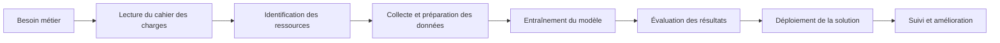

# Cours — Ressources nécessaires à un projet d’intelligence artificielle

## Table des matières

| # | Section |
|---|---------|
| 1 | [Introduction générale](#section-1) |
| 2 | [Pourquoi identifier les ressources avant de commencer ?](#section-2) |
| 3 | [Les grandes catégories de ressources](#section-3) |
| 4 | [Les ressources humaines dans un projet IA](#section-4) |
| 4a | &nbsp;&nbsp;&nbsp;↳ [Les principaux métiers IA](#section-4a) |
| 4b | &nbsp;&nbsp;&nbsp;↳ [Différence entre les rôles](#section-4b) |
| 5 | [Les ressources matérielles](#section-5) |
| 6 | [Les ressources logicielles](#section-6) |
| 7 | [Les ressources informationnelles](#section-7) |
| 8 | [Lecture d’un cahier des charges](#section-8) |
| 9 | [Sources scientifiques](#section-9) |
| 10 | [Documentations techniques](#section-10) |
| 11 | [Exemple complet : projet IA de recommandation de produits](#section-11) |
| 12 | [Erreurs fréquentes dans un projet IA](#section-12) |
| 13 | [Activité formative](#section-13) |
| 14 | [Synthèse à retenir](#section-14) |

---

<strong>1 — Introduction générale</strong>

 

Un projet d’intelligence artificielle ne commence pas directement avec du code, un modèle ou un algorithme. Avant de programmer, il faut d’abord comprendre le besoin, identifier les ressources disponibles, organiser l’équipe et vérifier si les données sont suffisantes et exploitables.

Dans un projet IA, la réussite ne dépend pas seulement du choix du modèle. Elle dépend aussi de la qualité des données, des compétences de l’équipe, du matériel utilisé, des logiciels choisis et de la documentation disponible. Un modèle peut être très performant en théorie, mais devenir inutile si le projet est mal préparé, si les données sont mauvaises ou si les objectifs ne sont pas clairement définis.

On peut comparer un projet IA à la construction d’un bâtiment. Avant de construire, il faut un plan, des matériaux, des outils, des travailleurs, un budget, un échéancier et des règles de sécurité. Pour l’intelligence artificielle, c’est la même logique. Il faut savoir ce que l’on veut construire, pourquoi on le construit, avec quelles données, avec quels outils et avec quelles personnes.

Dans une entreprise, un projet IA peut servir à prédire des ventes, détecter des fraudes, recommander des produits, classer des documents, analyser des images, répondre automatiquement à des questions ou automatiser certaines tâches. Même si ces projets sont différents, ils ont tous un point commun : ils nécessitent une préparation sérieuse.

L’objectif de ce cours est donc de comprendre les ressources nécessaires à un projet IA. Il faut être capable d’identifier les ressources humaines, matérielles, logicielles et informationnelles. Il faut aussi comprendre comment lire un cahier des charges, pourquoi les rôles de l’équipe sont importants, et comment utiliser des sources scientifiques et des documentations techniques.

<a href="#top">↑ Retour en haut</a>

---

<strong>2 — Pourquoi identifier les ressources avant de commencer ?</strong>

 

Avant de lancer un projet IA, il est essentiel de savoir si le projet est réaliste. Une idée peut sembler intéressante au départ, mais elle peut devenir impossible à réaliser si les données n’existent pas, si le budget est insuffisant, si les outils sont mal choisis ou si l’équipe ne possède pas les compétences nécessaires.

Par exemple, une entreprise peut vouloir créer un système capable de prédire les clients qui risquent de quitter son service. Cette idée est intéressante, mais il faut d’abord vérifier plusieurs éléments. Il faut savoir si l’entreprise possède un historique des clients, si les données sont bien organisées, si les informations sont légalement utilisables, si l’équipe sait construire un modèle prédictif et si l’entreprise dispose d’un environnement technique pour déployer la solution.

Identifier les ressources permet aussi d’éviter les mauvaises surprises. Si l’équipe découvre trop tard que les données sont incomplètes, le projet peut prendre du retard. Si elle découvre trop tard que le modèle doit être explicable pour respecter une règle interne, elle devra peut-être changer complètement de méthode. Si elle découvre trop tard qu’aucun serveur n’est disponible pour déployer la solution, le modèle restera bloqué dans un notebook.

Autrement dit, un projet IA doit être préparé avant d’être développé. Si cette préparation est négligée, l’équipe risque de perdre du temps, de produire un modèle inutilisable ou de livrer une solution qui ne répond pas au vrai besoin.

### Exemple simple

Une équipe veut créer un chatbot pour répondre aux questions des employés d’une entreprise. L’idée semble simple, mais l’équipe doit d’abord vérifier plusieurs choses. Elle doit savoir quels documents le chatbot pourra lire, qui a le droit d’accéder à ces documents, quelle plateforme sera utilisée, comment les réponses seront contrôlées, et qui sera responsable si le chatbot donne une mauvaise réponse.

Cet exemple montre qu’un projet IA n’est jamais seulement une question de modèle. Il faut penser au besoin, aux données, aux outils, à la sécurité, aux utilisateurs et aux limites de la solution.

<a href="#top">↑ Retour en haut</a>

---

<strong>3 — Les grandes catégories de ressources</strong>

 

Dans un projet IA, on distingue généralement quatre grandes catégories de ressources. Il y a d’abord les ressources humaines, qui correspondent aux personnes impliquées dans le projet. Ensuite, il y a les ressources matérielles, qui correspondent aux ordinateurs, serveurs, cartes graphiques, espaces de stockage et environnements cloud. Il y a aussi les ressources logicielles, qui regroupent les outils, langages, bibliothèques et plateformes utilisés. Enfin, il y a les ressources informationnelles, qui regroupent les données, les documents, les cahiers des charges, les sources scientifiques et les documentations techniques.

Ces quatre catégories sont liées entre elles. Une bonne équipe ne peut pas travailler efficacement sans données fiables. De bonnes données ne suffisent pas si l’équipe n’a pas les bons outils. Un bon modèle ne peut pas être utilisé en production si l’infrastructure matérielle ou logicielle n’est pas adaptée.

| Catégorie de ressource | Question principale | Exemple concret |
|---|---|---|
| **Ressources humaines** | Qui va travailler sur le projet ? | Chef de projet IA, data scientist, data engineer, analyste IA, spécialiste sécurité. |
| **Ressources matérielles** | Sur quelles machines le projet sera-t-il exécuté ? | Ordinateur, serveur, GPU, stockage, réseau, environnement cloud. |
| **Ressources logicielles** | Quels outils seront utilisés ? | Python, Pandas, scikit-learn, PyTorch, Git, Docker, MLflow, FastAPI. |
| **Ressources informationnelles** | Quelles informations sont nécessaires ? | Données, cahier des charges, règles métier, articles scientifiques, documentations techniques. |

### Idée importante à retenir

Un projet IA ne peut pas être évalué uniquement avec la question : « Quel modèle allons-nous utiliser ? ». Il faut plutôt poser une question plus complète : « Avons-nous les bonnes personnes, les bonnes données, les bons outils, le bon matériel et les bonnes informations pour réaliser le projet correctement ? ».

<a href="#top">↑ Retour en haut</a>

---

<strong>4 — Les ressources humaines dans un projet IA</strong>

 

Les ressources humaines représentent toutes les personnes qui participent au projet. Dans un projet IA, il ne suffit pas d’avoir une seule personne qui sait programmer. Un projet sérieux demande souvent plusieurs profils, car chaque personne apporte une compétence différente.

Le client ou le commanditaire est la personne qui exprime le besoin. C’est souvent lui qui explique le problème à résoudre. Par exemple, il peut dire que l’entreprise veut réduire les fraudes, améliorer les recommandations de produits ou détecter automatiquement des anomalies dans des données.

Le chef de projet est responsable de l’organisation générale. Il suit l’avancement du projet, organise les réunions, vérifie les délais et s’assure que les livrables sont produits correctement. Son rôle est important, car même une excellente équipe technique peut échouer si le projet est mal organisé.

L’expert métier est la personne qui connaît très bien le domaine dans lequel l’IA sera utilisée. Par exemple, dans un projet médical, l’expert métier peut être un médecin. Dans un projet bancaire, il peut être un conseiller financier ou un analyste de risque. Son rôle est d’aider l’équipe technique à comprendre la réalité du terrain.

Le data scientist est la personne qui analyse les données et construit les modèles d’intelligence artificielle. Il explore les données, nettoie les erreurs, choisit les algorithmes, entraîne les modèles et évalue les résultats. Son travail consiste à transformer les données en prédictions ou en décisions utiles.

Le data engineer prépare les données pour qu’elles soient utilisables. Il organise les bases de données, automatise les flux de données et construit des pipelines. Sans lui, les données peuvent être dispersées, mal structurées ou difficiles à utiliser.

Le ML engineer, ou ingénieur en apprentissage automatique, aide à transformer un modèle expérimental en solution utilisable. Le data scientist peut créer un modèle dans un notebook, mais le ML engineer va souvent aider à le rendre stable, rapide et intégrable dans une vraie application.

Le spécialiste MLOps ou DevOps s’occupe de l’automatisation, du déploiement et de la surveillance du modèle. Il peut utiliser des outils comme Docker, Kubernetes, GitHub Actions, Jenkins ou MLflow. Son rôle devient très important lorsque le modèle doit fonctionner en production.

Le spécialiste en cybersécurité vérifie que les données, les accès et les systèmes sont protégés. Ce rôle est essentiel, car les projets IA utilisent souvent des données sensibles, comme des données clients, médicales, financières ou personnelles.

Le responsable conformité ou éthique vérifie que le projet respecte les lois, les règles internes et les principes éthiques. Il doit s’assurer que le modèle ne produit pas de décisions discriminatoires, injustes ou impossibles à expliquer.

Le testeur ou responsable qualité vérifie que la solution fonctionne correctement. Dans un projet IA, il ne teste pas seulement le code. Il doit aussi vérifier que les prédictions sont fiables, que les erreurs sont acceptables et que les résultats correspondent aux attentes du client.

<a href="#top">↑ Retour en haut</a>

---

<strong>4a — Tableau des principaux métiers IA</strong>

 

Dans un projet d’intelligence artificielle, plusieurs métiers peuvent intervenir. Chaque rôle ne fait pas la même chose. Certaines personnes s’occupent de comprendre le besoin, d’autres préparent les données, d’autres développent le modèle, testent la solution ou organisent le projet. Le tableau suivant permet de comprendre clairement les principaux métiers liés à l’IA.

| Métier IA | Explication simple du rôle | Missions principales | Exemple concret dans un projet IA |
|---|---|---|---|
| **Chef de projet IA** | Le chef de projet IA organise le projet du début à la fin. Il ne construit pas forcément le modèle lui-même, mais il s’assure que l’équipe avance dans la bonne direction. | Il planifie les étapes, suit le calendrier, répartit les tâches, communique avec le client et vérifie que les livrables sont produits à temps. | Dans un projet de détection de fraude, il organise les réunions entre le client, le data scientist, le développeur et le spécialiste sécurité. |
| **Analyste IA** | L’analyste IA étudie le besoin de l’organisation et aide à transformer un problème métier en problème technique. Il fait le lien entre le client et l’équipe technique. | Il analyse le cahier des charges, identifie les données nécessaires, reformule les besoins et propose des indicateurs de réussite. | Si une entreprise veut prédire les clients qui risquent de partir, l’analyste IA précise quelles données clients seront utiles et quels résultats sont attendus. |
| **Analyste de données** | L’analyste de données étudie les données pour comprendre ce qu’elles contiennent. Il cherche des tendances, des anomalies et des informations utiles. | Il nettoie les données, crée des tableaux, produit des graphiques et prépare des rapports pour aider à la décision. | Dans un projet de vente en ligne, il analyse les achats des clients pour voir quels produits sont souvent achetés ensemble. |
| **Data Scientist** | Le data scientist construit les modèles d’intelligence artificielle. Il utilise les données pour entraîner des algorithmes capables de prédire, classer ou recommander. | Il explore les données, choisit les algorithmes, entraîne les modèles, compare les résultats et interprète les performances. | Dans un projet de classification d’emails, il entraîne un modèle capable de distinguer les plaintes, les factures, les demandes clients et les spams. |
| **Data Engineer** | Le data engineer prépare l’infrastructure des données. Son rôle est de rendre les données propres, accessibles et utilisables par l’équipe IA. | Il collecte les données, construit des pipelines, organise les bases de données et automatise les traitements. | Dans un projet bancaire, il prépare les données de transactions pour que le data scientist puisse entraîner un modèle de détection de fraude. |
| **Machine Learning Engineer** | Le machine learning engineer transforme un modèle expérimental en solution utilisable dans un vrai système. Il rend le modèle plus stable, plus rapide et plus facile à déployer. | Il optimise le modèle, crée des API, prépare le déploiement et vérifie que le modèle fonctionne en dehors du notebook. | Un modèle créé dans Jupyter Notebook peut être transformé en API avec FastAPI pour être utilisé par une application web. |
| **Ingénieur IA / MLOps / LLMOps** | Ce profil s’occupe du déploiement, du suivi et de l’automatisation des modèles IA. Il devient essentiel lorsque le modèle doit fonctionner en production. | Il utilise Docker, Kubernetes, MLflow, GitHub Actions ou des outils cloud pour suivre les modèles, automatiser les tests et surveiller les performances. | Dans un projet avec un modèle de langage, il surveille les réponses du modèle, les coûts, les erreurs et les changements de performance. |
| **Développeur IA générative** | Le développeur IA générative construit des applications qui utilisent des modèles capables de générer du texte, du code, des images ou des réponses conversationnelles. | Il intègre des API IA, construit des prompts, développe des agents, connecte des outils et teste les réponses générées. | Il peut créer un assistant capable de lire des documents internes et de répondre aux questions des employés. |
| **Développeur Agentic AI** | Le développeur Agentic AI travaille sur des systèmes IA capables d’exécuter plusieurs étapes, de planifier des actions et d’utiliser des outils. | Il conçoit des agents, définit leurs limites, connecte des API, ajoute des contrôles et vérifie que l’agent ne prend pas de mauvaises décisions. | Un agent IA peut recevoir une demande, chercher dans une base documentaire, produire une réponse et générer un rapport. |
| **Architecte IA** | L’architecte IA conçoit l’architecture globale de la solution. Il décide comment les données, les modèles, les API, le cloud et les applications vont fonctionner ensemble. | Il choisit les technologies, définit l’architecture, prévoit la sécurité, la scalabilité et l’intégration avec les systèmes existants. | Pour une entreprise, il peut décider si la solution IA doit utiliser AWS, Azure, un modèle local, une API externe ou une architecture hybride. |
| **Tech Lead IA** | Le Tech Lead IA guide techniquement l’équipe de développement. Il vérifie que le code, les choix techniques et les pratiques de l’équipe sont cohérents. | Il encadre les développeurs, valide les choix techniques, relit le code et aide à résoudre les problèmes complexes. | Dans un projet IA, il s’assure que le code est propre, que les modèles sont bien intégrés et que les bonnes pratiques sont respectées. |
| **Engineering Manager IA** | L’Engineering Manager IA gère une équipe technique travaillant sur des projets IA. Il est responsable de l’organisation humaine et technique de l’équipe. | Il suit les priorités, accompagne les développeurs, coordonne les équipes et s’assure que les objectifs sont atteints. | Dans une grande entreprise, il peut gérer plusieurs équipes qui travaillent sur des produits IA différents. |
| **Consultant IA** | Le consultant IA conseille les organisations sur l’utilisation de l’intelligence artificielle. Il aide à choisir les bons projets, les bons outils et les bonnes stratégies. | Il analyse les besoins, propose des solutions, évalue la faisabilité et accompagne la transformation numérique. | Une entreprise peut faire appel à lui pour savoir si elle doit utiliser un chatbot, un moteur de recommandation ou un système de prédiction. |
| **Consultant en stratégie Data & IA** | Ce profil travaille davantage sur la vision globale. Il aide l’entreprise à définir une stratégie autour des données et de l’intelligence artificielle. | Il identifie les opportunités IA, priorise les projets, estime les coûts, analyse les risques et propose une feuille de route. | Il peut recommander à une entreprise de commencer par un projet simple d’analyse de données avant de lancer un projet IA complexe. |
| **Expert IA générative** | L’expert IA générative possède une expertise avancée sur les modèles capables de produire du texte, du code, des images ou des réponses conversationnelles. | Il évalue les modèles, conçoit des architectures RAG, améliore les prompts, réduit les hallucinations et définit des règles d’utilisation. | Dans une entreprise, il peut créer un système qui répond aux questions à partir de documents internes validés. |
| **Spécialiste Computer Vision** | Le spécialiste en vision par ordinateur travaille sur les images et les vidéos. Il développe des modèles capables de reconnaître des objets, des personnes, des gestes ou des situations. | Il prépare les images, entraîne des modèles de détection, de classification ou de segmentation et évalue les performances visuelles. | Il peut créer un système qui détecte automatiquement des défauts dans des pièces industrielles. |
| **AI Software Engineer** | L’AI Software Engineer est un développeur logiciel spécialisé dans l’intégration de fonctions IA dans des applications. | Il développe des applications, connecte les modèles IA au backend, crée des interfaces et assure la qualité du code. | Il peut intégrer un modèle de recommandation dans un site web ou un assistant IA dans une application interne. |
| **Formateur ou Coach IA** | Le coach IA aide les équipes à comprendre et utiliser correctement les outils d’intelligence artificielle. | Il forme les utilisateurs, prépare des guides, explique les limites des outils IA et accompagne l’adoption en entreprise. | Il peut former des employés à utiliser Microsoft Copilot, ChatGPT ou des assistants internes de manière efficace et sécurisée. |
| **Responsable éthique et conformité IA** | Ce profil vérifie que le projet IA respecte les règles légales, les principes éthiques et les politiques internes de l’organisation. | Il analyse les risques de biais, de discrimination, de mauvaise utilisation des données et de manque de transparence. | Dans un projet de recrutement automatisé, il vérifie que le modèle ne favorise pas injustement certains profils. |
| **Spécialiste cybersécurité IA** | Le spécialiste cybersécurité IA protège les données, les modèles, les API et les environnements utilisés dans le projet. | Il contrôle les accès, sécurise les données, analyse les risques, protège les clés API et surveille les vulnérabilités. | Dans un projet utilisant des données médicales, il s’assure que seules les personnes autorisées peuvent accéder aux informations sensibles. |
| **Testeur QA IA** | Le testeur QA IA vérifie que la solution fonctionne correctement et que les résultats produits par le modèle sont acceptables. | Il prépare des scénarios de test, vérifie les cas normaux, les cas limites, les erreurs et les performances du modèle. | Pour un chatbot IA, il teste si les réponses sont pertinentes, sécurisées, cohérentes et conformes aux attentes. |

Il est important de comprendre que tous ces métiers ne sont pas toujours présents dans chaque projet IA. Dans un petit projet, une même personne peut jouer plusieurs rôles. Par exemple, un data scientist peut aussi faire une partie du travail d’analyste de données et de développeur IA.

Dans une grande entreprise, les rôles sont souvent séparés. Une personne prépare les données, une autre construit le modèle, une autre s’occupe du déploiement, et une autre vérifie la sécurité ou la conformité.

L’idée principale à retenir est qu’un projet IA est un travail d’équipe. Le modèle n’est qu’une partie du projet. Pour réussir, il faut aussi comprendre le besoin, préparer les données, choisir les bons outils, sécuriser la solution, tester les résultats et documenter le travail réalisé.

<a href="#top">↑ Retour en haut</a>

---

<strong>4b — Différence entre les rôles : explication très simple</strong>

 

Il est normal de confondre certains métiers IA, car plusieurs rôles travaillent avec les mêmes données ou les mêmes outils. La différence se trouve surtout dans l’objectif de chaque rôle.

Le chef de projet IA se demande surtout : « Est-ce que le projet avance correctement ? ». Il regarde le calendrier, les livrables, les risques et la coordination entre les personnes.

L’analyste IA se demande surtout : « Quel est le vrai besoin et comment peut-on le traduire en projet IA ? ». Il aide à passer d’une demande générale à un problème plus clair.

L’analyste de données se demande surtout : « Que disent les données ? ». Il observe, résume, nettoie et explique les données.

Le data scientist se demande surtout : « Quel modèle peut apprendre à partir des données ? ». Il construit, entraîne et évalue des modèles.

Le data engineer se demande surtout : « Comment rendre les données propres, disponibles et automatisées ? ». Il prépare l’infrastructure des données.

Le ML engineer se demande surtout : « Comment rendre le modèle utilisable dans une vraie application ? ». Il transforme un modèle expérimental en composant logiciel utilisable.

Le spécialiste MLOps se demande surtout : « Comment surveiller, versionner et redéployer le modèle correctement ? ». Il s’occupe du cycle de vie du modèle après son développement.

L’architecte IA se demande surtout : « Comment toute la solution va fonctionner ensemble ? ». Il pense à l’architecture globale, aux données, aux modèles, aux API, au cloud, à la sécurité et à l’intégration.

Le spécialiste sécurité se demande surtout : « Est-ce que les données, les accès et les systèmes sont protégés ? ». Il réduit les risques techniques et organisationnels.

Le responsable éthique et conformité se demande surtout : « Est-ce que la solution respecte les règles, les personnes et les lois ? ». Il analyse les biais, la confidentialité, la transparence et les impacts humains.

| Rôle | Question principale |
|---|---|
| **Chef de projet IA** | Est-ce que le projet avance correctement ? |
| **Analyste IA** | Quel est le vrai besoin IA ? |
| **Analyste de données** | Que disent les données ? |
| **Data Scientist** | Quel modèle peut apprendre à partir des données ? |
| **Data Engineer** | Comment préparer les données correctement ? |
| **ML Engineer** | Comment rendre le modèle utilisable ? |
| **MLOps / LLMOps** | Comment surveiller et maintenir le modèle ? |
| **Architecte IA** | Comment construire une solution complète et cohérente ? |
| **Spécialiste sécurité IA** | Comment protéger les données et les systèmes ? |
| **Responsable éthique IA** | Comment éviter les décisions injustes ou non conformes ? |

<a href="#top">↑ Retour en haut</a>

---

<strong>5 — Les ressources matérielles</strong>

 

Les ressources matérielles correspondent aux équipements nécessaires pour développer, entraîner, tester et déployer la solution IA. Elles peuvent être physiques, comme un ordinateur ou un serveur, ou virtuelles, comme une machine dans le cloud.

Un ordinateur standard peut suffire pour un petit projet. Par exemple, si l’on travaille avec un petit fichier CSV et un modèle simple de classification, un ordinateur classique avec un processeur correct et assez de mémoire peut être suffisant.

Le processeur, appelé CPU, est utilisé pour les calculs généraux. Il permet d’exécuter le code, de préparer les données et d’entraîner certains modèles simples. Pour des projets d’apprentissage automatique classiques avec scikit-learn, le CPU peut être largement suffisant.

Le GPU est une carte graphique utilisée pour accélérer les calculs complexes. Il devient important dans les projets de deep learning, de vision par ordinateur, de traitement vidéo ou de grands modèles de langage. Par exemple, entraîner un modèle qui reconnaît des objets dans des milliers d’images peut être extrêmement lent sans GPU.

La mémoire vive, ou RAM, permet de charger temporairement les données pendant le traitement. Si le projet manipule de gros fichiers, beaucoup d’images ou de grandes bases de données, il faut prévoir suffisamment de RAM. Sinon, l’ordinateur peut devenir très lent ou ne pas être capable d’exécuter le traitement.

Le stockage est également important. Il faut stocker les données brutes, les données nettoyées, les modèles entraînés, les rapports, les logs et les résultats des expériences. Il faut aussi prévoir des sauvegardes, car perdre les données ou les modèles peut faire perdre plusieurs semaines de travail.

Le réseau est nécessaire lorsque les données sont accessibles à distance ou lorsque la solution doit communiquer avec d’autres systèmes. Par exemple, si le modèle doit appeler une API, se connecter à une base de données ou être utilisé par une application web, la qualité du réseau devient importante.

Le cloud peut aussi être utilisé. Il permet de louer des ressources informatiques à distance au lieu d’acheter directement des machines physiques. Par exemple, une équipe peut utiliser AWS, Azure ou Google Cloud pour obtenir du stockage, des serveurs, des GPU ou des services IA prêts à l’emploi.

| Ressource matérielle | Utilité | Exemple simple |
|---|---|---|
| **Ordinateur de développement** | Permet d’écrire le code, tester les scripts et préparer les données. | Un portable avec Python, VS Code et Jupyter Notebook. |
| **CPU** | Exécute les calculs généraux et les modèles simples. | Entraîner un modèle scikit-learn sur un petit fichier CSV. |
| **GPU** | Accélère les calculs lourds, surtout en deep learning. | Entraîner un modèle de reconnaissance d’images. |
| **RAM** | Permet de charger les données pendant le traitement. | Manipuler un gros fichier de données sans ralentissement. |
| **Stockage** | Conserve les données, modèles, logs et rapports. | Stocker les fichiers bruts, les fichiers nettoyés et les modèles entraînés. |
| **Réseau** | Permet de connecter les bases de données, API et services cloud. | Envoyer une requête à une API de prédiction. |
| **Cloud** | Fournit des ressources à distance et à la demande. | Utiliser une machine GPU temporaire pour entraîner un modèle. |

### Exemple vulgarisé

Si un projet IA est petit, l’équipe peut travailler avec un ordinateur classique. Si le projet devient plus gros, l’équipe peut avoir besoin d’un serveur, de beaucoup de stockage ou d’un GPU. Si l’entreprise ne veut pas acheter ce matériel, elle peut louer ces ressources dans le cloud. Le cloud devient alors une sorte de « salle informatique à distance » que l’on utilise selon les besoins.

<a href="#top">↑ Retour en haut</a>

---

<strong>6 — Les ressources logicielles</strong>

 

Les ressources logicielles sont les outils utilisés pour réaliser le projet. Elles comprennent les langages de programmation, les bibliothèques, les environnements de développement, les outils de versionnement, les outils de suivi des expériences et les plateformes de déploiement.

Python est le langage le plus utilisé en intelligence artificielle. Il est populaire parce qu’il possède beaucoup de bibliothèques spécialisées dans les données, les statistiques, le machine learning et le deep learning.

Pandas est utilisé pour manipuler des tableaux de données. NumPy est utilisé pour faire des calculs numériques. Matplotlib permet de créer des graphiques. Scikit-learn permet d’utiliser des modèles classiques de machine learning, comme la régression linéaire, les arbres de décision, les forêts aléatoires ou les modèles de classification.

PyTorch et TensorFlow sont utilisés pour le deep learning. Ils servent à construire des réseaux de neurones plus complexes. Ces outils sont souvent utilisés pour la vision par ordinateur, le traitement du langage naturel ou les modèles plus avancés.

Les environnements de développement permettent d’écrire et de tester le code. On peut utiliser VS Code, Jupyter Notebook, Google Colab, PyCharm, Databricks, SageMaker Studio ou Azure Machine Learning Studio.

Git est un outil essentiel pour suivre l’évolution du code. Il permet de sauvegarder l’historique du projet, de travailler en équipe, de créer des branches et de revenir à une ancienne version si une erreur est introduite.

MLflow est un outil utile pour suivre les expériences. Dans un projet IA, on teste souvent plusieurs modèles avec plusieurs paramètres. Sans outil de suivi, il devient difficile de savoir quel modèle a donné le meilleur résultat. MLflow permet d’enregistrer les paramètres, les métriques, les modèles et les résultats.

Docker est utilisé pour emballer une application avec tout ce dont elle a besoin pour fonctionner. Cela évite le problème classique où un programme fonctionne sur l’ordinateur d’un développeur, mais ne fonctionne pas sur une autre machine.

FastAPI ou Flask peuvent être utilisés pour créer une API autour du modèle. Cela permet à une autre application d’envoyer des données au modèle et de recevoir une prédiction.

| Ressource logicielle | Rôle dans le projet IA | Exemple d’utilisation |
|---|---|---|
| **Python** | Langage principal pour coder les traitements IA. | Écrire un script d’entraînement de modèle. |
| **Pandas** | Manipuler, nettoyer et analyser les données tabulaires. | Supprimer les valeurs manquantes dans un fichier CSV. |
| **NumPy** | Réaliser des calculs numériques rapides. | Manipuler des tableaux de nombres. |
| **Matplotlib** | Visualiser les données et les résultats. | Créer un graphique de distribution des données. |
| **scikit-learn** | Utiliser des modèles de machine learning classiques. | Créer un modèle de classification. |
| **PyTorch / TensorFlow** | Construire des modèles de deep learning. | Entraîner un réseau de neurones pour analyser des images. |
| **Jupyter Notebook** | Explorer les données et tester rapidement des idées. | Comparer plusieurs modèles dans un notebook. |
| **VS Code** | Développer le code du projet de manière structurée. | Organiser les fichiers Python d’une application IA. |
| **Git** | Suivre les versions du code. | Revenir à une ancienne version si une erreur est introduite. |
| **MLflow** | Suivre les expériences IA. | Comparer plusieurs modèles avec des paramètres différents. |
| **Docker** | Rendre l’application portable. | Lancer la même API IA sur plusieurs machines. |
| **FastAPI** | Créer une API pour utiliser le modèle. | Envoyer des données au modèle et recevoir une prédiction. |
| **Cloud IA** | Déployer, entraîner ou stocker à distance. | Utiliser Azure Machine Learning, AWS SageMaker ou Google Vertex AI. |

### Exemple vulgarisé

Les logiciels sont comme les outils dans une boîte à outils. Python peut être comparé à l’outil principal. Pandas sert à préparer les données. Scikit-learn sert à entraîner des modèles simples. PyTorch ou TensorFlow servent à construire des modèles plus complexes. Git sert à garder l’historique du travail. Docker sert à déplacer l’application sans casser son fonctionnement. MLflow sert à garder la trace des essais réalisés.

<a href="#top">↑ Retour en haut</a>

---

<strong>7 — Les ressources informationnelles</strong>

 

Les ressources informationnelles regroupent toutes les informations nécessaires pour comprendre, développer et justifier le projet. Elles comprennent les données, le cahier des charges, les règles métier, les rapports internes, les articles scientifiques et les documentations techniques.

Les données sont la matière première d’un projet IA. Sans données, un modèle ne peut pas apprendre. Les données peuvent venir de fichiers CSV, de bases de données, de capteurs, d’images, de vidéos, de formulaires, de journaux système ou d’API.

La qualité des données est extrêmement importante. Si les données sont fausses, incomplètes ou mal structurées, le modèle risque d’apprendre de mauvaises choses. Un modèle IA ne corrige pas automatiquement les problèmes de données. Au contraire, il peut amplifier les erreurs présentes dans les données.

Par exemple, si une entreprise veut créer un modèle pour détecter la fraude, mais que les exemples de fraude sont très rares ou mal identifiés, le modèle risque de ne pas apprendre correctement. Il pourrait classer presque toutes les situations comme normales, même lorsqu’il y a un risque réel.

Il faut aussi documenter les données. L’équipe doit savoir d’où viennent les données, quand elles ont été collectées, ce que signifient les colonnes, quelles transformations ont été appliquées et quelles limites existent. Cette documentation permet de comprendre les résultats et de reproduire le projet plus tard.

| Ressource informationnelle | Rôle dans le projet | Exemple concret |
|---|---|---|
| **Données brutes** | Servent de base au projet. | Historique des ventes, transactions, images, textes, logs. |
| **Données nettoyées** | Servent à entraîner le modèle après correction. | Fichier sans doublons, sans valeurs incohérentes et avec colonnes normalisées. |
| **Dictionnaire de données** | Explique la signification des colonnes. | `age_client` signifie l’âge du client en années. |
| **Cahier des charges** | Décrit le besoin et les attentes. | Document qui précise les objectifs, contraintes et livrables. |
| **Règles métier** | Donnent le contexte professionnel. | Une transaction supérieure à un certain montant doit être vérifiée. |
| **Rapports internes** | Aident à comprendre l’historique du problème. | Rapport sur les fraudes observées l’année précédente. |
| **Sources scientifiques** | Aident à justifier les méthodes. | Article sur la détection d’anomalies ou la classification. |
| **Documentations techniques** | Aident à utiliser correctement les outils. | Documentation officielle de scikit-learn, PyTorch ou AWS. |

### Qualité des données

Pour savoir si les données sont utilisables, il faut se poser plusieurs questions. Les données sont-elles complètes ? Les colonnes sont-elles bien expliquées ? Les valeurs manquantes sont-elles nombreuses ? Les données sont-elles récentes ? Les données représentent-elles bien la réalité du problème ? Les données peuvent-elles être utilisées légalement ?

Si la réponse à ces questions est négative, le projet peut devenir risqué. Le modèle risque d’apprendre à partir d’informations fausses, incomplètes ou biaisées.

<a href="#top">↑ Retour en haut</a>

---

<strong>8 — Lecture d’un cahier des charges</strong>

 

Le cahier des charges est un document qui décrit ce que le projet doit réaliser. Il sert de référence entre le client, l’équipe technique et les responsables du projet.

Un bon cahier des charges explique le contexte du projet, le problème à résoudre, les objectifs attendus, les contraintes, les ressources disponibles, les livrables et les critères de réussite.

Lire un cahier des charges ne veut pas dire seulement lire rapidement le document. Il faut analyser ce qui est demandé. Il faut repérer les informations importantes et vérifier si le projet est clair, réaliste et mesurable.

La première question à poser est : quel est le problème à résoudre ? Par exemple, le problème peut être de prédire les ventes, de détecter des fraudes, de classer des documents ou de recommander des produits.

La deuxième question est : quel est l’objectif métier ? Un objectif métier explique pourquoi le projet est important pour l’organisation. Par exemple, l’entreprise peut vouloir réduire les pertes financières, améliorer le service client ou automatiser une tâche répétitive.

La troisième question est : quel est le résultat attendu ? Le résultat peut être un rapport, un modèle, une API, un tableau de bord, une application ou une preuve de concept.

La quatrième question est : quelles sont les données disponibles ? Il faut savoir si les données existent, si elles sont accessibles, si elles sont complètes et si elles peuvent être utilisées légalement.

La cinquième question est : quelles sont les contraintes ? Les contraintes peuvent être liées au budget, au délai, à la sécurité, à la loi, à la performance ou aux technologies imposées.

La sixième question est : quels sont les critères de réussite ? Il faut éviter les phrases vagues comme « le modèle doit être bon ». Il faut plutôt définir des critères mesurables, comme un taux de précision minimal, un temps de réponse maximal ou un niveau d’erreur acceptable.

| Élément à repérer | Question à poser | Exemple |
|---|---|---|
| **Contexte** | Pourquoi le projet existe-t-il ? | L’entreprise reçoit trop de demandes manuelles à traiter. |
| **Problème** | Quel problème doit être résolu ? | Détecter automatiquement les demandes suspectes. |
| **Objectif métier** | Quel bénéfice est attendu ? | Réduire les pertes et accélérer le traitement. |
| **Données disponibles** | Quelles données peuvent être utilisées ? | Historique des réclamations et décisions passées. |
| **Contraintes** | Quelles limites faut-il respecter ? | Données sensibles, délai court, budget limité. |
| **Livrables** | Que faut-il remettre à la fin ? | Modèle, API, rapport, documentation. |
| **Critères de réussite** | Comment saura-t-on que le projet est réussi ? | Temps de réponse inférieur à deux secondes, résultats explicables. |

### Exemple simple de cahier des charges

Imaginons qu’une compagnie d’assurance souhaite utiliser l’intelligence artificielle pour détecter les demandes de remboursement suspectes.

Le contexte est le suivant : l’entreprise reçoit chaque mois un grand nombre de réclamations. Certaines réclamations sont normales, mais d’autres peuvent être frauduleuses. L’analyse manuelle prend beaucoup de temps.

L’objectif du projet est de construire un modèle capable d’indiquer si une réclamation présente un risque élevé de fraude.

Les données disponibles peuvent inclure le montant réclamé, le type de réclamation, la région, l’ancienneté du client, l’historique des réclamations et le résultat final des enquêtes précédentes.

Les contraintes sont importantes. Les données sont sensibles, car elles concernent des clients. Le modèle doit donc être sécurisé. Il doit aussi être explicable, parce qu’une entreprise ne peut pas refuser une réclamation uniquement avec une décision automatique incompréhensible.

Les livrables attendus peuvent être un rapport d’analyse, un modèle entraîné, une API de prédiction, une documentation technique et une liste de recommandations.

Les critères de réussite peuvent être les suivants : le modèle doit détecter une partie importante des réclamations suspectes, il doit limiter les faux positifs, il doit produire une explication compréhensible et il doit respecter les règles de confidentialité.

<a href="#top">↑ Retour en haut</a>

---

<strong>9 — Sources scientifiques</strong>

 

Les sources scientifiques sont utilisées pour comprendre les méthodes, justifier les choix techniques et comparer les approches existantes.

Une source scientifique peut être un article de recherche, un livre universitaire, une publication de conférence, une revue spécialisée ou un rapport technique. Ces sources permettent de ne pas choisir une méthode au hasard.

Par exemple, si une équipe veut utiliser un modèle de classification pour détecter des fraudes, elle peut consulter des articles scientifiques pour voir quelles méthodes sont souvent utilisées dans ce domaine. Elle peut aussi vérifier quelles métriques sont recommandées, comme la précision, le rappel, le F1-score ou la courbe ROC.

Les sources scientifiques sont utiles parce qu’elles donnent une base sérieuse au projet. Elles permettent d’expliquer pourquoi une approche a été choisie plutôt qu’une autre. Elles permettent aussi de montrer que le projet s’appuie sur des connaissances reconnues.

Il faut cependant évaluer la qualité d’une source scientifique. Il faut regarder l’auteur, l’année de publication, la revue ou la conférence, la méthodologie utilisée, les résultats obtenus et les limites mentionnées. Une source ancienne ou mal expliquée ne doit pas être utilisée sans réflexion.

| Type de source scientifique | Utilité | Exemple d’utilisation |
|---|---|---|
| **Article scientifique** | Présente une méthode, une expérience ou des résultats. | Justifier le choix d’un algorithme de classification. |
| **Conférence scientifique** | Présente des travaux récents dans un domaine. | Étudier les nouvelles méthodes en IA générative. |
| **Livre universitaire** | Explique les concepts de manière structurée. | Comprendre les bases du machine learning. |
| **Benchmark** | Compare plusieurs modèles sur une même tâche. | Comparer des modèles pour la classification d’images. |
| **Rapport technique** | Décrit une solution, une architecture ou une évaluation. | Comprendre les limites d’un modèle en production. |

### Où chercher des sources scientifiques ?

Les sources scientifiques peuvent être trouvées dans des plateformes comme Google Scholar, IEEE Xplore, ACM Digital Library, SpringerLink, ScienceDirect, PubMed, arXiv et Papers With Code. Il faut cependant rester critique. Une source trouvée sur Internet n’est pas automatiquement fiable. Il faut toujours vérifier qui l’a écrite, où elle a été publiée et si elle correspond réellement au sujet du projet.

### Exemple vulgarisé

Une source scientifique sert à répondre à la question : « Pourquoi cette méthode est-elle sérieuse ? ». Si une équipe choisit un modèle de détection d’anomalies, elle doit pouvoir expliquer que ce choix n’est pas fait au hasard. Elle peut s’appuyer sur des articles qui montrent que cette méthode est adaptée à des problèmes similaires.

<a href="#top">↑ Retour en haut</a>

---

<strong>10 — Documentations techniques</strong>

 

Les documentations techniques expliquent comment utiliser concrètement un outil, une bibliothèque, une plateforme ou une API.

Par exemple, la documentation de scikit-learn explique comment utiliser les modèles de machine learning en Python. La documentation de PyTorch explique comment construire et entraîner des réseaux de neurones. La documentation de Docker explique comment créer et exécuter des conteneurs. La documentation d’AWS ou d’Azure explique comment utiliser les services cloud.

Il faut bien distinguer une source scientifique et une documentation technique. Une source scientifique explique souvent pourquoi une méthode fonctionne et dans quel contexte elle est utile. Une documentation technique explique comment utiliser un outil correctement.

Par exemple, un article scientifique peut expliquer le principe d’un modèle Transformer. La documentation de Hugging Face peut expliquer comment charger et utiliser un modèle Transformer dans un programme Python.

Dans un projet IA, les deux types de ressources sont nécessaires. Les sources scientifiques aident à justifier les choix. Les documentations techniques aident à réaliser correctement l’implémentation.

| Élément | Source scientifique | Documentation technique |
|---|---|---|
| **Objectif** | Justifier une méthode ou comprendre une approche. | Utiliser correctement un outil ou une plateforme. |
| **Question principale** | Pourquoi cette méthode est-elle pertinente ? | Comment utiliser cet outil ? |
| **Exemple** | Article sur les Transformers. | Documentation Hugging Face Transformers. |
| **Utilité dans le projet** | Aider à choisir et justifier. | Aider à implémenter et configurer. |
| **Niveau** | Théorique, expérimental ou méthodologique. | Pratique, technique et opérationnel. |

### Exemple vulgarisé

Si une personne veut construire une maison, elle peut lire un livre d’architecture pour comprendre les principes de construction. Mais elle doit aussi lire la notice des outils pour savoir comment les utiliser correctement. Dans un projet IA, c’est pareil. Les sources scientifiques donnent les principes. Les documentations techniques donnent les instructions pratiques.

<a href="#top">↑ Retour en haut</a>

---

<strong>11 — Exemple complet : projet IA de recommandation de produits</strong>

 

Une entreprise de commerce en ligne veut créer un système qui recommande automatiquement des produits aux clients.

L’objectif est d’aider chaque client à trouver des produits qui correspondent à ses intérêts. L’entreprise espère aussi augmenter ses ventes et améliorer l’expérience utilisateur.

Pour ce projet, il faut d’abord des ressources humaines. Il faut un chef de projet pour organiser le travail. Il faut un expert métier pour comprendre les produits, les clients et les habitudes d’achat. Il faut un data scientist pour construire le modèle de recommandation. Il faut un data engineer pour préparer les données d’achat et de navigation. Il faut un ML engineer pour intégrer le modèle dans le site web. Il faut aussi un spécialiste sécurité pour protéger les données clients.

Il faut ensuite des ressources matérielles. L’équipe aura besoin d’ordinateurs pour développer, d’un espace de stockage pour conserver les données, d’un serveur de test et peut-être d’un environnement cloud si le volume de données est important.

Il faut aussi des ressources logicielles. L’équipe peut utiliser Python, Pandas, scikit-learn, PyTorch, Git, MLflow, Docker et FastAPI. Elle peut aussi utiliser une base de données pour stocker les informations sur les clients et les produits.

Les ressources informationnelles sont également essentielles. Il faut les historiques d’achat, les produits consultés, les paniers abandonnés, les catégories de produits et les profils clients. Il faut aussi le cahier des charges, les règles de confidentialité, la documentation des outils et des sources scientifiques sur les systèmes de recommandation.

Les critères de réussite doivent être clairs. Le système doit recommander des produits pertinents. Il doit répondre rapidement. Il doit respecter la confidentialité des données. Il doit pouvoir être testé et amélioré avec le temps.

| Catégorie | Ressources nécessaires pour ce projet |
|---|---|
| **Ressources humaines** | Chef de projet IA, expert métier, data scientist, data engineer, ML engineer, spécialiste sécurité, testeur QA. |
| **Ressources matérielles** | Ordinateurs de développement, espace de stockage, serveur de test, environnement cloud, ressources réseau. |
| **Ressources logicielles** | Python, Pandas, scikit-learn, PyTorch, Git, MLflow, Docker, FastAPI, base de données. |
| **Ressources informationnelles** | Historique d’achat, produits consultés, paniers abandonnés, profils clients, règles métier, cahier des charges, documentation technique. |
| **Critères de réussite** | Recommandations pertinentes, temps de réponse rapide, protection des données, système testable et améliorable. |

### Déroulement simplifié du projet

<a href="#top">↑ Retour en haut</a>

---

<strong>12 — Erreurs fréquentes dans un projet IA</strong>

 

La première erreur consiste à commencer directement par le choix du modèle. Beaucoup de personnes veulent immédiatement utiliser un modèle avancé, alors qu’elles n’ont pas encore compris le problème, les données ou les contraintes. C’est une erreur, car le modèle doit être choisi en fonction du besoin réel.

La deuxième erreur consiste à négliger la qualité des données. Un modèle IA apprend à partir des données qu’on lui donne. Si les données sont mauvaises, le modèle sera mauvais, même si l’algorithme est très puissant.

La troisième erreur consiste à oublier les rôles non techniques. Un projet IA ne concerne pas seulement les développeurs. Il faut aussi des experts métier, des responsables sécurité, des testeurs, des gestionnaires et parfois des spécialistes juridiques.

La quatrième erreur consiste à ne pas documenter le projet. Sans documentation, il devient difficile de savoir quelles données ont été utilisées, quel modèle a été entraîné, quels paramètres ont été testés et pourquoi certaines décisions ont été prises.

La cinquième erreur consiste à ne pas définir les critères de réussite. Dire qu’un modèle doit être performant n’est pas suffisant. Il faut dire précisément comment la performance sera mesurée.

| Erreur fréquente | Pourquoi c’est un problème | Bonne pratique |
|---|---|---|
| **Commencer par le modèle** | Le modèle peut ne pas répondre au vrai besoin. | Commencer par le problème, les données et les critères de réussite. |
| **Négliger les données** | Le modèle apprend à partir de données mauvaises ou incomplètes. | Vérifier la qualité, la source et la représentativité des données. |
| **Oublier les rôles non techniques** | Le projet peut ignorer le métier, la conformité ou la sécurité. | Impliquer les experts métier, sécurité, éthique et qualité. |
| **Ne pas documenter** | Le projet devient difficile à comprendre, maintenir ou reproduire. | Documenter les données, les choix, les modèles et les tests. |
| **Avoir des critères vagues** | Personne ne sait vraiment si le projet est réussi. | Définir des critères mesurables et réalistes. |
| **Sous-estimer le déploiement** | Le modèle fonctionne en test mais pas en production. | Prévoir l’API, l’infrastructure, la sécurité et le monitoring. |

### Phrase importante à retenir

Un projet IA échoue rarement uniquement à cause d’un algorithme. Il échoue souvent parce que le besoin est flou, les données sont mal préparées, les rôles sont mal définis ou les critères de succès ne sont pas mesurables.

<a href="#top">↑ Retour en haut</a>

---

<strong>13 — Activité formative : analyser les ressources d’un projet IA</strong>

 

### Mise en situation

Une entreprise de commerce en ligne souhaite créer un système IA pour recommander automatiquement des produits aux clients selon leurs achats précédents, leurs recherches et les produits qu’ils consultent sur le site.

L’entreprise veut augmenter les ventes, améliorer l’expérience client et réduire le temps nécessaire pour trouver un produit intéressant. Elle possède déjà un historique des achats, une base de produits, des données de navigation et des avis clients. Elle veut obtenir une première version fonctionnelle dans un délai de huit semaines.

### Travail demandé

Vous devez analyser les ressources nécessaires pour réaliser ce projet IA. Votre réponse doit être rédigée en phrases complètes. Il ne suffit pas de donner une liste de mots. Vous devez expliquer pourquoi chaque ressource est importante.

### Questions

| # | Question |
|---|---|
| 1 | Quel est le problème que l’entreprise veut résoudre ? |
| 2 | Quelles ressources humaines sont nécessaires ? Justifiez chaque rôle. |
| 3 | Quelles ressources matérielles faut-il prévoir ? |
| 4 | Quels logiciels ou outils pourraient être utilisés ? |
| 5 | Quelles données sont nécessaires pour entraîner ou tester le modèle ? |
| 6 | Quels risques peut-on identifier dans ce projet ? |
| 7 | Quels critères de réussite peut-on proposer ? |
| 8 | Quelles sources scientifiques pourraient aider à justifier le projet ? |
| 9 | Quelles documentations techniques seraient utiles ? |
| 10 | Pourquoi le projet doit-il être bien documenté ? |

### Exemple de réponse attendue

L’entreprise veut résoudre un problème de recommandation de produits. Elle souhaite proposer automatiquement des produits pertinents à chaque client afin d’améliorer l’expérience d’achat et d’augmenter les ventes.

Les ressources humaines nécessaires comprennent un chef de projet IA, un expert métier, un data scientist, un data engineer, un ML engineer, un spécialiste sécurité et un testeur QA. Le chef de projet organise le travail et suit les délais. L’expert métier aide à comprendre les produits et les comportements d’achat. Le data scientist construit le modèle de recommandation. Le data engineer prépare les données. Le ML engineer intègre le modèle dans le site web. Le spécialiste sécurité protège les données clients. Le testeur vérifie que la solution fonctionne correctement.

Les ressources matérielles nécessaires comprennent des ordinateurs de développement, un espace de stockage, un serveur de test, une base de données et éventuellement un environnement cloud. Si les données sont volumineuses ou si le modèle est complexe, l’entreprise peut avoir besoin de ressources plus puissantes.

Les ressources logicielles peuvent inclure Python, Pandas, scikit-learn, PyTorch, Git, MLflow, Docker, FastAPI et une base de données. Ces outils permettent de préparer les données, entraîner le modèle, suivre les expériences et déployer la solution.

Les données nécessaires comprennent l’historique d’achat, les produits consultés, les paniers abandonnés, les catégories de produits, les avis clients et les profils utilisateurs. Ces données doivent être nettoyées et documentées avant l’entraînement du modèle.

Les risques du projet concernent la qualité des données, la confidentialité des informations clients, les recommandations peu pertinentes, les biais dans les résultats et la difficulté de déployer le modèle dans le site web.

Les critères de réussite peuvent inclure la pertinence des recommandations, le temps de réponse du système, l’augmentation du taux de clic, l’amélioration des ventes et le respect des règles de confidentialité.

<a href="#top">↑ Retour en haut</a>

---

<strong>14 — Synthèse à retenir</strong>

 

Un projet d’intelligence artificielle ne repose pas seulement sur un algorithme. Il repose sur une organisation complète. Il faut comprendre le problème, définir les objectifs, identifier les données, choisir les outils, réunir les bonnes personnes et prévoir le matériel nécessaire.

Les ressources humaines permettent d’organiser, comprendre, développer, sécuriser et tester la solution. Les ressources matérielles permettent d’exécuter les traitements, stocker les données et déployer le modèle. Les ressources logicielles permettent de coder, entraîner, suivre, déployer et maintenir la solution. Les ressources informationnelles permettent de comprendre le besoin, utiliser les données correctement et justifier les choix techniques.

Le cahier des charges joue un rôle central, car il décrit ce que le projet doit réaliser. Il permet de clarifier le besoin, les contraintes, les livrables et les critères de réussite.

Les sources scientifiques sont utiles pour justifier les méthodes choisies. Les documentations techniques sont utiles pour utiliser correctement les outils. Les deux sont nécessaires dans un projet IA sérieux.

La préparation est donc une étape essentielle. Un projet bien préparé a beaucoup plus de chances de produire une solution utile, fiable et adaptée au besoin réel. À l’inverse, un projet lancé trop vite risque de produire un modèle techniquement intéressant, mais inutilisable dans la pratique.

### Phrase finale

Pour réussir un projet IA, il ne faut pas seulement se demander quel modèle utiliser. Il faut se demander quelles personnes, quelles données, quels outils, quelles machines et quelles informations sont nécessaires pour transformer une idée en solution réelle.

<a href="#top">↑ Retour en haut</a>

